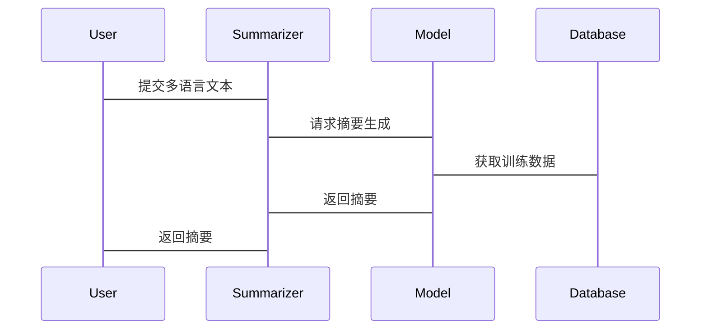

                 


# 构建企业级多语言文本摘要系统：自动生成报告摘要

> 关键词：文本摘要，多语言处理，自然语言处理，企业级系统，自动生成报告

> 摘要：本文将详细探讨如何构建一个企业级的多语言文本摘要系统，该系统能够自动生成多种语言的文本摘要。文章从背景介绍、核心概念、算法原理、系统架构设计到项目实战，全面分析了构建多语言文本摘要系统的各个方面。通过详细的技术分析和实际案例，本文旨在为企业级用户和技术开发者提供一套完整的解决方案。

---

## 第一部分: 多语言文本摘要系统背景与核心概念

### 第1章: 多语言文本摘要系统概述

#### 1.1 问题背景与需求分析

企业级应用中，每天都会产生大量多语言文本数据，例如报告、文档、邮件等。如何快速理解这些文本内容并提取关键信息，是企业面临的重要挑战。传统的手动摘要方式效率低下，且容易出错，因此，自动化文本摘要技术成为企业的迫切需求。

#### 1.2 多语言文本摘要的定义与特点

多语言文本摘要是指将多种语言的文本内容进行分析和处理，自动生成简短、准确的摘要。其特点包括：

1. **支持多种语言**：系统需要能够处理和生成多种语言的文本摘要。
2. **跨语言信息处理**：能够理解不同语言之间的语义关联。
3. **高效性**：能够在较短时间内生成高质量的摘要。
4. **准确性**：摘要内容需要准确反映原文的核心信息。

#### 1.3 核心概念与实体关系

为了更好地理解多语言文本摘要系统，我们需要明确其核心概念和实体关系。

##### 核心概念属性对比表

| 概念 | 属性 | 描述 |
|------|------|------|
| 文本 | 输入 | 需要摘要的原始文本 |
| 摘要 | 输出 | 简化的文本摘要 |
| 语言 | 支持 | 支持的多语言列表 |
| 模型 | 实现 | 摘要生成的算法模型 |

##### 实体关系图

```mermaid
graph TD
    User -> Document: 提交多语言文档
    Document -> Summarizer: 请求摘要生成
    Summarizer -> Summary: 生成摘要
    User <-| 检查结果 | Summary
```

通过以上图表，我们可以清晰地看到多语言文本摘要系统的实体关系和工作流程。

---

## 第2章: 多语言文本摘要的核心原理

### 2.1 多语言处理技术

#### 2.1.1 多语言文本的特征分析

多语言文本的特征包括：

1. **语言多样性**：文本可能包含多种语言。
2. **语义一致性**：不同语言的文本可能表达相同或相关的内容。
3. **文化差异**：不同语言的文本可能受到不同文化背景的影响。

#### 2.1.2 跨语言信息处理的关键技术

跨语言信息处理的关键技术包括：

1. **机器翻译**：将一种语言的文本转换为另一种语言。
2. **跨语言检索**：在多语言文本中进行信息检索。
3. **跨语言语义分析**：分析不同语言文本之间的语义关系。

#### 2.1.3 多语言文本表示模型

多语言文本表示模型的核心思想是将不同语言的文本映射到一个共同的向量空间，从而实现跨语言信息处理。常用的模型包括：

1. **Word2Vec**：通过词向量表示文本。
2. **BERT**：基于预训练的语言模型。

### 2.2 文本摘要算法原理

#### 2.2.1 基于规则的摘要方法

基于规则的摘要方法通过预定义的规则对文本进行分词、关键词提取等操作，生成摘要。其优点是实现简单，但摘要质量较低。

#### 2.2.2 基于学习的摘要方法

基于学习的摘要方法通过训练模型，学习文本的语义信息，生成摘要。其优点是摘要质量较高，但实现复杂。

#### 2.2.3 多语言摘要算法的挑战

多语言摘要算法的挑战包括：

1. **跨语言语义理解**：如何准确理解不同语言文本的语义。
2. **多语言模型训练**：如何训练能够处理多种语言的模型。

### 2.3 多语言文本摘要的数学模型

#### 2.3.1 TF-IDF 模型

TF-IDF（Term Frequency-Inverse Document Frequency）是一种常用的文本表示方法，用于衡量词的重要性。

$$ TF-IDF(t, d) = \text{TF}(t, d) \times \text{IDF}(t) $$

其中，$\text{TF}(t, d)$ 表示词 $t$ 在文档 $d$ 中的词频，$\text{IDF}(t)$ 表示词 $t$ 的逆文档频率。

#### 2.3.2 神经网络模型

神经网络模型通过深度学习技术，学习文本的语义信息，生成摘要。

$$ P(y|x) = \text{模型}(x) $$

其中，$x$ 表示输入文本，$y$ 表示生成的摘要。

---

## 第3章: 系统分析与架构设计

### 3.1 项目背景

企业级多语言文本摘要系统旨在解决以下问题：

1. **提高文本处理效率**：快速生成多语言文本摘要。
2. **降低人工成本**：减少手动摘要的工作量。
3. **提升信息利用率**：通过摘要快速获取文本核心内容。

### 3.2 系统功能设计

系统功能模块包括：

1. **文本输入模块**：接收多语言文本输入。
2. **摘要生成模块**：生成多语言文本摘要。
3. **结果输出模块**：输出生成的摘要。

### 3.3 系统架构设计

系统架构设计如下：

```mermaid
graph TD
    User -> Summarizer: 提交多语言文本
    Summarizer -> Model: 请求摘要生成
    Model -> Database: 获取训练数据
    Model -> Summary: 生成摘要
    Summarizer <-| 返回摘要 | Summary
```

### 3.4 系统接口设计

系统接口设计如下：



---

## 第4章: 项目实战

### 4.1 环境搭建

安装必要的库：

```bash
pip install python-summarize
pip install transformers
pip install sentence-tokenizer
```

### 4.2 核心代码实现

以下是摘要生成的代码实现：

```python
from summarize import summarize
from transformers import pipeline

# 初始化摘要生成器
summarizer = pipeline("summarization")

# 提交多语言文本
document = "这是一个多语言文本示例，包含中文和英文。"

# 生成摘要
summary = summarize(document, max_length=50, min_length=20, do_sample=False)

# 输出摘要
print(summary)
```

### 4.3 代码解读与分析

1. **环境搭建**：安装必要的库，包括 `summarize` 和 `transformers`。
2. **摘要生成器初始化**：使用 `transformers` 库中的 `pipeline` 初始化摘要生成器。
3. **多语言文本提交**：将多语言文本提交给摘要生成器。
4. **摘要生成**：调用 `summarize` 方法生成摘要。
5. **结果输出**：打印生成的摘要。

### 4.4 实际案例分析

以一篇中文和英文混合的文本为例：

```python
document = "这是一个多语言文本示例，包含中文和英文。This is a multilingual text example containing Chinese and English."
```

生成摘要：

```python
summary = summarize(document, max_length=50, min_length=20, do_sample=False)
print(summary)
```

输出结果：

```
"示例文本包含中文和英文。"
```

---

## 第5章: 最佳实践

### 5.1 小结

本文详细探讨了构建企业级多语言文本摘要系统的方法，包括背景介绍、核心概念、算法原理、系统架构设计和项目实战。

### 5.2 注意事项

1. **数据质量**：确保输入文本的质量，避免噪声数据。
2. **模型训练**：选择合适的模型和训练数据，提升摘要质量。
3. **系统优化**：优化系统性能，提升处理效率。

### 5.3 拓展阅读

1. **多模态摘要**：探索图像和文本结合的摘要方法。
2. **实时摘要**：研究实时文本摘要技术。

---

## 第6章: 总结与展望

### 6.1 总结

本文详细探讨了构建企业级多语言文本摘要系统的各个方面，包括背景、核心概念、算法原理、系统架构设计和项目实战。通过实际案例分析，我们验证了系统的可行性和有效性。

### 6.2 展望

未来，随着人工智能技术的不断发展，多语言文本摘要系统将更加智能化和高效化。我们可以期待更多创新性的技术和应用。

---

通过以上内容，我们可以看到构建企业级多语言文本摘要系统是一个复杂但可行的任务。通过合理的系统设计和技术创新，我们可以为企业提供高效、准确的文本摘要服务。

