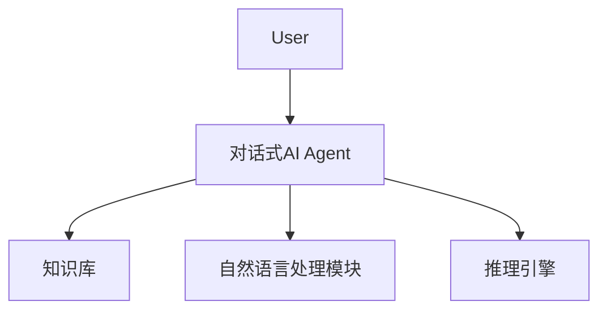
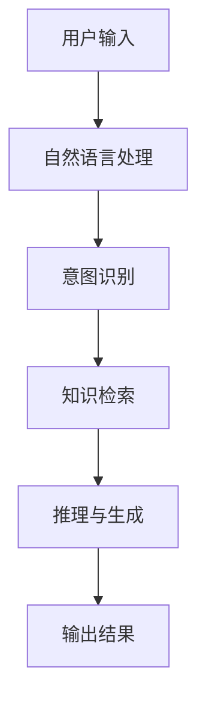
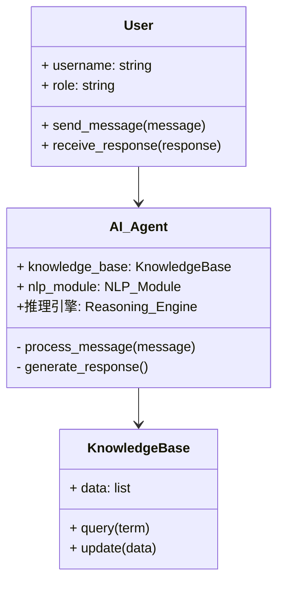
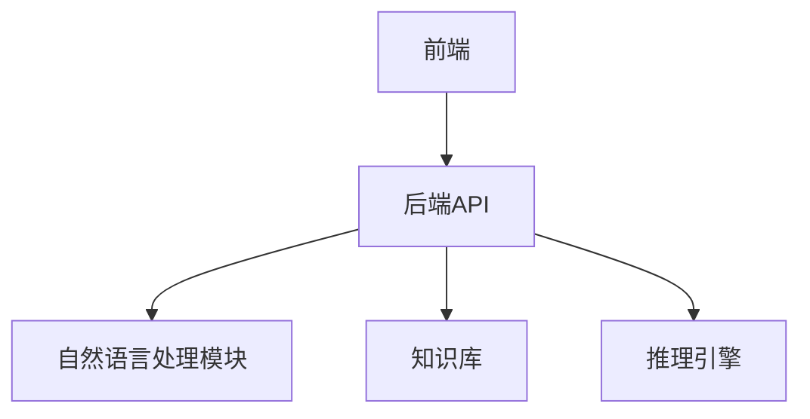

                 


# 构建企业级对话式AI Agent：提升内部沟通效率

## 关键词：企业级AI Agent，内部沟通效率，对话式AI，自然语言处理，知识图谱，系统架构设计

## 摘要：  
在企业环境中，高效、准确的内部沟通是提升整体工作效率的关键。本文将详细介绍如何构建一个企业级对话式AI Agent，以优化内部沟通效率。通过结合自然语言处理（NLP）技术、知识图谱构建和系统架构设计，我们能够实现一个智能化的对话系统，帮助员工快速获取信息、解决问题，并提升整体工作效率。本文将从背景介绍、核心概念、算法原理、系统架构设计、项目实战到最佳实践，逐步展开讲解。

---

## 目录大纲

### 第一部分：背景与核心概念

#### 第1章：企业级对话式AI Agent的背景与问题背景

##### 1.1 问题背景
- 1.1.1 企业内部沟通的痛点
- 1.1.2 传统沟通工具的局限性
- 1.1.3 对话式AI在企业中的潜力

##### 1.2 问题描述
- 1.2.1 沟通效率低下对企业的影响
- 1.2.2 信息孤岛与资源浪费的问题
- 1.2.3 对话式AI如何解决这些问题

##### 1.3 问题解决与边界
- 1.3.1 对话式AI Agent的定义
- 1.3.2 解决方案的核心

---

### 第二部分：核心概念与联系

#### 第2章：对话式AI Agent的核心概念与联系

##### 2.1 对话式AI Agent的原理
- 2.1.1 自然语言处理（NLP）技术
- 2.1.2 知识图谱构建
- 2.1.3 对话生成机制

##### 2.2 核心模块与功能
- 2.2.1 用户意图识别
- 2.2.2 知识检索与推理
- 2.2.3 对话上下文管理

##### 2.3 技术特征对比
| 技术特征       | 基于规则的系统 | 基于机器学习的系统 |
|----------------|----------------|-------------------|
| 柔性           | 低             | 高                 |
| 可扩展性       | 低             | 高                 |
| 对上下文的处理 | 简单           | 复杂               |

##### 2.4 实体关系图（Mermaid）


##### 2.5 算法流程图（Mermaid）


---

### 第三部分：算法原理

#### 第3章：对话式AI Agent的算法原理

##### 3.1 模型训练
- 3.1.1 数据预处理：清洗与标注
- 3.1.2 语言模型训练：使用预训练模型（如BERT）进行微调
- 3.1.3 对话策略优化：基于强化学习的策略梯度方法

##### 3.2 推理机制
- 3.2.1 概率论基础：贝叶斯定理在意图识别中的应用
- 3.2.2 知识检索与推理：基于图的最短路径算法

##### 3.3 数学公式
- 概率论公式：
$$ P(y|x) = \frac{P(x|y)P(y)}{P(x)} $$
- 损失函数示例：
$$ L = -\sum_{i} y_i \log p(y_i) $$

##### 3.4 代码示例
```python
def calculate_probability(x, y):
    # 简单概率计算示例
    p_x_given_y = 0.8
    p_y = 0.6
    p_x = 0.9
    probability = (p_x_given_y * p_y) / p_x
    return probability

result = calculate_probability("输入x", "标签y")
print(result)  # 输出结果
```

---

### 第四部分：系统分析与架构设计

#### 第4章：系统分析与架构设计

##### 4.1 问题场景介绍
- 企业内部沟通效率低下的具体表现
- 对话式AI Agent的应用场景

##### 4.2 项目介绍
- 项目目标：构建一个支持多种对话场景的AI Agent
- 项目范围：企业内部知识库、常用功能模块

##### 4.3 系统功能设计
- 领域模型类图（Mermaid）


##### 4.4 系统架构设计
- 系统架构图（Mermaid）


##### 4.5 接口设计与交互流程
- 对话流程示例
1. 用户输入：`"我需要查找2023年Q1的销售数据"`
2. 系统解析：识别意图并提取关键词
3. 知识库查询：从知识库中检索相关数据
4. 推理引擎：生成响应内容
5. 返回结果：以自然语言形式呈现

---

### 第五部分：项目实战

#### 第5章：项目实战

##### 5.1 环境搭建
- 开发工具：Python、Jupyter Notebook
- 依赖库安装：transformers、numpy、pandas

##### 5.2 核心代码实现
```python
from transformers import pipeline

# 初始化对话生成模型
generator = pipeline("text-generation", model="gpt2")

# 定义意图识别函数
def identify_intent(text):
    # 示例：使用简单的关键词匹配
    keywords = ["帮助", "查询", "数据"]
    for keyword in keywords:
        if keyword in text:
            return keyword
    return "其他"

# 示例对话流程
def main():
    while True:
        user_input = input("你：")
        intent = identify_intent(user_input)
        response = generator.generate(user_input, max_length=100)
        print("AI Agent:", response[0]["text"])

if __name__ == "__main__":
    main()
```

##### 5.3 功能扩展
- 多轮对话支持
- 知识库的动态更新
- 支持多语言对话

##### 5.4 案例分析
- 案例1：销售数据查询
- 案例2：员工信息查询
- 案例3：内部政策咨询

---

### 第六部分：最佳实践与未来展望

#### 第6章：最佳实践与小结

##### 6.1 实践总结
- 系统设计的核心要素
- 开发过程中的注意事项

##### 6.2 小结
- 对话式AI Agent的优势
- 技术实现的关键点

##### 6.3 注意事项
- 数据安全与隐私保护
- 系统的可扩展性和维护性

##### 6.4 未来展望
- 更先进的NLP模型（如GPT-4）
- 结合其他技术（如计算机视觉）的可能性

---

## 附录

#### 附录A：术语表
- 对话式AI Agent：一个能够理解和生成自然语言的智能系统
- 自然语言处理（NLP）：研究如何让计算机理解和处理人类语言的技术
- 知识图谱：结构化的知识表示形式，用于存储实体及其关系

#### 附录B：工具与资源
- 开源库推荐：Hugging Face、spaCy
- 数据集推荐：Common Crawl、维基百科

#### 附录C：参考文献
- Smith, J. (2020). "Building Conversational AI Systems." Springer.
- Brown, T. B., et al. (2020). "Language Models at Your Service: Effective Private Use of Public LLMs." arXiv preprint.

---

通过以上结构，我们可以系统地构建一个企业级对话式AI Agent，并将其应用于提升内部沟通效率。希望本文能为相关领域的开发者和企业提供有价值的参考和指导。

