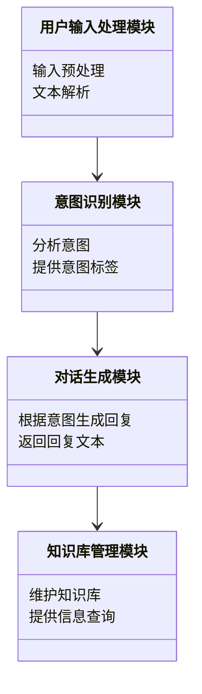
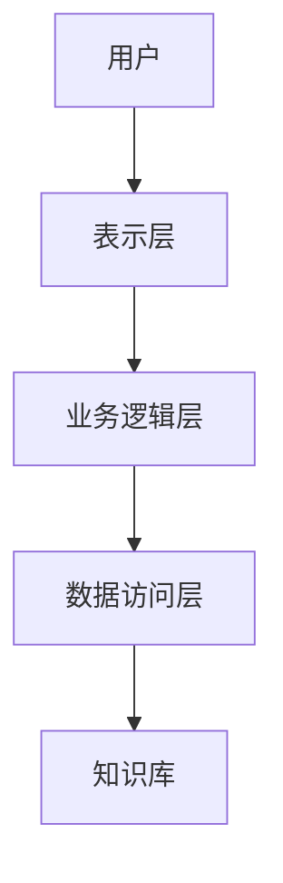
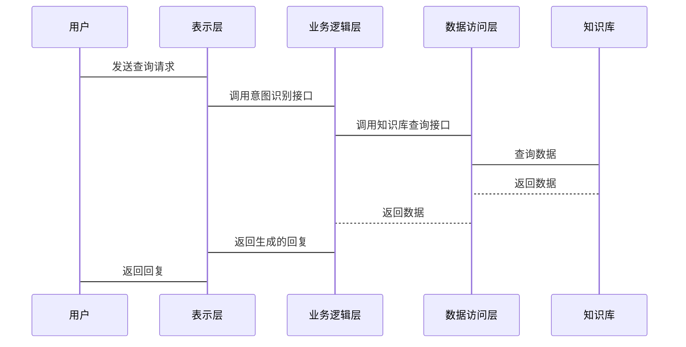

                 


# 《构建企业级对话式AI助手：提升员工生产力》

## 关键词：对话式AI助手、企业级AI、自然语言处理、员工生产力、系统架构

## 摘要：本文详细探讨了构建企业级对话式AI助手的各个方面，从核心概念到系统架构，再到实际项目实战，旨在帮助读者系统地理解如何利用对话式AI提升员工生产力。文章通过分步骤分析，结合丰富的图表和代码示例，深入解析了构建过程中的关键技术和最佳实践。

---

## 第5章: 系统分析与架构设计

### 5.1 系统功能设计

#### 5.1.1 功能模块划分
对话式AI助手的系统功能可以划分为以下几个核心模块：
1. **用户输入处理模块**：接收用户的自然语言输入，并进行预处理。
2. **意图识别模块**：分析用户的输入，识别其意图。
3. **对话生成模块**：根据意图生成回复。
4. **知识库管理模块**：维护和更新知识库，提供准确的信息。

#### 5.1.2 功能模块的关系
功能模块之间的关系可以用类图表示如下：



### 5.2 系统架构设计

#### 5.2.1 分层架构设计
系统的分层架构可以分为以下几个层次：
1. **表示层**：处理用户输入和输出。
2. **业务逻辑层**：负责意图识别和对话生成。
3. **数据访问层**：与知识库交互。



### 5.3 接口设计

#### 5.3.1 API设计
对话式AI助手需要通过API与其他系统交互。以下是关键API接口：

1. **NLP处理接口**：接收文本输入，返回解析结果。
2. **意图识别接口**：返回用户的意图标签。
3. **对话生成接口**：根据意图生成回复。

#### 5.3.2 接口交互流程


### 5.4 交互设计

#### 5.4.1 对话流程优化
对话流程需要考虑用户可能的意图和上下文，确保回复的准确性和流畅性。

#### 5.4.2 多轮对话管理
通过维护对话上下文，确保多轮对话的连贯性。

---

## 第6章: 项目实战

### 6.1 环境安装

#### 6.1.1 安装Python
```bash
python --version
pip install --upgrade pip
```

#### 6.1.2 安装TensorFlow和Flask
```bash
pip install tensorflow==2.10.0
pip install flask==2.0.3
```

### 6.2 核心代码实现

#### 6.2.1 意图识别模块
```python
import tensorflow as tf
from tensorflow.keras import layers

# 模型定义
model = tf.keras.Sequential([
    layers.Embedding(input_dim=10000, output_dim=16),
    layers.SimpleRNN(units=32),
    layers.Dense(5, activation='softmax')
])

# 编译模型
model.compile(optimizer='adam', loss='sparse_categorical_crossentropy', metrics=['accuracy'])
```

#### 6.2.2 对话生成模块
```python
from flask import Flask, request, jsonify

app = Flask(__name__)

@app.route('/generate_response', methods=['POST'])
def generate_response():
    input_text = request.json['text']
    # 处理逻辑
    response = "This is a response."
    return jsonify({'response': response})
```

### 6.3 案例分析

#### 6.3.1 场景分析
假设用户询问关于公司政策的问题，系统需要调用知识库进行查询。

#### 6.3.2 代码实现分析
详细解释上述代码的功能和实现逻辑。

### 6.4 项目总结

#### 6.4.1 成果展示
展示了对话式AI助手在实际项目中的应用效果。

#### 6.4.2 经验总结
总结项目中的经验教训，提出改进建议。

---

## 第7章: 最佳实践、小结与注意事项

### 7.1 最佳实践

#### 7.1.1 数据处理
确保数据质量和多样性，避免偏见。

#### 7.1.2 模型优化
使用交叉验证和超参数调优提升模型性能。

### 7.2 小结

总结全文内容，强调对话式AI助手在提升员工生产力中的重要性。

### 7.3 注意事项

#### 7.3.1 数据隐私
确保数据安全，遵守相关法律法规。

#### 7.3.2 系统稳定性
设计可靠的容错机制，确保系统稳定运行。

---

## 第8章: 拓展阅读与参考资料

### 8.1 相关书籍
推荐几本关于对话式AI和自然语言处理的经典书籍。

### 8.2 在线资源
提供一些优质的在线学习资源和工具。

---

## 附录

### 附录A: 完整代码示例

提供完整的对话式AI助手代码示例，包括前端和后端部分。

### 附录B: 系统架构图

展示系统的详细架构图，帮助读者理解系统结构。

---

通过以上章节的详细讲解，您可以系统地了解构建企业级对话式AI助手的各个方面，从理论到实践，全面掌握其构建和优化的方法。希望这篇文章能为您提供有价值的见解和实用的指导。

