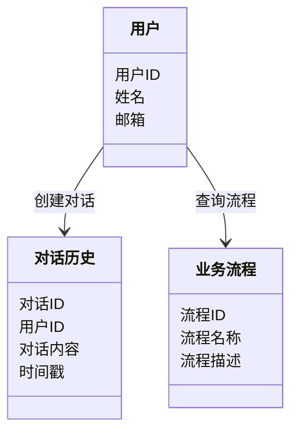
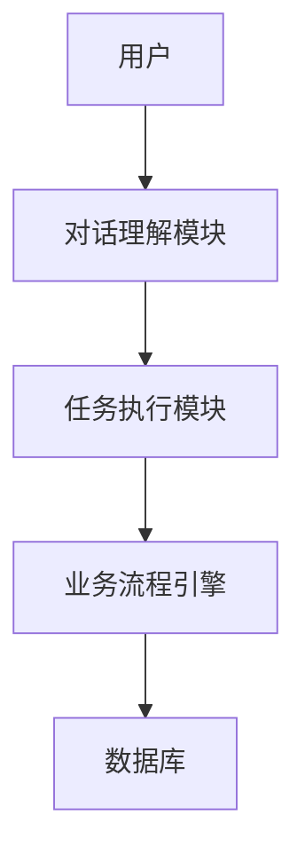
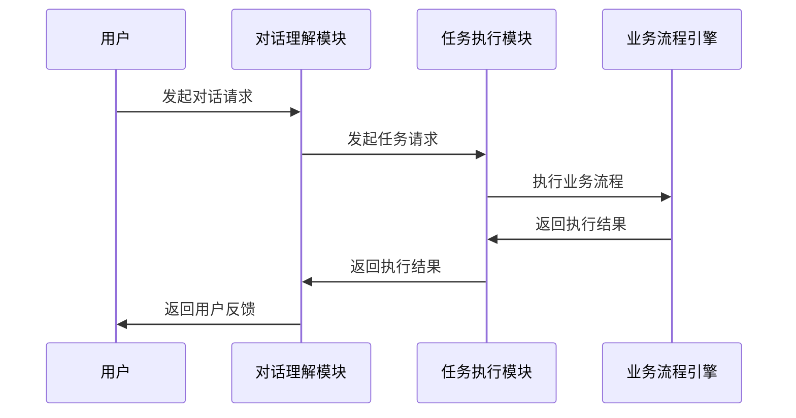

                 


# 构建企业级对话式AI助手：跨部门业务流程自动化与协同

> 关键词：对话式AI助手、企业级、跨部门业务流程、NLP、知识图谱、系统架构、项目实战

> 摘要：本文深入探讨了企业级对话式AI助手的构建过程，重点分析了其在跨部门业务流程自动化与协同中的应用。通过详细的技术分析和实践案例，文章系统地介绍了对话式AI的核心算法、系统架构设计、项目实现及最佳实践，帮助读者全面理解并掌握企业级对话式AI助手的开发与应用。

---

# 第1章: 企业级对话式AI助手的背景与问题背景

## 1.1 企业级对话式AI助手的背景

### 1.1.1 企业数字化转型的现状与挑战

随着企业数字化转型的深入推进，传统的业务流程逐渐暴露出效率低下、协作复杂、信息孤岛等问题。企业级对话式AI助手作为一种新兴的技术解决方案，能够通过自然语言处理（NLP）技术，实现跨部门业务流程的自动化与协同，为企业提供智能化的交互体验。

### 1.1.2 对话式AI在企业中的应用价值

对话式AI助手能够为企业提供以下价值：

1. **提升效率**：通过自动化处理跨部门业务流程，减少人工干预，提升业务处理效率。
2. **增强协作**：实现部门间信息的实时共享与协同，打破信息孤岛。
3. **优化用户体验**：通过自然语言交互，简化用户操作流程，提升用户体验。

### 1.1.3 企业级对话式AI助手的定义与特点

企业级对话式AI助手是一种基于NLP技术的智能系统，能够通过自然语言交互，理解用户意图并执行相应的业务流程。其特点包括：

- **跨部门协同**：支持多个部门之间的业务流程协作。
- **智能化**：基于AI算法，能够理解复杂语义并执行任务。
- **可扩展性**：支持多种业务场景和功能扩展。

## 1.2 问题背景与问题描述

### 1.2.1 传统跨部门业务流程的痛点

传统跨部门业务流程存在以下痛点：

1. **信息孤岛**：各部门之间信息不通，导致业务处理效率低下。
2. **协作复杂**：跨部门协作流程繁琐，容易出现沟通不畅的问题。
3. **效率低下**：人工处理业务流程耗时长，且容易出错。

### 1.2.2 对话式AI助手的解决方案

对话式AI助手通过以下方式解决上述问题：

1. **智能化交互**：通过自然语言处理技术，实现用户与系统之间的智能化交互。
2. **自动化处理**：自动执行跨部门业务流程，减少人工干预。
3. **实时协同**：实现部门间信息的实时共享与协同。

### 1.2.3 问题的边界与外延

对话式AI助手的应用范围主要集中在企业内部的跨部门业务流程自动化与协同，其边界包括：

- **用户范围**：企业内部员工。
- **功能范围**：跨部门业务流程的自动化与协同。
- **数据范围**：企业内部数据的共享与处理。

---

# 第2章: 对话式AI的核心算法原理

## 2.1 对话式AI的核心算法概述

### 2.1.1 基于规则的对话系统

基于规则的对话系统是一种简单但有效的对话系统，通过预定义的规则和关键词匹配来实现对话交互。

### 2.1.2 基于统计的对话系统

基于统计的对话系统通过分析海量对话数据，利用统计学习方法来生成对话回复。

### 2.1.3 基于深度学习的对话系统

基于深度学习的对话系统（如基于Transformer的模型）能够通过自注意力机制理解对话上下文，生成更自然的对话回复。

## 2.2 Transformer模型在对话式AI中的应用

### 2.2.1 Transformer模型的工作原理

Transformer模型由编码器和解码器组成，通过自注意力机制和前馈网络实现序列的编码和解码。

$$
\text{自注意力机制公式：}
$$

$$
\text{Attention}(Q, K, V) = \text{softmax}\left(\frac{QK^T}{\sqrt{d_k}}\right)V
$$

### 2.2.2 自注意力机制的数学模型

自注意力机制通过计算查询（Q）、键（K）和值（V）之间的关系，生成最终的注意力权重。

### 2.2.3 编码器-解码器结构的实现

编码器将输入序列编码为高维向量，解码器根据编码结果生成输出序列。

---

# 第3章: 对话式AI助手的系统分析与架构设计

## 3.1 问题场景介绍

### 3.1.1 企业级对话式AI助手的应用场景

企业级对话式AI助手主要应用于以下场景：

1. **跨部门协作**：如审批流程、信息查询等。
2. **客户支持**：通过对话交互解决客户问题。
3. **内部管理**：如会议安排、任务分配等。

### 3.1.2 业务流程自动化的核心需求

业务流程自动化的核心需求包括：

1. **智能化交互**：支持自然语言对话。
2. **任务执行**：自动执行业务流程。
3. **信息共享**：实现部门间信息的实时共享。

## 3.2 系统功能设计

### 3.2.1 领域模型类图展示



### 3.2.2 对话理解模块的设计

对话理解模块负责解析用户的意图并生成相应的业务请求。

### 3.2.3 任务执行模块的设计

任务执行模块负责根据用户的意图执行相应的业务流程。

## 3.3 系统架构设计

### 3.3.1 系统架构图展示



### 3.3.2 模块间的交互关系

模块间的交互关系包括用户与对话理解模块的交互，对话理解模块与任务执行模块的交互，任务执行模块与业务流程引擎的交互等。

### 3.3.3 系统接口设计

系统接口设计包括：

1. 用户与对话理解模块的接口。
2. 对话理解模块与任务执行模块的接口。
3. 任务执行模块与业务流程引擎的接口。

## 3.4 系统交互序列图

### 3.4.1 用户请求的处理流程



### 3.4.2 系统与外部服务的交互

系统与外部服务的交互包括调用第三方API、访问数据库等操作。

---

# 第4章: 对话式AI助手的项目实战

## 4.1 环境安装与配置

### 4.1.1 安装Python与相关库

```bash
pip install numpy
pip install pandas
pip install transformers
pip install torch
```

### 4.1.2 安装对话式AI框架

```bash
pip install transformers
pip install torch
pip install fastapi
```

## 4.2 系统核心实现

### 4.2.1 对话理解模块的实现

```python
from transformers import AutoTokenizer, AutoModelForSeq2Seq
import torch

class DialogUnderstanding:
    def __init__(self, model_name):
        self.tokenizer = AutoTokenizer.from_pretrained(model_name)
        self.model = AutoModelForSeq2Seq.from_pretrained(model_name)
    
    def understand_dialog(self, input_text):
        inputs = self.tokenizer(input_text, return_tensors="pt")
        outputs = self.model.generate(inputs.input_ids, max_length=50)
        return self.tokenizer.decode(outputs[0], skip_special_tokens=True)
```

### 4.2.2 任务执行模块的实现

```python
import requests
from typing import Dict, Any

class TaskExecution:
    def __init__(self, config):
        self.config = config
    
    def execute_task(self, task_request: Dict[str, Any]) -> Dict[str, Any]:
        # 示例：调用外部API执行任务
        response = requests.post(self.config['api_url'], json=task_request)
        return response.json()
```

### 4.2.3 系统交互的实现

```python
from fastapi import FastAPI
from pydantic import BaseModel

app = FastAPI()

class Query(BaseModel):
    query: str

@app.post("/dialog/")
async def dialog(query: Query):
    # 示例：处理对话请求
    return {"response": "Hello, how can I help you?"}

if __name__ == "__main__":
    uvicorn.run(app, host="0.0.0.0", port=8000)
```

## 4.3 代码应用解读与分析

### 4.3.1 对话理解模块的代码解读

对话理解模块使用了预训练的语言模型，通过输入对话内容生成理解结果。

### 4.3.2 任务执行模块的代码解读

任务执行模块通过调用外部API，执行相应的业务流程。

### 4.3.3 系统交互的代码解读

系统交互通过FastAPI框架实现了RESTful API接口，处理用户的对话请求。

## 4.4 实际案例分析

### 4.4.1 案例背景

某企业希望实现跨部门的审批流程自动化，通过对话式AI助手完成审批请求的提交与处理。

### 4.4.2 案例实现

```python
from fastapi import FastAPI
from pydantic import BaseModel

app = FastAPI()

class ApprovalRequest(BaseModel):
    employee_id: str
    request_type: str
    description: str

@app.post("/approve/")
async def approve(request: ApprovalRequest):
    # 示例：处理审批请求
    return {"status": "success", "message": "Approval request has been received."}

if __name__ == "__main__":
    uvicorn.run(app, host="0.0.0.0", port=8000)
```

## 4.5 项目小结

### 4.5.1 项目总结

通过对话式AI助手实现跨部门业务流程的自动化与协同，能够显著提升企业的业务处理效率和用户体验。

### 4.5.2 项目成果

成功实现了对话理解、任务执行和系统交互的核心功能，为企业提供了智能化的对话式AI助手。

---

# 第5章: 最佳实践与注意事项

## 5.1 小结

### 5.1.1 关键点总结

- 对话式AI助手的核心算法是Transformer模型。
- 系统架构设计需要考虑模块间的交互与协作。
- 项目实现需要结合具体的业务场景进行定制化开发。

## 5.2 注意事项

### 5.2.1 数据隐私与安全

在实现对话式AI助手时，需要注意数据隐私与安全问题，确保用户数据的安全性。

### 5.2.2 系统性能优化

需要对系统进行性能优化，确保在高并发场景下的稳定运行。

### 5.2.3 业务流程定制化

根据企业的具体需求，进行业务流程的定制化开发。

## 5.3 拓展阅读

### 5.3.1 推荐书籍

- 《Deep Learning》
- 《Natural Language Processing with PyTorch》

### 5.3.2 推荐博客与技术文章

- [Hugging Face官方文档](https://huggingface.co/transformers/)
- [FastAPI官方文档](https://fastapi.io/)

---

# 第6章: 项目总结与未来展望

## 6.1 项目总结

通过本文的详细讲解，我们系统地介绍了企业级对话式AI助手的构建过程，包括背景分析、算法原理、系统架构设计、项目实现及最佳实践等内容。

## 6.2 未来展望

随着AI技术的不断发展，对话式AI助手将在企业级应用中发挥越来越重要的作用，未来的研究方向包括更复杂的对话理解、多模态交互、实时协作优化等。

---

以上是《构建企业级对话式AI助手：跨部门业务流程自动化与协同》的技术博客文章的完整目录大纲和部分具体内容。希望这篇文章能够为您提供清晰的思路和详细的实现方法。

