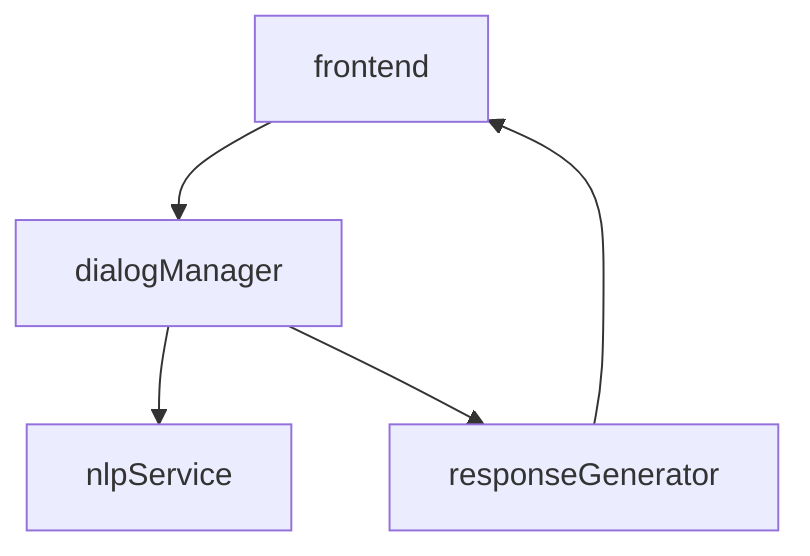

                 


# 构建企业级对话式AI平台：提升内外部沟通效率

## 关键词：企业级对话式AI，自然语言处理，对话管理，内部沟通效率，外部客户体验

## 摘要：企业级对话式AI平台通过自然语言处理技术和对话管理算法，优化企业内部沟通和外部客户服务。本文详细探讨了构建该平台的背景、核心概念、算法原理、系统设计及实战案例，提供从理论到实践的全面指导。

---

# 第一部分：企业级对话式AI平台的背景与核心概念

## 第1章：问题背景与需求分析

### 1.1 问题背景

#### 1.1.1 传统企业沟通效率的痛点
现代企业面临内外部沟通效率低下的问题。内部沟通依赖于邮件、会议等传统方式，效率低下且信息传递不及时；外部客户咨询渠道分散，客户体验差。

#### 1.1.2 对话式AI的出现与应用前景
对话式AI技术的兴起为企业提供了智能化的沟通解决方案，能够实现24/7的客户支持和内部信息高效传递。

#### 1.1.3 企业级对话式AI的定义与目标
企业级对话式AI平台旨在通过智能化对话系统，提升企业内部协作效率和外部客户服务质量，降低沟通成本。

### 1.2 问题描述

#### 1.2.1 企业内外部沟通的主要挑战
- **内部沟通**：信息传递慢、协作效率低、信息孤岛。
- **外部沟通**：客户咨询渠道分散、响应时间长、服务质量不一致。

#### 1.2.2 对话式AI在企业沟通中的角色
- 提供统一的沟通渠道。
- 实现自动化、智能化的对话管理。
- 提高沟通效率和客户满意度。

#### 1.2.3 企业级对话式AI平台的核心需求
- 支持多渠道接入（如网页、移动端、邮件等）。
- 实现自然语言理解与生成。
- 提供灵活的对话策略配置。

### 1.3 问题解决与边界

#### 1.3.1 对话式AI平台的解决方案
通过引入对话式AI技术，构建统一的沟通平台，实现智能化的对话管理和信息传递。

#### 1.3.2 系统边界与功能范围
- **系统边界**：仅关注对话式AI平台本身，不涉及企业其他系统的集成。
- **功能范围**：支持内部员工间对话、员工与客户间的对话，以及跨部门协作。

#### 1.3.3 平台的可扩展性与兼容性
平台应支持多种对话场景，具备良好的扩展性和兼容性，能够与现有企业系统无缝集成。

### 1.4 核心概念与系统架构

#### 1.4.1 对话式AI的核心要素
- 自然语言处理（NLP）：理解用户输入。
- 对话管理：控制对话流程。
- 响应生成：生成自然语言回复。

#### 1.4.2 系统架构的组成与关系
- **前端**：用户界面，接收输入并显示输出。
- **后端**：对话管理模块，处理用户请求并生成响应。
- **数据存储**：存储对话历史和相关数据。

#### 1.4.3 平台的核心功能模块
- 用户身份验证与权限管理。
- 对话历史记录与查询。
- 自定义对话策略配置。

---

## 第2章：对话式AI的核心概念与原理

### 2.1 对话式AI的定义与特点

#### 2.1.1 对话式AI的定义
对话式AI是一种能够通过自然语言与用户进行交互的智能系统，能够理解用户的意图并生成相应的回复。

#### 2.1.2 对话式AI的核心特点
- **智能性**：能够理解用户意图并生成合适的回复。
- **交互性**：支持多轮对话，保持上下文理解。
- **可扩展性**：支持多种对话场景和业务逻辑。

### 2.2 对话式AI的实现原理

#### 2.2.1 自然语言处理（NLP）基础
- **分词**：将用户输入的文本分割成词语或短语。
- **实体识别**：识别文本中的关键实体（如人名、地名等）。
- **意图识别**：理解用户的意图。

#### 2.2.2 对话管理算法
- **基于规则的对话管理**：通过预定义的规则控制对话流程。
- **基于机器学习的对话管理**：通过训练数据学习对话策略。

#### 2.2.3 响应生成机制
- **模板生成**：基于预定义的模板生成回复。
- **生成式模型**：利用生成模型（如GPT）生成自然语言回复。

### 2.3 对话式AI的系统架构

#### 2.3.1 系统模块划分
- **NLP模块**：处理用户输入，生成对话意图。
- **对话管理模块**：根据意图生成回复内容。
- **响应生成模块**：生成自然语言回复。

#### 2.3.2 系统组件之间的关系
用户输入首先经过NLP模块处理，生成意图后传递给对话管理模块，生成回复内容后由响应生成模块生成最终回复。

#### 2.3.3 系统的输入输出流程
用户输入 -> NLP处理 -> 对话管理 -> 响应生成 -> 输出回复。

---

## 第3章：对话式AI的算法原理与实现

### 3.1 对话式AI的算法原理

#### 3.1.1 自然语言处理（NLP）算法
- **分词算法**：如jieba分词。
- **实体识别算法**：如CRF模型。
- **意图识别算法**：如朴素贝叶斯分类器。

#### 3.1.2 对话管理算法
- **基于规则的对话管理**：使用状态机模型。
- **基于机器学习的对话管理**：使用强化学习训练对话策略。

#### 3.1.3 响应生成算法
- **模板生成**：使用预定义模板生成回复。
- **生成式模型**：如GPT-3生成回复。

### 3.2 对话式AI的数学模型

#### 3.2.1 语言模型的数学表达
语言模型通常使用概率分布来表示词的序列概率：
$$ P(w_1, w_2, ..., w_n) = \prod_{i=1}^n P(w_i | w_1, ..., w_{i-1}) $$

#### 3.2.2 对话模型的数学表达
对话模型通常使用条件概率来表示回复的概率：
$$ P(r | u) $$

#### 3.2.3 响应生成模型的数学表达
生成式模型使用概率生成回复：
$$ P(r | u) = \text{模型参数} $$

### 3.3 对话式AI的实现流程

#### 3.3.1 数据预处理
- 分词
- 去停用词
- 词干提取

#### 3.3.2 模型训练
- 训练语言模型
- 训练对话管理模型
- 训练响应生成模型

#### 3.3.3 模型推理
- 接收用户输入
- 解析意图
- 生成回复

---

## 第4章：对话式AI的系统设计与架构

### 4.1 系统功能设计

#### 4.1.1 用户需求分析
- 支持多渠道对话
- 支持多语言对话
- 提供对话历史查询

#### 4.1.2 功能模块划分
- 用户身份验证模块
- 对话管理模块
- 响应生成模块
- 对话历史存储模块

#### 4.1.3 功能模块之间的关系
用户输入 -> 身份验证 -> 对话管理 -> 响应生成 -> 输出回复。

### 4.2 系统架构设计

#### 4.2.1 分层架构设计
- **前端层**：接收用户输入，展示回复内容。
- **业务逻辑层**：处理对话逻辑，调用相关服务。
- **数据访问层**：访问数据库，存储对话历史。

#### 4.2.2 微服务架构设计
- **NLP服务**：提供分词、实体识别等服务。
- **对话管理服务**：负责对话逻辑的处理。
- **响应生成服务**：生成自然语言回复。

### 4.3 系统接口设计

#### 4.3.1 API接口
- `/api/v1/dialog/start`：开始对话。
- `/api/v1/dialog/end`：结束对话。
- `/api/v1/dialog/message`：发送/接收消息。

#### 4.3.2 接口交互流程
用户发起请求 -> API调用 -> 服务处理 -> 返回响应。

### 4.4 系统交互设计

#### 4.4.1 序列图
```mermaid
sequenceDiagram
    user ->+> dialogManager: 发送消息
    dialogManager ->+> nlpService: 请求解析
    nlpService ->+> responseGenerator: 请求生成回复
    responseGenerator ->+> dialogManager: 返回回复内容
    dialogManager ->+> user: 返回回复
```

#### 4.4.2 系统架构图


---

## 第5章：项目实战

### 5.1 环境安装

#### 5.1.1 安装Python环境
使用Anaconda或虚拟环境，安装Python 3.8以上版本。

#### 5.1.2 安装依赖库
安装NLP库（如jieba）、对话管理库（如transformers）和生成模型库（如tensorflow）。

### 5.2 核心代码实现

#### 5.2.1 对话管理模块
```python
class DialogManager:
    def __init__(self):
        self.current_dialogue = {}
    
    def process_message(self, message):
        # 处理消息，生成回复
        response = self.generate_response(message)
        return response
    
    def generate_response(self, message):
        # 调用NLP模块解析意图
        intent = nlp_module.analyze(message)
        # 根据意图生成回复
        response = response_generator.generate_response(intent)
        return response
```

#### 5.2.2 响应生成模块
```python
class ResponseGenerator:
    def __init__(self):
        self.models = {}  # 不同场景下的生成模型
    
    def generate_response(self, intent):
        # 根据意图选择合适的生成模型
        model = self.select_model(intent)
        response = model.generate_response(intent)
        return response
    
    def select_model(self, intent):
        # 根据意图选择合适的模型
        return self.models.get(intent, default_model)
```

### 5.3 案例分析与实现

#### 5.3.1 案例分析
假设我们有一个内部员工之间的对话场景，员工需要快速查找公司政策。

#### 5.3.2 代码实现
```python
# NLP模块实现
class NLProcessor:
    def __init__(self):
        self.tokenizer = Tokenizer()
    
    def process_message(self, message):
        tokens = self.tokenizer.tokenize(message)
        entities = self.extract_entities(tokens)
        intent = self.determine_intent(tokens)
        return entities, intent

    def extract_entities(self, tokens):
        # 提取实体
        return entities

    def determine_intent(self, tokens):
        # 确定意图
        return intent
```

---

## 第6章：最佳实践与总结

### 6.1 最佳实践
- **数据质量**：确保训练数据的多样性和代表性。
- **模型调优**：根据实际需求优化模型参数。
- **用户反馈**：收集用户反馈，持续优化对话系统。

### 6.2 小结
构建企业级对话式AI平台是一个复杂但极具价值的过程。通过自然语言处理和对话管理技术，企业可以显著提升内外部沟通效率。

### 6.3 注意事项
- **数据隐私**：确保数据的安全性和隐私性。
- **系统稳定性**：确保系统的高可用性和稳定性。
- **用户体验**：注重用户体验设计，提升用户满意度。

### 6.4 拓展阅读
- 《自然语言处理入门》
- 《对话式AI系统设计》
- 《机器学习实战》

---

# 结语

通过本文的详细讲解，读者可以全面了解企业级对话式AI平台的构建过程，从理论到实践，掌握核心技术和实现方法，为企业提升内外部沟通效率提供有力支持。

