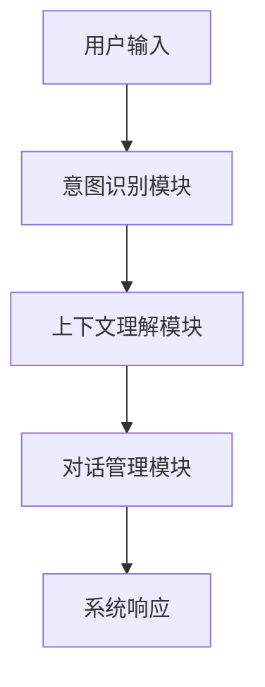
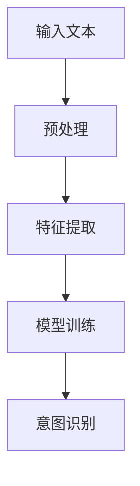
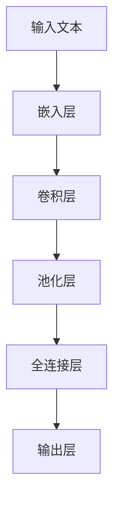
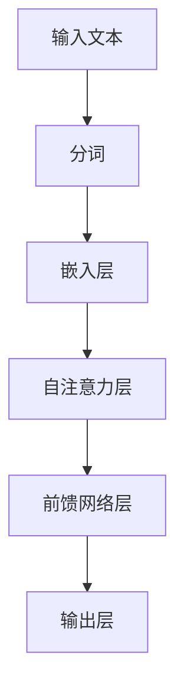
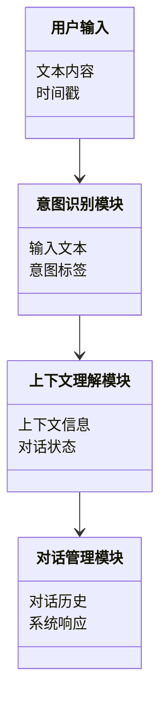
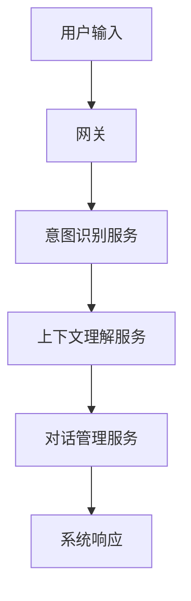
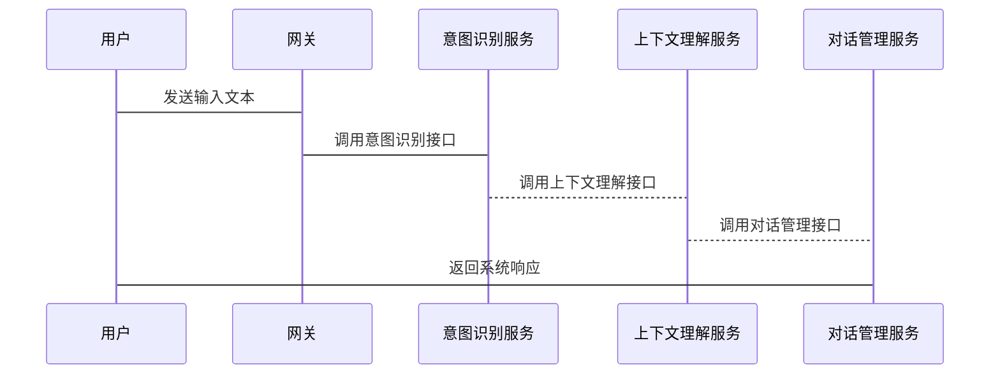

                 


# 构建企业级对话意图识别系统：上下文理解与多轮对话管理

## 关键词：对话意图识别、上下文理解、多轮对话管理、自然语言处理、企业级系统、深度学习

## 摘要：本文详细探讨了构建企业级对话意图识别系统的各个方面，从核心概念到算法实现，从系统架构设计到项目实战。文章首先介绍了对话意图识别的背景和定义，然后深入分析了其核心概念与技术原理，接着详细讲解了基于深度学习的算法实现和数学模型，提出了系统架构设计方案，并通过实际案例展示了项目实现过程。最后，本文总结了最佳实践和未来发展方向，为企业级对话意图识别系统的构建提供了全面的指导。

---

# 第一部分: 背景与核心概念

## 第1章: 对话意图识别系统概述

### 1.1 问题背景与定义

#### 1.1.1 对话意图识别的背景与意义
在当今企业级应用中，对话系统已经成为人机交互的核心技术之一。对话意图识别（Dialog Intent Recognition）是自然语言处理（NLP）领域的重要分支，旨在理解用户在对话中的意图。随着企业对智能化服务需求的增加，构建高效的对话意图识别系统成为企业数字化转型的关键技术。

#### 1.1.2 对话意图识别的定义与目标
对话意图识别是指通过分析用户的输入文本，识别出用户的意图。其目标是将用户的自然语言输入转化为可操作的系统指令，例如“我想查询订单状态”可以转化为“查询订单状态”这一意图。企业级对话系统需要在复杂场景下准确识别意图，支持多轮对话和上下文理解。

#### 1.1.3 企业级对话系统的应用场景
企业级对话系统广泛应用于客服、销售、技术支持等领域。例如，在客服系统中，用户可能需要通过多轮对话解决复杂问题，系统需要准确理解每一轮对话的意图并提供相应的服务。

---

### 1.2 问题描述与解决思路

#### 1.2.1 对话意图识别的核心问题
对话意图识别的核心问题包括：
1. 如何准确识别用户的意图。
2. 如何处理多轮对话中的上下文信息。
3. 如何在企业级系统中实现高效的意图识别。

#### 1.2.2 多轮对话中的上下文理解挑战
多轮对话中，上下文理解是关键。例如，用户在第一轮对话中提到“我需要查询订单”，在第二轮对话中提到“请帮我取消这个订单”，系统需要结合上下文理解用户的真实意图。

#### 1.2.3 企业级系统中的特殊需求
企业级系统通常需要处理大量数据和复杂场景，对意图识别的准确性和实时性要求较高。此外，企业系统还需要支持多种语言和多渠道输入（如电话、邮件、聊天）。

---

### 1.3 边界与外延

#### 1.3.1 对话意图识别的边界
对话意图识别的边界包括：
1. 仅处理用户的输入文本，不涉及用户的其他行为数据。
2. 不直接处理系统的输出，仅识别用户的输入意图。

#### 1.3.2 相关概念的区分与联系
- 对话意图识别与自然语言处理（NLP）：前者是NLP的一个子领域，专注于意图识别。
- 单轮对话与多轮对话：单轮对话仅处理一次输入，多轮对话需要处理上下文。
- 上下文理解与实体识别：实体识别关注文本中的具体信息，上下文理解关注语境。

#### 1.3.3 企业级系统的扩展性
企业级系统需要支持扩展，例如支持多种语言、多渠道输入和复杂的业务流程。

---

### 1.4 概念结构与核心要素

#### 1.4.1 对话意图识别的构成要素
对话意图识别系统通常包括以下要素：
1. **输入文本**：用户的自然语言输入。
2. **意图标签**：预定义的意图分类。
3. **上下文信息**：多轮对话中的历史信息。
4. **意图识别模型**：用于识别意图的算法或模型。

#### 1.4.2 上下文理解的层次模型
上下文理解可以分为以下层次：
1. **语义理解**：理解文本的语义含义。
2. **意图识别**：基于语义理解识别用户的意图。
3. **对话状态跟踪**：跟踪多轮对话中的上下文信息。

#### 1.4.3 多轮对话管理的流程框架
多轮对话管理的流程通常包括：
1. **用户输入**：用户发送一条或多条消息。
2. **意图识别**：系统识别用户的意图。
3. **上下文更新**：系统更新对话的上下文信息。
4. **系统响应**：系统根据意图和上下文生成响应。

---

## 第2章: 核心概念与联系

### 2.1 对话意图识别的核心原理

#### 2.1.1 意图识别的基本原理
意图识别的基本原理是将用户的输入文本映射到预定义的意图标签上。例如，用户输入“我要退订单”，系统将其映射到“退单”意图。

#### 2.1.2 上下文理解的实现方式
上下文理解可以通过以下方式实现：
1. **基于规则的方法**：通过预定义的规则匹配上下文信息。
2. **基于模型的方法**：使用机器学习模型捕捉上下文信息。

#### 2.1.3 多轮对话管理的策略
多轮对话管理的策略包括：
1. **状态驱动**：根据对话状态生成响应。
2. **意图驱动**：根据用户的意图生成响应。
3. **混合驱动**：结合对话状态和意图生成响应。

---

### 2.2 核心概念对比表

| 对比维度 | 单轮对话 | 多轮对话 |
|----------|----------|----------|
| 处理方式 | 仅处理单条输入 | 处理多条输入，维护上下文 |
| 状态管理 | 无状态 | 有状态 |
| 挑战 | 识别意图 | 维护上下文和意图 |

---

### 2.3 实体关系图（ER图）



---

# 第二部分: 算法原理与数学模型

## 第3章: 对话意图识别算法原理

### 3.1 常见算法介绍

#### 3.1.1 基于统计的模型：CRF
条件随机场（CRF）是一种常用的统计模型，适用于序列标注任务。CRF通过考虑上下文信息，对文本进行分词和标注。

##### CRF算法流程图


##### CRF算法代码示例
```python
import numpy as np
from sklearn.preprocessing import LabelEncoder
from sklearn.model_selection import train_test_split
from sklearn.metrics import accuracy_score
from sklearn.feature_extraction.text import TfidfVectorizer

# 示例数据
texts = ["我想查询订单", "请帮我取消订单"]
labels = ["查询订单", "取消订单"]

# 特征提取
vectorizer = TfidfVectorizer()
X = vectorizer.fit_transform(texts)

# 标签编码
encoder = LabelEncoder()
y = encoder.fit_transform(labels)

# 划分训练集和测试集
X_train, X_test, y_train, y_test = train_test_split(X, y, test_size=0.2)

# 训练模型
from sklearn.svm import SVC
model = SVC()
model.fit(X_train, y_train)

# 预测
y_pred = model.predict(X_test)
print("准确率：", accuracy_score(y_test, y_pred))
```

##### CRF算法数学模型
CRF的数学模型如下：
$$ P(y|x) = \frac{1}{Z} \exp(\sum_{i=1}^n \sum_{j=1}^m w_{i,j} x_i y_j) $$
其中，$Z$是归一化因子，$w$是权重矩阵，$x$是输入特征，$y$是输出标签。

---

#### 3.1.2 基于深度学习的模型：DNN
深度神经网络（DNN）是一种常用的深度学习模型，适用于复杂的意图识别任务。DNN通过多层神经网络提取文本特征，实现意图分类。

##### DNN算法流程图


##### DNN算法代码示例
```python
import tensorflow as tf
from tensorflow.keras import layers

# 示例数据
texts = ["我想查询订单", "请帮我取消订单"]
labels = ["查询订单", "取消订单"]

# 数据处理
tokenizer = tf.keras.preprocessing.text.Tokenizer()
tokenizer.fit_on_texts(texts)
X = tokenizer.texts_to_sequences(texts)
y = tf.keras.utils.to_categorical(labels, num_classes=2)

# 模型构建
model = tf.keras.Sequential()
model.add(layers.Embedding(input_dim=100, output_dim=32))
model.add(layers.Flatten())
model.add(layers.Dense(2, activation="softmax"))

# 编译模型
model.compile(optimizer="adam", loss="categorical_crossentropy", metrics=["accuracy"])

# 训练模型
model.fit(X, y, epochs=10, batch_size=32)
```

##### DNN算法数学模型
DNN的数学模型如下：
$$ P(y|x) = \text{softmax}(Wx + b) $$
其中，$W$是权重矩阵，$b$是偏置项，$x$是输入特征，$y$是输出标签。

---

#### 3.1.3 基于Transformer的模型：BERT
BERT是一种基于Transformer的预训练模型，适用于复杂的意图识别任务。BERT通过自注意力机制捕捉文本中的长距离依赖关系，实现意图分类。

##### BERT算法流程图


##### BERT算法代码示例
```python
import tensorflow as tf
from tensorflow.keras import layers
from transformers import BertTokenizer, TFBertModel

# 示例数据
texts = ["我想查询订单", "请帮我取消订单"]
labels = ["查询订单", "取消订单"]

# 数据处理
tokenizer = BertTokenizer.from_pretrained("bert-base-chinese")
X = tokenizer(texts, padding=True, truncation=True, return_tensors="tf")
y = tf.keras.utils.to_categorical(labels, num_classes=2)

# 模型构建
bert_model = TFBertModel.from_pretrained("bert-base-chinese")
model = tf.keras.Sequential()
model.add(bert_model)
model.add(layers.Dense(2, activation="softmax"))

# 编译模型
model.compile(optimizer="adam", loss="categorical_crossentropy", metrics=["accuracy"])

# 训练模型
model.fit(X.input_ids, y, epochs=10, batch_size=32)
```

##### BERT算法数学模型
BERT的数学模型如下：
$$ \text{Attention}(Q, K, V) = \text{softmax}\left(\frac{QK^T}{\sqrt{d_k}}\right)V $$
其中，$Q$是查询矩阵，$K$是键矩阵，$V$是值矩阵，$d_k$是维度。

---

## 第4章: 对话意图识别系统架构设计

### 4.1 问题场景介绍
企业级对话意图识别系统需要支持多轮对话，处理复杂的上下文信息，满足高可用性和高扩展性的要求。

### 4.2 项目介绍
本项目旨在构建一个企业级对话意图识别系统，支持多轮对话和上下文理解。

---

### 4.3 系统功能设计

#### 4.3.1 领域模型设计


#### 4.3.2 系统架构设计


#### 4.3.3 系统接口设计
- 用户输入接口：接受用户的文本输入。
- 意图识别接口：返回意图标签。
- 上下文理解接口：返回对话状态。

#### 4.3.4 系统交互流程


---

## 第5章: 项目实战

### 5.1 环境安装

#### 5.1.1 安装Python和依赖库
```bash
pip install numpy scikit-learn tensorflow transformers
```

#### 5.1.2 安装NLP工具
```bash
pip install jieba
```

---

### 5.2 核心代码实现

#### 5.2.1 意图识别模块
```python
import numpy as np
from sklearn.svm import SVC
from sklearn.feature_extraction.text import TfidfVectorizer
from sklearn.preprocessing import LabelEncoder
from sklearn.model_selection import train_test_split

# 示例数据
texts = ["我想查询订单", "请帮我取消订单"]
labels = ["查询订单", "取消订单"]

# 特征提取
vectorizer = TfidfVectorizer()
X = vectorizer.fit_transform(texts)

# 标签编码
encoder = LabelEncoder()
y = encoder.fit_transform(labels)

# 划分训练集和测试集
X_train, X_test, y_train, y_test = train_test_split(X, y, test_size=0.2)

# 训练模型
model = SVC()
model.fit(X_train, y_train)

# 预测
y_pred = model.predict(X_test)
print("准确率：", accuracy_score(y_test, y_pred))
```

#### 5.2.2 上下文理解模块
```python
from transformers import BertTokenizer, TFBertModel
import tensorflow as tf

# 示例数据
texts = ["我想查询订单", "请帮我取消订单"]
labels = ["查询订单", "取消订单"]

# 数据处理
tokenizer = BertTokenizer.from_pretrained("bert-base-chinese")
X = tokenizer(texts, padding=True, truncation=True, return_tensors="tf")
y = tf.keras.utils.to_categorical(labels, num_classes=2)

# 模型构建
bert_model = TFBertModel.from_pretrained("bert-base-chinese")
model = tf.keras.Sequential()
model.add(bert_model)
model.add(layers.Dense(2, activation="softmax"))

# 编译模型
model.compile(optimizer="adam", loss="categorical_crossentropy", metrics=["accuracy"])

# 训练模型
model.fit(X.input_ids, y, epochs=10, batch_size=32)
```

---

### 5.3 代码解读与分析

#### 5.3.1 意图识别模块代码解读
- **特征提取**：使用TfidfVectorizer提取文本特征。
- **模型训练**：使用SVM模型训练意图识别模型。
- **预测与评估**：评估模型准确率。

#### 5.3.2 上下文理解模块代码解读
- **数据处理**：使用BertTokenizer处理文本数据。
- **模型构建**：使用BERT模型构建意图识别模型。
- **训练与评估**：训练模型并评估准确率。

---

### 5.4 实际案例分析

#### 5.4.1 案例1：客服系统
用户输入：“我需要查询订单状态。”
系统识别意图：“查询订单状态。”
系统响应：“请提供订单号。”

#### 5.4.2 案例2：技术支持
用户输入：“我的订单被取消了。”
系统识别意图：“取消订单。”
系统响应：“请提供订单号进行处理。”

---

### 5.5 项目小结
通过上述代码实现，我们可以构建一个简单的对话意图识别系统。在实际应用中，需要考虑更多的场景和优化模型性能。

---

# 第三部分: 高级主题与最佳实践

## 第6章: 高级主题与最佳实践

### 6.1 模型优化与调优

#### 6.1.1 模型优化策略
- 数据增强：增加训练数据的多样性。
- 超参数调优：优化模型的超参数。
- 模型融合：结合多种模型的优点。

#### 6.1.2 性能调优技巧
- 使用更复杂的模型：如BERT。
- 增加训练数据：使用更多的标注数据。
- 调整模型参数：如学习率、批次大小。

---

### 6.2 系统部署与维护

#### 6.2.1 系统部署方案
- 使用容器化技术：如Docker。
- 部署到云平台：如AWS、阿里云。
- 使用API网关：提供统一的接口。

#### 6.2.2 系统维护建议
- 定期更新模型：适应新的数据和场景。
- 监控系统性能：及时发现和解决问题。
- 提供反馈机制：收集用户反馈优化系统。

---

### 6.3 实际案例与经验分享

#### 6.3.1 案例分析
某企业使用对话意图识别系统优化了客服流程，减少了人工干预，提高了客户满意度。

#### 6.3.2 经验总结
- 系统设计要简洁高效。
- 模型选择要根据具体场景。
- 系统维护要持续优化。

---

## 第7章: 总结与展望

### 7.1 总结
本文详细介绍了企业级对话意图识别系统的构建过程，从核心概念到算法实现，从系统架构设计到项目实战，为企业级系统的构建提供了全面的指导。

### 7.2 展望
未来，随着深度学习技术的发展，对话意图识别系统将更加智能化和个性化。企业级系统需要进一步优化模型性能，提升用户体验。

---

通过本文的学习，读者可以掌握企业级对话意图识别系统的构建方法，并将其应用到实际项目中。

