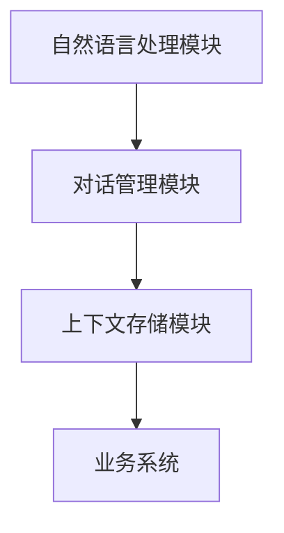
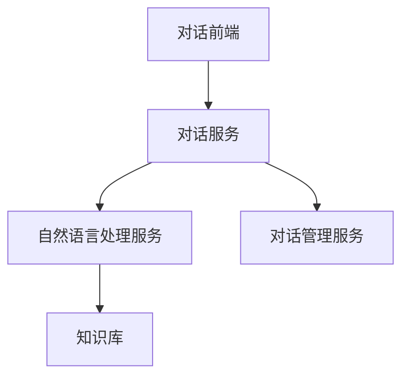
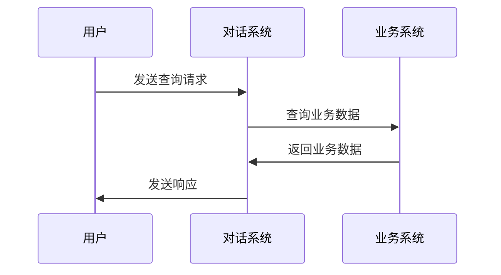

                 


# 构建企业级对话系统：上下文感知与多轮交互管理

> 关键词：企业级对话系统、上下文感知、多轮交互、对话管理、自然语言处理、深度学习

> 摘要：企业级对话系统的核心在于上下文感知与多轮交互管理。本文从背景、原理、算法、系统架构、项目实战等角度深入剖析了构建企业级对话系统的各个方面，重点探讨了上下文感知的重要性、多轮交互的管理策略以及系统架构设计的关键点。通过结合实际案例，详细解读了对话系统的实现过程，并提供了丰富的代码示例和系统设计图。本文旨在为企业级对话系统的构建提供理论支持与实践指导。

---

# 第一部分：企业级对话系统的背景与挑战

# 第1章：企业级对话系统的背景与挑战

## 1.1 对话系统的基本概念

### 1.1.1 对话系统的定义
对话系统是一种能够理解和生成自然语言的计算机系统，能够通过文本或语音与用户进行交互。企业级对话系统是指在企业应用场景中，具备高度智能化和专业化的对话能力，能够处理复杂业务逻辑的对话系统。

### 1.1.2 企业级对话系统的特征
- **上下文感知**：能够理解对话的上下文信息，保持对话的连贯性。
- **多轮交互**：支持多轮对话，能够根据对话历史调整响应策略。
- **业务深度集成**：与企业业务系统深度集成，能够处理复杂业务逻辑。
- **高可用性**：具备高容错性和高可用性，能够处理大规模用户请求。

### 1.1.3 对话系统的核心要素
- **输入**：用户输入的文本或语音。
- **输出**：系统生成的文本或语音。
- **上下文**：对话历史、用户信息、业务数据等。
- **对话管理**：根据上下文信息生成合适的响应。

## 1.2 上下文感知的重要性

### 1.2.1 上下文的定义
上下文是指对话中相关的背景信息，包括对话历史、用户身份、业务数据等。上下文感知是指系统能够理解并利用这些信息来生成更准确的响应。

### 1.2.2 上下文在对话系统中的作用
- **提升对话准确性**：通过利用上下文信息，系统能够生成更符合用户意图的响应。
- **增强用户体验**：通过保持对话连贯性，提升用户的对话体验。
- **支持复杂业务逻辑**：通过结合业务数据，系统能够处理复杂的业务场景。

## 1.3 多轮交互的基本原理

### 1.3.1 多轮对话的定义
多轮对话是指用户和系统之间进行的多次交互，每次交互都依赖于之前的对话历史。

### 1.3.2 多轮交互的特点
- **依赖性**：每次交互都依赖于之前的对话历史。
- **动态性**：对话内容和上下文会随着每次交互而变化。
- **复杂性**：需要处理多种可能的对话路径和上下文信息。

## 1.4 企业级对话系统的挑战

### 1.4.1 上下文理解的难点
- **信息不完整**：用户输入的信息可能不完整，需要系统通过上下文进行推理。
- **信息歧义性**：用户输入的信息可能存在多种解释，需要系统结合上下文进行判断。

### 1.4.2 对话历史管理的问题
- **数据量大**：随着对话轮次增加，对话历史数据量迅速增加。
- **数据复杂性**：对话历史包含文本、业务数据等多种类型的信息，管理复杂。

### 1.4.3 系统集成的复杂性
- **多系统集成**：需要与企业现有的业务系统、数据库等进行深度集成。
- **高可用性要求**：企业级系统需要具备高可用性和高容错性。

## 1.5 本章小结
本章介绍了企业级对话系统的背景、核心概念和挑战。上下文感知和多轮交互管理是构建企业级对话系统的关键，也是实现智能化对话的核心技术。

---

# 第二部分：上下文感知与多轮交互的核心概念

# 第2章：上下文感知的原理与实现

## 2.1 上下文表示的方法

### 2.1.1 基于序列的上下文表示
- **序列模型**：利用序列模型（如 LSTM、Transformer）对对话历史进行编码，生成上下文表示。
- **注意力机制**：通过注意力机制，聚焦于重要的对话历史信息。

### 2.1.2 基于向量的上下文表示
- **词向量**：将对话历史中的词语表示为向量，通过向量运算生成上下文表示。
- **句向量**：将对话历史中的句子表示为向量，通过句向量组合生成上下文表示。

### 2.1.3 基于知识图谱的上下文表示
- **知识图谱**：通过构建领域知识图谱，将对话历史中的实体和关系表示为图结构。
- **图嵌入**：利用图嵌入技术，生成上下文表示。

## 2.2 对话状态表示的实现

### 2.2.1 对话状态的定义
对话状态是指当前对话的上下文信息，包括用户意图、对话历史、业务数据等。

### 2.2.2 对话状态表示的实现方法
- **隐式表示**：通过神经网络生成隐式对话状态表示。
- **显式表示**：通过规则或模板生成显式对话状态表示。

## 2.3 上下文感知与对话流畅性的关系

### 2.3.1 上下文感知对对话流畅性的影响
- **上下文感知增强对话流畅性**：通过理解上下文信息，系统能够生成更符合用户意图的响应。
- **上下文感知降低对话流畅性**：如果上下文理解出现错误，可能导致对话不流畅。

### 2.3.2 优化上下文感知的方法
- **改进上下文表示模型**：通过优化上下文表示模型，提高上下文理解的准确性。
- **结合领域知识**：通过引入领域知识，增强上下文理解的准确性。

---

# 第三部分：对话系统的核心算法与实现

# 第3章：多轮交互的算法实现

## 3.1 基于记忆网络的多轮对话算法

### 3.1.1 记忆网络的原理
- **记忆网络结构**：由编码器和解码器组成，编码器将对话历史编码为向量，解码器根据向量生成响应。
- **注意力机制**：通过注意力机制，聚焦于重要的对话历史信息。

### 3.1.2 记忆网络的实现
```python
class MemoryNetwork:
    def __init__(self, vocab_size, embedding_dim, hidden_dim):
        self.vocab_size = vocab_size
        self.embedding_dim = embedding_dim
        self.hidden_dim = hidden_dim
        self.embedding = nn.Embedding(vocab_size, embedding_dim)
        self.encoder = nn.LSTM(embedding_dim, hidden_dim, batch_first=True)
        self.decoder = nn.LSTM(hidden_dim, hidden_dim, batch_first=True)
        self.linear = nn.Linear(hidden_dim, vocab_size)
    
    def forward(self, input_sequence, prev_state):
        # 编码器编码对话历史
        encoded, _ = self.encoder(input_sequence, prev_state)
        # 解码器生成响应
        decoded, _ = self.decoder(encoded, prev_state)
        # 线性变换生成最终输出
        output = self.linear(decoded[:, -1, :])
        return output, decoded
```

### 3.1.3 记忆网络的应用场景
- **客服对话**：处理用户的问题和投诉，需要结合对话历史进行上下文感知。
- **智能助手**：为用户提供个性化服务，需要理解对话上下文。

## 3.2 基于树状结构的多轮对话管理

### 3.2.1 树状对话管理的原理
- **树状结构**：将对话历史表示为树状结构，每个节点表示一个对话轮次。
- **树状遍历**：通过遍历树状结构，生成对话响应。

### 3.2.2 树状对话管理的实现
```python
class DialogTree:
    def __init__(self, root):
        self.root = root
    
    def add_child(self, node, child):
        node.children.append(child)
    
    def traverse(self, node):
        # 深度优先遍历
        for child in node.children:
            self.traverse(child)
```

## 3.3 基于规则的多轮对话管理

### 3.3.1 规则驱动对话管理的原理
- **规则定义**：通过预定义的规则，指导对话的流程。
- **状态转移**：根据当前状态和用户输入，触发相应的规则，生成对话响应。

### 3.3.2 规则驱动对话管理的实现
```python
class RuleBasedManager:
    def __init__(self, rules):
        self.rules = rules
    
    def generate_response(self, context):
        for rule in self.rules:
            if rule.trigger(context):
                return rule.response(context)
        return default_response
```

---

# 第四部分：系统分析与架构设计方案

# 第4章：企业级对话系统的系统架构设计

## 4.1 系统功能需求分析

### 4.1.1 用户需求分析
- **用户输入**：支持文本和语音输入。
- **对话历史**：记录对话历史，支持上下文感知。
- **业务集成**：与企业业务系统深度集成。

### 4.1.2 系统功能模块
- **自然语言处理模块**：负责对话理解和生成。
- **对话管理模块**：负责对话状态管理和响应生成。
- **上下文存储模块**：负责对话历史和业务数据的存储和管理。

## 4.2 系统架构设计

### 4.2.1 模块化架构设计


### 4.2.2 微服务架构设计


## 4.3 接口设计与交互流程

### 4.3.1 系统接口设计
- **输入接口**：支持文本和语音输入接口。
- **输出接口**：支持文本和语音输出接口。
- **上下文接口**：支持对话历史查询和更新接口。

### 4.3.2 交互流程设计


---

# 第五部分：项目实战

# 第5章：企业级对话系统的实战开发

## 5.1 环境安装与配置

### 5.1.1 安装依赖
```bash
pip install numpy
pip install pandas
pip install tensorflow
pip install transformers
```

### 5.1.2 配置环境
- **路径配置**：设置数据路径和模型路径。
- **日志配置**：配置日志输出格式和日志文件路径。

## 5.2 核心代码实现

### 5.2.1 对话系统实现
```python
class DialogSystem:
    def __init__(self, model, context_store):
        self.model = model
        self.context_store = context_store
    
    def process_dialog(self, input_text):
        # 获取上下文
        context = self.context_store.get_context()
        # 生成响应
        response = self.model.generate_response(input_text, context)
        return response
```

### 5.2.2 上下文存储实现
```python
class ContextStore:
    def __init__(self):
        self.context = {}
    
    def get_context(self):
        return self.context
    
    def update_context(self, key, value):
        self.context[key] = value
```

## 5.3 案例分析与代码解读

### 5.3.1 案例分析
- **案例背景**：构建一个客服对话系统，用于处理用户的咨询和投诉。
- **案例实现**：通过代码实现对话系统的上下文感知和多轮交互管理。

### 5.3.2 代码解读
```python
class DialogManager:
    def __init__(self):
        self.dialog_tree = DialogTree(DialogNode())
    
    def process_dialog(self, input_text):
        current_node = self.dialog_tree.root
        while True:
            if current_node.has_child(input_text):
                current_node = current_node.get_child(input_text)
            else:
                break
        return self.generate_response(current_node)
```

## 5.4 项目总结

### 5.4.1 项目成果
- **系统实现**：成功实现了一个企业级对话系统，具备上下文感知和多轮交互管理功能。
- **代码实现**：完成了对话系统的核心代码实现，包括对话管理模块和上下文存储模块。

### 5.4.2 项目经验
- **经验总结**：上下文感知和多轮交互管理是构建企业级对话系统的核心技术。
- **优化建议**：未来可以通过引入领域知识图谱和强化学习算法进一步提升对话系统的智能化水平。

---

# 第六部分：最佳实践与拓展阅读

# 第6章：企业级对话系统的最佳实践

## 6.1 对话系统优化技巧

### 6.1.1 上下文感知优化
- **优化上下文表示**：通过改进上下文表示模型，提高上下文理解的准确性。
- **结合领域知识**：通过引入领域知识图谱，增强上下文理解的能力。

### 6.1.2 多轮交互优化
- **优化对话策略**：通过引入强化学习算法，优化对话策略。
- **动态调整对话流程**：根据对话历史和用户意图，动态调整对话流程。

## 6.2 对话系统开发注意事项

### 6.2.1 开发注意事项
- **数据质量**：确保训练数据的质量，避免数据偏差。
- **模型可解释性**：确保模型具备良好的可解释性，方便调试和优化。
- **系统容错性**：确保系统具备良好的容错性，能够处理各种异常情况。

## 6.3 拓展阅读

### 6.3.1 推荐书籍
- 《深度学习》—— Ian Goodfellow
- 《自然语言处理入门》—— Jurafsky

### 6.3.2 推荐论文
- "Sequence to Sequence Learning with Neural Networks"（seq2seq模型）
- "Attention Is All You Need"（Transformer模型）

---

# 结语

构建企业级对话系统是一项复杂而富有挑战性的任务，需要结合上下文感知和多轮交互管理的核心技术。通过本文的深入剖析，读者可以全面了解企业级对话系统的构建过程，并掌握相关的理论知识和实践技能。未来，随着人工智能技术的不断发展，企业级对话系统将具备更强的智能化和自动化能力，为企业的业务发展提供更强大的支持。

