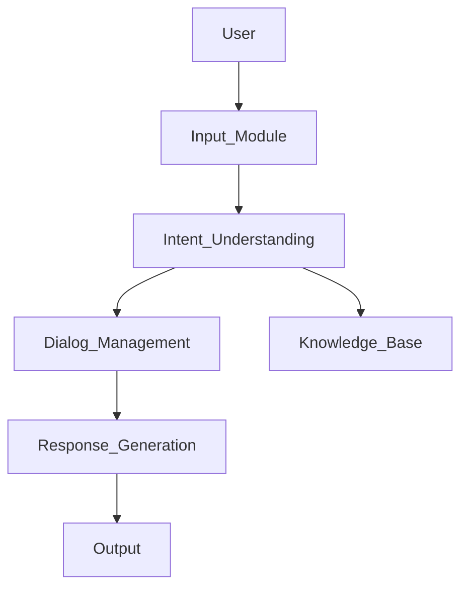

                 


# 构建企业级对话系统：多轮对话管理与意图理解

**关键词**：企业级对话系统、多轮对话管理、意图理解、自然语言处理、深度学习

**摘要**：  
随着人工智能技术的快速发展，企业级对话系统在各个行业的应用越来越广泛。本文将深入探讨构建企业级对话系统的核心技术，重点分析多轮对话管理和意图理解的关键问题、算法原理及系统架构设计。通过理论与实践相结合的方式，详细讲解如何从零开始构建一个高效、准确的对话系统，并通过具体案例分析，总结最佳实践经验和未来研究方向。

---

## 第一部分: 企业级对话系统概述

### 第1章: 对话系统概述

#### 1.1 对话系统的演变
##### 1.1.1 从单轮对话到多轮对话的演变
- 单轮对话的局限性：无法处理复杂场景，用户需求表达不完整。
- 多轮对话的兴起：通过连续交互理解用户需求，提升用户体验。
- 企业级对话系统的特点：高可用性、高准确率、支持复杂业务逻辑。

##### 1.1.2 企业级对话系统的定义与特点
- 定义：企业级对话系统是一种基于自然语言处理技术，能够理解用户意图并提供相应服务的智能系统。
- 特点：
  - 高可用性：支持7×24小时运行。
  - 高准确性：准确识别用户意图。
  - 支持复杂业务逻辑：能够处理多种业务场景。

##### 1.1.3 对话系统在企业中的应用场景
- 客服系统：处理用户咨询、问题解答。
- 电子商务：推荐产品、处理订单。
- 健康医疗：提供疾病咨询、预约挂号。
- 金融服务：提供投资建议、账户查询。

#### 1.2 对话系统的核心概念
##### 1.2.1 对话系统的组成要素
- 用户：发起对话的主体。
- 系统：响应用户需求的智能系统。
- 交互记录：对话过程中生成的文本记录。
- 意图：用户通过对话希望实现的目标。

##### 1.2.2 对话系统的关键问题
- 意图识别：准确理解用户的意图。
- 对话状态管理：跟踪对话的进展。
- 对话策略：选择合适的回应方式。

##### 1.2.3 对话系统的性能指标
- 响应时间：系统对用户输入的响应时间。
- 准确率：意图识别的准确率。
- 用户满意度：用户的使用体验。

### 第2章: 对话系统的数学模型与公式

#### 2.1 对话系统的数学模型
- 状态转移矩阵：描述对话过程中状态的变化。
- 概率分布函数：表示用户输入的概率分布。
- 损失函数：衡量系统预测与真实结果的差异。

#### 2.2 意图理解的公式表示
- 分类函数：将用户输入映射到意图类别。
- 损失函数：用于训练模型的优化目标。

#### 2.3 对话管理的公式表示
- 状态转移矩阵：表示对话状态的转移概率。
- 响应生成函数：根据当前状态生成系统回应。

### 第3章: 对话系统的ER实体关系图

```mermaid
erDiagram
    actor User {
        <id> int User_id
        <name> string User_name
    }
    class Dialog_system {
        <id> int Dialog_id
        <intent> string Intent
        <response> string Response
        <timestamp> datetime Timestamp
    }
    User --> Dialog_system : 发起对话
    Dialog_system --> Dialog_system : 状态转移
```

---

## 第二部分: 多轮对话管理与意图理解的算法原理

### 第4章: 多轮对话管理的算法原理

#### 4.1 基于HMM的对话管理算法

##### 4.1.1 HMM算法的原理
- 隐马尔可夫模型：通过状态转移概率和观测概率建模对话过程。
- 对话状态：表示当前对话的上下文信息。

##### 4.1.2 HMM算法的实现步骤
1. 初始化参数：状态转移概率矩阵、观测概率矩阵。
2. 计算前向概率：给定观测序列下各个状态的概率。
3. 计算后向概率：给定观测序列和当前状态的后验概率。
4. 更新参数：根据期望值公式优化参数。

##### 4.1.3 HMM算法的优缺点
- 优点：简单易懂，计算效率高。
- 缺点：无法处理复杂的对话场景。

##### 4.1.4 Python代码实现
```python
import numpy as np

class HMM:
    def __init__(self, states, obs):
        self.states = states
        self.obs = obs
        self.n_states = len(states)
        self.n_obs = len(obs)
        self.A = np.random.rand(self.n_states, self.n_states)
        self.B = np.random.rand(self.n_states, self.n_obs)
        self.pi = np.random.rand(self.n_states)

    def forward_algorithm(self, sequence):
        n = len(sequence)
        delta = np.zeros((n, self.n_states))
        delta[0] = self.pi * self.B[:, sequence[0]]
        for t in range(1, n):
            for j in range(self.n_states):
                delta[t][j] = delta[t-1][j] * self.A[j][j]
        return delta[-1].sum()

    def backward_algorithm(self, sequence):
        n = len(sequence)
        beta = np.zeros((n, self.n_states))
        beta[-1] = np.ones(self.n_states)
        for t in range(n-2, -1, -1):
            for i in range(self.n_states):
                beta[t][i] = beta[t+1].dot(self.A[i])
        return beta
```

#### 4.2 基于CRF的对话管理算法

##### 4.2.1 CRF算法的原理
- 条件随机场：建模对话过程中的依赖关系。
- 对话状态：基于上下文的信息进行预测。

##### 4.2.2 CRF算法的实现步骤
1. 初始化参数：状态转移概率矩阵、特征权重。
2. 训练模型：基于标注数据优化参数。
3. 解码：给定观测序列生成最可能的状态序列。

##### 4.2.3 CRF算法的优缺点
- 优点：能够建模复杂的对话依赖关系。
- 缺点：计算复杂度较高。

##### 4.2.4 Python代码实现
```python
import numpy as np

class CRF:
    def __init__(self, n_states, features):
        self.n_states = n_states
        self.n_features = len(features)
        self.w = np.random.randn(self.n_features)
        self.A = np.random.randn(self.n_states, self.n_states)

    def forward(self, x, features):
        n = len(x)
        logZ = 0
        for t in range(n):
            logZ += np.dot(self.w, features[x[t]])
        return logZ

    def decode(self, x, features):
        n = len(x)
        viterbi = np.zeros((n, self.n_states))
        prev = np.zeros(n)
        for t in range(n):
            for y in range(self.n_states):
                if t == 0:
                    viterbi[t][y] = self.w[features[y]]
                else:
                    max_prob = -float('inf')
                    best_prev = 0
                    for y_prev in range(self.n_states):
                        prob = viterbi[t-1][y_prev] + self.A[y_prev][y] + self.w[features[x[t]]]
                        if prob > max_prob:
                            max_prob = prob
                            best_prev = y_prev
                    viterbi[t][y] = max_prob
                    prev[t] = best_prev
        y = prev[-1]
        return y
```

### 第5章: 意图理解的算法原理

#### 5.1 基于词袋模型的意图理解算法

##### 5.1.1 词袋模型的原理
- 词袋模型：将文本表示为词频向量。
- 意图分类：基于词频向量进行分类。

##### 5.1.2 词袋模型的实现步骤
1. 文本预处理：分词、去停用词。
2. 特征提取：构建词袋向量。
3. 模型训练：基于 SVM 或 NB 进行分类。

##### 5.1.3 词袋模型的优缺点
- 优点：简单易实现，计算效率高。
- 缺点：无法捕捉词语之间的关系。

##### 5.1.4 Python代码实现
```python
from sklearn.feature_extraction.text import TfidfVectorizer
from sklearn.svm import SVC

class IntentClassifier:
    def __init__(self):
        self.vectorizer = TfidfVectorizer()
        self.classifier = SVC()

    def fit(self, X, y):
        self.vectorizer.fit(X)
        X_vec = self.vectorizer.transform(X)
        self.classifier.fit(X_vec, y)

    def predict(self, X):
        X_vec = self.vectorizer.transform(X)
        return self.classifier.predict(X_vec)
```

#### 5.2 基于深度学习的意图理解算法

##### 5.2.1 深度学习算法的原理
- 词嵌入：使用 Word2Vec 或 GloVe 进行词向量化。
- 神经网络：构建 RNN 或 LSTM 进行序列建模。

##### 5.2.2 深度学习算法的实现步骤
1. 文本预处理：分词、去停用词。
2. 词嵌入：将文本转换为词向量。
3. 神经网络训练：基于词向量训练分类模型。

##### 5.2.3 深度学习算法的优缺点
- 优点：能够捕捉文本的语义信息。
- 缺点：计算资源消耗大，训练时间长。

##### 5.2.4 Python代码实现
```python
import torch
import torch.nn as nn

class IntentClassifier(nn.Module):
    def __init__(self, vocab_size, embed_dim, hidden_dim, output_dim):
        super(IntentClassifier, self).__init__()
        self.embed = nn.Embedding(vocab_size, embed_dim)
        self.rnn = nn.LSTM(embed_dim, hidden_dim, batch_first=True)
        self.fc = nn.Linear(hidden_dim, output_dim)
        self.dropout = nn.Dropout(0.5)

    def forward(self, x):
        embed = self.embed(x)
        out, _ = self.rnn(embed)
        out = self.dropout(out[:, -1])
        out = self.fc(out)
        return out
```

### 第6章: 对话系统的数学模型与公式

#### 6.1 对话系统的数学模型
- 状态转移矩阵：描述对话过程中状态的变化。
  $$ A = \begin{bmatrix} a_{ij} \end{bmatrix} $$
  其中，$a_{ij}$ 表示从状态 $i$ 转移到状态 $j$ 的概率。

- 概率分布函数：表示用户输入的概率分布。
  $$ P(x) = \prod_{i=1}^{n} p(x_i) $$

- 损失函数：用于优化模型的损失。
  $$ L = -\frac{1}{N} \sum_{i=1}^{N} \log P(y_i|x_i) $$

#### 6.2 意图理解的数学模型
- 特征向量：将文本转换为数值向量。
  $$ x = (x_1, x_2, ..., x_n) $$

- 分类函数：将特征向量映射到意图类别。
  $$ f(x) = \arg\max_{c} P(c|x) $$

- 评估指标：准确率、召回率、F1值。
  $$ \text{Accuracy} = \frac{\text{正确预测数}}{\text{总预测数}} $$

---

## 第三部分: 企业级对话系统的架构与实现

### 第7章: 企业级对话系统的架构设计

#### 7.1 对话系统的功能模块划分
- 用户输入模块：接收用户的输入。
- 意图理解模块：分析用户的意图。
- 对话管理模块：跟踪对话状态并生成回应。
- 知识库模块：存储业务知识和上下文信息。
- 响应生成模块：生成系统的回应。

#### 7.2 对话系统的架构图



#### 7.3 对话系统的交互流程
1. 用户输入：用户发送一条消息。
2. 意图理解：系统分析用户的意图。
3. 对话管理：系统根据意图生成回应。
4. 响应生成：系统将回应返回给用户。

#### 7.4 对话系统的数学模型与公式
- 对话状态表示：使用向量表示当前对话的状态。
  $$ s_t = f(s_{t-1}, x_t) $$
  其中，$s_t$ 表示当前状态，$x_t$ 表示当前输入。

- 响应生成：基于当前状态生成系统回应。
  $$ y_t = g(s_t) $$

---

## 第四部分: 项目实战

### 第8章: 项目实战——构建企业级对话系统

#### 8.1 项目背景与目标
- 项目背景：某企业希望构建一个智能客服对话系统。
- 项目目标：实现用户咨询、问题解答、信息查询等功能。

#### 8.2 系统功能设计
- 用户输入：接收用户的文本输入。
- 意图理解：识别用户的意图。
- 对话管理：跟踪对话状态并生成回应。
- 知识库：存储常见问题及答案。
- 响应生成：生成系统的回应。

#### 8.3 系统实现步骤
1. 环境搭建：安装 Python、TensorFlow、Keras 等依赖库。
2. 数据准备：收集用户咨询数据，标注意图。
3. 模型训练：训练意图分类模型和对话管理模型。
4. 系统集成：将各个模块集成到一个对话系统中。
5. 测试优化：测试系统性能，优化模型参数。

#### 8.4 系统实现代码
```python
class DialogSystem:
    def __init__(self, intent_classifier, dialog_manager):
        self.intent_classifier = intent_classifier
        self.dialog_manager = dialog_manager

    def process_dialog(self, input_text):
        intent = self.intent_classifier.predict(input_text)
        response = self.dialog_manager.generate_response(intent)
        return response
```

#### 8.5 系统测试与优化
- 测试指标：准确率、响应时间、用户满意度。
- 优化方向：优化意图分类模型，提升对话管理的准确性。

---

## 第五部分: 总结与展望

### 第9章: 总结与展望

#### 9.1 总结
- 本文详细介绍了构建企业级对话系统的核心技术，包括多轮对话管理和意图理解的算法原理、系统架构设计和项目实战。
- 通过具体案例分析，展示了如何从零开始构建一个高效、准确的对话系统。

#### 9.2 最佳实践 tips
- 数据质量：高质量的标注数据是模型准确的关键。
- 系统架构：模块化设计能够提升系统的可维护性和扩展性。
- 模型优化：不断优化模型参数，提升系统的性能。

#### 9.3 注意事项
- 数据隐私：确保用户数据的安全和隐私。
- 系统性能：优化系统的响应时间和吞吐量。
- 模型泛化能力：提升模型在不同场景下的适应能力。

#### 9.4 拓展阅读
- 《自然语言处理实战：基于深度学习的对话系统》
- 《机器学习实战：基于Scikit-learn和TensorFlow的算法实现》

---

通过本文的学习，读者可以系统性地掌握构建企业级对话系统的核心技术，并能够在实际项目中灵活运用这些知识。希望本文能够为读者提供有价值的参考和启发。

