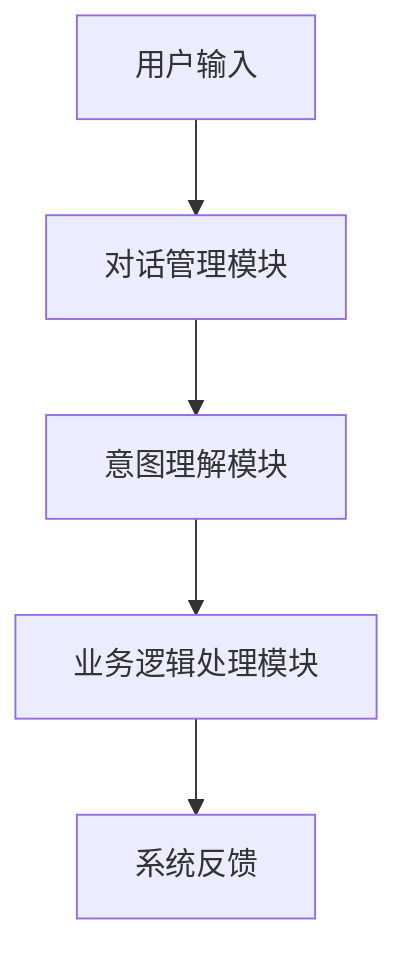
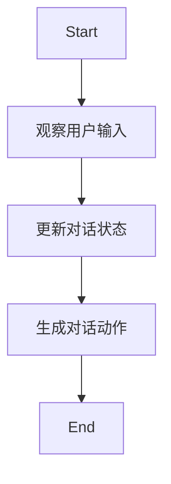
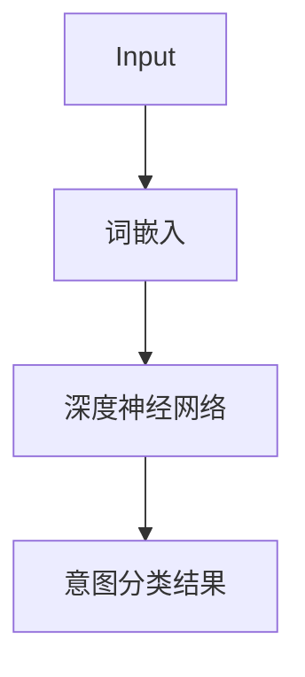
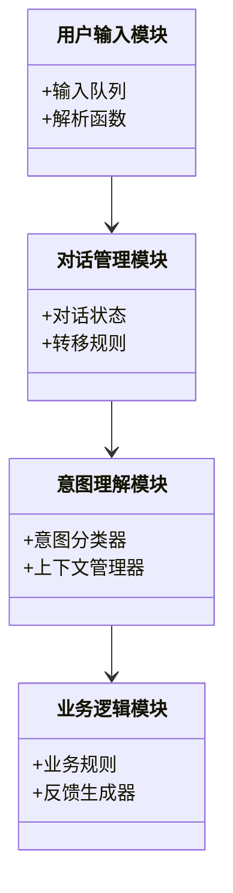
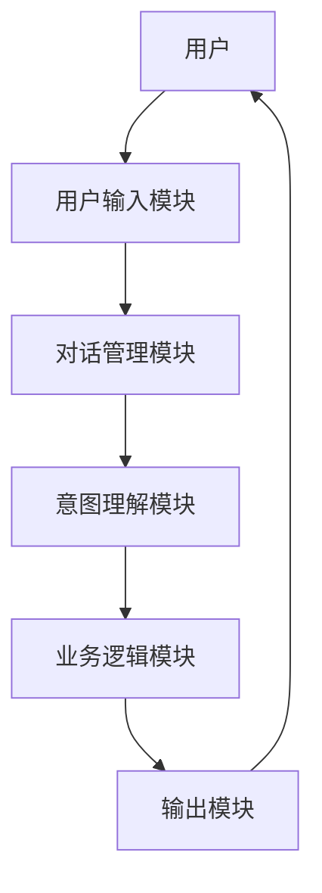

                 


# 构建企业级对话系统：多轮对话管理与意图理解的深度整合

## 关键词：
企业级对话系统，多轮对话管理，意图理解，深度整合，对话系统架构，对话系统算法

## 摘要：
在现代企业智能化转型中，构建高效的对话系统是实现人机交互的核心任务。本文重点探讨如何将多轮对话管理和意图理解进行深度整合，构建一个高效、准确的企业级对话系统。通过分析多轮对话管理的复杂性、意图理解的技术挑战，以及两者的整合策略，本文将为企业级对话系统的构建提供系统性解决方案。

---

## 第一部分: 企业级对话系统概述

### 第1章: 背景与问题背景

#### 1.1 问题背景
##### 1.1.1 当前对话系统的发展现状
现代对话系统经历了从简单的关键词匹配到复杂的深度学习模型的演进。然而，现有的系统在处理多轮对话和复杂意图理解时仍存在诸多挑战，尤其是在企业级应用中，需要更高的准确性和稳定性。

##### 1.1.2 企业级对话系统的定义与特点
企业级对话系统是指在企业环境中，用于支持客户与系统进行多轮交互，实现复杂业务目标的智能化对话系统。其特点包括：高可用性、可扩展性、支持多语言、集成企业业务逻辑等。

##### 1.1.3 多轮对话管理与意图理解的重要性
多轮对话管理确保对话的连贯性，而意图理解则是准确解析用户需求的关键。两者的深度整合是实现高效企业级对话系统的核心。

#### 1.2 问题描述
##### 1.2.1 对话系统的核心挑战
- 对话状态跟踪的复杂性
- 不同意图之间的干扰
- 长对话中的信息丢失

##### 1.2.2 多轮对话管理的难点
- 对话上下文的维护与更新
- 多意图识别的准确性
- 多轮对话中的用户情绪分析

##### 1.2.3 意图理解的复杂性
- 多义词的处理
- 意图的模糊性
- 隐含意图的识别

#### 1.3 问题解决
##### 1.3.1 多轮对话管理的解决方案
- 基于状态机的对话管理
- 基于深度学习的对话策略生成
- 对话历史的有效存储与检索

##### 1.3.2 意图理解的技术路径
- 基于规则的意图分类
- 基于机器学习的意图识别
- 基于上下文的意图推理

##### 1.3.3 深度整合的必要性
- 提高对话系统的整体性能
- 实现意图与对话流程的无缝衔接
- 支持复杂业务场景的处理

#### 1.4 边界与外延
##### 1.4.1 企业级对话系统的边界
- 系统内部的功能模块
- 系统与外部数据源的交互
- 系统与用户的交互界面

##### 1.4.2 相关领域的外延
- 自然语言处理（NLP）
- 语音识别与合成
- 业务逻辑引擎

##### 1.4.3 系统与外部环境的交互
- 用户输入的接收
- 对话结果的输出
- 与企业业务系统的集成

#### 1.5 概念结构与核心要素
##### 1.5.1 对话系统的组成要素
- 用户输入模块
- 对话管理模块
- 意图理解模块
- 业务逻辑处理模块

##### 1.5.2 多轮对话的流程结构
- 初始化对话
- 对话状态跟踪
- 意图识别
- 对话策略生成
- 系统反馈

##### 1.5.3 意图理解的核心要素
- 用户输入解析
- 意图分类
- 上下文理解
- 意图验证

---

### 第2章: 核心概念与联系

#### 2.1 核心概念原理
##### 2.1.1 多轮对话管理的原理
- 对话上下文的维护
- 对话状态的跟踪
- 对话策略的生成

##### 2.1.2 意图理解的原理
- 用户输入的预处理
- 意图分类
- 上下文关联

##### 2.1.3 深度整合的机制
- 对话上下文的共享
- 意图理解结果的反馈
- 对话策略的优化

#### 2.2 概念属性特征对比
##### 对比表格展示：
| 对比维度       | 多轮对话管理                     | 意图理解                     |
|----------------|----------------------------------|-----------------------------|
| 核心目标       | 维护对话流程的连贯性             | 准确识别用户的意图           |
| 输入数据       | 对话历史、当前输入               | 用户输入、上下文信息         |
| 输出结果       | 对话策略、下一步操作             | 意图标签、意图置信度         |
| 技术难点       | 对话状态的准确跟踪               | 模糊意图的识别               |

#### 2.3 ER实体关系图
##### Mermaid流程图展示：


---

## 第三部分: 算法原理讲解

### 第3章: 多轮对话管理算法

#### 3.1 基于HMM的对话状态跟踪
##### 算法流程图展示：


##### Python代码实现：
```python
import numpy as np
from hmmlearn.hmm import GaussianHMM

# 示例数据：用户输入序列
user_inputs = ["购买产品", "查询价格", "下单"]

# 对话状态转移矩阵
states = ["初始状态", "中间状态", "结束状态"]
transition_matrix = np.array([
    [0.6, 0.3, 0.1],
    [0.1, 0.5, 0.4],
    [0.0, 0.0, 1.0]
])

# 初始化HMM模型
model = GaussianHMM(n_components=len(states), covariance_type="full")
model.transmat_ = transition_matrix

# 预测对话状态
predicted_states = model.predict(user_inputs)
print(predicted_states)
```

#### 3.2 基于DNN的意图分类
##### 算法流程图展示：


##### Python代码实现：
```python
import tensorflow as tf
from tensorflow.keras import layers

# 示例数据：用户输入
inputs = ["我需要技术支持", "请帮我查询订单"]

# 模型定义
model = tf.keras.Sequential([
    layers.Embedding(input_dim=1000, output_dim=32),
    layers.LSTM(32),
    layers.Dense(5, activation="softmax")
])

# 训练模型
model.compile(optimizer="adam", loss="sparse_categorical_crossentropy", metrics=["accuracy"])
model.fit(x, y, epochs=10)
```

---

## 第四部分: 系统分析与架构设计

### 第4章: 系统分析与架构设计

#### 4.1 问题场景介绍
##### 4.1.1 企业级对话系统的应用场景
- 客户服务
- 在线销售
- 技术支持

#### 4.2 系统功能设计
##### 4.2.1 领域模型Mermaid类图


#### 4.3 系统架构设计
##### 4.3.1 系统架构Mermaid架构图


---

## 第五部分: 项目实战

### 第5章: 项目实战

#### 5.1 环境安装
##### 5.1.1 开发环境搭建
- 安装Python
- 安装TensorFlow、Keras、HMM库
- 安装Mermaid工具

##### 5.1.2 依赖库安装
```bash
pip install numpy tensorflow keras hmmlearn
```

#### 5.2 核心代码实现
##### 5.2.1 对话管理模块实现
```python
class DialogManager:
    def __init__(self):
        self.states = ["initial", "processing", "completed"]
        self.current_state = "initial"

    def update_state(self, input):
        # 根据输入更新状态
        if input == "start":
            self.current_state = "processing"
        elif input == "complete":
            self.current_state = "completed"
```

##### 5.2.2 意图理解模块实现
```python
class IntentAnalyzer:
    def __init__(self):
        self.model = self.build_model()

    def build_model(self):
        # 定义意图分类模型
        pass

    def predict_intent(self, input):
        return self.model.predict(input)
```

##### 5.2.3 整合代码实现
```python
def main():
    dialog_manager = DialogManager()
    intent_analyzer = IntentAnalyzer()
    while True:
        input = input("请输入您的需求：")
        dialog_manager.update_state(input)
        intent = intent_analyzer.predict_intent(input)
        print(f"系统理解的意图是：{intent}")
```

---

## 第六部分: 最佳实践

### 第6章: 小结与注意事项

#### 6.1 小结
企业级对话系统的构建需要深度整合多轮对话管理和意图理解，通过合理的系统架构设计和高效的算法实现，才能满足复杂业务场景的需求。

#### 6.2 注意事项
- 确保对话系统的高可用性和稳定性
- 定期优化意图分类模型
- 注意数据隐私与安全问题

#### 6.3 拓展阅读
- 《深度学习实战》
- 《自然语言处理入门》
- 《对话系统设计与实现》

---

通过以上系统的分析和实践，我们可以看到，构建企业级对话系统是一个复杂但极具挑战性的任务。通过深度整合多轮对话管理与意图理解，我们可以实现更高效、更智能的对话系统，为企业带来更大的价值。

