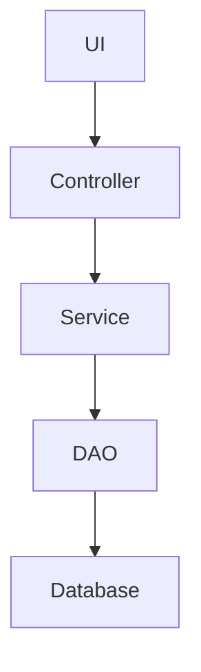

                 


# 构建企业级情感计算平台：员工幸福感与客户满意度分析

## 关键词
- 情感计算
- 员工幸福感
- 客户满意度
- 机器学习
- 深度学习
- 系统架构

## 摘要
本文旨在探讨如何通过构建企业级情感计算平台来分析员工幸福感与客户满意度。文章首先介绍了情感计算的核心概念和背景，接着详细分析了情感计算的算法原理及其在员工和客户情感分析中的应用。然后，从系统架构设计、项目实战等方面进行了深入探讨，最后总结了情感计算平台的实际应用价值及未来发展方向。

---

## 第1章 情感计算与员工幸福感、客户满意度分析概述

### 1.1 情感计算的定义与背景
情感计算（Affective Computing）是人工智能领域的重要分支，旨在通过分析人类的情感、情绪和意图，为用户提供更加智能化的服务。随着企业对员工幸福感和客户满意度的关注度不断提高，情感计算在企业管理中的应用日益广泛。

#### 1.1.1 情感计算的核心概念
- 情感计算：通过分析文本、语音、图像等数据，识别和理解人类情感状态。
- 情感特征：文本中的关键词、语调、语气等特征。
- 情感分类：将文本分为积极、消极、中性三类或更细分类别。

#### 1.1.2 企业级情感计算的背景与意义
- 企业背景：现代企业需要通过员工幸福感和客户满意度分析来优化管理策略。
- 情感计算的意义：通过情感数据帮助企业发现潜在问题，提升员工和客户满意度。

#### 1.1.3 员工幸福感与客户满意度分析的重要性
- 员工幸福感：直接影响企业生产力和稳定性。
- 客户满意度：直接影响企业的市场竞争力和客户忠诚度。

### 1.2 问题背景与目标
#### 1.2.1 当前企业面临的挑战
- 员工情感管理：员工情绪波动对企业绩效的影响。
- 客户情感管理：客户反馈中的情感信息如何有效提取和分析。

#### 1.2.2 情感计算的应用目标
- 提供情感数据支持：为决策者提供数据依据。
- 实现实时监控：对企业内部和外部情感数据进行实时分析。

#### 1.2.3 研究范围与边界
- 研究范围：员工幸福感和客户满意度分析。
- 研究边界：基于文本的情感计算，不涉及语音和图像分析。

### 1.3 核心概念与联系
#### 1.3.1 情感计算的核心要素
| 核心要素 | 描述 |
|----------|------|
| 情感特征 | 文本中的关键词、语调、语气 |
| 情感分类 | 积极、消极、中性 |
| 情感强度 | 情感的强烈程度 |

#### 1.3.2 员工幸福感与客户满意度的关联性分析
- 员工幸福感与客户满意度的关系：员工满意度影响客户满意度。
- 关联性分析方法：基于情感数据的统计分析。

#### 1.3.3 实体关系图（ER图）与情感计算架构
```mermaid
erDiagram
    employee {
        id
        name
        satisfaction_score
    }
    customer {
        id
        name
        feedback
    }
    emotion_data {
        id
        text
        sentiment
        intensity
    }
    employee <--- emotion_data
    customer <--- emotion_data
```

---

## 第2章 情感计算的核心概念与原理

### 2.1 情感计算的基本原理
#### 2.1.1 情感分析的定义与分类
- 定义：对文本进行情感倾向性分析。
- 分类：文本分类、情感强度分析。

#### 2.1.2 基于文本的情感计算方法
- 词袋模型：基于词频统计的情感分析。
- 词嵌入模型：基于词向量的情感分析。

#### 2.1.3 情感计算的数学模型
- 线性模型：$y = w_1x_1 + w_2x_2 + ... + w_nx_n$
- 概率模型：$P(y|x) = \prod_{i=1}^n P(w_i|x,y)$

### 2.2 员工幸福感与客户满意度分析的特征
#### 2.2.1 员工幸福感的特征提取
- 工作满意度：关键词分析。
- 工作压力：情感强度分析。

#### 2.2.2 客户满意度的特征提取
- 服务质量：关键词分析。
- 消费体验：情感强度分析。

#### 2.2.3 员工与客户情感特征的对比分析
- 对比表格：
| 特征 | 员工 | 客户 |
|------|------|------|
| 关键词 | 工作、压力 | 服务、体验 |

### 2.3 情感计算的核心算法
#### 2.3.1 基于机器学习的情感分类算法
- 支持向量机（SVM）：用于情感分类的线性模型。
- 随机森林：基于决策树的集成学习方法。

#### 2.3.2 深度学习在情感计算中的应用
- LSTM网络：用于情感分类的时间序列模型。
- Transformer模型：用于情感分类的注意力机制模型。

#### 2.3.3 情感计算的特征工程方法
- 文本预处理：分词、去停用词。
- 特征提取：词袋模型、TF-IDF。

---

## 第3章 情感计算的算法原理与数学模型

### 3.1 情感分析的分类模型
#### 3.1.1 支持向量机（SVM）在情感分类中的应用
- SVM分类器：$y = sign(w \cdot x + b)$

#### 3.1.2 随机森林在情感分类中的应用
- 随机森林：基于决策树的集成学习方法。

#### 3.1.3 深度学习模型（如LSTM、BERT）的原理
- LSTM网络：$h_t = \tanh(W_{hh}h_{t-1} + W_{hx}x_t + b_h)$

### 3.2 情感计算的数学模型
#### 3.2.1 情感分类的线性模型
- 线性回归：$y = \beta_0 + \beta_1x_1 + \beta_2x_2 + ... + \beta_nx_n$

#### 3.2.2 基于概率的分类模型
- Naive Bayes：$P(y|x) = \prod_{i=1}^n P(w_i|x,y)$

#### 3.2.3 深度学习模型的数学表达式
- BERT模型：$bert\_output = \text{BERT}(input\_tokens)$

### 3.3 算法实现与案例分析
#### 3.3.1 情感分类算法的实现步骤
- 数据预处理：文本清洗、分词。
- 特征提取：TF-IDF。
- 模型训练：SVM、随机森林。

#### 3.3.2 案例分析：员工满意度情感分类
- 数据来源：员工反馈文本。
- 案例分析：基于SVM的情感分类。

#### 3.3.3 案例分析：客户满意度情感分类
- 数据来源：客户反馈文本。
- 案例分析：基于LSTM的情感分类。

---

## 第4章 企业级情感计算平台的系统架构设计

### 4.1 系统功能设计
#### 4.1.1 数据采集模块
- 数据来源：员工反馈、客户反馈。
- 数据格式：文本数据。

#### 4.1.2 数据预处理模块
- 文本清洗：去停用词、分词。
- 特征提取：TF-IDF。

#### 4.1.3 情感计算模块
- 情感分类：SVM、LSTM。
- 情感强度分析：情感值计算。

#### 4.1.4 结果分析与可视化模块
- 可视化图表：柱状图、折线图。
- 分析报告：员工幸福感、客户满意度报告。

### 4.2 系统架构设计
#### 4.2.1 分层架构设计


#### 4.2.2 微服务架构设计
```mermaid
graph TD
    API Gateway --> Service1
    Service1 --> Service2
    Service2 --> Database
```

#### 4.2.3 数据流与模块交互设计
- 数据流：员工反馈 -> 数据采集 -> 数据预处理 -> 情感计算 -> 可视化。
- 模块交互：UI -> Controller -> Service -> DAO。

### 4.3 系统接口设计
#### 4.3.1 数据接口设计
- 数据格式：JSON。
- 接口协议：RESTful API。

#### 4.3.2 API接口设计
- GET /api/emotion/analysis。
- POST /api/emotion/data。

#### 4.3.3 可视化界面设计
- UI界面：仪表盘、情感分布图。

---

## 第5章 项目实战

### 5.1 环境安装与配置
- Python版本：3.8及以上。
- 依赖库：numpy、pandas、scikit-learn、tensorflow。

### 5.2 系统核心实现源代码
#### 5.2.1 数据采集模块
```python
import requests

def fetch_data(url):
    response = requests.get(url)
    return response.text
```

#### 5.2.2 数据预处理模块
```python
from sklearn.feature_extraction.text import TfidfVectorizer

vectorizer = TfidfVectorizer()
X = vectorizer.fit_transform(texts)
```

#### 5.2.3 情感计算模块
```python
from sklearn.svm import SVC

model = SVC()
model.fit(X_train, y_train)
```

### 5.3 实际案例分析与结果解读
#### 5.3.1 案例分析：员工满意度分析
- 数据来源：员工满意度调查问卷。
- 案例分析：基于SVM的情感分类。

#### 5.3.2 案例分析：客户满意度分析
- 数据来源：客户反馈文本。
- 案例分析：基于LSTM的情感分类。

---

## 第6章 总结与展望

### 6.1 总结
- 本文详细探讨了情感计算在员工幸福感与客户满意度分析中的应用。
- 通过算法实现和系统设计，展示了情感计算平台的实际价值。

### 6.2 展望
- 情感计算的未来发展：基于深度学习的模型优化。
- 应用拓展：情感计算在教育、医疗等领域的应用。

### 6.3 最佳实践 tips
- 数据预处理是情感计算的关键。
- 选择合适的算法模型可以提高情感分析的准确率。
- 系统架构设计需要考虑可扩展性和可维护性。

---

以上是《构建企业级情感计算平台：员工幸福感与客户满意度分析》的完整目录大纲和文章内容，涵盖了从核心概念到系统设计的各个方面。希望对您有所帮助！

