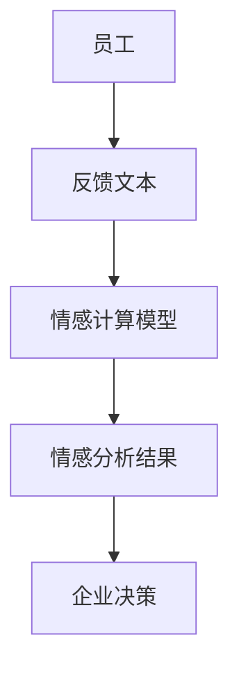
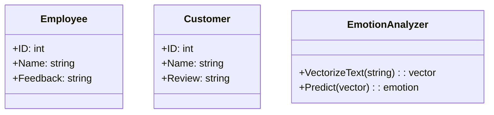
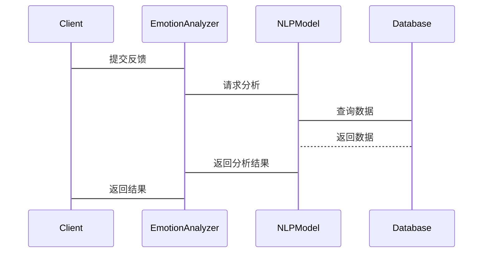

                 


# 构建企业级情感计算平台：员工满意度与客户情绪分析

> 关键词：情感计算、自然语言处理、员工满意度、客户情绪分析、机器学习、深度学习

> 摘要：情感计算是一种通过分析文本中的情感倾向来理解人类情绪的技术，广泛应用于企业级员工满意度分析和客户情绪分析。本文将详细探讨情感计算的核心概念、算法原理、系统架构设计以及实际项目实现，帮助读者全面理解如何构建一个高效的企业级情感计算平台。

---

# 第一部分: 情感计算与企业级应用背景

## 第1章: 情感计算与企业应用概述

### 1.1 情感计算的定义与核心概念
#### 1.1.1 情感计算的定义
情感计算（Affective Computing）是一种通过分析文本、语音或图像中的情感信息，来识别人类情绪状态的技术。它不仅关注内容本身，还关注内容背后的情感倾向，例如“正面”、“负面”或“中性”。

#### 1.1.2 情感计算的核心概念
- **情感分析**：判断文本的情感倾向，例如将一段评论分类为“正面”或“负面”。
- **情感强度**：量化情感的强度，例如“非常喜欢”（强度高）或“不太喜欢”（强度低）。
- **情感计算的边界**：情感计算仅关注情绪信息，不涉及具体的情感内容或语境。

#### 1.1.3 情感计算与自然语言处理的关系
情感计算是自然语言处理（NLP）的一个子领域，主要依赖于文本处理技术，如分词、词性标注和句法分析。

### 1.2 情感计算在企业中的应用价值
#### 1.2.1 员工满意度分析
通过分析员工反馈文本（如离职面谈记录、满意度调查问卷），帮助企业识别员工不满情绪，优化员工管理策略。

#### 1.2.2 客户情绪分析
通过分析客户反馈（如产品评论、客服对话记录），帮助企业识别客户不满情绪，提升客户满意度。

#### 1.2.3 企业级情感计算的商业价值
- 提高客户满意度，增强客户忠诚度。
- 优化员工管理，降低员工流失率。
- 提升企业竞争力，增强市场地位。

### 1.3 情感计算的技术背景与发展趋势
#### 1.3.1 情感计算的技术背景
- 随着NLP技术的快速发展，情感计算逐渐成熟。
- 大数据分析技术的兴起为企业级情感计算提供了数据支持。

#### 1.3.2 情感计算的发展趋势
- 深度学习算法（如LSTM、Transformer）逐渐取代传统机器学习算法。
- 情感分析从二分类（正面/负面）向多分类（非常正面、正面、中性、负面、非常负面）发展。

#### 1.3.3 企业级应用的挑战与机遇
- **挑战**：数据量大、情感表达多样化、语境复杂。
- **机遇**：技术进步为情感计算提供了更多可能性。

---

## 第2章: 情感计算的核心概念与联系

### 2.1 情感计算的核心概念
#### 2.1.1 情感分析的分类
- **二分类**：正面/负面。
- **多分类**：非常正面、正面、中性、负面、非常负面。
- **情感强度**：量化情感的强弱程度。

#### 2.1.2 情感计算的属性特征对比（表格形式）

| 特征属性 | 定义 | 示例 |
|----------|------|------|
| 情感类别 | 情感类型 | 正面、负面 |
| 情感强度 | 情感程度 | 非常喜欢、有点喜欢 |
| 情感语境 | 情感发生的场景 | 产品评论、客服对话 |

#### 2.1.3 情感计算的ER实体关系图（Mermaid流程图）



---

## 第3章: 情感计算的算法原理

### 3.1 常见的情感计算算法
#### 3.1.1 词袋模型（Bag of Words）
- 仅考虑词语的出现频率，不考虑词语顺序。
- 例如：文本“我非常喜欢这个产品”会被表示为一个向量，向量的长度等于词表的大小。

#### 3.1.2 TF-IDF特征提取
- TF（词频）：词语在文本中的出现频率。
- IDF（逆文档频率）：词语在所有文档中的倒数频率。

#### 3.1.3 情感词典方法
- 使用预定义的情感词典，将词语映射到情感值（如正面=1，负面=-1）。
- 例如：词语“喜欢”映射为+1，“不喜欢”映射为-1。

#### 3.1.4 机器学习算法
- **SVM**：支持向量机，适用于小规模数据。
- **随机森林**：适用于特征较多的情况。

#### 3.1.5 深度学习算法
- **LSTM**：长短期记忆网络，适用于序列数据。
- **Transformer**：基于注意力机制，适用于大规模数据。

### 3.2 情感计算的数学模型与公式
#### 3.2.1 词袋模型的数学表达
$$ P(w_1, w_2, ..., w_n) = \prod_{i=1}^{n} P(w_i) $$

#### 3.2.2 TF-IDF的计算公式
$$ TF-IDF(t, d) = TF(t, d) \times \log\left(\frac{N}{DF(t)}\right) $$

---

## 第4章: 系统分析与架构设计方案

### 4.1 问题场景介绍
- **员工满意度分析**：分析员工反馈文本，识别员工情绪。
- **客户情绪分析**：分析客户评论，识别客户情绪。

### 4.2 系统功能设计
#### 4.2.1 领域模型（Mermaid类图）



#### 4.2.2 系统架构设计（Mermaid架构图）

```mermaid
dataflowDiagram
    client --> EmotionAnalyzer: 提交反馈
    EmotionAnalyzer --> Database: 查询数据
    EmotionAnalyzer --> NLPModel: 分析情感
    NLPModel --> Database: 存储结果
    EmotionAnalyzer --> Client: 返回结果
```

#### 4.2.3 接口设计
- **输入接口**：接收员工或客户反馈文本。
- **输出接口**：返回情感分析结果。

#### 4.2.4 系统交互（Mermaid序列图）



---

## 第5章: 项目实战

### 5.1 环境安装
- **Python**：3.8+
- **库**：numpy、pandas、scikit-learn、transformers

### 5.2 系统核心实现
#### 5.2.1 数据预处理
```python
import pandas as pd

def preprocess(text):
    return text.lower().strip()
```

#### 5.2.2 特征提取
```python
from sklearn.feature_extraction.text import TfidfVectorizer

vectorizer = TfidfVectorizer()
X = vectorizer.fit_transform(texts)
```

#### 5.2.3 模型训练
```python
from sklearn.svm import SVC

model = SVC()
model.fit(X, labels)
```

#### 5.2.4 模型预测
```python
from transformers import pipeline

classifier = pipeline("sentiment-analysis")
result = classifier(text)
```

---

## 第6章: 最佳实践与小结

### 6.1 小结
- 情感计算是一种重要的NLP技术，能够帮助企业分析员工满意度和客户情绪。
- 构建企业级情感计算平台需要结合具体业务需求，选择合适的算法和架构。

### 6.2 注意事项
- 数据质量和数量直接影响情感分析结果。
- 情感计算模型需要不断优化和更新。

### 6.3 拓展阅读
- [《自然语言处理实战》](https://example.com)
- [《深度学习入门》](https://example.com)

---

通过以上内容，我们系统地探讨了情感计算的核心概念、算法原理、系统架构设计以及实际项目实现。希望读者能够通过本文，掌握构建企业级情感计算平台的方法，为企业管理和决策提供支持。

