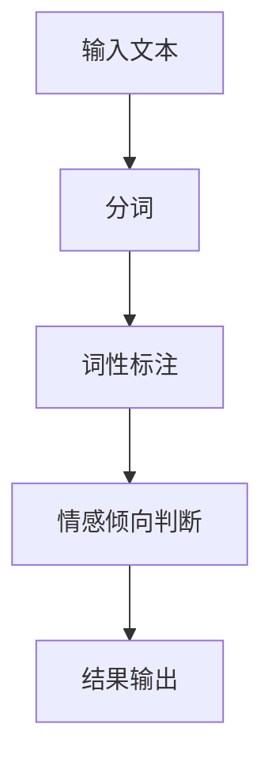
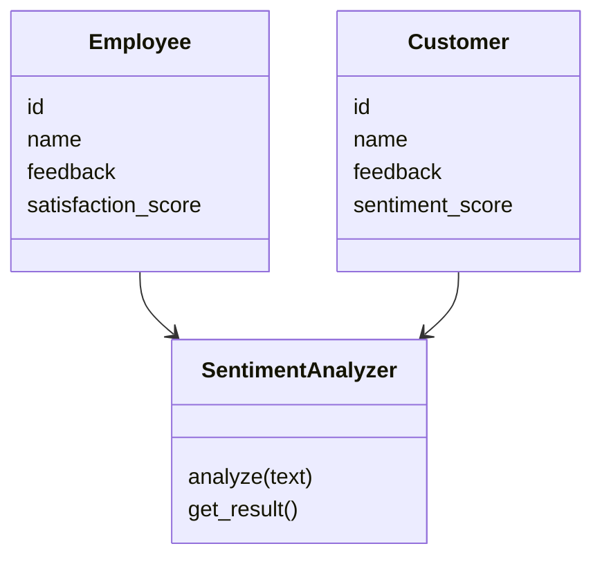
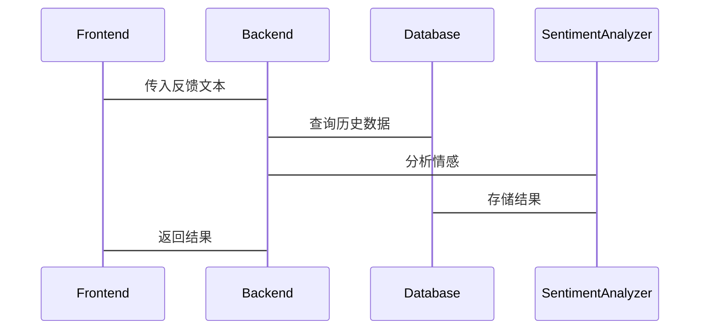

                 


# 构建企业级情感计算平台：员工满意度与客户情绪综合分析

## 关键词：企业级情感计算平台，员工满意度，客户情绪分析，自然语言处理，深度学习，机器学习

## 摘要：本文详细探讨了构建企业级情感计算平台的核心技术与方法，重点分析了如何通过自然语言处理和深度学习技术，实现对员工满意度和客户情绪的综合分析。文章从背景介绍、核心概念、算法原理、系统设计到项目实战，全面解析了情感计算平台的构建过程，并通过实际案例展示了其在企业中的应用价值。

---

# 目录

1. **企业级情感计算平台概述**  
   1.1 情感计算平台的背景与意义  
   1.2 核心概念与联系  

2. **情感计算的核心算法原理**  
   2.1 情感分析算法概述  
   2.2 情感分析流程图  
   2.3 支持向量机（SVM）模型  

3. **情感计算的数学模型与公式**  
   3.1 情感分析的特征提取  
   3.2 情感分析的分类模型  

4. **系统分析与架构设计方案**  
   4.1 问题场景介绍  
   4.2 系统功能设计  
   4.3 系统架构设计  

5. **项目实战：构建企业级情感计算平台**  
   5.1 环境安装与配置  
   5.2 核心功能实现  
   5.3 项目案例分析  

6. **最佳实践与小结**  
   6.1 最佳实践 tips  
   6.2 小结与展望  

---

# 正文

## 第1章: 企业级情感计算平台概述

### 1.1 情感计算平台的背景与意义

#### 1.1.1 问题背景：企业为何需要情感计算
现代企业每天都会面临大量的员工反馈和客户评价，这些反馈和评价中蕴含了大量的情感信息。通过分析这些情感信息，企业可以更好地了解员工的工作满意度和客户的情绪状态，从而优化管理策略。然而，传统的文本分析方法往往依赖于人工阅读和归纳，效率低下且容易遗漏重要信息。情感计算技术的引入，为企业提供了一种高效、自动化的解决方案。

#### 1.1.2 问题描述：员工满意度与客户情绪分析的挑战
- **员工满意度分析**：员工的反馈可能包含主观性较强的情感词汇，如何准确识别并分类这些情感是技术难点。
- **客户情绪分析**：客户评价可能涉及多种情感极性（如正面、负面、中性），且评价内容可能包含歧义或隐含情感，如何准确识别这些情感是另一个挑战。
- **数据多样性**：员工和客户的反馈可能来自不同的渠道（如邮件、问卷、社交媒体等），数据格式和内容差异较大，如何统一处理这些数据是另一个问题。

#### 1.1.3 问题解决：情感计算平台的作用
情感计算平台通过自然语言处理（NLP）和机器学习技术，可以自动提取文本中的情感信息，并生成可量化的指标（如情感得分、情感分类等）。企业可以通过这些指标，快速识别员工和客户的情绪趋势，从而优化管理策略。

#### 1.1.4 边界与外延：情感计算的适用范围与限制
- **适用范围**：情感计算适用于对文本数据进行情感分析的场景，如员工反馈、客户评价、社交媒体评论等。
- **限制**：情感计算目前主要基于文本数据，难以处理图像、视频等其他形式的媒体数据；此外，情感计算的准确性可能受到数据质量和算法复杂度的影响。

### 1.2 核心概念与联系

#### 1.2.1 情感计算的核心概念
- **情感计算**：通过对文本、语音、图像等数据的情感信息进行分析，从而理解人类情感的技术。
- **情感分析**：从文本中提取情感信息的过程，通常包括情感分类（如正面、负面、中性）和情感强度分析。

#### 1.2.2 文本挖掘与自然语言处理的关系
- **文本挖掘**：从非结构化文本数据中提取有用信息的过程，通常包括数据清洗、特征提取、模式识别等步骤。
- **自然语言处理**：研究如何让计算机理解、处理和生成人类语言的技术，是情感计算的重要基础。

#### 1.2.3 ER实体关系图
以下是员工、客户和情感分析实体之间的关系图：

```mermaid
erDiagram
    employee {
        id
        name
        satisfaction_score
        feedback_text
    }
    customer {
        id
        name
       sentiment_score
        feedback_text
    }
    sentiment_analysis {
        text
        sentiment
        confidence
    }
    employee <>-- sentiment_analysis
    customer <>-- sentiment_analysis
```

---

## 第2章: 情感计算的核心算法原理

### 2.1 情感分析算法概述

#### 2.1.1 基于规则的情感分析
- **原理**：通过预定义的情感词汇表（如正面词汇、负面词汇）对文本进行情感分类。
- **优缺点**：简单易实现，但准确率较低，难以处理复杂的情感表达。

#### 2.1.2 基于机器学习的情感分析
- **原理**：利用机器学习算法（如支持向量机、随机森林）对特征向量进行训练，生成情感分类模型。
- **优缺点**：准确率较高，但需要大量标注数据。

#### 2.1.3 基于深度学习的情感分析
- **原理**：利用深度学习模型（如LSTM、Transformer）对文本进行特征提取和情感分类。
- **优缺点**：准确率高，但需要大量计算资源和数据。

### 2.2 情感分析流程图

以下是情感分析的流程图：



### 2.3 支持向量机（SVM）模型

#### 2.3.1 SVM 原理
支持向量机是一种常用的分类算法，其核心思想是通过找到一个超平面，将数据分成不同的类别。

#### 2.3.2 SVM 的数学模型
以下是 SVM 的目标函数：

$$ \text{目标函数：} \quad \max_{\alpha} \left( \sum_{i=1}^{n} y_i \alpha_i - \alpha^T Q \alpha + \rho \right) $$

其中：
- \( y_i \) 是样本的标签（+1 或 -1）。
- \( \alpha_i \) 是拉格朗日乘子。
- \( Q \) 是核矩阵。
- \( \rho \) 是偏置项。

---

## 第3章: 情感计算的数学模型与公式

### 3.1 情感分析的特征提取

#### 3.1.1 TF-IDF 特征提取
TF-IDF 是一种常用的文本特征提取方法，其计算公式如下：

$$ \text{TF-IDF}(i,j) = \text{TF}(i,j) \times \text{IDF}(j) $$

其中：
- \( \text{TF}(i,j) \) 是词 \( j \) 在文本 \( i \) 中的词频。
- \( \text{IDF}(j) \) 是词 \( j \) 的逆文档频率。

#### 3.1.2 词嵌入（Word2Vec、GloVe）
词嵌入是一种将词表示为低维向量的技术，常用的方法包括 Word2Vec 和 GloVe。

---

## 第4章: 系统分析与架构设计方案

### 4.1 问题场景介绍
企业需要一个情感计算平台，用于分析员工和客户的反馈，优化管理策略。

### 4.2 系统功能设计

#### 4.2.1 领域模型类图
以下是系统的领域模型类图：



### 4.3 系统架构设计

#### 4.3.1 系统架构图
以下是系统的架构图：


### 4.4 系统接口设计

#### 4.4.1 API 接口
- **输入接口**：接受员工和客户的反馈文本。
- **输出接口**：返回情感分析结果（如情感得分、情感分类）。

### 4.5 系统交互序列图

以下是系统的交互序列图：



---

## 第5章: 项目实战：构建企业级情感计算平台

### 5.1 环境安装与配置

#### 5.1.1 安装 Python 环境
```bash
pip install python3
pip install numpy
pip install scikit-learn
pip install spacy
```

### 5.2 核心功能实现

#### 5.2.1 数据预处理
```python
import spacy

nlp = spacy.load("en_core_web_sm")

def preprocess(text):
    doc = nlp(text)
    tokens = [token.text for token in doc]
    return tokens
```

#### 5.2.2 情感分析模型训练
```python
from sklearn.feature_extraction.text import TfidfVectorizer
from sklearn.svm import SVC

vectorizer = TfidfVectorizer()
X = vectorizer.fit_transform(X)
model = SVC()
model.fit(X, y)
```

### 5.3 项目案例分析
通过分析客户和员工的反馈文本，生成情感分析报告，帮助企业优化管理策略。

---

## 第6章: 最佳实践与小结

### 6.1 最佳实践 tips
- 数据质量是情感计算的核心，确保数据清洗和预处理。
- 选择合适的算法模型，根据任务需求选择规则、机器学习或深度学习方法。

### 6.2 小结与展望
情感计算平台是企业智能化管理的重要工具，未来可以通过引入更多数据源和优化算法模型，进一步提升分析的准确性和深度。

---

以上是《构建企业级情感计算平台：员工满意度与客户情绪综合分析》的技术博客文章目录大纲和部分内容。如果需要进一步扩展或调整，请随时告知！

