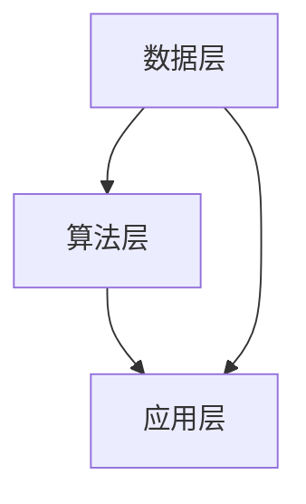
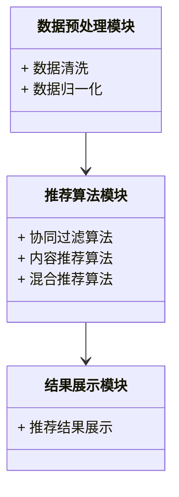
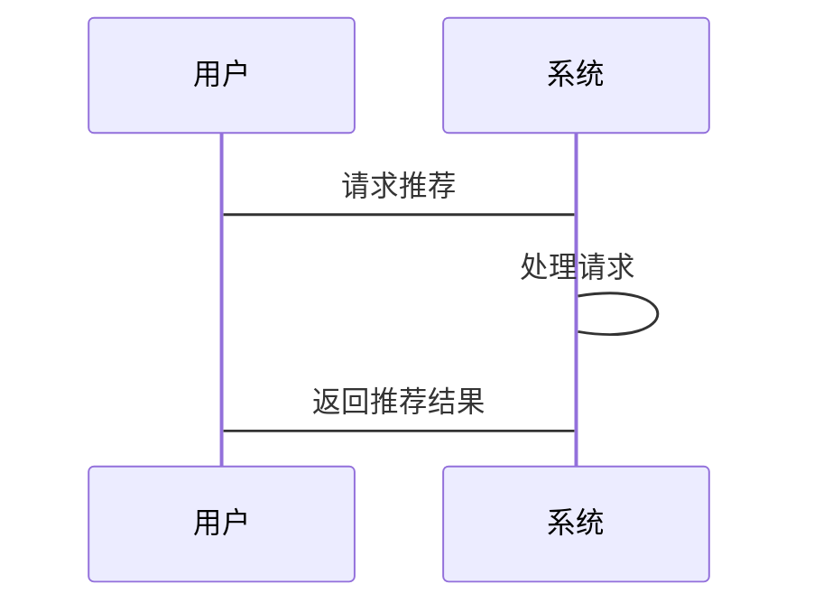

                 


# 构建企业级推荐引擎：跨平台个性化用户体验

## 关键词：推荐引擎、协同过滤、混合推荐模型、系统架构、项目实战

## 摘要

推荐引擎作为现代互联网应用中的核心技术，广泛应用于电商、视频、音乐和新闻等领域。随着技术的进步，推荐引擎从协同过滤和基于内容的推荐发展到混合推荐模型，解决了数据稀疏性和计算复杂度等问题。本文详细探讨推荐引擎的核心概念、算法原理、系统架构设计、项目实战和最佳实践，帮助读者构建高效、稳定的跨平台推荐系统。

---

## 第1章：推荐引擎概述

### 1.1 推荐引擎的定义与类型

推荐引擎是一种通过分析用户行为和数据，预测用户兴趣，从而推荐相关内容或产品的技术。它主要分为以下几种类型：

- **协同过滤推荐**：基于用户行为的相似性，推荐用户可能感兴趣的内容。
- **基于内容的推荐**：通过分析内容本身的特征，推荐与用户兴趣相符的内容。
- **混合推荐模型**：结合协同过滤和基于内容的推荐，利用两者的优点，提升推荐准确性和稳定性。

### 1.2 推荐引擎的技术发展

推荐引擎的发展经历了几个阶段：

1. **协同过滤阶段**：早期的推荐引擎主要基于用户行为数据，通过计算用户相似度进行推荐。
2. **基于内容的推荐阶段**：随着技术进步，推荐引擎开始分析内容特征，如文本、图像等。
3. **混合推荐模型阶段**：结合协同过滤和内容推荐的优点，提升推荐系统的准确性和多样性。

### 1.3 推荐引擎的应用场景

推荐引擎在多个领域有广泛应用：

- **电商推荐**：推荐用户可能购买的商品。
- **视频推荐**：根据用户的观看历史推荐视频。
- **音乐推荐**：基于用户的听歌习惯推荐歌曲。
- **新闻推荐**：根据用户的阅读偏好推荐新闻。

### 1.4 推荐引擎的挑战与边界

推荐引擎面临以下挑战：

- **数据稀疏性问题**：用户行为数据不足可能导致推荐准确性下降。
- **计算复杂度**：大规模数据处理需要高效的算法和优化策略。
- **用户隐私问题**：推荐引擎需要处理大量用户数据，隐私保护至关重要。

## 第2章：推荐引擎的核心概念

### 2.1 协同过滤推荐原理

协同过滤推荐基于用户行为的相似性进行推荐：

- **基于用户的协同过滤**：计算用户之间的相似度，推荐相似用户喜欢的内容。
- **基于物品的协同过滤**：计算物品之间的相似度，推荐用户喜欢的相似物品。
- **混合协同过滤**：结合用户和物品的相似度，进行综合推荐。

### 2.2 基于内容的推荐原理

基于内容的推荐通过分析内容特征进行推荐：

- **文本相似度计算**：使用余弦相似度等方法，计算文本内容的相似度。
- **特征提取与降维**：通过文本挖掘技术提取关键特征，降低维度。
- **内容权重分配**：根据特征的重要性分配权重，提升推荐的准确性。

### 2.3 混合推荐模型的优势

混合推荐模型结合协同过滤和内容推荐的优点：

- **稳定性与准确性**：利用两种推荐方法的优势，提升推荐的准确性和稳定性。
- **可扩展性**：混合推荐模型在大规模数据下表现更好，适应性更强。

### 2.4 推荐模型的优缺点对比

以下是推荐模型的优缺点对比表：

| 模型类型       | 优点                           | 缺点                           |
|----------------|--------------------------------|--------------------------------|
| 协同过滤       | 数据相关性高，推荐准确         | 数据稀疏性问题                 |
| 基于内容的推荐 | 内容丰富性高，推荐多样性       | 计算复杂度高                   |
| 混合推荐模型     | 结合两种方法的优点，准确性和稳定性高 | 实现复杂，计算资源消耗大       |

## 第3章：推荐引擎的算法原理

### 3.1 协同过滤算法原理

协同过滤算法实现步骤：

1. **数据预处理**：清洗和归一化数据。
2. **相似度计算**：使用余弦相似度计算用户或物品的相似度。
3. **推荐生成**：基于相似度计算，生成推荐列表。

#### 协同过滤的数学公式

基于用户的协同过滤公式：

$$ sim_{user}(u,i) = \frac{\sum_{k} (r_{u,k} - \bar{r}_u)(r_{i,k} - \bar{r}_i)}{\sqrt{\sum_{k} (r_{u,k} - \bar{r}_u)^2} \sqrt{\sum_{k} (r_{i,k} - \bar{r}_i)^2}} $$

其中，$r_{u,k}$ 表示用户 u 对物品 k 的评分，$\bar{r}_u$ 是用户 u 的平均评分。

### 3.2 基于内容的推荐算法

基于内容的推荐实现步骤：

1. **特征提取**：提取内容的关键特征。
2. **相似度计算**：计算内容之间的相似度。
3. **推荐生成**：基于相似度生成推荐列表。

#### 文本相似度计算

使用余弦相似度计算文本相似度：

$$ sim_{text}(text1, text2) = \frac{\sum_{i=1}^{n} (w1_i \times w2_i)}{\sqrt{\sum_{i=1}^{n} w1_i^2} \sqrt{\sum_{i=1}^{n} w2_i^2}} $$

其中，$w1_i$ 和 $w2_i$ 分别是文本1和文本2在第i个特征上的权重。

### 3.3 混合推荐算法的实现

混合推荐算法实现步骤：

1. **协同过滤推荐**：生成基于用户的推荐列表。
2. **内容推荐**：生成基于内容的推荐列表。
3. **混合策略**：结合两种推荐结果，生成最终推荐列表。

### 3.4 推荐算法的数学模型

混合推荐模型的数学表达式：

$$ final\_score = \alpha \times score_{cf} + \beta \times score_{content} $$

其中，$\alpha$ 和 $\beta$ 是权重系数，满足 $\alpha + \beta = 1$。

## 第4章：推荐引擎的系统架构设计

### 4.1 系统架构整体设计

推荐引擎的分层架构：

1. **数据层**：存储用户行为数据、内容数据和推荐结果。
2. **算法层**：实现协同过滤、内容推荐和混合推荐算法。
3. **应用层**：提供推荐结果展示和接口调用。

#### 系统架构图



### 4.2 系统功能设计

系统功能模块：

1. **数据预处理模块**：清洗和转换数据。
2. **推荐算法模块**：实现协同过滤、内容推荐和混合推荐。
3. **结果展示模块**：展示推荐结果。

#### 系统功能类图



### 4.3 系统交互图

用户与系统交互流程：

1. 用户请求推荐。
2. 系统处理请求，调用推荐算法。
3. 返回推荐结果。

#### 系统交互图



## 第5章：推荐引擎的项目实战

### 5.1 项目环境搭建

安装必要的工具和库：

1. **Python**：编程语言。
2. **Pandas**：数据处理库。
3. **Scikit-learn**：机器学习库。

### 5.2 推荐系统核心实现

基于协同过滤和混合推荐的Python代码示例：

```python
from sklearn.metrics.pairwise import cosine_similarity

# 协同过滤实现
def collaborative_filtering(X):
    X = normalize(X)
    similarities = cosine_similarity(X)
    return similarities

# 混合推荐实现
def hybrid_recommendation(X, content_features):
    cf_scores = collaborative_filtering(X)
    content_scores = cosine_similarity(content_features)
    alpha = 0.5
    hybrid_scores = alpha * cf_scores + (1 - alpha) * content_scores
    return hybrid_scores

# 数据预处理
def preprocess_data(data):
    data = data.dropna()
    data = data[['user_id', 'item_id', 'rating']]
    return data

# 测试代码
data = preprocess_data(your_data)
content_features = get_content_features(data)
recommendations = hybrid_recommendation(data, content_features)
```

### 5.3 项目功能实现

1. **数据加载**：读取数据并进行预处理。
2. **特征提取**：提取内容特征。
3. **模型训练**：训练协同过滤和混合推荐模型。
4. **结果展示**：展示推荐结果。

### 5.4 项目小结

通过项目实战，我们掌握了推荐系统的实现步骤，从数据预处理到模型训练，再到结果展示，为后续的实际应用打下坚实基础。

## 第6章：推荐引擎的最佳实践

### 6.1 推荐引擎的设计原则

1. **数据质量**：确保数据的完整性和准确性。
2. **模型可解释性**：推荐结果应易于理解和解释。
3. **系统可扩展性**：设计灵活的架构，适应业务扩展。

### 6.2 推荐引擎的性能优化

1. **算法优化**：采用分布式计算和优化算法。
2. **内存优化**：合理分配内存资源，减少数据冗余。

### 6.3 推荐引擎的系统安全

1. **数据隐私保护**：确保用户数据的安全和隐私。
2. **防止数据泄露**：采用数据脱敏技术，保护敏感信息。

### 6.4 推荐引擎的扩展阅读

1. **《推荐系统实战》**：深入讲解推荐系统的实现。
2. **《机器学习实战》**：提供机器学习相关知识。
3. **《分布式系统设计》**：帮助设计高效的分布式推荐系统。

## 结语

构建企业级推荐引擎是一项复杂但 rewarding 的任务。通过本文的学习，读者可以掌握推荐引擎的核心概念、算法原理、系统架构设计和项目实战技巧，为实际应用打下坚实基础。未来，随着技术的进步，推荐引擎将在更多领域发挥重要作用，值得我们持续关注和研究。

---

**感谢您的耐心阅读，希望本文对您有所帮助！**

