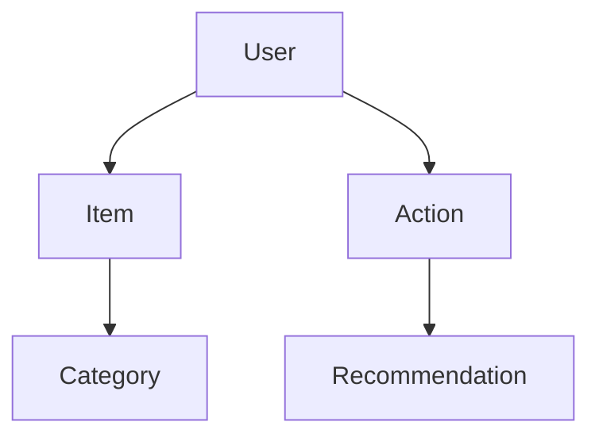
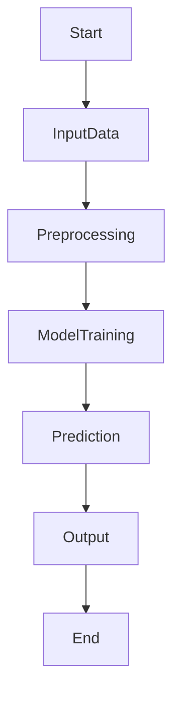

                 


# 构建企业级推荐引擎：跨平台个性化用户体验的智能化实现

## 关键词：推荐引擎，个性化推荐，深度学习，协同过滤，系统架构

## 摘要：  
推荐引擎是现代企业实现个性化用户体验的核心技术之一。随着人工智能和大数据技术的快速发展，企业级推荐引擎的构建变得越来越重要。本文将从推荐引擎的基本概念出发，深入探讨其算法原理、系统架构设计以及实际项目中的应用。通过详细分析协同过滤、基于内容的推荐和深度学习模型，结合实际案例，为读者提供构建高效、智能化推荐引擎的完整指南。

---

# 第一部分: 背景介绍与核心概念

---

## 第1章: 推荐引擎概述

### 1.1 推荐引擎的定义与背景  
推荐引擎是一种基于用户行为、偏好和数据的智能系统，旨在为用户提供个性化的内容或产品推荐。它是大数据和人工智能技术的典型应用之一。  
- **定义**：推荐引擎通过分析用户行为、物品属性和交互数据，生成个性化推荐列表。  
- **背景**：随着互联网的快速发展，企业需要通过个性化推荐来提高用户粘性和转化率。  

### 1.2 企业级推荐引擎的特点  
- **高可用性**：支持大规模并发请求，确保系统的稳定性和可靠性。  
- **跨平台支持**：适应PC、移动端、Web等多种平台。  
- **个性化与实时性**：基于实时数据快速生成推荐结果。  

### 1.3 本章小结  
本章介绍了推荐引擎的基本概念和其在企业中的重要性，为后续内容打下基础。

---

## 第2章: 推荐引擎的核心概念与联系

### 2.1 推荐系统的原理  
推荐系统的核心在于分析用户行为和物品特征，生成个性化推荐。  
- **协同过滤**：基于用户相似性或物品相似性进行推荐。  
- **基于内容的推荐**：通过分析物品的属性或内容特征进行推荐。  
- **混合推荐模型**：结合多种推荐方法，提升推荐效果。  

### 2.2 核心概念与联系  
推荐系统的实体关系图如下：  


### 2.3 推荐系统的数学模型  
- **矩阵分解模型**：将用户-物品交互数据表示为矩阵，通过分解矩阵得到用户和物品的潜在特征。  
  $$X = U \times V^T$$  
  其中，$X$是用户-物品交互矩阵，$U$是用户潜在特征矩阵，$V$是物品潜在特征矩阵。  
- **基于深度学习的推荐模型**：利用神经网络提取高维特征，例如：  
  $$f(x) = \text{softmax}(Wx + b)$$  

### 2.4 本章小结  
本章详细介绍了推荐系统的原理和核心概念，为后续算法实现奠定了基础。

---

## 第3章: 推荐引擎的算法原理

### 3.1 协同过滤算法  
- **基于用户的协同过滤**：通过寻找相似用户的推荐。  
- **基于物品的协同过滤**：通过寻找相似物品的推荐。  
- **深度协同过滤**：结合深度学习模型，提升推荐效果。  

### 3.2 基于内容的推荐算法  
- **文本挖掘**：通过分析物品的文本描述生成推荐。  
- **向量空间模型**：将物品表示为向量，计算相似性。  
- **知识图谱**：利用知识图谱中的语义信息进行推荐。  

### 3.3 深度学习推荐算法  
- **神经网络推荐模型**：通过神经网络提取用户和物品的特征。  
- **注意力机制**：在推荐中引入注意力机制，提升模型的表达能力。  
- **强化学习推荐**：通过强化学习优化推荐策略。  

### 3.4 算法流程图  


### 3.5 本章小结  
本章详细讲解了推荐引擎的核心算法，包括协同过滤、基于内容的推荐和深度学习模型，并通过流程图展示了推荐系统的整体流程。

---

## 第4章: 推荐引擎的系统分析与架构设计

### 4.1 系统分析  
- **问题场景**：用户行为数据的采集、处理和分析。  
- **项目目标**：构建一个高效、智能化的推荐系统。  
- **系统功能需求**：支持实时推荐、多平台部署、个性化推荐等。  

### 4.2 系统架构设计  
推荐系统的分层架构如下：  
```mermaid
graph TD
    Client --> API Gateway
    API Gateway --> Service Layer
    Service Layer --> Database
    Database --> Model
```

### 4.3 系统接口设计  
- **输入接口**：用户行为数据接口。  
- **输出接口**：推荐结果输出接口。  

### 4.4 本章小结  
本章从系统架构的角度，详细介绍了推荐引擎的设计与实现。

---

## 第5章: 推荐引擎的项目实战

### 5.1 环境搭建  
- **开发环境**：Python、Jupyter Notebook、TensorFlow。  
- **数据集**：使用公开数据集（如MovieLens）进行实验。  

### 5.2 系统核心实现  
#### 5.2.1 数据预处理  
```python
import pandas as pd
data = pd.read_csv('movielens.csv')
```

#### 5.2.2 模型训练  
```python
from sklearn.metrics.pairwise import cosine_similarity
similarity = cosine_similarity(data)
```

#### 5.2.3 推荐结果输出  
```python
def recommend(user_id, similarity, data):
    # 获取用户相似性排名
    similar_users = similarity[user_id].argsort()[::-1]
    # 剩余用户未评分的物品
    recommendations = []
    for user in similar_users:
        if user == user_id:
            continue
        for item in data.columns:
            if pd.isna(data.loc[user, item]):
                recommendations.append(item)
                break
    return recommendations[:10]
```

### 5.3 项目小结  
本章通过一个实际案例，详细讲解了推荐引擎的环境搭建和核心实现。

---

## 第6章: 推荐引擎的最佳实践

### 6.1 性能优化  
- **数据压缩**：减少数据存储空间。  
- **分布式计算**：利用分布式技术提升计算效率。  

### 6.2 模型调优  
- **超参数优化**：通过网格搜索或随机搜索优化模型参数。  
- **模型融合**：结合多种推荐算法提升推荐效果。  

### 6.3 线上监控  
- **实时监控**：监控推荐系统的运行状态。  
- **日志分析**：分析用户行为日志，优化推荐策略。  

### 6.4 本章小结  
本章总结了推荐引擎在实际应用中的最佳实践，包括性能优化、模型调优和线上监控等。

---

## 第7章: 总结与展望

### 7.1 总结  
推荐引擎是企业级个性化推荐的核心技术，本文从算法原理到系统架构，再到项目实战，全面介绍了推荐引擎的构建过程。  

### 7.2 展望  
随着人工智能技术的不断发展，推荐引擎将更加智能化和个性化。未来的研究方向包括：  
- 更高效的推荐算法。  
- 更智能的推荐系统架构。  

### 7.3 本章小结  
本章总结了全文内容，并展望了推荐引擎的未来发展方向。

---

## 参考文献  
1. 《推荐系统导论》  
2. 《深度学习推荐系统》  
3. 《系统架构设计实战》  

---

## 致谢  
感谢读者的耐心阅读，希望本文能为构建企业级推荐引擎提供有价值的参考。

