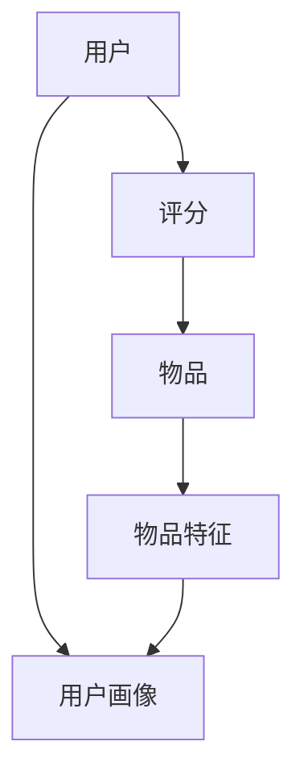

                 


# 构建企业级推荐系统：个性化产品与服务推荐

## 关键词：企业级推荐系统、个性化推荐、协同过滤、深度学习、系统架构设计、推荐算法

## 摘要：本文详细探讨了构建企业级推荐系统的各个方面，从背景介绍到核心概念、算法原理、系统架构设计，再到项目实战和优化扩展。通过逐步分析，帮助读者掌握构建高效推荐系统所需的知识和技能。

---

## 第1章: 推荐系统的背景与概述

### 1.1 推荐系统的概念与类型

#### 1.1.1 什么是推荐系统
推荐系统是一种利用用户行为数据、物品特征和用户画像，通过算法预测用户可能感兴趣的产品或服务的系统。它广泛应用于电商、电影、音乐、新闻等领域，帮助用户发现感兴趣的内容。

#### 1.1.2 推荐系统的类型
推荐系统主要分为以下几种类型：
1. **协同过滤推荐**：基于用户相似性或物品相似性进行推荐。
2. **基于内容的推荐**：利用物品本身的特征（如文本、标签）进行推荐。
3. **基于知识图谱的推荐**：结合知识图谱中的实体关系进行推荐。
4. **混合推荐**：结合多种推荐方法，提升推荐的准确性和多样性。

#### 1.1.3 推荐系统的应用场景
推荐系统在企业中的应用场景非常广泛，例如：
- **电商推荐**：推荐用户可能购买的商品。
- **视频推荐**：推荐用户可能喜欢的视频内容。
- **新闻推荐**：推荐用户可能感兴趣的新闻文章。
- **社交推荐**：推荐用户可能关注的社交账号或内容。

---

### 1.2 个性化推荐的重要性

#### 1.2.1 个性化推荐的核心价值
个性化推荐能够显著提升用户体验，增加用户粘性和购买转化率。通过分析用户的偏好和行为，推荐系统能够提供高度个性化的服务，满足用户的多样化需求。

#### 1.2.2 个性化推荐对企业的意义
- **提升用户满意度**：通过个性化推荐，用户能够更快地找到感兴趣的内容或产品。
- **增加收入**：个性化推荐能够提高用户购买的可能性，从而增加企业的收入。
- **降低营销成本**：通过精准推荐，企业可以更有效地进行营销，降低无效广告支出。

#### 1.2.3 个性化推荐的挑战
- **数据稀疏性**：当用户行为数据较少时，推荐系统的准确性会下降。
- **实时性要求**：企业级推荐系统需要实时处理大量的数据，这对系统的性能提出了很高的要求。
- **模型复杂性**：复杂的推荐算法可能导致系统难以部署和维护。

---

### 1.3 企业级推荐系统的特征

#### 1.3.1 高可用性
企业级推荐系统需要保证7×24小时的高可用性，确保在高并发情况下依然能够正常运行。

#### 1.3.2 高扩展性
随着用户数量和数据量的增长，推荐系统需要能够快速扩展，以应对不断增长的请求量。

#### 1.3.3 高实时性
企业级推荐系统需要实时处理用户行为数据，并快速生成推荐结果，以满足用户的实时需求。

---

## 第2章: 推荐系统的核心概念与联系

### 2.1 推荐系统的核心概念

#### 2.1.1 用户画像
用户画像是通过收集和分析用户的行为数据，构建出的用户信息模型。用户画像是推荐系统的核心输入之一，通常包括用户的年龄、性别、兴趣爱好、购买历史等信息。

#### 2.1.2 物品特征
物品特征是指物品本身的属性信息，例如商品的价格、类别、品牌、评分等。物品特征是基于内容推荐的基础。

#### 2.1.3 用户-物品交互数据
用户-物品交互数据是用户与物品之间的行为记录，例如用户的点击、收藏、购买、评分等行为。这些数据是协同过滤推荐的核心输入。

---

### 2.2 推荐系统的核心原理

#### 2.2.1 协同过滤
协同过滤是一种基于用户相似性或物品相似性的推荐方法。具体来说，协同过滤通过分析用户的行为数据，找到与目标用户相似的其他用户，然后基于这些相似用户的偏好进行推荐。

#### 2.2.2 基于内容的推荐
基于内容的推荐是通过分析物品本身的特征，找到与目标用户兴趣相似的物品进行推荐。这种方法通常用于推荐书籍、音乐等具有明确特征的物品。

#### 2.2.3 基于知识图谱的推荐
基于知识图谱的推荐是通过构建知识图谱，分析物品之间的语义关系，找到与目标用户相关的物品进行推荐。这种方法能够处理复杂的语义信息，提升推荐的准确性。

---

### 2.3 推荐系统的实体关系图



---

### 2.4 推荐算法的对比分析

| 算法类型       | 协同过滤 | 基于内容的推荐 | 混合推荐 |
|----------------|----------|----------------|----------|
| 优点           | 高准确性  | 高可解释性      | 综合性好  |
| 缺点           | 对稀疏数据敏感 | 需要大量特征    | 复杂性高  |

---

## 第3章: 推荐算法的原理与实现

### 3.1 协同过滤算法

#### 3.1.1 基于用户的协同过滤
基于用户的协同过滤通过计算用户之间的相似性，找到与目标用户相似的其他用户，然后基于这些用户的偏好进行推荐。

#### 3.1.2 基于物品的协同过滤
基于物品的协同过滤通过计算物品之间的相似性，找到与目标用户已购买物品相似的其他物品进行推荐。

#### 3.1.3 混合协同过滤
混合协同过滤结合了基于用户和基于物品的协同过滤方法，通过集成两种方法的优势，提升推荐的准确性和多样性。

---

### 3.2 深度学习模型

#### 3.2.1 矩阵分解
矩阵分解是一种常用的方法，通过对用户-物品评分矩阵进行分解，找到隐含的用户和物品特征，用于推荐。

#### 3.2.2 神经网络协同过滤
神经网络协同过滤通过构建神经网络模型，利用非线性特征进行推荐。

#### 3.2.3 图神经网络
图神经网络通过构建图结构，分析用户和物品之间的复杂关系，用于推荐。

---

### 3.3 算法实现

#### 3.3.1 协同过滤算法实现

```python
import numpy as np

# 示例：基于用户的协同过滤
def user_based_collaborative_filtering(user_item_matrix):
    # 计算用户之间的相似性
    user_similarity = np.corrcoef(user_item_matrix.T)
    # 对用户进行推荐
   推荐结果 = user_item_matrix @ user_similarity
    return 推荐结果
```

#### 3.3.2 深度学习模型实现

```python
import tensorflow as tf

# 示例：神经网络协同过滤
class NeuralCF(tf.keras.Model):
    def __init__(self, user_dim, item_dim):
        super(NeuralCF, self).__init__()
        self.user_embedding = tf.keras.layers.Embedding(user_dim, 64)
        self.item_embedding = tf.keras.layers.Embedding(item_dim, 64)
        self.dnn = tf.keras.layers.Dense(64, activation='relu')
        self.predict = tf.keras.layers.Dense(1, activation='sigmoid')

    def call(self, inputs):
        user_id, item_id = inputs
        user_emb = self.user_embedding(user_id)
        item_emb = self.item_embedding(item_id)
        merged = tf.concat([user_emb, item_emb], axis=-1)
        hidden = self.dnn(merged)
        output = self.predict(hidden)
        return output
```

---

### 3.4 算法对比与选择

在选择推荐算法时，需要综合考虑数据量、计算复杂度和推荐效果。对于小数据集，协同过滤方法可能更合适；而对于大数据集，深度学习模型可能表现更好。

---

## 总结

构建企业级推荐系统需要从背景知识、核心概念、算法原理、系统架构设计、项目实战和优化扩展等多个方面进行全面考虑。通过理解推荐系统的原理和实现，结合实际应用场景，可以构建出高效、可靠的个性化推荐系统，为企业创造更大的价值。

