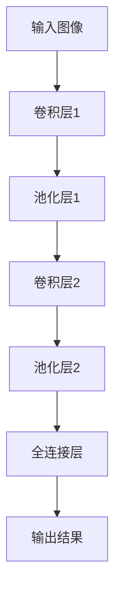
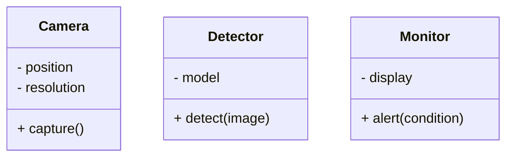
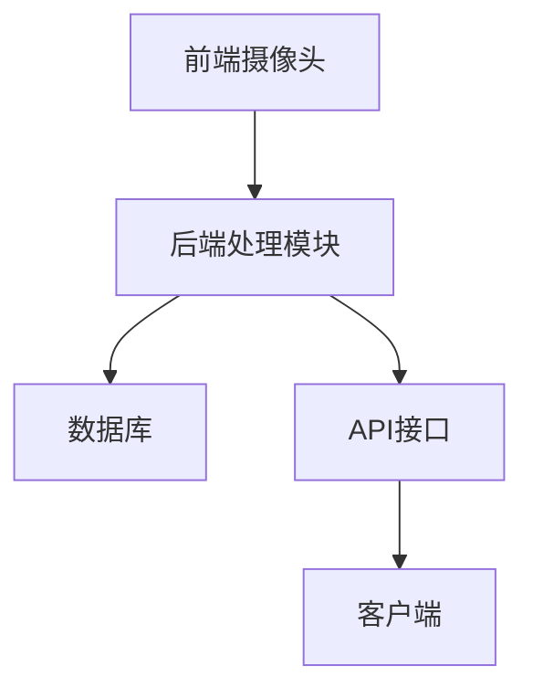

                 


# 构建企业级机器视觉平台：质量控制与安全监测

---

## 关键词
- 机器视觉
- 质量控制
- 安全监测
- 深度学习
- 目标检测
- 图像处理

---

## 摘要
企业级机器视觉平台在现代工业中的应用日益广泛，特别是在质量控制和安全监测领域。通过结合先进的图像处理技术、深度学习算法和实时监测系统，企业能够显著提高生产效率、降低缺陷率并确保工作环境的安全性。本文将详细探讨机器视觉的核心原理、系统架构、算法实现以及实际应用案例，帮助读者深入了解如何构建高效可靠的机器视觉平台。

---

## 第一章: 机器视觉与企业级应用概述

### 1.1 机器视觉的定义与核心概念
#### 1.1.1 机器视觉的定义
机器视觉是利用计算机模拟人类视觉系统的技术，通过摄像头和传感器捕获图像，利用算法进行分析和处理，实现对物体的识别、检测和测量。

#### 1.1.2 机器视觉的核心概念与技术
- **图像处理**：对图像进行增强、滤波、边缘检测等预处理操作。
- **特征提取**：从图像中提取关键特征，用于后续的识别和分类。
- **目标检测**：通过算法定位和识别图像中的特定目标。
- **深度学习**：利用神经网络模型（如CNN、R-CNN）进行图像分析。

#### 1.1.3 企业级机器视觉平台的背景与意义
随着工业自动化和智能化的推进，企业级机器视觉平台在制造业、物流、医疗等领域的应用需求日益增长。通过机器视觉技术，企业可以实现高效的自动化检测和实时监控，显著提升生产效率和产品质量。

---

### 1.2 机器视觉在质量控制与安全监测中的应用
#### 1.2.1 质量控制中的机器视觉应用
- **缺陷检测**：在制造过程中，通过视觉系统检测产品的外观缺陷。
- **尺寸测量**：利用视觉系统精确测量产品的尺寸参数。
- **分类与分拣**：根据产品的特征进行分类和自动分拣。

#### 1.2.2 安全监测中的机器视觉应用
- **人员识别**：在安全监控中，通过人脸识别技术进行身份验证。
- **行为分析**：实时监测人员的行为，识别异常动作。
- **环境监测**：检测工作环境中的潜在危险，如烟雾、气体泄漏等。

#### 1.2.3 机器视觉在企业中的潜在价值
- 提高生产效率
- 降低人工成本
- 提升产品质量
- 增强安全性

---

## 第二章: 机器视觉的核心技术原理

### 2.1 图像处理与特征提取
#### 2.1.1 图像处理基础
图像处理是机器视觉的基础，主要包括：
- **图像增强**：通过调整亮度、对比度等改善图像质量。
- **边缘检测**：提取图像的边缘信息，用于后续分析。
- **噪声去除**：通过滤波等技术消除图像中的噪声。

#### 2.1.2 特征提取方法
特征提取是图像识别的关键步骤，常用方法包括：
- **Harris角点检测**：用于检测图像中的兴趣点。
- **SIFT（尺度不变特征变换）**：提取具有尺度不变性的特征点。
- **HOG（方向梯度直方图）**：用于目标检测中的特征描述。

#### 2.1.3 常用图像处理算法对比
| 算法名称 | 特点 | 优缺点 |
|----------|------|--------|
| SIFT     | 尺度不变，鲁棒性强 | 计算复杂度高 |
| HOG      | 方向特征显著 | 对光照变化敏感 |
| HAAR     | 训练速度快 | 特征表达能力有限 |

### 2.2 目标检测与识别
#### 2.2.1 目标检测算法原理
目标检测是机器视觉的重要任务，常用算法包括：
- **滑动窗口检测**：通过滑动窗口遍历图像，检测目标。
- **基于区域的检测（如Selective Search）**：通过区域建议生成候选区域，进行目标检测。

#### 2.2.2 识别算法的优缺点对比
| 算法名称 | 优缺点 | 适用场景 |
|----------|---------|----------|
| HAAR     | 计算速度快 | 适合简单目标检测 |
| DNN      | 准确率高 | 适合复杂目标检测 |

#### 2.2.3 实际应用中的特征提取与分类
在实际应用中，特征提取与分类是关键步骤。例如，在工业质量检测中，可以通过SIFT提取缺陷特征，利用支持向量机（SVM）进行分类。

---

### 2.3 机器学习与深度学习在视觉中的应用
#### 2.3.1 机器学习在视觉中的作用
机器学习用于图像分类、目标检测等任务，通过训练模型实现对图像的理解。

#### 2.3.2 深度学习的核心原理
深度学习通过多层神经网络提取图像的高层次特征，如卷积神经网络（CNN）。

#### 2.3.3 CNN网络在视觉任务中的应用
CNN通过卷积层提取空间特征，池化层降低计算复杂度，全连接层进行分类。

---

### 2.4 机器视觉系统的整体架构
#### 2.4.1 系统组成模块
- **输入模块**：摄像头或传感器捕获图像。
- **处理模块**：对图像进行预处理和特征提取。
- **算法模块**：利用目标检测、分类算法进行分析。
- **输出模块**：生成结果并输出。

#### 2.4.2 各模块之间的关系
Mermaid图：


---

## 第三章: 机器视觉算法原理与实现

### 3.1 基于CNN的目标检测算法
#### 3.1.1 算法原理
目标检测算法如YOLO、Faster R-CNN通过CNN提取特征，进行边界框回归和分类。

#### 3.1.2 算法实现步骤
Mermaid流程图：


#### 3.1.3 核心代码实现
```python
import torch
import torch.nn as nn

class SimpleCNN(nn.Module):
    def __init__(self):
        super(SimpleCNN, self).__init__()
        self.conv1 = nn.Conv2d(3, 6, 5)
        self.pool = nn.MaxPool2d(2, 2)
        self.conv2 = nn.Conv2d(6, 16, 5)
        self.fc1 = nn.Linear(16 * 5 * 5, 120)
        self.fc2 = nn.Linear(120, 10)

    def forward(self, x):
        x = self.pool(F.relu(self.conv1(x)))
        x = self.pool(F.relu(self.conv2(x)))
        x = x.view(-1, 16 * 5 * 5)
        x = F.relu(self.fc1(x))
        x = self.fc2(x)
        return x
```

#### 3.1.4 数学模型与公式
- 卷积操作：$$ (input\_channel \times kernel\_size \times kernel\_size) \rightarrow output\_channel $$
- 池化操作：$$ \max pooling \text{ 或 } average pooling $$

---

## 第四章: 系统分析与架构设计

### 4.1 问题场景介绍
质量控制与安全监测的典型场景包括：
- 工厂生产线上的缺陷检测
- 工作环境中的危险行为监测

### 4.2 系统功能设计
#### 4.2.1 领域模型类图
Mermaid图：


#### 4.2.2 系统架构设计
Mermaid图：


---

## 第五章: 项目实战

### 5.1 环境搭建与安装
安装必要的库：
```bash
pip install numpy
pip install opencv-python
pip install torch torchvision
```

### 5.2 系统核心实现
实现目标检测功能：
```python
import cv2
import numpy as np

def detect_objects(image):
    # 简单的目标检测算法实现
    gray = cv2.cvtColor(image, cv2.COLOR_BGR2GRAY)
    edges = cv2.Canny(gray, 50, 150)
    return edges

# 测试代码
image = cv2.imread("test.jpg")
result = detect_objects(image)
cv2.imwrite("result.jpg", result)
```

### 5.3 代码解读与分析
- **图像读取**：使用OpenCV读取图像。
- **目标检测**：通过Canny边缘检测算法提取目标边界。
- **结果保存**：将检测结果保存为新的图像文件。

### 5.4 实际案例分析
案例：汽车零件缺陷检测
- 输入：汽车零件图像
- 输出：检测出的缺陷位置

---

## 第六章: 总结与建议

### 6.1 最佳实践 tips
- 数据预处理：确保数据质量，进行归一化等处理。
- 模型优化：通过数据增强、超参数调整提升模型性能。
- 系统集成：将视觉系统与企业现有系统无缝对接。

### 6.2 小结
构建企业级机器视觉平台需要综合运用图像处理、深度学习和系统架构设计等技术。通过实际项目实战，可以深入理解平台的构建过程和应用价值。

### 6.3 注意事项
- 确保系统的实时性和稳定性。
- 注意数据隐私和安全问题。
- 定期更新模型，适应新场景和数据变化。

### 6.4 拓展阅读
- 《Deep Learning for Image Processing》
- 《Computer Vision: Algorithms and Applications》

---

通过本文的详细讲解，读者可以系统地了解企业级机器视觉平台的构建过程，掌握相关的核心技术，并能够在实际应用中灵活运用这些知识。

