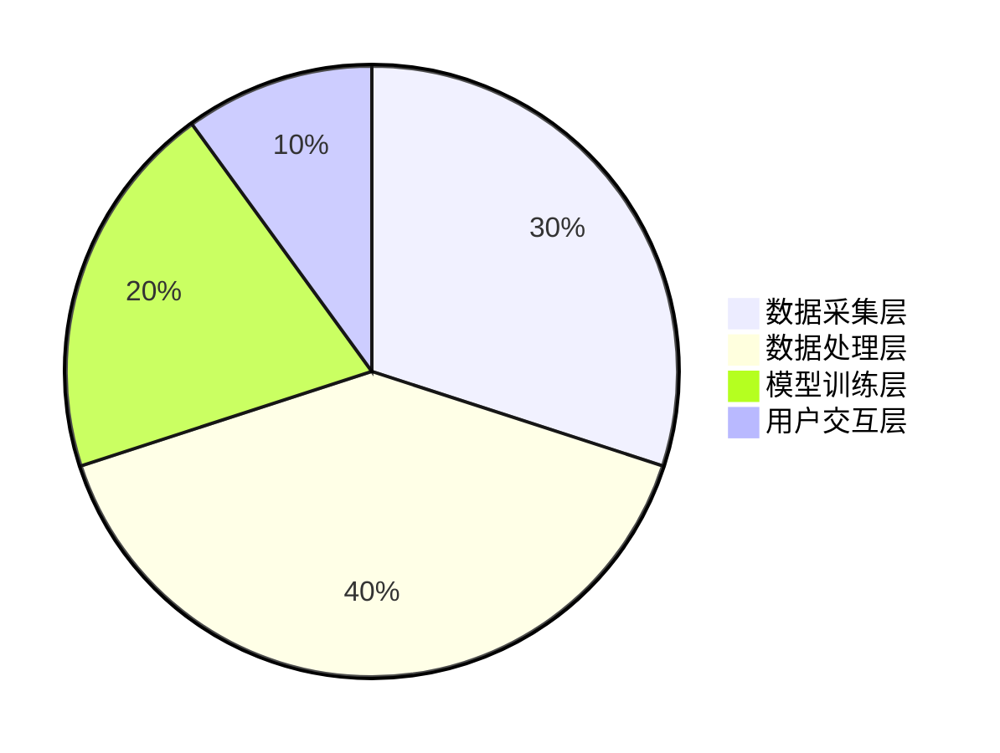
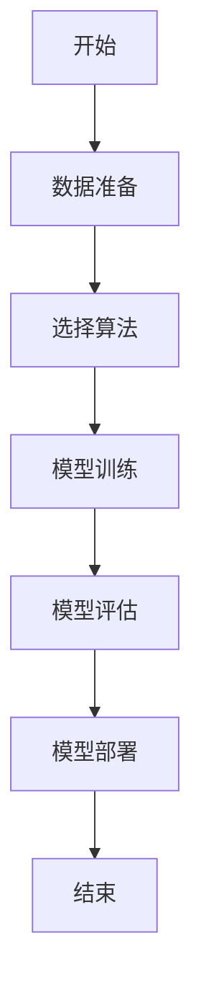
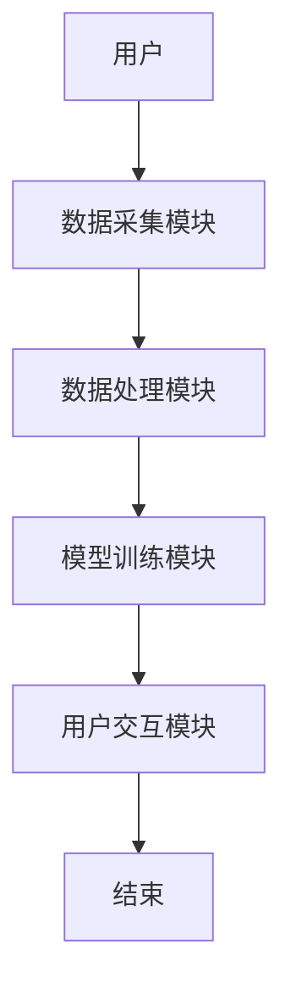

                 


# 《构建企业级环境监测AI：助力合规与可持续发展》

> 关键词：环境监测、AI、企业合规、可持续发展、数据采集、模型训练、系统架构

> 摘要：随着全球对可持续发展的关注日益增加，企业级环境监测AI系统的构建变得至关重要。本文详细探讨了如何利用人工智能技术构建企业级环境监测系统，从数据采集、模型训练到系统架构设计，再到实际项目实施，全面解析其技术实现与应用价值。通过本篇文章，读者将深入了解如何利用AI技术助力企业实现环境监测的合规与可持续发展目标。

---

# 第一部分: 企业级环境监测AI的背景与核心概念

# 第1章: 企业级环境监测AI的背景与问题背景

## 1.1 环境监测与可持续发展的重要性

### 1.1.1 环境监测的定义与目标

环境监测是指通过技术手段对企业运营过程中产生的环境数据（如空气质量、水质、噪音、能源消耗等）进行实时采集、分析和评估的过程。其目标是帮助企业识别环境风险，优化资源配置，减少对环境的负面影响，同时确保符合相关环保法规与行业标准。

### 1.1.2 可持续发展的核心理念

可持续发展强调在满足当代人需求的同时，不损害后代人满足其需求的能力。企业作为社会的重要组成部分，承担着保护环境、减少资源浪费的责任。通过环境监测AI系统，企业可以实现对环境数据的智能化管理，从而推动可持续发展目标的实现。

### 1.1.3 企业环境责任与合规要求

企业在全球化背景下，不仅要遵守当地的环保法规，还要满足行业标准和客户对绿色产品的需求。环境监测AI系统能够帮助企业实时监控环境数据，确保其生产过程符合环保要求，避免因环境违规导致的罚款或声誉损失。

## 1.2 企业级环境监测的现状与挑战

### 1.2.1 环境监测的传统方法与局限性

传统环境监测方法主要依赖人工采集数据，效率低下且成本高昂。同时，人工分析容易出现误差，难以实时响应环境变化。此外，传统方法难以处理海量数据，且缺乏智能化的分析能力。

### 1.2.2 企业环境监测的痛点与难点

- 数据采集困难：企业环境数据来源多样，包括传感器、日志文件、外部数据库等，数据格式和接口多样，整合难度大。
- 数据分析复杂：环境数据具有时序性、波动性等特点，传统的统计方法难以捕捉复杂的关联性。
- 系统集成挑战：企业现有的信息化系统可能较为分散，环境监测系统需要与之无缝集成，技术难度较高。

### 1.2.3 AI技术在环境监测中的潜力

AI技术具有强大的数据处理能力和智能化分析能力，能够帮助企业解决传统环境监测方法的痛点。通过机器学习算法，AI可以实时分析环境数据，预测潜在的环境风险，并提出优化建议，从而实现环境监测的智能化和高效化。

## 1.3 企业级环境监测AI的定义与目标

### 1.3.1 企业级环境监测AI的定义

企业级环境监测AI系统是指利用人工智能技术，对企业运营过程中产生的环境数据进行实时采集、分析和评估，并提供智能化决策支持的系统。它通过整合多种数据源，结合机器学习算法，实现对环境状况的精准监测和预测。

### 1.3.2 企业级环境监测AI的核心目标

- 实现环境数据的实时采集与分析，确保企业生产过程的环境合规性。
- 提供智能化的环境风险预警，帮助企业提前应对潜在的环境问题。
- 优化资源利用，降低企业运营对环境的负担，推动可持续发展。

### 1.3.3 企业级环境监测AI的边界与外延

企业级环境监测AI系统的边界包括数据采集、模型训练、系统架构设计和用户界面等模块。其外延则涵盖与企业信息化系统（如ERP、MES）的集成，以及与其他第三方环境监测平台的数据共享。

## 1.4 本章小结

本章从环境监测的定义、可持续发展的核心理念出发，分析了企业级环境监测的现状与挑战，重点探讨了AI技术在环境监测中的潜力与应用价值。通过对企业级环境监测AI系统的定义与目标的阐述，为后续的技术实现奠定了理论基础。

---

# 第2章: 企业级环境监测AI的核心概念与联系

## 2.1 核心概念原理

### 2.1.1 数据采集与处理

环境数据采集是环境监测AI系统的第一步，主要包括传感器数据采集、日志文件解析和外部数据库接口调用。数据采集后需要进行预处理，包括数据清洗、归一化和特征提取等步骤，以确保数据质量。

### 2.1.2 AI模型训练与部署

AI模型训练是环境监测AI系统的核心环节，主要包括特征工程、模型选择、训练与调优。训练好的模型需要部署到生产环境，通过API接口提供实时预测服务。

### 2.1.3 系统架构与交互

企业级环境监测AI系统的架构设计需要考虑可扩展性、可维护性和可靠性。系统架构通常包括数据采集层、数据处理层、模型训练层和用户交互层。

## 2.2 核心概念属性特征对比表

| 概念       | 属性1 | 属性2 | 属性3 |
|------------|-------|-------|-------|
| 数据采集   | 实时性 | 准确性 | 可扩展性 |
| AI模型训练 | 数据量 | 计算资源 | 模型复杂度 |
| 系统架构   | 可扩展性 | 可维护性 | 可靠性 |

## 2.3 ER实体关系图（Mermaid）

```mermaid
erDiagram
    actor 用户 {
        string 用户ID
        string 用户名
        string 密码
    }
    actor 系统管理员 {
        string 系统管理员ID
        string 系统管理员名
        string 密码
    }
    entity 环境数据 {
        string 数据ID
        string 数据类型
        string 数据值
        date 数据采集时间
    }
    entity 模型训练数据 {
        string 数据ID
        string 模型ID
        string 训练时间
    }
    entity AI模型 {
        string 模型ID
        string 模型名称
        string 模型版本
        date 创建时间
    }
    用户 --> 环境数据 : 采集
    系统管理员 --> 环境数据 : 管理
    环境数据 --> 模型训练数据 : 提供
    模型训练数据 --> AI模型 : 训练
```

## 2.4 本章小结

本章通过对比分析企业级环境监测AI的核心概念，揭示了数据采集、AI模型训练和系统架构之间的内在联系。通过ER实体关系图，展示了系统中各实体之间的关联关系，为后续的技术实现提供了清晰的概念框架。

---

# 第3章: 企业级环境监测AI的技术基础

## 3.1 数据采集与预处理

### 3.1.1 数据采集方法

环境数据采集可以通过以下几种方式实现：

1. **传感器数据采集**：通过IoT设备（如温湿度传感器、气体传感器）实时采集环境数据。
2. **日志文件解析**：从企业生产系统中提取环境相关的日志数据。
3. **外部数据库接口**：调用第三方环境监测平台的API获取环境数据。

### 3.1.2 数据预处理方法

数据预处理是确保数据质量的关键步骤，主要包括：

- **数据清洗**：去除噪声数据和异常值。
- **数据归一化**：将不同量纲的数据转换为统一尺度。
- **特征提取**：从原始数据中提取有助于模型训练的特征。

## 3.2 AI模型训练与部署

### 3.2.1 特征工程

特征工程是模型训练的关键步骤，需要根据环境监测的业务需求设计特征。例如，可以设计“空气质量指数”、“能源消耗趋势”等特征。

### 3.2.2 模型选择与训练

根据环境监测的业务需求选择合适的模型。例如，可以使用时间序列模型（如LSTM）进行环境趋势预测，或者使用分类模型（如随机森林）进行环境风险分类。

### 3.2.3 模型部署

训练好的模型需要部署到生产环境，可以通过API接口提供实时预测服务。例如，可以使用Flask框架搭建一个RESTful API，接收环境数据并返回预测结果。

## 3.3 系统架构设计

### 3.3.1 系统功能设计

企业级环境监测AI系统的主要功能包括：

- 数据采集与管理
- 模型训练与部署
- 环境风险预警
- 可视化分析

### 3.3.2 系统架构图（Mermaid）



## 3.4 本章小结

本章详细介绍了企业级环境监测AI的技术基础，包括数据采集与预处理、模型训练与部署以及系统架构设计。通过系统架构图，展示了各功能模块之间的关系，为后续的系统实现奠定了技术基础。

---

# 第4章: 企业级环境监测AI的算法原理

## 4.1 算法原理概述

### 4.1.1 机器学习算法选择

根据环境监测的业务需求选择合适的机器学习算法。例如，可以使用线性回归模型进行环境趋势预测，或者使用支持向量机（SVM）进行环境分类。

### 4.1.2 算法实现步骤

以线性回归为例，算法实现步骤如下：

1. **数据准备**：收集环境数据，包括特征变量和目标变量。
2. **模型训练**：使用最小二乘法求解回归系数。
3. **模型评估**：通过均方误差（MSE）或决定系数（R²）评估模型性能。
4. **模型部署**：将训练好的模型部署到生产环境，提供实时预测服务。

### 4.1.3 算法公式

线性回归的数学公式如下：

$$
y = \beta_0 + \beta_1x + \epsilon
$$

其中，$y$ 是目标变量，$x$ 是特征变量，$\beta_0$ 是截距，$\beta_1$ 是回归系数，$\epsilon$ 是误差项。

## 4.2 算法流程图（Mermaid）



## 4.3 本章小结

本章详细讲解了企业级环境监测AI的算法原理，包括机器学习算法的选择、实现步骤和数学公式。通过算法流程图，展示了算法实现的全过程，为后续的系统实现提供了理论支持。

---

# 第5章: 企业级环境监测AI的系统架构设计

## 5.1 系统功能设计

### 5.1.1 数据采集模块

数据采集模块负责从各种数据源（如传感器、日志文件、外部数据库）采集环境数据。

### 5.1.2 数据处理模块

数据处理模块负责对采集到的环境数据进行预处理，包括数据清洗、归一化和特征提取。

### 5.1.3 模型训练模块

模型训练模块负责根据预处理后的环境数据训练机器学习模型，并保存训练好的模型。

### 5.1.4 用户交互模块

用户交互模块提供友好的用户界面，让用户可以查看环境数据、模型预测结果和环境风险预警。

## 5.2 系统架构图（Mermaid）


## 5.3 系统接口设计

### 5.3.1 数据接口

系统需要提供以下数据接口：

- 传感器数据接口：通过MQTT协议接收传感器数据。
- 数据处理接口：通过RESTful API提供数据预处理服务。
- 模型训练接口：通过RESTful API提供模型训练服务。

### 5.3.2 用户接口

系统需要提供以下用户接口：

- 环境数据可视化界面：让用户可以查看实时环境数据和历史数据。
- 模型预测结果界面：让用户可以查看模型预测结果和环境风险预警。

## 5.4 系统交互流程图（Mermaid）



## 5.5 本章小结

本章详细设计了企业级环境监测AI的系统架构，包括功能模块设计、系统架构图和系统接口设计。通过系统交互流程图，展示了系统各模块之间的交互关系，为后续的系统实现提供了清晰的架构蓝图。

---

# 第6章: 企业级环境监测AI的项目实战

## 6.1 环境搭建与配置

### 6.1.1 开发环境搭建

- 安装Python和相关库（如numpy、pandas、scikit-learn、flask）
- 安装Jupyter Notebook用于数据探索和模型训练

### 6.1.2 数据源配置

- 配置传感器数据采集接口（如MQTT协议）
- 配置外部数据库接口（如MongoDB）
- 配置日志文件解析工具（如logstash）

## 6.2 核心代码实现

### 6.2.1 数据采集模块实现

```python
import paho.mqtt.client as mqtt

def on_connect(client, userdata, flags, rc):
    print("Connected with result code " + str(rc))
    client.subscribe("environment/sensor")

def on_message(client, userdata, msg):
    print("Received message: " + msg.payload.decode())
    # 将数据存储到数据库中

client = mqtt.Client()
client.on_connect = on_connect
client.on_message = on_message
client.connect("mqttBroker", 1883, 60)
client.loop_forever()
```

### 6.2.2 数据处理模块实现

```python
import pandas as pd

def data_preprocessing(data):
    # 数据清洗
    data = data.dropna()
    # 数据归一化
    data = (data - data.min()) / (data.max() - data.min())
    return data
```

### 6.2.3 模型训练模块实现

```python
from sklearn.linear_model import LinearRegression

def train_model(X, y):
    model = LinearRegression()
    model.fit(X, y)
    return model

# 示例数据
X = [[1], [2], [3], [4], [5]]
y = [2, 4, 5, 4, 5]
model = train_model(X, y)
print("模型训练完成，回归系数为：", model.coef_)
```

### 6.2.4 用户交互模块实现

```python
from flask import Flask, jsonify

app = Flask(__name__)

@app.route('/api/predict', methods=['POST'])
def predict():
    data = request.json['data']
    prediction = model.predict(data)
    return jsonify({'result': prediction.tolist()})

if __name__ == '__main__':
    app.run(debug=True)
```

## 6.3 项目实战案例分析

### 6.3.1 案例背景

某制造企业需要实时监测生产过程中的能源消耗数据，确保其符合环保法规。

### 6.3.2 数据采集与处理

通过传感器采集能源消耗数据，数据预处理后进行模型训练。

### 6.3.3 模型训练与部署

使用线性回归模型对能源消耗数据进行建模，并部署到Flask服务中，提供实时预测服务。

### 6.3.4 系统优化

根据模型预测结果优化能源消耗，减少企业运营对环境的负担。

## 6.4 项目小结

通过本章的项目实战，读者可以掌握企业级环境监测AI系统的实际开发流程，包括环境搭建、数据采集、模型训练和系统部署。通过案例分析，进一步理解了环境监测AI系统在企业中的实际应用价值。

---

# 第7章: 企业级环境监测AI的最佳实践与总结

## 7.1 最佳实践

### 7.1.1 数据质量管理

确保数据采集的实时性和准确性，避免因数据质量问题导致模型训练失败。

### 7.1.2 模型优化

通过交叉验证和超参数调优优化模型性能，提高环境监测的准确性。

### 7.1.3 系统集成

确保环境监测AI系统与其他企业信息化系统的无缝集成，提升整体系统的可用性。

## 7.2 项目总结

### 7.2.1 项目成果

通过构建企业级环境监测AI系统，帮助企业实现了环境数据的实时监测和智能化管理，提高了环境合规性，推动了可持续发展。

### 7.2.2 项目经验

在项目实施过程中，需要注意数据源的多样性和数据格式的复杂性，以及模型训练时间和计算资源的分配。

## 7.3 未来展望

随着AI技术的不断发展，企业级环境监测AI系统将更加智能化和高效化。未来，可以通过引入深度学习技术（如图神经网络）进一步提升环境监测的准确性。

## 7.4 注意事项

- 数据隐私保护：在处理环境数据时，需要注意数据隐私保护，避免数据泄露。
- 系统容错性：确保系统具有容错性，避免因单点故障导致系统崩溃。
- 模型可解释性：在模型部署时，需要考虑模型的可解释性，便于后续优化和维护。

## 7.5 拓展阅读

- 《机器学习实战》：深入理解机器学习算法的实现与应用。
- 《深度学习》：探索深度学习技术在环境监测中的应用。
- 《企业架构实战》：学习企业级系统的架构设计与实现。

## 7.6 本章小结

本章总结了企业级环境监测AI项目的最佳实践，通过项目总结和未来展望，为读者提供了宝贵的实践经验。同时，注意事项和拓展阅读也为读者进一步学习和实践提供了方向。

---

# 结语

通过本篇文章的详细讲解，读者可以系统地了解企业级环境监测AI的构建过程，从理论到实践，全面掌握其技术实现与应用价值。希望本文能够为企业的环境监测与可持续发展提供有益的参考与指导。

---

# 接下来步骤说明

1. 根据以上目录大纲，继续撰写完整的技术博客文章，确保每个章节内容详实，包含必要的图表和代码示例。
2. 确保文章结构清晰，逻辑严密，语言专业且易于理解。
3. 在撰写过程中，随时检查内容的完整性和准确性，确保符合用户要求。
4. 完成初稿后，进行多次校对，确保无语法错误和逻辑漏洞。
5. 最终输出完整的、高质量的技术博客文章。

