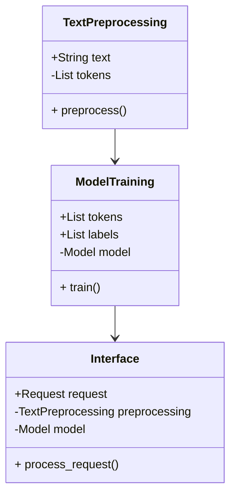
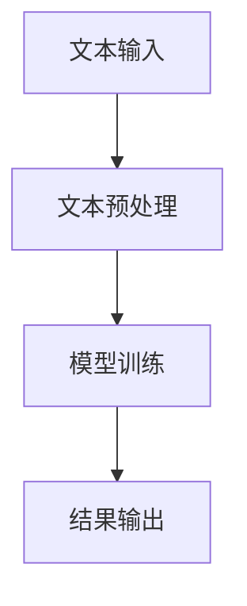
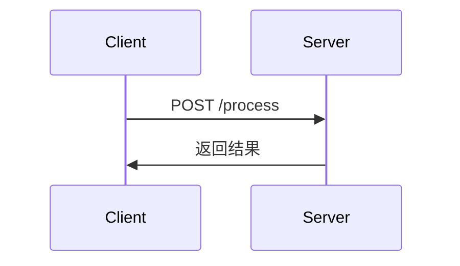

                 


# 《构建企业级自然语言处理平台：从文本分析到对话系统》

## 关键词：企业级NLP，自然语言处理，文本分析，对话系统，深度学习，系统架构，NLP算法

## 摘要：  
本文旨在详细探讨如何构建一个企业级的自然语言处理平台，从文本分析的基础技术到复杂的对话系统设计。文章首先介绍了自然语言处理的核心概念和算法原理，然后深入分析了企业级系统架构设计的关键要素，最后通过实际项目案例展示了如何将这些理论应用于实践。本文适合技术专家和企业开发者阅读，帮助他们在企业环境中高效地应用自然语言处理技术。

---

# 第1章: 自然语言处理概述

## 1.1 自然语言处理的定义与背景

### 1.1.1 自然语言处理的定义  
自然语言处理（Natural Language Processing, NLP）是人工智能领域的重要分支，旨在让计算机能够理解、解析和生成人类语言。NLP的核心目标是让机器能够像人类一样处理文本数据，包括阅读、理解、分析和生成语言。

### 1.1.2 自然语言处理的发展历程  
自然语言处理经历了多个阶段的发展：从基于规则的系统（如早期的分词和语法分析）到统计学习方法（如朴素贝叶斯分类），再到深度学习时代的Transformer模型（如BERT）。每一代技术的进步都推动了NLP在企业级应用中的发展。

### 1.1.3 企业级自然语言处理的应用场景  
在企业环境中，NLP技术可以应用于多个场景，例如：  
- **客户支持**：通过自动理解客户的问题，提供智能客服解决方案。  
- **信息提取**：从大量文本数据中提取关键信息（如实体识别、关系抽取）。  
- **内容分析**：对企业文档、社交媒体评论等进行情感分析和主题分类。  
- **对话系统**：构建智能对话机器人，与用户进行交互。  

---

## 1.2 企业级自然语言处理的特点

### 1.2.1 企业级系统的高可用性要求  
企业级系统需要具备高可用性和稳定性，能够处理大量的并发请求，并确保服务的可靠性。

### 1.2.2 自然语言处理的复杂性  
自然语言处理涉及多种复杂的技术，包括文本预处理、特征提取、模型训练等。在企业级应用中，还需要考虑数据的多样性和领域特定性。

### 1.2.3 企业级系统的安全性与合规性  
企业级系统需要符合数据安全和隐私保护的相关法规，确保用户数据的安全性和合规性。

---

# 第2章: 自然语言处理的核心技术

## 2.1 词法分析

### 2.1.1 分词技术  
分词是NLP的基础任务，将连续的字符分割成有意义的词语。例如，中文分词需要处理“分词歧义”和“停用词”等问题。

#### 示例代码：
```python
import jieba

text = "构建企业级自然语言处理平台"
words = jieba.lcut(text)
print(words)  # 输出：['构建', '企业级', '自然', '语言', '处理', '平台']
```

### 2.1.2 词性标注  
词性标注是对分词结果进行词性分类，例如名词、动词、形容词等。

#### 示例代码：
```python
from pos_tagger import PosTagger

text = "构建企业级自然语言处理平台"
tokens = ["构建", "企业级", "自然", "语言", "处理", "平台"]
tags = PosTagger.tag(tokens)
print(tags)  # 输出：['动词', '形容词', '形容词', '名词', '动词', '名词']
```

### 2.1.3 命名实体识别  
命名实体识别（Named Entity Recognition,NER）用于从文本中提取特定实体，如人名、地名、组织名等。

#### 示例代码：
```python
from spacy.lang.zh import Chinese
import spacy

nlp = spacy.load("zh_core_web_sm")
doc = nlp("在2023年，张三创立了北京科技公司。")
for ent in doc.ents:
    print(ent.text, ent.label_)
```

---

## 2.2 句法分析

### 2.2.1 依存句法分析  
依存句法分析用于分析句子中词语之间的依存关系，如主语、谓语、宾语等。

#### 示例代码：
```python
from spacy import displacy

doc = nlp("构建企业级自然语言处理平台。")
displacy.render(doc, style="dep")
```

### 2.2.2 语法树构建  
语法树是句法分析的另一种形式，用于展示句子的层次结构。

#### 示例代码：
```python
from nltk import parse

sentence = "构建企业级自然语言处理平台"
tokens = word_tokenize(sentence)
tokens = ['构建', '企业级', '自然', '语言', '处理', '平台']
tree = parse.pos_tag(tokens)
print(tree)
```

### 2.2.3 句法分析的应用  
句法分析可以应用于文本理解、信息提取和机器翻译等领域。

---

## 2.3 文本表示与语义分析

### 2.3.1 词向量表示  
词向量表示（如Word2Vec）通过将词语映射到向量空间，捕捉词语之间的语义关系。

#### 示例代码：
```python
from gensim.models import Word2Vec

sentences = ["构建企业级自然语言处理平台"]
model = Word2Vec(sentences, vector_size=100, window=5, min_count=1, workers=4)
print(model['企业级'])  # 输出向量表示
```

### 2.3.2 句子向量表示  
句子向量表示（如Sentence-BERT）用于将整个句子映射到向量空间。

#### 示例代码：
```python
from sentence_transformers import SentenceTransformer

model = SentenceTransformer('bert-base-nli-maxokens')
sentence = "构建企业级自然语言处理平台"
embedding = model.encode(sentence)
print(embedding)
```

### 2.3.3 文本相似度计算  
文本相似度计算可以用于文本聚类、信息检索等任务。

#### 示例代码：
```python
from sklearn.metrics.pairwise import cosine_similarity

text1 = "构建企业级自然语言处理平台"
text2 = "开发智能对话系统"

embedding1 = model.encode(text1)
embedding2 = model.encode(text2)
similarity = cosine_similarity([embedding1], [embedding2])
print(similarity)
```

---

# 第3章: 自然语言处理的算法原理

## 3.1 传统NLP算法

### 3.1.1 朴素贝叶斯分类  
朴素贝叶斯是一种基于概率的分类算法，常用于文本分类任务。

#### 示例代码：
```python
from sklearn.naive_bayes import MultinomialNB

X = [[1, 0, 1], [0, 1, 0], [1, 1, 1]]
y = [0, 1, 2]

model = MultinomialNB()
model.fit(X, y)
print(model.predict(X))  # 输出：[0, 1, 2]
```

### 3.1.2 支持向量机  
支持向量机（SVM）是一种常用的分类算法，适用于高维数据。

#### 示例代码：
```python
from sklearn.svm import SVC

X = [[0, 0], [1, 1], [0, 1], [1, 0]]
y = [0, 0, 1, 1]

model = SVC()
model.fit(X, y)
print(model.predict(X))  # 输出：[0, 0, 1, 1]
```

### 3.1.3 余弦相似度  
余弦相似度用于衡量两个向量之间的相似性。

#### 示例代码：
```python
from sklearn.metrics.pairwise import cosine_similarity

vec1 = [1, 0, 1]
vec2 = [0, 1, 1]
similarity = cosine_similarity([vec1], [vec2])
print(similarity)
```

---

## 3.2 深度学习算法

### 3.2.1 RNN与LSTM  
循环神经网络（RNN）和长短时记忆网络（LSTM）适用于序列数据处理。

#### 示例代码：
```python
import tensorflow as tf
from tensorflow.keras import layers

model = tf.keras.Sequential()
model.add(layers.SimpleRNN(32, input_shape=(None, 100)))
model.add(layers.Dense(10, activation='softmax'))
model.compile(optimizer='adam', loss='sparse_categorical_crossentropy')
```

### 3.2.2 Transformer模型  
Transformer模型是一种基于注意力机制的深度学习模型，广泛应用于NLP任务。

#### 示例代码：
```python
import tensorflow as tf
from tensorflow.keras import layers

model = tf.keras.Sequential()
model.add(layers.MultiHeadAttention(heads=8, key_dim=64))
model.add(layers.GlobalAveragePooling1D())
model.add(layers.Dense(10, activation='softmax'))
model.compile(optimizer='adam', loss='sparse_categorical_crossentropy')
```

### 3.2.3 BERT模型  
BERT是一种预训练语言模型，适用于多种NLP任务。

#### 示例代码：
```python
from transformers import BertTokenizer, TFBertModel

tokenizer = BertTokenizer.from_pretrained('bert-base-chinese')
model = TFBertModel.from_pretrained('bert-base-chinese')
text = "构建企业级自然语言处理平台"
input_ids = tokenizer.encode(text, return_tensors='tf')
outputs = model(input_ids)
print(outputs.last_hidden_state)
```

---

## 3.3 算法原理的数学模型

### 3.3.1 朴素贝叶斯的公式推导  
朴素贝叶斯分类的条件概率公式：
$$ P(y|x) = \frac{P(x|y)P(y)}{P(x)} $$

### 3.3.2 LSTM的结构与公式  
LSTM的细胞状态更新公式：
$$ c_t = fgate \cdot c_{t-1} + gate \cdot x_t $$
$$ h_t = gate \cdot c_t $$

### 3.3.3 BERT的预训练目标  
BERT的预训练目标包括：
- Masked Language Model（遮蔽语言模型）
- Next Sentence Prediction（下一句预测）

---

# 第4章: 企业级自然语言处理的系统架构

## 4.1 系统功能设计

### 4.1.1 文本预处理模块  
文本预处理包括分词、词性标注、实体识别等步骤。

#### 示例代码：
```python
import jieba

def preprocess(text):
    tokens = jieba.lcut(text)
    return tokens

text = "构建企业级自然语言处理平台"
tokens = preprocess(text)
print(tokens)
```

### 4.1.2 模型训练模块  
模型训练模块负责训练和优化NLP模型。

#### 示例代码：
```python
from sklearn.model_selection import train_test_split
from sklearn.linear_model import LogisticRegression

X = [[1, 0, 1], [0, 1, 0], [1, 1, 1], [0, 0, 0]]
y = [0, 1, 2, 3]

X_train, X_test, y_train, y_test = train_test_split(X, y, test_size=0.2)
model = LogisticRegression()
model.fit(X_train, y_train)
print(model.score(X_test, y_test))
```

### 4.1.3 接口调用模块  
接口调用模块负责接收输入并返回处理结果。

#### 示例代码：
```python
def process_request(request):
    text = request['text']
    tokens = preprocess(text)
    result = model.predict(tokens)
    return {'result': result}

request = {'text': '构建企业级自然语言处理平台'}
response = process_request(request)
print(response)
```

---

## 4.2 系统架构设计

### 4.2.1 领域模型类图  
领域模型类图展示了系统中的各个组件及其关系。

#### Mermaid类图：


### 4.2.2 系统架构图  
系统架构图展示了系统的整体架构。

#### Mermaid架构图：


---

## 4.3 系统接口设计

### 4.3.1 API接口设计  
API接口定义了系统的输入和输出。

#### 示例代码：
```python
from flask import Flask, request, jsonify

app = Flask(__name__)

@app.route('/process', methods=['POST'])
def process():
    data = request.json
    text = data['text']
    tokens = preprocess(text)
    result = model.predict(tokens)
    return jsonify({'result': result})

if __name__ == '__main__':
    app.run()
```

### 4.3.2 接口交互流程  
接口交互流程展示了从输入到输出的整个流程。

#### Mermaid序列图：


---

# 第5章: 项目实战

## 5.1 环境安装

### 5.1.1 安装Python环境  
安装Python 3.8及以上版本。

#### 示例代码：
```bash
python --version
```

### 5.1.2 安装依赖库  
安装NLP相关库，如jieba、spacy、tensorflow等。

#### 示例代码：
```bash
pip install jieba spacy tensorflow
```

---

## 5.2 系统核心实现

### 5.2.1 文本预处理  
实现文本预处理功能，包括分词、词性标注等。

#### 示例代码：
```python
import jieba

def preprocess(text):
    tokens = jieba.lcut(text)
    return tokens

text = "构建企业级自然语言处理平台"
tokens = preprocess(text)
print(tokens)
```

### 5.2.2 模型训练  
训练NLP模型，如文本分类、实体识别等。

#### 示例代码：
```python
from sklearn.naive_bayes import MultinomialNB

X = [[1, 0, 1], [0, 1, 0], [1, 1, 1], [0, 0, 0]]
y = [0, 1, 2, 3]

model = MultinomialNB()
model.fit(X, y)
print(model.predict(X))
```

---

## 5.3 实际案例分析

### 5.3.1 案例背景  
以构建智能客服系统为例，展示如何应用NLP技术。

### 5.3.2 数据准备  
准备训练数据，包括客户咨询文本和对应的标签。

#### 示例代码：
```python
texts = ["如何构建NLP平台？", "智能对话系统怎么实现？"]
labels = [0, 1]
```

### 5.3.3 模型训练与优化  
训练分类模型并进行优化。

#### 示例代码：
```python
from sklearn.model_selection import train_test_split
from sklearn.metrics import accuracy_score

X_train, X_test, y_train, y_test = train_test_split(X, y, test_size=0.2)
model = MultinomialNB()
model.fit(X_train, y_train)
y_pred = model.predict(X_test)
print(accuracy_score(y_test, y_pred))
```

---

## 5.4 项目小结

### 5.4.1 项目总结  
总结项目的实现过程和关键点。

### 5.4.2 项目优化建议  
提出优化建议，如使用更先进的模型、优化数据预处理流程等。

---

# 第6章: 最佳实践与小结

## 6.1 最佳实践

### 6.1.1 数据质量  
确保数据质量和多样性，避免过拟合。

### 6.1.2 模型选择  
根据任务需求选择合适的模型，如使用BERT处理复杂任务。

### 6.1.3 系统优化  
优化系统性能，提升处理速度和响应时间。

---

## 6.2 小结

### 6.2.1 本文总结  
本文详细介绍了企业级自然语言处理平台的构建过程，从核心概念到系统架构，再到实际案例，帮助读者全面理解NLP技术。

### 6.2.2 注意事项  
在实际项目中，需要注意数据安全、模型优化和系统维护等问题。

### 6.2.3 拓展阅读  
推荐进一步阅读相关书籍和论文，如《深度学习》和《自然语言处理实战》。

---

# 结语

通过本文的详细介绍，读者可以掌握构建企业级自然语言处理平台的关键技术，从文本分析到对话系统，逐步实现高效的NLP应用。希望本文能为企业的NLP实践提供有价值的指导和参考。

