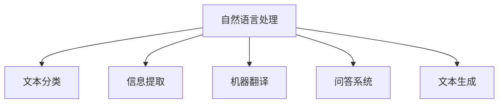
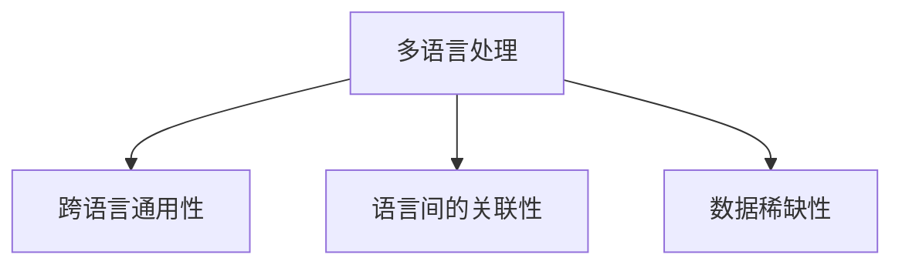
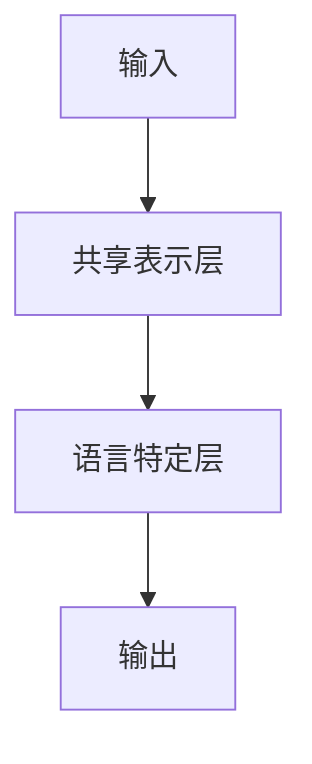
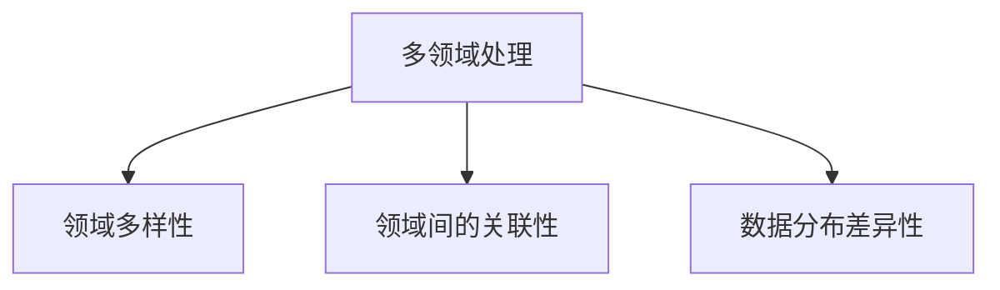
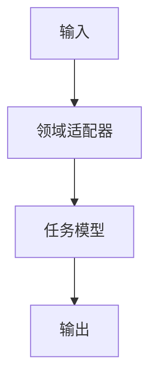
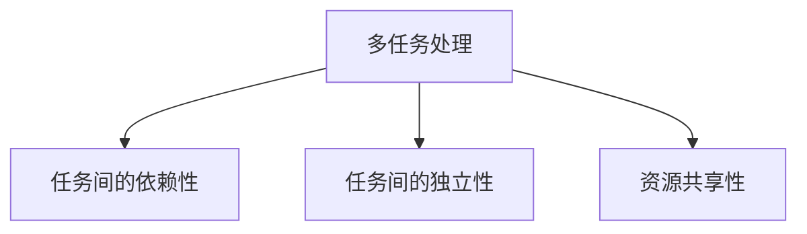
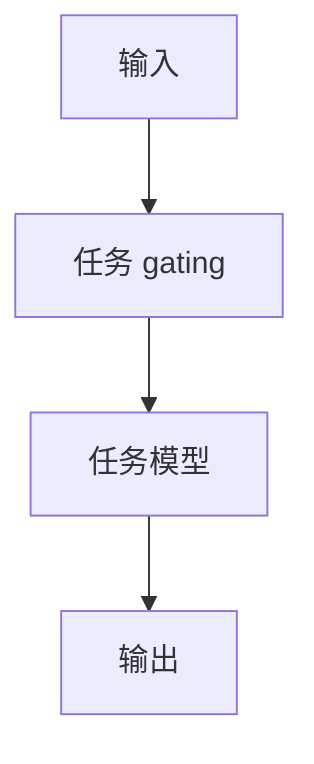
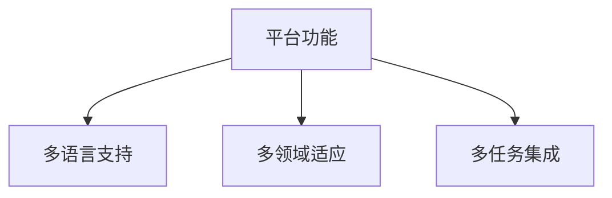
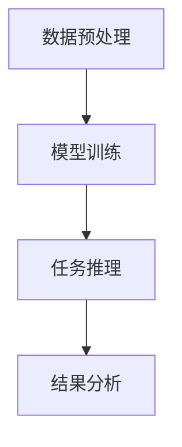
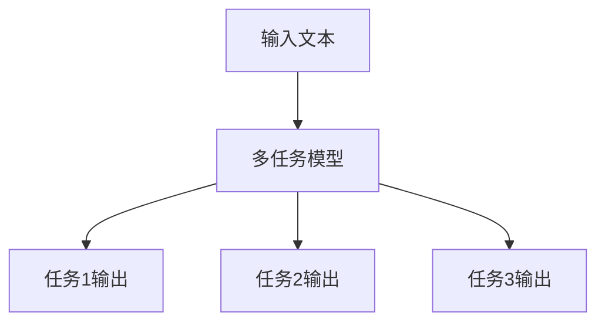

                 


# 构建企业级自然语言处理平台：多语言、多领域、多任务集成

## 关键词：自然语言处理、企业级平台、多语言、多领域、多任务集成

## 摘要：
本文旨在探讨如何构建一个支持多语言、多领域、多任务集成的企业级自然语言处理平台。文章从NLP的基本概念出发，深入分析了多语言、多领域和多任务处理的核心原理，详细讲解了企业级NLP平台的系统架构设计，并通过具体案例展示了平台的实现过程。最后，文章总结了构建企业级NLP平台的最佳实践和未来发展方向。

---

# 第一部分: 企业级自然语言处理平台概述

## 第1章: 自然语言处理与企业级应用概述

### 1.1 自然语言处理的基本概念
自然语言处理（Natural Language Processing, NLP）是人工智能领域的重要分支，旨在让计算机能够理解和处理人类语言。NLP的核心任务包括文本分类、信息提取、机器翻译、问答系统、文本生成等。



### 1.2 企业级NLP平台的背景与挑战
企业级NLP平台需要处理多种语言、多个领域和多种任务，这带来了以下挑战：
1. **多语言处理**：不同语言的语法规则和语义差异需要专门处理。
2. **多领域适应**：不同领域的数据分布和语义差异需要模型具备领域迁移能力。
3. **多任务集成**：多个任务之间的数据依赖和模型共享需要复杂的架构设计。

### 1.3 本章小结
本章介绍了自然语言处理的基本概念和企业级NLP平台的背景与挑战，为后续内容奠定了基础。

---

# 第二部分: 多语言、多领域、多任务处理的核心概念

## 第2章: 多语言处理原理

### 2.1 多语言处理的定义与特点
多语言处理是指在单一模型中同时支持多种语言的处理任务。其特点包括：
- **跨语言通用性**：模型需要在多种语言上表现良好。
- **语言间的关联性**：某些语言可能共享相似的语法规则或语义特征。
- **数据稀缺性**：小语种数据量有限，模型训练难度较大。



### 2.2 多语言模型的架构设计
多语言模型通常采用以下架构：
1. **共享表示层**：所有语言共享同一组词向量。
2. **语言特定层**：每种语言有自己的参数调整。
3. **跨语言注意力机制**：捕捉语言间的语义关联。



### 2.3 本章小结
本章详细讲解了多语言处理的定义、特点和模型架构设计，为后续内容提供了理论基础。

---

## 第3章: 多领域处理原理

### 3.1 多领域处理的定义与特点
多领域处理是指模型需要在多个领域（如医疗、法律、金融等）上表现良好。其特点包括：
- **领域多样性**：不同领域具有不同的语义特征。
- **领域间的关联性**：某些领域可能共享相似的任务或数据结构。
- **数据分布差异性**：不同领域数据分布可能差异较大。



### 3.2 多领域模型的训练与优化
多领域模型的训练策略包括：
1. **领域混合训练**：将不同领域的数据混合训练，模型学习领域间的共性和差异性。
2. **领域适配器**：在模型中增加领域适配器模块，用于调整领域间的差异。
3. **领域迁移学习**：利用源领域的数据对目标领域进行迁移学习。



### 3.3 本章小结
本章详细讲解了多领域处理的定义、特点和模型训练策略，为后续内容提供了理论支持。

---

## 第4章: 多任务处理的核心原理

### 4.1 多任务处理的定义与特点
多任务处理是指模型需要同时完成多个任务（如文本分类、信息提取、问答系统等）。其特点包括：
- **任务间的依赖性**：某些任务可能共享数据或特征。
- **任务间的独立性**：某些任务可能相对独立，互不影响。
- **资源共享性**：多任务模型通常共享参数或表示。



### 4.2 多任务模型的训练与优化
多任务模型的训练策略包括：
1. **联合训练**：将多个任务的损失函数联合起来优化。
2. **任务权重调整**：根据任务的重要性和数据量调整任务权重。
3. **任务 gating机制**：动态调整任务间的信息共享。



### 4.3 本章小结
本章详细讲解了多任务处理的定义、特点和模型训练策略，为后续内容提供了理论支持。

---

# 第三部分: 企业级NLP平台的系统架构与实现

## 第5章: 企业级NLP平台的系统架构设计

### 5.1 系统功能设计
企业级NLP平台需要实现以下功能：
1. **多语言支持**：支持多种语言的文本处理任务。
2. **多领域适应**：支持多个领域的模型训练和部署。
3. **多任务集成**：支持多种任务的联合训练和推理。



### 5.2 系统架构设计
企业级NLP平台的系统架构包括以下模块：
1. **数据预处理模块**：负责数据清洗、标注和格式化。
2. **模型训练模块**：负责多语言、多领域、多任务模型的训练。
3. **任务推理模块**：负责模型的推理和结果输出。
4. **结果分析模块**：负责结果的可视化和评估。



### 5.3 本章小结
本章详细讲解了企业级NLP平台的系统架构设计，为后续内容提供了实现基础。

---

## 第6章: 企业级NLP平台的实现与案例分析

### 6.1 环境安装
企业级NLP平台的实现需要以下环境：
- **Python**：推荐使用3.7及以上版本。
- **深度学习框架**：如TensorFlow、PyTorch等。
- **NLP工具库**：如NLTK、spaCy、HanLP等。

### 6.2 核心代码实现
以下是企业级NLP平台的核心代码示例：

```python
import tensorflow as tf
from tensorflow import keras

# 定义多任务模型
class MultiTaskModel(keras.Model):
    def __init__(self, input_dim, task_num):
        super(MultiTaskModel, self).__init__()
        self.shared_layer = keras.layers.Dense(input_dim, activation='relu')
        self.task_layers = [keras.layers.Dense(1, activation='sigmoid') for _ in range(task_num)]
    
    def call(self, inputs):
        x = self.shared_layer(inputs)
        outputs = []
        for i in range(len(self.task_layers)):
            outputs.append(self.task_layers[i](x))
        return outputs

# 编译模型
model = MultiTaskModel(input_dim=128, task_num=3)
model.compile(optimizer='adam', loss='binary_crossentropy')
```

### 6.3 案例分析
以下是一个具体的案例分析，展示如何使用企业级NLP平台进行多任务处理：



### 6.4 本章小结
本章通过具体实现和案例分析，展示了企业级NLP平台的实现过程。

---

# 第四部分: 最佳实践与未来展望

## 第7章: 构建企业级NLP平台的最佳实践

### 7.1 数据管理与优化
- **数据清洗**：确保数据的干净和一致性。
- **数据增强**：通过数据增强技术提升模型的泛化能力。
- **数据隐私保护**：确保数据的安全性和隐私性。

### 7.2 模型优化与调优
- **模型选择**：选择适合任务的模型架构。
- **超参数调优**：通过网格搜索或随机搜索优化模型性能。
- **模型压缩**：通过模型压缩技术降低模型的计算成本。

### 7.3 系统性能优化
- **并行计算**：利用多GPU或分布式计算加速模型训练。
- **缓存优化**：优化数据加载和缓存策略，减少I/O开销。
- **资源分配**：合理分配计算资源，提升系统吞吐量。

### 7.4 本章小结
本章总结了构建企业级NLP平台的最佳实践，为实际应用提供了宝贵的建议。

---

## 第8章: 企业级NLP平台的未来展望

### 8.1 技术发展趋势
- **大模型时代**：随着大模型的发展，企业级NLP平台将更加依赖预训练模型。
- **多模态融合**：未来的NLP平台将更加注重多模态数据的融合。
- **实时推理**：实时推理能力将成为企业级NLP平台的重要指标。

### 8.2 应用场景扩展
- **智能客服**：通过多语言、多任务处理提升客服系统的智能化水平。
- **智能医疗**：在医疗领域实现多语言、多任务的患者信息处理。
- **智能金融**：在金融领域实现多语言、多任务的金融数据分析。

### 8.3 本章小结
本章展望了企业级NLP平台的未来发展趋势和应用场景，为读者提供了更广阔的技术视野。

---

# 附录: 企业级NLP平台的数学公式

## 附录A: 多任务学习的数学模型

$$L_{total} = \alpha_1 L_1 + \alpha_2 L_2 + \alpha_3 L_3$$

其中：
- $$\alpha_i$$ 是任务i的权重系数。
- $$L_i$$ 是任务i的损失函数。

## 附录B: 多语言模型的注意力机制

$$\text{Attention}(Q, K, V) = \text{softmax}\left(\frac{QK^T}{\sqrt{d_k}}\right)V$$

其中：
- $$Q$$ 是查询向量。
- $$K$$ 是键向量。
- $$V$$ 是值向量。
- $$d_k$$ 是向量的维度。

---

# 结语

通过本文的详细讲解，我们了解了如何构建一个支持多语言、多领域、多任务集成的企业级自然语言处理平台。从理论到实践，从算法到系统架构，我们为读者提供了全面的技术指导。希望本文能为企业的NLP实践提供有价值的参考和启发。

--- 

关键词：自然语言处理、企业级平台、多语言、多领域、多任务集成

