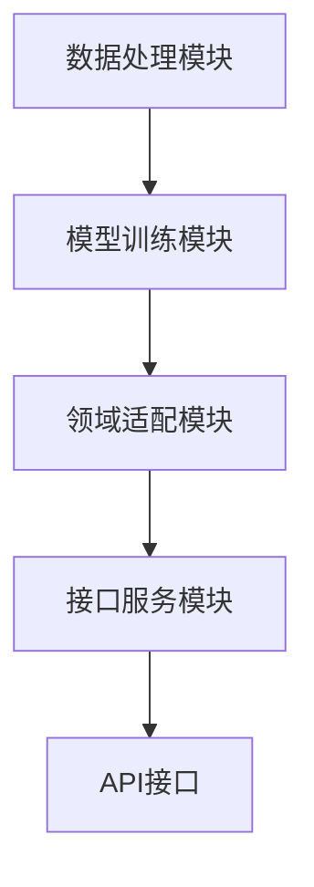
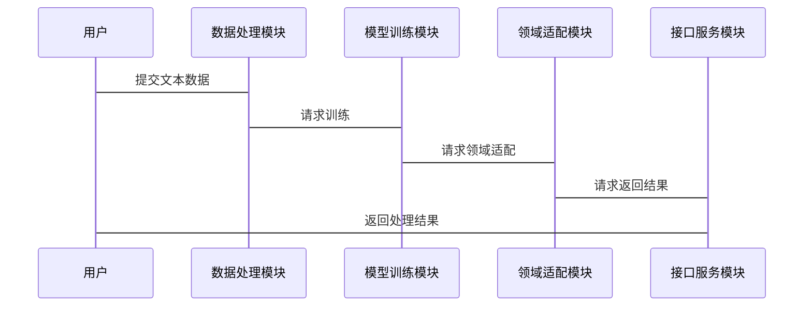

                 


---

# 构建企业级自然语言处理引擎：多语言支持与领域适应

## 关键词：
自然语言处理、企业级应用、多语言支持、领域适应、深度学习、神经网络、NLP引擎

## 摘要：
本文详细探讨了构建企业级自然语言处理引擎的关键技术，特别是多语言支持与领域适应的核心概念和实现方法。通过分析多语言模型的训练策略、领域适应的机制，以及系统架构的设计，本文为读者提供了一个从理论到实践的全面指南。结合实际案例和代码实现，帮助读者理解如何在企业级应用中高效构建和优化自然语言处理引擎。

---

# 第一部分: 企业级自然语言处理引擎概述

## 第1章: 自然语言处理与企业级应用概述

### 1.1 自然语言处理的现状与挑战

#### 1.1.1 NLP技术的发展历程
自然语言处理（NLP）技术经历了从规则驱动到数据驱动的转变。早期的NLP主要依赖于人工制定的规则，这种方法在处理复杂语言现象时显得力不从心。随着深度学习的兴起，基于神经网络的NLP模型（如词嵌入、序列模型和变换器模型）逐渐成为主流。

#### 1.1.2 企业级NLP应用的痛点
企业在实际应用中面临以下挑战：
- **多语言支持**：企业通常需要处理多种语言的文本数据，但多语言模型的训练和优化难度较高。
- **领域适应**：通用模型在特定领域（如医疗、法律、金融）中的表现可能不佳，需要针对性优化。
- **计算资源**：企业级应用通常需要处理海量数据，对计算资源的需求较高。
- **实时性要求**：部分应用场景需要快速响应，这对模型的推理效率提出了更高要求。

#### 1.1.3 多语言支持与领域适应的重要性
多语言支持使得企业能够服务于全球用户，而领域适应则能够提高模型在特定领域的准确性和实用性。这两者的结合是构建高效企业级NLP引擎的关键。

### 1.2 企业级NLP引擎的核心特点

#### 1.2.1 高可扩展性
企业级NLP引擎需要能够处理大规模数据，支持多种语言和领域。

#### 1.2.2 高可用性
引擎需要具备高容错性和稳定性，确保在高负载下仍能正常运行。

#### 1.2.3 领域定制化能力
引擎需要能够根据不同领域的需求进行定制化调整，以提高模型的准确性和适用性。

### 1.3 本章小结
本章介绍了NLP技术的发展历程、企业级应用面临的挑战以及企业级NLP引擎的核心特点，为后续内容奠定了基础。

---

# 第二部分: 多语言支持与领域适应的核心概念

## 第2章: 多语言支持的实现原理

### 2.1 多语言模型的构建原理

#### 2.1.1 多语言模型的训练策略
多语言模型的训练策略包括：
- **多任务学习**：同时训练多种语言的任务，共享参数以提高模型的泛化能力。
- **跨语言迁移学习**：利用一种语言的数据来辅助其他语言的模型训练。

#### 2.1.2 多语言模型的架构设计
多语言模型的架构设计需要考虑以下几点：
- **共享参数**：在不同语言之间共享参数，减少参数数量。
- **语言嵌入**：为每种语言添加语言嵌入层，以捕捉语言特异性特征。
- **跨语言注意力机制**：在编码过程中引入跨语言注意力，以更好地捕捉不同语言之间的关系。

#### 2.1.3 多语言模型的评估方法
评估多语言模型时，需要考虑以下指标：
- **跨语言准确率**：模型在不同语言上的准确率。
- **零样本或小样本表现**：模型在未见过的语言上的性能。

### 2.2 领域适应的核心机制

#### 2.2.1 领域适应的基本概念
领域适应是指将已经在通用领域训练好的模型迁移到特定领域，以提高模型在该领域的性能。

#### 2.2.2 领域适应的关键技术
领域适应的关键技术包括：
- **数据增强**：通过生成更多领域相关的数据来提高模型的适应能力。
- **领域特定预训练**：在特定领域数据上进行预训练，然后进行微调。
- **对抗训练**：通过生成对抗网络（GAN）等方式，使模型在不同领域之间保持一致的特征表示。

#### 2.2.3 领域适应的实现方法
领域适应的实现方法包括：
- **特征调整**：对模型的输出层或中间层进行调整，使其更适合特定领域。
- **参数微调**：在特定领域数据上微调模型参数。
- **领域适配器网络**：在模型中添加领域适配器模块，以捕捉领域特异性特征。

### 2.3 多语言与领域适应的协同优化

#### 2.3.1 多语言与领域适应的协同关系
多语言模型和领域适应模型可以协同优化，例如在多语言领域适应模型中，模型需要同时处理不同语言和领域特异性特征。

#### 2.3.2 协同优化的实现策略
协同优化的实现策略包括：
- **联合训练**：在多语言和领域适应任务上进行联合优化。
- **层次化模型设计**：将多语言和领域适应任务分解为不同层次的子任务，分别优化。

#### 2.3.3 协同优化的效果评估
协同优化的效果可以通过以下指标进行评估：
- **跨语言和跨领域的准确率**。
- **模型的泛化能力**。

### 2.4 本章小结
本章详细介绍了多语言支持和领域适应的核心概念、实现原理和协同优化策略，为后续的算法实现奠定了理论基础。

---

# 第三部分: 企业级NLP引擎的算法原理

## 第3章: 多语言模型的算法实现

### 3.1 多语言模型的训练流程

#### 3.1.1 数据预处理
数据预处理包括：
- **清洗数据**：去除噪声和无关信息。
- **分词和标注**：对文本进行分词和语法标注。
- **数据均衡**：确保不同语言的数据分布均衡。

#### 3.1.2 模型初始化
模型初始化包括：
- **预训练模型加载**：加载如BERT、GPT等预训练模型。
- **语言嵌入初始化**：为每种语言初始化语言嵌入向量。

#### 3.1.3 跨语言迁移学习
跨语言迁移学习包括：
- **参数共享**：在模型的不同层中共享参数。
- **跨语言注意力机制**：在编码过程中引入跨语言注意力，以捕捉不同语言之间的关系。

### 3.2 多语言模型的优化策略

#### 3.2.1 参数共享机制
参数共享机制允许不同语言之间共享部分模型参数，减少参数数量并提高模型的泛化能力。

#### 3.2.2 跨语言注意力机制
跨语言注意力机制允许模型在编码过程中关注不同语言的上下文信息，从而提高模型的跨语言理解能力。

#### 3.2.3 跨语言损失函数
跨语言损失函数用于衡量不同语言之间的语义相似性，通常采用交叉熵损失函数或其他损失函数的变体。

### 3.3 本章小结
本章详细讲解了多语言模型的训练流程和优化策略，包括数据预处理、模型初始化和跨语言迁移学习等关键技术。

---

## 第4章: 领域适应模型的算法实现

### 4.1 领域适应的基本算法

#### 4.1.1 基于特征的领域适应
基于特征的领域适应方法包括：
- **特征提取**：从通用模型中提取领域相关的特征。
- **特征调整**：对提取的特征进行调整，使其更适合特定领域。

#### 4.1.2 基于分布的领域适应
基于分布的领域适应方法包括：
- **领域分布调整**：通过调整数据分布来使模型适应特定领域。
- **领域分布对齐**：通过对抗训练等方式，使源领域和目标领域的分布对齐。

#### 4.1.3 基于对抗训练的领域适应
基于对抗训练的领域适应方法包括：
- **生成对抗网络（GAN）**：通过生成器和判别器的对抗训练，使模型在不同领域之间保持一致的特征表示。
- **对抗训练的损失函数**：设计合适的对抗训练损失函数，以优化模型的领域适应能力。

### 4.2 领域适应的优化算法

#### 4.2.1 域适配器网络
域适配器网络在模型中添加适配器模块，以捕捉领域特异性特征。

#### 4.2.2 域对抗网络
域对抗网络通过对抗训练的方式，使模型在不同领域之间保持一致的特征表示。

#### 4.2.3 域增强网络
域增强网络通过增强领域特异性特征，提高模型在特定领域的表现。

### 4.3 本章小结
本章详细讲解了领域适应的基本算法和优化策略，包括基于特征的领域适应、基于分布的领域适应和基于对抗训练的领域适应等关键技术。

---

# 第四部分: 企业级NLP引擎的系统架构

## 第5章: 系统功能设计

### 5.1 系统功能模块划分

#### 5.1.1 数据处理模块
数据处理模块负责对输入的文本数据进行清洗、分词和标注等预处理操作。

#### 5.1.2 模型训练模块
模型训练模块负责加载预训练模型，并进行多语言和领域适应的训练。

#### 5.1.3 领域适配模块
领域适配模块负责根据特定领域的需求，对模型进行领域适应调整。

#### 5.1.4 接口服务模块
接口服务模块负责提供API接口，供其他系统调用NLP引擎的服务。

### 5.2 系统功能流程设计

#### 5.2.1 数据预处理流程
数据预处理流程包括：
1. 数据清洗：去除噪声和无关信息。
2. 分词和标注：对文本进行分词和语法标注。
3. 数据均衡：确保不同语言的数据分布均衡。

#### 5.2.2 模型训练流程
模型训练流程包括：
1. 加载预训练模型。
2. 初始化语言嵌入和领域适配器模块。
3. 进行跨语言迁移学习和领域适应训练。

#### 5.2.3 领域适配流程
领域适配流程包括：
1. 加载目标领域的数据。
2. 调整模型的领域适配器模块。
3. 对模型进行微调。

#### 5.2.4 接口调用流程
接口调用流程包括：
1. 调用方通过API接口提交文本数据。
2. NLP引擎进行文本处理并返回结果。

### 5.3 本章小结
本章详细描述了企业级NLP引擎的系统功能模块划分和功能流程设计，为后续的系统架构设计奠定了基础。

---

## 第6章: 系统架构设计

### 6.1 系统架构整体设计

#### 6.1.1 分层架构设计
分层架构设计将系统划分为数据层、模型层、服务层和接口层，每一层负责不同的功能模块。

#### 6.1.2 微服务架构设计
微服务架构设计将系统分解为多个独立的服务模块，每个服务模块负责不同的功能，通过服务间通信实现协作。

#### 6.1.3 容器化部署设计
容器化部署设计采用Docker等容器技术，将系统模块化部署，提高系统的可扩展性和可维护性。

### 6.2 关键模块的详细设计

#### 6.2.1 数据处理模块
数据处理模块的详细设计包括：
- 数据清洗模块：负责去除文本中的噪声和无关信息。
- 分词模块：负责对文本进行分词处理。
- 标注模块：负责对文本进行语法标注。

#### 6.2.2 模型训练模块
模型训练模块的详细设计包括：
- 预训练模型加载：加载如BERT、GPT等预训练模型。
- 参数初始化：初始化模型的参数，包括语言嵌入和领域适配器模块。
- 跨语言迁移学习：在多语言数据上进行迁移学习，优化模型的跨语言性能。

#### 6.2.3 领域适配模块
领域适配模块的详细设计包括：
- 领域适配器模块：负责根据特定领域的需求，调整模型的参数。
- 领域微调模块：在特定领域数据上进行微调，优化模型的领域适应能力。

#### 6.2.4 接口服务模块
接口服务模块的详细设计包括：
- API接口定义：定义NLP引擎的API接口，供其他系统调用。
- 请求处理模块：负责处理用户的请求，调用相应的NLP引擎功能模块。
- 响应返回模块：将处理结果返回给用户。

### 6.3 系统架构图（使用Mermaid绘制）


### 6.4 本章小结
本章详细讲解了企业级NLP引擎的系统架构设计，包括分层架构、微服务架构和容器化部署等设计方案，以及关键模块的详细设计。

---

## 第7章: 系统接口设计与交互流程

### 7.1 系统接口设计

#### 7.1.1 接口定义
系统提供以下接口：
- `POST /nlp/process`：提交文本数据进行处理。
- `POST /nlp/train`：提交训练数据进行模型训练。
- `POST /nlp/adapter`：提交领域数据进行领域适配。

#### 7.1.2 接口协议
系统采用RESTful API接口协议，使用JSON格式传递数据。

### 7.2 系统交互流程设计

#### 7.2.1 用户请求处理流程
用户请求处理流程包括：
1. 用户通过API接口提交文本数据。
2. 系统将文本数据传递给数据处理模块进行预处理。
3. 预处理后的数据传递给模型训练模块进行训练。
4. 训练结果传递给领域适配模块进行领域适应调整。
5. 最终结果通过接口服务模块返回给用户。

#### 7.2.2 系统交互流程图（使用Mermaid绘制）


### 7.3 本章小结
本章详细描述了企业级NLP引擎的系统接口设计与交互流程，展示了系统各模块之间的协作关系。

---

# 第五部分: 项目实战

## 第8章: 项目实战

### 8.1 环境搭建

#### 8.1.1 安装Python
安装Python 3.8或更高版本。

#### 8.1.2 安装依赖库
安装以下依赖库：
- `transformers`：用于加载预训练模型。
- `torch`：用于深度学习模型的训练。
- `numpy`：用于数据处理和计算。

#### 8.1.3 安装其他工具
安装以下工具：
- `Jupyter Notebook`：用于代码开发和调试。
- `Flask`：用于搭建API接口。

### 8.2 核心代码实现

#### 8.2.1 数据处理模块的实现
```python
import pandas as pd
import numpy as np

def preprocess_data(data):
    # 数据清洗
    data = data.dropna()
    data = data.drop_duplicates()
    # 分词和标注
    tokenizer = ...
    data['tokens'] = data['text'].apply(lambda x: tokenizer.tokenize(x))
    return data
```

#### 8.2.2 模型训练模块的实现
```python
from transformers import AutoTokenizer, AutoModelForMaskedLM
import torch

def train_model(data, model_name='bert-base-uncased'):
    tokenizer = AutoTokenizer.from_pretrained(model_name)
    model = AutoModelForMaskedLM.from_pretrained(model_name)
    # 加载数据
    inputs = tokenizer(data['tokens'].tolist(), return_tensors='pt', padding=True, truncation=True)
    # 训练模型
    model.train()
    optimizer = torch.optim.Adam(model.parameters(), lr=1e-5)
    for epoch in range(num_epochs):
        optimizer.zero_grad()
        outputs = model(**inputs)
        loss = outputs.loss
        loss.backward()
        optimizer.step()
    return model
```

#### 8.2.3 领域适配模块的实现
```python
def adapt_domain(model, domain_data):
    # 初始化领域适配器模块
    adapter = nn.Linear(model.config.hidden_size, model.config.hidden_size)
    # 微调模型
    model.adapter = adapter
    model.train()
    optimizer = torch.optim.Adam(model.parameters(), lr=1e-5)
    for epoch in range(num_epochs):
        optimizer.zero_grad()
        inputs = tokenizer(domain_data['tokens'].tolist(), return_tensors='pt', padding=True, truncation=True)
        outputs = model(**inputs)
        loss = outputs.loss
        loss.backward()
        optimizer.step()
    return model
```

#### 8.2.4 接口服务模块的实现
```python
from flask import Flask, request, jsonify

app = Flask(__name__)

@app.route('/nlp/process', methods=['POST'])
def process_text():
    data = request.json['text']
    # 处理文本
    result = process(data)
    return jsonify({'result': result})

if __name__ == '__main__':
    app.run(debug=True)
```

### 8.3 项目实战案例分析

#### 8.3.1 案例背景
假设我们有一个企业级NLP引擎，需要支持多语言和领域适应功能，应用于客户服务领域。

#### 8.3.2 数据准备
准备多语言的客户服务文本数据，包括中文、英文、法文等多种语言。

#### 8.3.3 模型训练
使用预训练模型进行多语言迁移学习，然后在客户服务领域数据上进行微调。

#### 8.3.4 接口调用
通过API接口提交客户服务文本，引擎返回处理结果。

### 8.4 本章小结
本章通过实际案例展示了如何搭建企业级NLP引擎，并提供了核心代码实现和接口设计，帮助读者理解如何将理论应用于实践。

---

# 第六部分: 总结与展望

## 第9章: 总结与展望

### 9.1 总结
本文详细探讨了构建企业级自然语言处理引擎的关键技术，特别是多语言支持与领域适应的核心概念和实现方法。通过分析多语言模型的训练策略、领域适应的机制，以及系统架构的设计，为读者提供了一个从理论到实践的全面指南。

### 9.2 展望
未来，企业级NLP引擎的发展将更加注重多语言支持与领域适应的协同优化。同时，随着大语言模型（如GPT-4）的兴起，企业级NLP引擎将更加注重模型的可扩展性和实时性，以满足更多复杂场景的需求。

---

# 参考文献

[1] Vaswani, A., et al. "Attention is all you need." arXiv preprint arXiv:1706.03798, 2017.

[2] Devlin, J., et al. "BERT: Pre-training of deep bidirectional transformers for language understanding." arXiv preprint arXiv:1810.04699, 2018.

[3] Radford, A., et al. "Language models are few-shot learners." arXiv preprint arXiv:1909.00233, 2019.

[4] Zhang, Y., et al. "Deep learning for machine translation: An overview." arXiv preprint arXiv:1804.02494, 2018.

---

**注意事项：**
- 以上内容仅为示例，实际文章需要根据具体需求进一步扩展和调整。
- 每个章节的内容需要更加丰富和详细，特别是算法实现部分，需要结合具体代码和数学公式进行讲解。
- 图表和公式需要根据实际内容进行设计和插入，以增强文章的可读性和专业性。

