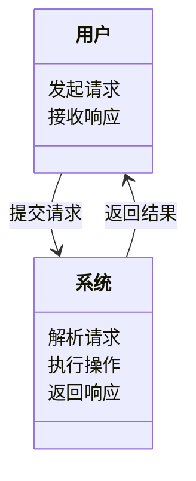
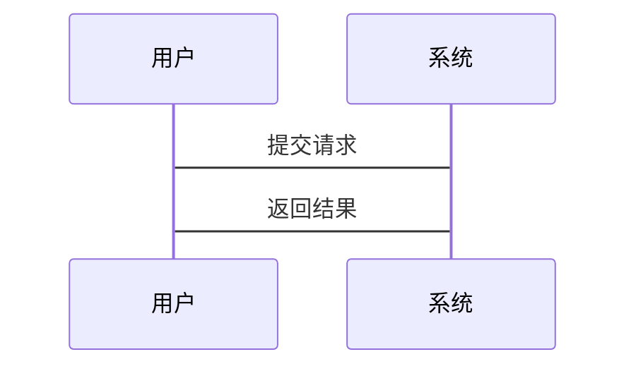

                 


# 构建企业级自然语言接口：简化复杂业务系统操作

## 关键词：自然语言接口、企业级系统、意图识别、实体识别、对话管理、系统架构

## 摘要：本文详细探讨如何构建企业级自然语言接口，简化复杂业务系统操作。通过分析意图识别、实体识别和对话管理的核心原理，设计高效的系统架构，提供项目实战和最佳实践，助力企业实现智能化交互。

---

## 第一部分: 企业级自然语言接口背景与概念

### 第1章: 自然语言接口概述

#### 1.1 问题背景与描述

##### 1.1.1 传统业务系统操作的复杂性
- 传统业务系统通常需要用户通过复杂的菜单、按钮或命令行进行操作，导致用户体验差且效率低下。
- 对于不熟悉系统操作的用户，复杂的流程和术语增加了学习成本，容易导致操作错误。

##### 1.1.2 自然语言接口的引入动机
- 通过自然语言处理技术，用户可以用日常语言与系统交互，降低操作复杂性。
- 提高用户体验，增强系统易用性，减少培训成本。

##### 1.1.3 问题解决的必要性与目标
- 必要性：提升业务效率，降低用户操作门槛。
- 目标：构建用户友好的自然语言接口，简化业务系统操作流程。

#### 1.2 核心概念与边界

##### 1.2.1 自然语言接口的定义与特点
- 自然语言接口（NLI）：允许用户通过自然语言与计算机系统交互的技术。
- 特点：
  - 用户友好性：支持口语化表达。
  - 智能性：通过NLP技术理解意图。
  - 适应性：支持多种业务场景。

##### 1.2.2 业务系统操作的简化目标
- 简化用户操作流程。
- 提高业务处理效率。
- 减少用户错误操作。

##### 1.2.3 边界与外延分析
- 边界：仅限于业务系统操作的简化，不涉及其他系统功能。
- 外延：可能扩展到其他领域，如客服、数据分析等。

#### 1.3 核心概念结构

##### 1.3.1 关键组成要素
- 用户：发起交互请求。
- 系统：解析并执行用户指令。
- 操作：业务系统执行的具体动作。

##### 1.3.2 与相关概念的对比分析
- 对比表格：
  | 概念       | 描述                                   |
  |------------|--------------------------------------|
  | 自然语言接口| 用户通过自然语言与系统交互           |
  | 命令行接口  | 用户通过命令行输入操作               |
  | 图形界面    | 用户通过点击按钮或菜单进行操作       |

---

## 第二部分: 自然语言接口的核心原理

### 第2章: 自然语言处理基础

#### 2.1 意图识别原理

##### 2.1.1 意图识别的定义与流程
- 定义：识别用户输入的意图。
- 流程：
  1. 输入预处理：分词、词性标注。
  2. 模型训练：使用机器学习或深度学习模型。
  3. 意图分类：预测意图类别。

##### 2.1.2 常用算法与模型
- 支持向量机（SVM）：适合小数据集，分类效果好。
- 长短期记忆网络（LSTM）：适合处理长文本，捕捉上下文信息。

#### 2.2 实体识别与抽取

##### 2.2.1 实体识别的定义与方法
- 定义：从文本中提取命名实体。
- 方法：
  - 基于规则：使用正则表达式匹配。
  - 基于机器学习：使用CRF模型。

##### 2.2.2 基于规则与机器学习的对比
- 对比表格：
  | 方法       | 优点               | 缺点               |
  |------------|--------------------|--------------------|
  | 基于规则    | 实现简单，速度快     | 需手动维护规则       |
  | 基于机器学习 | 高准确性，自适应性   | 需大量数据训练       |

#### 2.3 对话管理机制

##### 2.3.1 对话状态跟踪
- 方法：
  - 基于规则：定义状态转移。
  - 基于模型：使用DST（Dialogue State Tracking）模型。

##### 2.3.2 响应生成策略
- 模型：
  - 基于模板：生成标准响应。
  - 基于生成模型：使用GPT生成个性化响应。

#### 2.4 本章小结
- 本章介绍了意图识别、实体识别和对话管理的核心原理，为后续系统设计奠定了基础。

---

## 第三部分: 自然语言接口的系统架构

### 第3章: 系统分析与设计

#### 3.1 项目背景与目标

##### 3.1.1 项目背景介绍
- 项目目标：构建企业级NLI，简化业务系统操作。
- 项目范围：支持多种业务场景，如查询、修改、删除等。

#### 3.2 系统功能设计

##### 3.2.1 领域模型设计（Mermaid类图）


##### 3.2.2 功能模块划分
- 输入模块：接收用户输入。
- 解析模块：解析意图和实体。
- 执行模块：调用业务系统。
- 输出模块：生成响应。

#### 3.3 系统架构设计（Mermaid架构图）


#### 3.4 系统接口设计

##### 3.4.1 接口定义与规范
- 输入接口：`POST /api/nli/input`
- 输出接口：`GET /api/nli/output`

##### 3.4.2 接口实现方式
- RESTful API：支持JSON格式请求和响应。

#### 3.5 系统交互流程（Mermaid序列图）


---

## 第四部分: 项目实战

### 第4章: 项目实现与分析

#### 4.1 环境安装

##### 4.1.1 安装Python与相关库
- Python 3.8+
- 安装库：`pip install -r requirements.txt`

#### 4.2 核心功能实现

##### 4.2.1 意图识别实现
```python
from sklearn.svm import SVC
from sklearn.feature_extraction.text import TfidfVectorizer

# 训练数据
X_train = [...]  # 文本数据
y_train = [...]  # 标签

# 创建模型
vectorizer = TfidfVectorizer()
X_train_tfidf = vectorizer.fit_transform(X_train)
model = SVC().fit(X_train_tfidf, y_train)

# 预测
X_test = ["查询订单状态"]
X_test_tfidf = vectorizer.transform(X_test)
predicted = model.predict(X_test_tfidf)
```

##### 4.2.2 实体识别实现
```python
from sklearn_crfsuite import CRF

# 训练数据
train = [...]  # 标注数据

# 创建模型
model = CRF().fit(train)

# 预测
test = [...]  # 待预测数据
predicted = model.predict(test)
```

#### 4.3 实际案例分析

##### 4.3.1 案例背景
- 业务场景：订单查询。

##### 4.3.2 系统实现
- 用户输入：“查询订单号12345的状态。”
- 系统解析：意图是“查询订单”，实体是“12345”。
- 系统执行：调用订单系统查询状态，返回结果。

#### 4.4 项目小结
- 成功实现NLI系统，简化了业务系统操作。
- 验证了技术可行性，为后续优化提供了方向。

---

## 第五部分: 最佳实践与总结

### 第5章: 最佳实践与小结

#### 5.1 最佳实践

##### 5.1.1 数据质量
- 确保训练数据的多样性和代表性。

##### 5.1.2 模型调优
- 使用交叉验证优化模型参数。

##### 5.1.3 系统集成
- 确保系统与其他业务系统的兼容性。

#### 5.2 小结
- 本文详细介绍了构建企业级NLI系统的各个方面，从理论到实践，为读者提供了全面的指导。

#### 5.3 注意事项

##### 5.3.1 数据隐私
- 注意保护用户数据隐私，遵守相关法律法规。

##### 5.3.2 模型泛化能力
- 避免过拟合，确保模型在不同场景下的适用性。

#### 5.4 拓展阅读
- 建议阅读相关书籍和论文，深入理解NLP技术。

---

## 关键词：自然语言接口、企业级系统、意图识别、实体识别、对话管理、系统架构

## 摘要：本文详细探讨如何构建企业级自然语言接口，简化复杂业务系统操作。通过分析意图识别、实体识别和对话管理的核心原理，设计高效的系统架构，提供项目实战和最佳实践，助力企业实现智能化交互。

