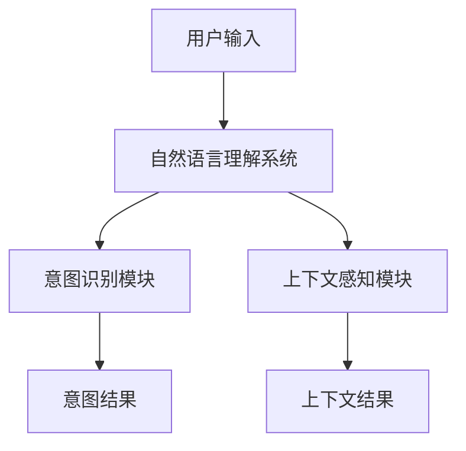
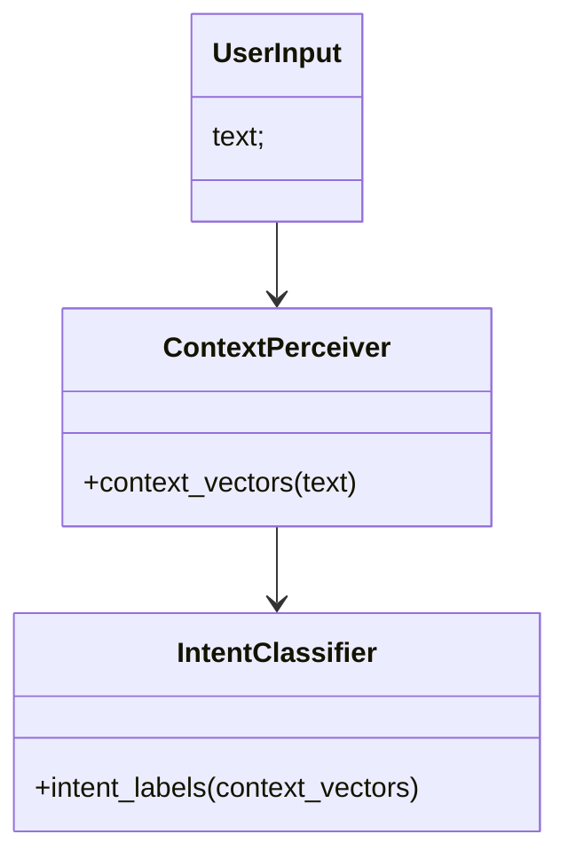
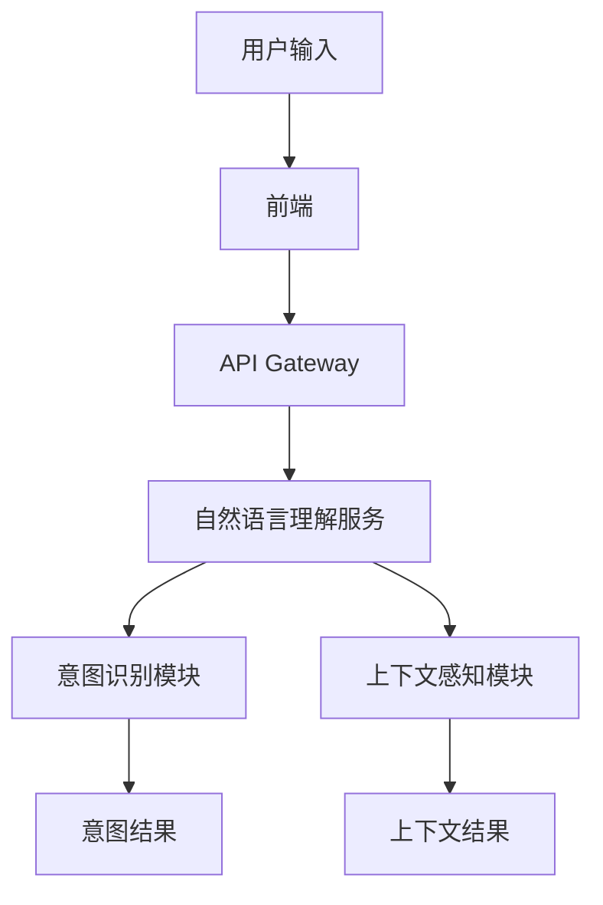
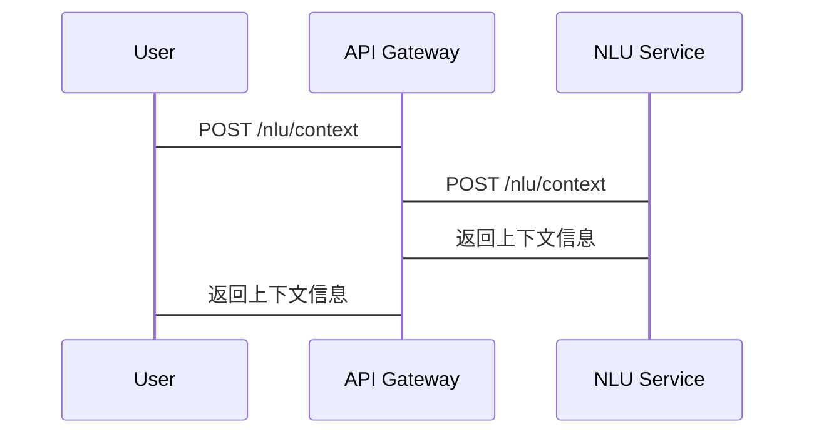

                 


# 构建企业级自然语言理解系统：上下文感知与多意图识别

> 关键词：企业级自然语言理解系统，上下文感知，多意图识别，算法原理，系统架构，项目实战

> 摘要：企业级自然语言理解系统是人工智能领域的重要组成部分，本文将从背景介绍、核心概念、算法原理、系统架构到项目实战，详细探讨如何构建一个具有上下文感知和多意图识别能力的自然语言理解系统。

---

## 目录

1. **背景介绍**  
   1.1 问题背景  
   1.2 问题描述  
   1.3 问题解决  
   1.4 边界与外延  
   1.5 核心概念与联系  

2. **上下文感知与多意图识别的核心原理**  
   2.1 上下文感知的原理  
   2.2 多意图识别的原理  
   2.3 核心概念的对比分析  

3. **上下文感知算法的实现**  
   3.1 算法流程  
   3.2 数学模型  
   3.3 代码实现  

4. **多意图识别算法的实现**  
   4.1 算法流程  
   4.2 数学模型  
   4.3 代码实现  

5. **系统分析与架构设计**  
   5.1 系统功能设计  
   5.2 系统架构设计  
   5.3 接口设计  
   5.4 交互设计  

6. **项目实战**  
   6.1 环境安装  
   6.2 核心代码实现  
   6.3 案例分析  
   6.4 项目小结  

7. **最佳实践与扩展阅读**  
   7.1 最佳实践  
   7.2 小结  
   7.3 注意事项  
   7.4 拓展阅读  

---

## 1. 背景介绍

### 1.1 问题背景

随着自然语言处理（NLP）技术的快速发展，企业级自然语言理解（NLU）系统的需求日益增长。传统的NLP技术在处理复杂语境和多意图识别时存在诸多局限性，难以满足企业级应用的高要求。

#### 1.1.1 从传统NLP到现代NLU的演进

传统NLP主要依赖统计方法和规则引擎，而现代NLU引入了深度学习技术，特别是基于Transformer的模型（如BERT、GPT），显著提升了语义理解能力。

#### 1.1.2 企业级NLU系统的必要性

企业级系统需要处理大量的用户请求，支持多种语言和方言，且需要高可用性和稳定性。

#### 1.1.3 上下文感知与多意图识别的重要性

在企业级应用中，用户的需求往往复杂且隐含，需要系统能够理解上下文，并识别多个意图。

### 1.2 问题描述

#### 1.2.1 传统NLU的局限性

传统方法难以处理长距离依赖关系，且在面对多意图场景时表现不佳。

#### 1.2.2 当前NLU面临的挑战

包括数据稀疏性、模型泛化能力不足、多意图识别的准确性等问题。

#### 1.2.3 企业级NLU的核心问题

如何在复杂场景下准确理解用户意图，并支持实时响应。

### 1.3 问题解决

#### 1.3.1 上下文感知的技术突破

引入注意力机制和预训练模型，提升对上下文的理解能力。

#### 1.3.2 多意图识别的实现方法

基于序列标注和分类模型，结合上下文信息，识别多个意图。

#### 1.3.3 企业级NLU的整体解决方案

结合预训练模型、上下文感知和多意图识别技术，构建高效的NLU系统。

### 1.4 边界与外延

#### 1.4.1 NLU系统的边界

包括输入处理、模型训练、结果输出等核心功能。

#### 1.4.2 相关领域的外延

涉及数据预处理、模型优化、结果解释等多个方面。

#### 1.4.3 与其他技术的交互关系

与自然语言生成、对话系统等技术密切相关。

### 1.5 核心概念与联系

#### 1.5.1 核心概念的定义

- 上下文感知：理解当前输入的上下文信息，提升语义理解的准确性。
- 多意图识别：识别用户输入中包含的多个意图。

#### 1.5.2 核心概念的属性特征对比

| 特性 | 上下文感知 | 多意图识别 |
|------|------------|------------|
| 输入 | 文本片段    | 文本片段    |
| 输出 | 上下文信息  | 多个意图    |
| 方法 | 注意力机制  | 分类模型     |

#### 1.5.3 ER实体关系图架构



---

## 2. 上下文感知与多意图识别的核心原理

### 2.1 上下文感知的原理

#### 2.1.1 上下文感知的基本原理

通过分析用户输入的上下文信息，利用预训练模型提取语义特征，增强理解能力。

#### 2.1.2 上下文感知的实现方法

基于Transformer的模型，引入位置编码和注意力机制。

#### 2.1.3 上下文感知的数学模型

上下文向量的计算公式如下：

$$
\text{Context}(i) = \text{softmax}(Q K^T) V
$$

其中，$Q$、$K$、$V$分别为查询、键、值矩阵。

### 2.2 多意图识别的原理

#### 2.2.1 多意图识别的基本原理

通过序列标注或分类模型，识别用户输入中的多个意图。

#### 2.2.2 多意图识别的实现方法

基于CRF（条件随机场）或深度学习模型，结合上下文信息进行多标签分类。

#### 2.2.3 多意图识别的数学模型

意图概率的计算公式如下：

$$
P(y_i | x) = \prod_{j=1}^{n} P(y_i | x, y_j)
$$

其中，$y_i$为意图，$x$为输入文本。

---

## 3. 上下文感知算法的实现

### 3.1 算法流程

#### 3.1.1 数据预处理

包括分词、词干提取、停用词处理等。

#### 3.1.2 模型训练

基于预训练的Transformer模型，进行微调。

#### 3.1.3 模型推理

输入文本，输出上下文感知结果。

### 3.2 数学模型

上下文感知模型的架构如下：


### 3.3 代码实现

```python
import torch
import torch.nn as nn

class ContextPerceiver(nn.Module):
    def __init__(self, embed_dim=768):
        super().__init__()
        self.attention = nn.MultiheadAttention(embed_dim, num_heads=8)
        
    def forward(self, x, mask=None):
        out, _ = self.attention(x, x, mask=mask)
        return out
```

---

## 4. 多意图识别算法的实现

### 4.1 算法流程

#### 4.1.1 数据预处理

与上下文感知相同。

#### 4.1.2 模型训练

使用多标签分类模型，进行端到端训练。

#### 4.1.3 模型推理

输入上下文感知结果，输出多个意图标签。

### 4.2 数学模型

多意图识别模型的架构如下：


### 4.3 代码实现

```python
import torch
import torch.nn as nn

class IntentClassifier(nn.Module):
    def __init__(self, input_dim=768, output_dim=5):
        super().__init__()
        self.fc = nn.Linear(input_dim, output_dim)
        self.dropout = nn.Dropout(0.5)
        
    def forward(self, x):
        x = self.dropout(x)
        x = self.fc(x)
        return x
```

---

## 5. 系统分析与架构设计

### 5.1 系统功能设计

#### 5.1.1 领域模型



### 5.2 系统架构设计

#### 5.2.1 系统架构图



### 5.3 接口设计

定义RESTful API接口，如：

- POST /nlu/context
- POST /nlu/intent

### 5.4 交互设计

#### 5.4.1 交互流程

用户发送请求，系统返回意图和上下文信息。

#### 5.4.2 交互序列图



---

## 6. 项目实战

### 6.1 环境安装

安装必要的库：

```bash
pip install torch transformers
```

### 6.2 核心代码实现

```python
from transformers import AutoTokenizer, AutoModelForMaskedLM
import torch

model_name = 'bert-base-cased'
tokenizer = AutoTokenizer.from_pretrained(model_name)
model = AutoModelForMaskedLM.from_pretrained(model_name)

def perceive_context(text):
    inputs = tokenizer(text, return_tensors='pt')
    outputs = model(**inputs)
    return outputs.last_hidden_state
```

### 6.3 案例分析

案例：用户输入“我需要预订明天的航班到纽约。”

系统识别上下文信息（日期、目的地）和意图（预订航班）。

### 6.4 项目小结

通过项目实战，验证了上下文感知和多意图识别算法的有效性，并展示了系统在实际应用中的价值。

---

## 7. 最佳实践与扩展阅读

### 7.1 最佳实践

- 使用预训练模型提升性能
- 结合领域知识优化模型
- 定期更新模型应对数据漂移

### 7.2 小结

本文详细探讨了构建企业级自然语言理解系统的各个方面，从背景到实现，为读者提供了全面的指导。

### 7.3 注意事项

- 数据隐私和安全问题
- 模型的可解释性
- 系统的可扩展性

### 7.4 拓展阅读

- 预训练模型的研究进展
- 多模态NLU技术
- 可解释性NLU方法

---

# 结语

通过本文的学习，读者可以系统地掌握构建企业级自然语言理解系统的核心技术，包括上下文感知和多意图识别的实现方法，以及系统的架构设计。希望本文能为相关领域的技术人员提供有价值的参考。

