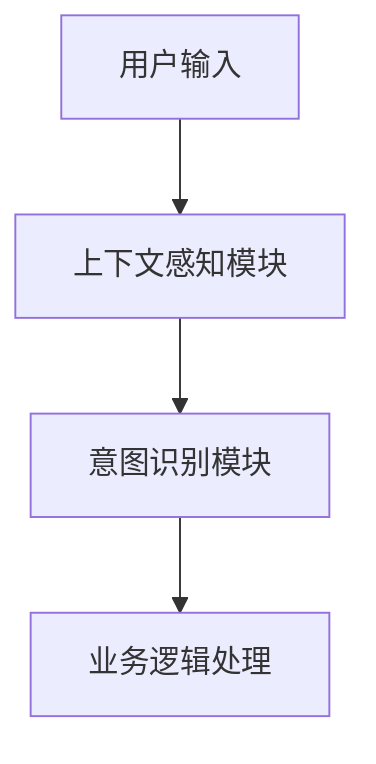

                 

# 构建企业级自然语言理解系统：上下文感知与多意图识别的融合

## 关键词：自然语言理解系统，上下文感知，多意图识别，企业级系统，深度学习

## 摘要：  
本文深入探讨了构建企业级自然语言理解系统的关键技术，重点分析了上下文感知与多意图识别的融合方法。文章从问题背景出发，详细介绍了核心概念、算法原理、系统架构及实现案例，为企业级NLU系统的开发提供了系统化的解决方案。

---

# 第1章 问题背景

## 1.1 问题背景

### 1.1.1 当前自然语言处理技术的发展现状  
自然语言处理（NLP）技术近年来取得了显著进展，尤其在深度学习的推动下，各种应用场景如智能客服、搜索引擎、语音助手等逐渐成熟。然而，现有的NLP系统在处理复杂场景时仍存在诸多挑战，例如上下文理解不足、多意图识别模糊等问题。

### 1.1.2 企业级NLU系统的应用需求  
企业级自然语言理解系统需要在复杂业务场景下，准确理解用户的意图，并结合上下文信息提供精准的服务。例如，在智能客服系统中，用户的问题可能涉及多个业务领域，系统需要同时识别主意图和相关子意图，并结合对话历史提供解决方案。

### 1.1.3 上下文感知与多意图识别的融合必要性  
传统NLU系统通常基于单个句子或短语进行意图识别，难以应对多轮对话中的上下文信息。通过融合上下文感知和多意图识别技术，系统能够更好地理解用户的真实需求，提升用户体验。

---

## 1.2 问题描述

### 1.2.1 传统NLU系统的局限性  
传统NLU系统通常仅能识别单个意图，难以处理复杂的多意图场景。此外，缺乏上下文感知能力导致系统在多轮对话中的表现受限。

### 1.2.2 上下文感知与多意图识别的定义  
- **上下文感知**：通过分析对话历史、用户行为等信息，理解当前输入的上下文背景。  
- **多意图识别**：在单个输入中识别多个相关意图，例如用户可能在询问“如何退票”时同时涉及“查询订单”和“退款流程”两个意图。

### 1.2.3 企业级NLU系统的边界与外延  
企业级NLU系统的边界包括前端交互界面和后端业务逻辑，外延则涉及数据预处理、模型训练、系统部署等环节。

---

## 1.3 核心问题解决

### 1.3.1 上下文感知的关键技术  
- 利用序列模型（如LSTM、Transformer）捕获对话历史中的上下文信息。  
- 基于注意力机制提取关键信息。

### 1.3.2 多意图识别的核心挑战  
- 如何在单个输入中识别多个意图。  
- 如何平衡主意图和次要意图的识别优先级。

### 1.3.3 融合上下文与多意图识别的解决方案  
通过构建联合模型，同时考虑上下文信息和多意图特征，提升系统整体性能。

---

## 1.4 核心概念结构

### 1.4.1 上下文感知与多意图识别的概念属性对比  
| **属性**         | **上下文感知**       | **多意图识别**       |
|-------------------|----------------------|----------------------|
| **输入**          | 文本片段             | 文本片段             |
| **输出**          | 上下文语义信息       | 多个意图标签         |
| **依赖性**        | 强依赖上下文信息     | 弱依赖上下文信息     |
| **应用场景**      | 对话系统             | 智能推荐系统         |

### 1.4.2 实体关系图（ER图）展示  

---

## 1.5 核心要素组成

### 1.5.1 上下文感知模块  
- **功能**：分析对话历史，提取上下文信息。  
- **实现**：基于Transformer的编码器模型，利用自注意力机制捕获上下文特征。

### 1.5.2 多意图识别模块  
- **功能**：识别输入文本中的多个意图。  
- **实现**：使用多标签分类模型，结合序列标注技术。

### 1.5.3 融合机制设计  
- **功能**：将上下文信息与意图识别结果进行融合。  
- **实现**：设计加权机制，根据上下文相关性调整意图权重。

---

## 1.6 本章小结  
本章从问题背景出发，详细分析了企业级NLU系统的核心概念、问题及解决方案。通过对比上下文感知和多意图识别的属性，为后续的技术实现奠定了基础。

---

接下来，我会按照这个大纲继续完成后续章节的撰写。如果您需要进一步的详细内容或其他章节的扩展，请随时告诉我！

