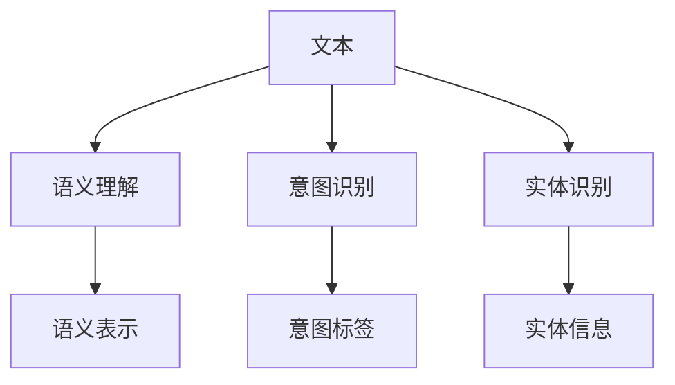
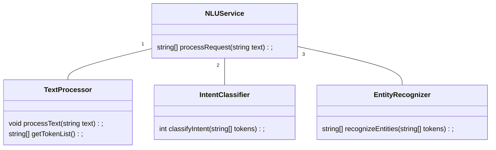
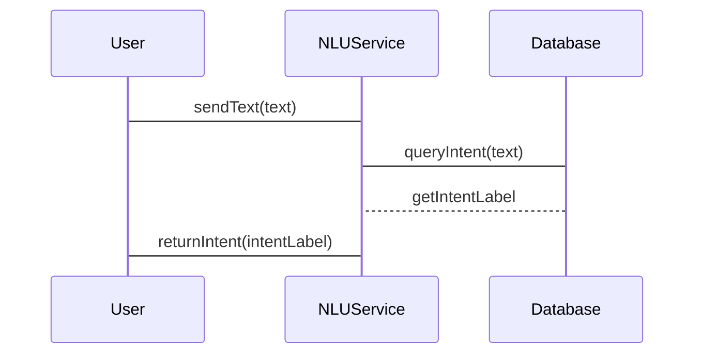

                 


# 构建企业级自然语言理解系统：跨语言语义理解与意图识别

## 关键词：自然语言处理，意图识别，跨语言理解，企业级系统，NLU系统

## 摘要：  
本文将详细探讨构建企业级自然语言理解系统的核心技术，重点分析跨语言语义理解与意图识别的实现方法。从理论基础到算法原理，从系统架构设计到项目实战，全面解析如何构建高效、准确的自然语言理解系统，帮助企业实现智能化的交互与数据处理。

---

# 第1章: 背景与核心概念

## 1.1 问题背景与描述

### 1.1.1 当前自然语言处理的挑战  
自然语言处理（NLP）作为人工智能的核心领域，近年来取得了显著进展。然而，企业级NLU系统仍面临诸多挑战，如多语言支持、语义理解的准确性、意图识别的高效性等。此外，数据的多样性和复杂性也增加了系统构建的难度。

### 1.1.2 企业级NLU系统的需求  
企业级NLU系统需要满足以下需求：  
1. **高准确性**：在复杂的场景下准确识别用户的意图。  
2. **跨语言支持**：支持多种语言的语义理解和意图识别。  
3. **可扩展性**：能够灵活扩展以应对不同业务场景的需求。  
4. **实时性**：支持实时处理，满足在线交互的需求。  

### 1.1.3 跨语言语义理解的实现范围  
跨语言语义理解的目标是将不同语言的文本映射到相同的语义空间，实现跨语言的语义分析。其实现范围包括：  
1. 多语言词嵌入模型的构建。  
2. 跨语言注意力机制的设计。  
3. 跨语言语义匹配算法的优化。  

## 1.2 问题解决与边界

### 1.2.1 自然语言理解的核心问题  
自然语言理解的核心问题包括：  
1. **语义解析**：将文本转化为计算机可理解的语义表示。  
2. **意图识别**：从文本中提取用户的目标或意图。  
3. **实体识别**：从文本中提取关键实体信息。  

### 1.2.2 企業級系统的核心边界  
企業級NLU系统的核心边界包括：  
1. **输入范围**：支持多种语言的文本输入。  
2. **输出范围**：提供标准化的语义表示和意图标签。  
3. **性能边界**：在大规模数据下保持低延迟和高吞吐量。  

### 1.2.3 系统实现的关键要素  
系统实现的关键要素包括：  
1. **多语言数据预处理**：支持多种语言的分词、句法分析和实体识别。  
2. **跨语言语义模型**：构建能够处理多种语言的深度学习模型。  
3. **高效的推理引擎**：实现高效的意图识别和语义推理。  

## 1.3 核心要素与概念结构

### 1.3.1 NLU系统的核心要素  
NLU系统的核心要素包括：  
1. **语言理解模块**：负责文本的语义解析。  
2. **意图识别模块**：负责识别用户的意图。  
3. **实体识别模块**：负责提取文本中的关键实体。  

### 1.3.2 跨语言处理的关键属性  
跨语言处理的关键属性包括：  
1. **语言无关性**：语义表示应与语言无关。  
2. **跨语言一致性**：不同语言的语义表示应具有一致性。  
3. **语言适应性**：系统应能够快速适应新的语言。  

### 1.3.3 系统架构的核心组件  
系统架构的核心组件包括：  
1. **数据预处理模块**：负责文本的清洗和标准化。  
2. **模型训练模块**：负责训练跨语言语义模型。  
3. **推理服务模块**：负责处理实时的语义理解和意图识别请求。  

---

# 第2章: 核心概念与联系

## 2.1 核心概念原理

### 2.1.1 语义理解的定义与实现  
语义理解是指从文本中提取语义信息，通常通过深度学习模型实现。常见的语义理解方法包括：  
1. **基于词嵌入的方法**：如Word2Vec、GloVe。  
2. **基于上下文的嵌入方法**：如BERT、GPT。  

### 2.1.2 意图识别的原理与方法  
意图识别是通过分析文本内容，推断用户的意图。常用方法包括：  
1. **基于规则的方法**：通过预定义的规则匹配意图。  
2. **基于机器学习的方法**：如SVM、随机森林。  
3. **基于深度学习的方法**：如RNN、BERT。  

### 2.1.3 跨语言处理的实现机制  
跨语言处理的实现机制包括：  
1. **多语言模型**：如多语言BERT（mBERT）。  
2. **跨语言映射**：将不同语言的词嵌入映射到同一空间。  
3. **联合训练**：在多语言数据上进行联合训练。  

## 2.2 概念对比与ER图

### 2.2.1 核心概念属性对比表  
以下是核心概念的属性对比表：  

| 概念       | 属性                   | 描述                                   |
|------------|------------------------|---------------------------------------|
| 语义理解    | 输入                   | 文本                                   |
|            | 输出                   | 语义表示                               |
| 意图识别    | 输入                   | 文本                                   |
|            | 输出                   | 意图标签                               |
| 跨语言处理  | 输入                   | 多语言文本                             |
|            | 输出                   | 跨语言语义表示                         |

### 2.2.2 实体关系图  
以下是实体关系图：  



---

# 第3章: 算法原理与数学模型

## 3.1 算法原理

### 3.1.1 BERT模型的结构与原理  
BERT（Bidirectional Encoder Representations from Transformers）是一种基于Transformer的预训练语言模型。其核心思想是通过双向编码器来捕捉文本的语义信息。BERT的结构包括：  
1. **输入层**：文本经过分词和嵌入后输入模型。  
2. **编码层**：多个Transformer层对输入进行编码。  
3. **输出层**：生成语义表示向量。  

### 3.1.2 意图识别的算法流程  
意图识别的算法流程包括：  
1. **数据预处理**：文本清洗、分词、特征提取。  
2. **模型训练**：使用深度学习模型（如BERT）进行训练。  
3. **模型推理**：输入文本，输出意图标签。  

### 3.1.3 跨语言处理的算法优化  
跨语言处理的算法优化包括：  
1. **多语言模型预训练**：在多语言数据上预训练模型。  
2. **跨语言注意力机制**：在模型中引入跨语言注意力机制。  
3. **语言适应性优化**：通过微调模型适应不同语言。  

## 3.2 数学模型与公式

### 3.2.1 词嵌入的数学表达  
词嵌入的数学表达如下：  
$$ \text{Word}_{i} \rightarrow \text{Vector}_{i} \in \mathbb{R}^{d} $$  

其中，$\text{Word}_{i}$表示第$i$个词，$\text{Vector}_{i}$是对应的词向量，$d$是维度数。  

### 3.2.2 注意力机制的公式推导  
注意力机制的公式推导如下：  
$$ \text{Attention}(Q, K, V) = \text{softmax}\left(\frac{QK^T}{\sqrt{d}}\right)V $$  

其中，$Q$是查询向量，$K$是键向量，$V$是值向量。  

### 3.2.3 模型训练的损失函数  
模型训练的损失函数通常使用交叉熵损失：  
$$ \mathcal{L} = -\sum_{i=1}^{n} y_i \log p(y_i) $$  

其中，$y_i$是真实标签，$p(y_i)$是模型预测的概率。  

## 3.3 代码实现与案例

### 3.3.1 使用Python实现简单的NLU模型  
以下是一个简单的NLU模型实现示例：  

```python
import torch
import torch.nn as nn

class SimpleNLUModel(nn.Module):
    def __init__(self, input_dim, hidden_dim, output_dim):
        super(SimpleNLUModel, self).__init__()
        self.fc1 = nn.Linear(input_dim, hidden_dim)
        self.fc2 = nn.Linear(hidden_dim, output_dim)
        self.relu = nn.ReLU()

    def forward(self, x):
        x = self.fc1(x)
        x = self.relu(x)
        x = self.fc2(x)
        return x

# 初始化模型
input_dim = 100
hidden_dim = 50
output_dim = 5
model = SimpleNLUModel(input_dim, hidden_dim, output_dim)

# 模型输出
X = torch.randn(1, input_dim)
output = model(X)
print(output)
```

### 3.3.2 案例分析与代码解读  
以下是一个意图识别的案例分析：  

假设我们有一个简单的意图分类任务，类别包括“查询”、“预订”、“投诉”等。我们可以使用预训练的BERT模型进行微调，如下：  

```python
from transformers import BertTokenizer, BertModel
import torch

# 加载BERT模型和分词器
tokenizer = BertTokenizer.from_pretrained('bert-base-multilingual-cased')
model = BertModel.from_pretrained('bert-base-multilingual-cased')

# 定义意图分类器
class IntentClassifier(nn.Module):
    def __init__(self, bert_model, num_classes):
        super(IntentClassifier, self).__init__()
        self.bert = bert_model
        self.dropout = nn.Dropout(0.1)
        self.classifier = nn.Linear(768, num_classes)

    def forward(self, input_ids, attention_mask):
        outputs = self.bert(input_ids=input_ids, attention_mask=attention_mask)
        pooled_output = outputs.last_hidden_state[:, 0, :]
        pooled_output = self.dropout(pooled_output)
        return self.classifier(pooled_output)

# 初始化分类器
num_classes = 5
classifier = IntentClassifier(model, num_classes)

# 示例输入
input_text = "I want to book a flight to Paris."
input_ids = tokenizer.encode(input_text, return_tensors='pt')
attention_mask = torch.ones(input_ids.size(), dtype=torch.long)

# 模型推理
with torch.no_grad():
    outputs = classifier(input_ids, attention_mask)
    predicted_class = torch.argmax(outputs).item()

print(f"Predicted intent: {predicted_class}")
```

---

# 第4章: 系统分析与架构设计

## 4.1 问题场景分析

### 4.1.1 企業級NLU系统的场景  
企業級NLU系统通常应用于客服、在线购物、智能助手等领域。例如，在客服系统中，用户可以通过自然语言与系统交互，系统需要准确理解用户的问题并提供相应的服务。

### 4.1.2 跨语言处理的场景  
跨语言处理的场景包括：  
1. **国际化业务**：企业需要支持多语言客户。  
2. **多语言数据分析**：需要对多种语言的文本进行统一分析。  

## 4.2 系统功能设计

### 4.2.1 领域模型设计  
以下是领域模型设计：  



### 4.2.2 功能模块划分  
功能模块划分包括：  
1. **文本预处理模块**：负责文本的分词、清洗。  
2. **意图识别模块**：负责识别用户的意图。  
3. **实体识别模块**：负责识别文本中的实体。  
4. **语义理解模块**：负责生成语义表示。  

## 4.3 系统架构设计

### 4.3.1 分层架构设计  
分层架构设计包括：  
1. **表现层**：负责用户交互。  
2. **业务逻辑层**：负责处理业务逻辑。  
3. **数据访问层**：负责访问数据源。  

### 4.3.2 微服务架构设计  
微服务架构设计包括：  
1. **NLU服务**：提供语义理解和意图识别服务。  
2. **数据服务**：提供多语言数据存储和访问服务。  
3. **管理服务**：提供系统管理功能。  

## 4.4 接口与交互设计

### 4.4.1 系统接口定义  
以下是系统接口定义：  



### 4.4.2 交互流程设计  
交互流程设计包括：  
1. **用户发送文本请求**。  
2. **NLU服务接收请求并进行处理**。  
3. **NLU服务查询数据库获取意图标签**。  
4. **NLU服务返回意图标签给用户**。  

---

# 第5章: 项目实战

## 5.1 环境安装与配置

### 5.1.1 开发环境搭建  
以下是开发环境搭建步骤：  
1. 安装Python 3.8及以上版本。  
2. 安装PyTorch和Transformers库。  
3. 安装Jupyter Notebook用于开发和调试。  

### 5.1.2 依赖库安装  
以下是依赖库安装命令：  

```bash
pip install torch transformers
```

## 5.2 核心代码实现

### 5.2.1 NLU模型实现  
以下是NLU模型实现代码：  

```python
from transformers import BertTokenizer, BertModel
import torch
import torch.nn as nn

class NLUModel(nn.Module):
    def __init__(self, bert_model, num_classes):
        super(NLUModel, self).__init__()
        self.bert = bert_model
        self.dropout = nn.Dropout(0.1)
        self.classifier = nn.Linear(768, num_classes)

    def forward(self, input_ids, attention_mask):
        outputs = self.bert(input_ids=input_ids, attention_mask=attention_mask)
        pooled_output = outputs.last_hidden_state[:, 0, :]
        pooled_output = self.dropout(pooled_output)
        return self.classifier(pooled_output)

# 初始化模型
tokenizer = BertTokenizer.from_pretrained('bert-base-multilingual-cased')
model = BertModel.from_pretrained('bert-base-multilingual-cased')
num_classes = 5
nlu_model = NLUModel(model, num_classes)
```

### 5.2.2 意图识别代码  
以下是意图识别代码示例：  

```python
def predict_intent(model, tokenizer, text):
    input_ids = tokenizer.encode(text, return_tensors='pt')
    attention_mask = torch.ones(input_ids.size(), dtype=torch.long)
    with torch.no_grad():
        outputs = model(input_ids, attention_mask)
        predicted_class = torch.argmax(outputs).item()
    return predicted_class

# 示例
text = "I need help with my order."
predicted_intent = predict_intent(nlu_model, tokenizer, text)
print(f"Predicted intent: {predicted_intent}")
```

## 5.3 案例分析与解读

### 5.3.1 实际案例分析  
以下是一个实际案例分析：  
假设我们有一个客服系统，用户发送了以下文本：“我的订单还没到，帮我查一下。” 系统需要识别用户的意图是“查询订单”。  

### 5.3.2 代码解读与优化  
代码解读与优化包括：  
1. **模型优化**：增加Dropout层防止过拟合。  
2. **训练优化**：使用Adam优化器和学习率衰减。  

## 5.4 项目总结

### 5.4.1 项目成果  
通过本项目，我们成功构建了一个基于BERT的跨语言自然语言理解系统，能够准确识别用户的意图。  

### 5.4.2 经验总结  
1. **数据预处理**：高质量的数据预处理是模型性能的关键。  
2. **模型选择**：选择适合任务的模型架构非常重要。  
3. **系统优化**：通过Dropout和正则化等技术优化模型性能。  

---

# 第6章: 最佳实践与小结

## 6.1 最佳实践Tips

### 6.1.1 开发中的注意事项  
1. **数据多样性**：确保训练数据覆盖多种语言和场景。  
2. **模型调优**：通过网格搜索等方法调优模型参数。  
3. **性能优化**：使用分布式训练和模型压缩技术优化性能。  

### 6.1.2 系统优化建议  
1. **微服务架构**：采用微服务架构提高系统的可扩展性和可维护性。  
2. **缓存机制**：使用缓存技术减少重复计算。  
3. **日志监控**：实时监控系统运行状态，及时发现和解决问题。  

## 6.2 小结与展望

### 6.2.1 本书内容总结  
本书详细讲解了构建企业级自然语言理解系统的核心技术，包括跨语言语义理解与意图识别的实现方法。  

### 6.2.2 未来研究方向  
未来的研究方向包括：  
1. **更高效的模型架构**：如更大参数的Transformer模型。  
2. **多模态NLU**：结合视觉、音频等多模态信息进行语义理解。  
3. **实时处理优化**：提高系统的实时处理能力。  

## 6.3 注意事项与拓展阅读

### 6.3.1 开发中的注意事项  
1. **代码规范**：确保代码的可读性和可维护性。  
2. **文档编写**：编写详细的开发文档，便于团队协作。  
3. **测试覆盖率**：确保系统各部分都有充分的测试。  

### 6.3.2 拓展阅读建议  
1. **阅读相关论文**：如BERT、GPT等论文。  
2. **参与开源项目**：参与开源NLP项目的开发。  
3. **参加技术交流**：参加相关的技术交流活动，了解最新动态。  

--- 

# 结语  
通过本书的学习，读者将能够掌握构建企业级自然语言理解系统的核心技术，为企业智能化转型提供有力支持。希望本书的内容能够为读者的实践提供有价值的指导和启发。

