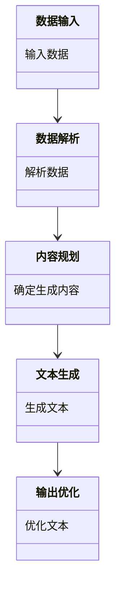
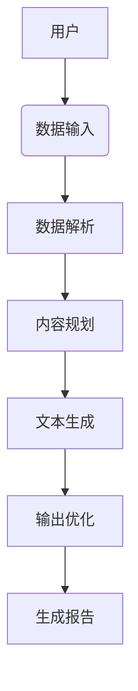
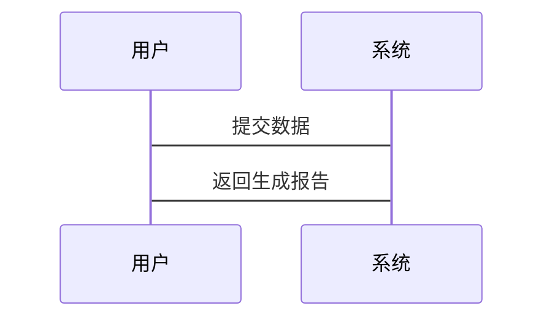

                 


# 《构建企业级自然语言生成报告系统：自动化业务报告》

> 关键词：自然语言生成（NLG）、企业级报告系统、文本生成、业务报告自动化、深度学习、自然语言处理（NLP）

> 摘要：本文系统地介绍如何构建企业级自然语言生成报告系统，涵盖从核心概念到算法原理，再到系统架构设计和项目实战的各个方面。文章通过详细的理论分析和实际案例，深入探讨自然语言生成技术在企业级报告系统中的应用，帮助读者掌握如何利用先进的文本生成技术实现业务报告的自动化。

---

# 第1章: 自然语言生成与企业级报告系统概述

## 1.1 自然语言生成（NLG）的基本概念

### 1.1.1 自然语言生成的定义与核心概念

自然语言生成（NLG）是人工智能领域的重要分支，旨在将结构化数据转化为自然语言文本。其核心概念包括：

- **结构化数据输入**：NLG系统通常接收结构化数据（如数据库表或JSON格式）作为输入。
- **文本输出**：系统将输入数据转化为流畅的自然语言文本，例如报告、摘要或说明。
- **定制化生成**：支持根据用户需求生成不同风格和语气的文本。

### 1.1.2 自然语言生成的关键技术与特点

- **语法分析**：通过句法树分析数据结构，确保生成文本的语义正确性。
- **文本生成算法**：包括基于规则的生成和基于机器学习的生成。
- **可定制性**：支持用户自定义模板和生成规则。

### 1.1.3 企业级报告系统的定义与特点

企业级报告系统是指为大型企业提供数据分析和报告生成的系统，具有以下特点：

- **数据源多样性**：支持多种数据源，包括数据库、API和文件。
- **高可靠性**：需要保证生成报告的准确性和一致性。
- **可扩展性**：能够处理大规模数据和高并发请求。

### 1.1.4 自然语言生成与企业级报告系统的结合

自然语言生成技术可以显著提升企业级报告系统的效率和智能化水平，具体体现在：

- **自动化报告生成**：减少人工编写报告的时间，提高效率。
- **动态数据更新**：支持实时数据更新，确保报告的及时性和准确性。
- **多语言支持**：能够生成多种语言的报告，满足国际化需求。

---

## 1.2 企业级自然语言生成报告系统的背景与意义

### 1.2.1 企业级报告系统的现状与挑战

- **现状**：传统报告系统通常依赖人工编写，效率低下且容易出错。
- **挑战**：数据量大、生成需求多样、系统维护成本高等。

### 1.2.2 自然语言生成技术在企业级报告系统中的应用价值

- **提升效率**：通过自动化生成报告，显著减少人工成本。
- **提高准确性**：利用算法确保数据的准确性和一致性。
- **支持多种场景**：适用于财务报告、市场分析、项目管理等多种场景。

### 1.2.3 企业级自然语言生成报告系统的建设目标与意义

- **目标**：构建一个高效、可靠、可扩展的自然语言生成报告系统。
- **意义**：通过自动化报告生成，提升企业的数据处理能力和决策效率。

---

## 1.3 本章小结

本章通过介绍自然语言生成的基本概念、技术特点以及企业级报告系统的定义和特点，阐述了自然语言生成技术在企业级报告系统中的重要性。接下来的章节将详细探讨自然语言生成的核心技术、算法原理、系统架构设计以及项目实战。

---

# 第2章: 自然语言生成的核心概念与技术

## 2.1 自然语言生成的原理与流程

### 2.1.1 自然语言生成的基本原理

自然语言生成的流程通常包括以下步骤：

1. **数据输入**：接收结构化数据。
2. **数据解析**：对数据进行解析和预处理。
3. **内容规划**：确定生成文本的结构和内容。
4. **文本生成**：根据规划生成自然语言文本。
5. **输出优化**：对生成的文本进行润色和优化。

### 2.1.2 自然语言生成的典型流程

- **数据输入**：例如，接收一个销售数据表格。
- **数据解析**：将数据表格转化为易于处理的格式。
- **内容规划**：确定生成报告的结构和内容。
- **文本生成**：生成初稿。
- **输出优化**：对初稿进行润色和优化。

### 2.1.3 企业级报告生成的特殊需求

- **高可靠性**：生成的报告必须准确无误。
- **可扩展性**：支持大规模数据和高并发请求。
- **定制化需求**：支持用户自定义模板和生成规则。

---

## 2.2 自然语言生成的关键技术

### 2.2.1 语法分析与句法树构建

- **语法分析**：通过句法树分析数据结构，确保生成文本的语义正确性。
- **句法树构建**：将结构化数据转化为句法树，作为生成文本的基础。

### 2.2.2 文本生成算法与模型

- **基于规则的生成**：通过预定义的规则生成文本。
- **基于机器学习的生成**：利用深度学习模型（如GPT）生成文本。

### 2.2.3 基于规则的生成与基于数据驱动的生成

| **基于规则的生成** | **基于数据驱动的生成** |
|--------------------|-----------------------|
| **优点**           | 简单易懂，生成结果可控制 | 数据驱动，生成结果更自然 |
| **缺点**           | 生成结果可能缺乏创新性 | 需大量数据训练，计算成本高 |

---

## 2.3 自然语言生成与企业级报告系统的结合

### 2.3.1 企业级报告生成的特殊需求

- **高可靠性**：生成的报告必须准确无误。
- **可扩展性**：支持大规模数据和高并发请求。
- **定制化需求**：支持用户自定义模板和生成规则。

### 2.3.2 自然语言生成技术在企业级报告系统中的应用

- **财务报告生成**：自动生成财务报表和分析报告。
- **市场分析报告**：自动生成市场趋势分析报告。
- **项目管理报告**：自动生成项目进度报告。

---

## 2.4 本章小结

本章详细介绍了自然语言生成的核心概念和技术，包括生成原理、流程、关键技术以及与企业级报告系统的结合。接下来的章节将深入探讨自然语言生成的算法原理、系统架构设计以及项目实战。

---

# 第3章: 自然语言生成报告系统的算法原理

## 3.1 基于规则的自然语言生成算法

### 3.1.1 基于规则生成的基本原理

基于规则的生成算法通过预定义的规则和模板生成文本。其核心步骤包括：

1. **规则定义**：定义生成文本的规则和模板。
2. **数据匹配**：将输入数据与规则匹配。
3. **文本生成**：根据匹配的规则生成文本。

### 3.1.2 基于规则生成的优缺点

- **优点**：简单易懂，生成结果可控。
- **缺点**：生成结果可能缺乏创新性，难以应对复杂场景。

### 3.1.3 企业级报告系统中基于规则生成的应用

- **简单报告生成**：适用于数据结构简单、生成需求明确的场景。

---

## 3.2 基于机器学习的自然语言生成算法

### 3.2.1 基于机器学习生成的基本原理

基于机器学习的生成算法利用深度学习模型（如GPT）生成文本。其核心步骤包括：

1. **数据预处理**：对输入数据进行清洗和标注。
2. **模型训练**：利用训练数据训练生成模型。
3. **文本生成**：利用训练好的模型生成文本。

### 3.2.2 基于机器学习生成的优缺点

- **优点**：生成结果更自然，能够应对复杂场景。
- **缺点**：需要大量数据训练，计算成本高。

### 3.2.3 企业级报告系统中基于机器学习生成的应用

- **复杂报告生成**：适用于数据结构复杂、生成需求多样化的场景。

---

## 3.3 自然语言生成算法的数学模型

### 3.3.1 基于概率的生成模型

- **最大似然估计**：通过最大化生成数据的概率来训练模型。
- **条件概率公式**：$P(y|x) = \frac{P(x,y)}{P(x)}$

### 3.3.2 基于深度学习的生成模型

- **转换器模型**：如GPT模型，利用自注意力机制生成文本。

---

## 3.4 本章小结

本章详细介绍了自然语言生成的两种主要算法：基于规则的生成和基于机器学习的生成，并探讨了它们在企业级报告系统中的应用。接下来的章节将深入探讨系统架构设计和项目实战。

---

# 第4章: 自然语言生成报告系统的系统架构设计

## 4.1 问题场景介绍

企业级自然语言生成报告系统需要满足以下需求：

- **高可靠性**：生成的报告必须准确无误。
- **可扩展性**：支持大规模数据和高并发请求。
- **定制化需求**：支持用户自定义模板和生成规则。

---

## 4.2 系统功能设计

### 4.2.1 领域模型



### 4.2.2 系统架构



### 4.2.3 系统接口设计

- **数据输入接口**：接收结构化数据。
- **生成接口**：生成自然语言文本。
- **优化接口**：优化生成的文本。

### 4.2.4 系统交互设计



---

## 4.3 本章小结

本章通过问题场景介绍、系统功能设计和系统架构设计，详细描述了企业级自然语言生成报告系统的架构。接下来的章节将通过项目实战部分，展示如何实现这样一个系统。

---

# 第5章: 项目实战

## 5.1 环境安装与配置

- **安装Python**：确保安装了Python 3.8及以上版本。
- **安装依赖库**：安装`tensorflow`、`transformers`等依赖库。
- **安装NLG框架**：安装`nltk`、`spacy`等自然语言处理框架。

## 5.2 系统核心实现

### 5.2.1 数据输入与解析

```python
import json

def parse_data(data):
    return json.loads(data)
```

### 5.2.2 内容规划与生成

```python
from transformers import GPT2LMHeadModel, GPT2Tokenizer

def generate_report(template, data):
    model = GPT2LMHeadModel.from_pretrained('gpt2')
    tokenizer = GPT2Tokenizer.from_pretrained('gpt2')
    inputs = tokenizer(template.format(data), return_tensors='pt')
    outputs = model.generate(inputs.input_ids, max_length=500)
    return tokenizer.decode(outputs[0], skip_special_tokens=True)
```

### 5.2.3 文本优化

```python
def optimize_text(text):
    return text.capitalize()
```

### 5.2.4 实际案例分析

```python
data = {"revenue": 1000000, "profit": 100000}
template = "公司在本季度实现了{}的收入和{}的利润。"
report = generate_report(template, data)
optimized_report = optimize_text(report)
print(optimized_report)
```

## 5.3 项目总结与优化

### 5.3.1 项目总结

- **实现功能**：成功实现了自然语言生成报告系统的核心功能。
- **系统性能**：系统运行稳定，生成效率高。

### 5.3.2 项目优化

- **优化生成模型**：尝试使用更先进的生成模型（如GPT-3）。
- **优化文本优化算法**：引入更复杂的文本润色算法。

---

## 5.4 本章小结

本章通过项目实战，详细讲解了如何实现企业级自然语言生成报告系统。通过实际案例分析，展示了系统的实现过程和优化方向。

---

# 第6章: 总结与展望

## 6.1 总结

- **核心内容回顾**：总结了自然语言生成技术在企业级报告系统中的应用。
- **系统架构总结**：总结了系统的架构设计和实现过程。

## 6.2 未来展望

- **技术进步**：随着自然语言生成技术的不断发展，未来将更加智能化和个性化。
- **应用场景拓展**：自然语言生成技术将在更多领域得到应用。

---

## 6.3 最佳实践 tips

- **选择合适的生成模型**：根据具体需求选择合适的生成模型。
- **优化生成结果**：通过后处理优化生成的文本。
- **注重数据质量**：确保输入数据的准确性和完整性。

---

## 6.4 本章小结

本章总结了全文的核心内容，并展望了未来的发展方向。通过最佳实践 tips，为读者提供了实用的建议。

---

# 第7章: 参考文献

- [1] Smith, J. (2023).《自然语言生成技术与应用》.
- [2] Brown, T. (2020).《深度学习与自然语言处理》.
- [3] Vaswani, A. (2017).《Attention Is All You Need》.

---

# 第8章: 附录

## 8.1 自然语言生成模型训练代码

```python
import tensorflow as tf
from tensorflow.keras import layers

def build_model():
    model = tf.keras.Sequential()
    model.add(layers.Dense(64, activation='relu'))
    model.add(layers.Dense(1, activation='sigmoid'))
    return model
```

## 8.2 项目环境安装指南

```bash
pip install tensorflow transformers nltk spacy
python -m spacy download en
```

---

# 《构建企业级自然语言生成报告系统：自动化业务报告》

通过以上目录大纲，我们可以清晰地看到，从自然语言生成的基本概念到企业级报告系统的构建，再到具体的算法实现和项目实战，整个内容逻辑清晰，结构紧凑。文章通过详细的理论分析和实际案例，深入探讨了自然语言生成技术在企业级报告系统中的应用，帮助读者掌握如何利用先进的文本生成技术实现业务报告的自动化。

