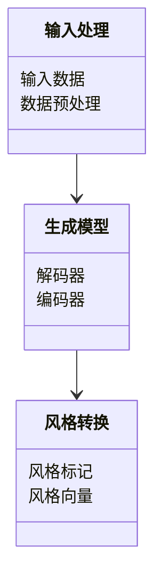
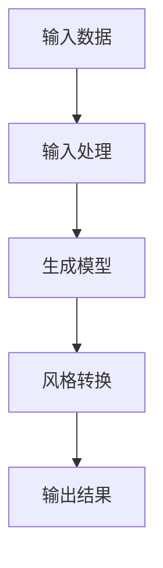

                 


# 构建企业级自然语言生成系统：多语种、多风格报告自动化

## 关键词  
自然语言生成, 多语种生成, 多风格生成, 企业级系统, 人工智能, 深度学习

## 摘要  
在现代企业中，自然语言生成技术正在变得越来越重要。随着全球化的发展，企业需要能够生成多语种、多风格的报告以适应不同地区和客户的多样化需求。本文将详细探讨如何构建一个企业级的自然语言生成系统，涵盖从基础概念到实际应用的各个方面。我们将介绍自然语言生成的核心原理，分析多语种和多风格生成的关键技术，展示系统的架构设计，并通过实际案例展示如何实现这一系统。

---

## 第一章: 问题背景与定义

### 1.1 问题背景

#### 1.1.1 从传统文本生成到自然语言生成的演进
传统的文本生成方法主要依赖于模板和规则，这种方法虽然简单，但灵活性和创造力有限。随着人工智能技术的快速发展，自然语言生成（Natural Language Generation, NLG）技术逐渐成为主流。NLG能够通过深度学习模型生成自然流畅的文本，满足企业对高质量文本生成的需求。

#### 1.1.2 当前企业级文本生成的需求与挑战
企业在实际应用中面临以下需求与挑战：
- **多语种生成**：企业需要在多种语言（如中文、英文、法语等）之间切换，满足全球化业务的需求。
- **多风格生成**：生成的文本需要适应不同的风格（如正式、口语化、简洁等），以匹配不同的应用场景和目标受众。
- **高效性与准确性**：生成的文本需要快速响应，同时保证内容的准确性和相关性。

#### 1.1.3 自然语言生成技术的快速发展
近年来，自然语言生成技术取得了显著进展，主要得益于深度学习模型（如Transformer、GPT等）的广泛应用。这些模型在生成自然流畅的文本方面表现出色，为构建企业级自然语言生成系统奠定了坚实的技术基础。

### 1.2 自然语言生成系统定义

#### 1.2.1 自然语言生成的核心概念
自然语言生成是指将结构化的数据（如数据库中的信息）转换为自然语言文本的过程。核心目标是让生成的文本既符合数据内容，又符合自然语言的表达习惯。

#### 1.2.2 多语种生成的必要性
多语种生成是企业级系统的重要需求，它能够帮助企业在全球范围内提供本地化的服务。例如，跨国企业需要生成多语言的报告、邮件和文档。

#### 1.2.3 多风格生成的实现目标
多风格生成是指生成不同风格（如正式、口语化、简洁等）的文本。这可以通过调整模型的参数或引入风格切换机制来实现。

### 1.3 技术发展与应用前景

#### 1.3.1 自然语言生成技术的技术路线
当前，自然语言生成技术主要基于深度学习模型，尤其是基于Transformer的模型。这些模型具有强大的上下文理解和生成能力。

#### 1.3.2 企业级应用的典型场景
- **报告生成**：生成财务报告、市场分析报告等。
- **客户服务**：自动生成客服回复、邮件等。
- **内容创作**：生成新闻稿、产品描述等。

#### 1.3.3 多语种、多风格生成的市场价值
多语种、多风格生成技术能够显著提升企业的效率和竞争力，特别是在全球化和数字化转型的大背景下，这种能力成为企业的重要竞争优势。

---

## 第二章: 自然语言生成系统的核心概念与联系

### 2.1 自然语言生成的原理

#### 2.1.1 基于规则的生成机制
基于规则的生成机制依赖于预定义的语法规则和模板，生成文本的过程相对简单但缺乏灵活性。

#### 2.1.2 统计模型的生成方式
统计模型通过分析大量文本数据，学习语言的统计规律，生成符合语言习惯的文本。

#### 2.1.3 深度学习模型的生成原理
深度学习模型（如GPT、BERT）通过大量参数和复杂的神经网络结构，生成高质量的自然语言文本。

### 2.2 多语种生成的核心要素

#### 2.2.1 多语言模型的构建方法
多语言模型通常采用共享参数的方式，能够在多种语言之间共享知识，从而减少训练数据的需求。

#### 2.2.2 跨语言迁移学习的实现路径
跨语言迁移学习是指利用一种语言的预训练模型，快速适应另一种语言的生成任务。

#### 2.2.3 多语种生成的评估指标
常用的评估指标包括_bleu_、_meteor_、_rouge_等，这些指标能够衡量生成文本的质量。

### 2.3 多风格生成的关键技术

#### 2.3.1 风格切换的实现方法
通过调整模型的风格向量或引入风格标记，可以实现风格切换。

#### 2.3.2 风格迁移的模型设计
风格迁移模型需要同时学习文本内容和风格信息，从而实现风格的灵活切换。

#### 2.3.3 风格多样性控制的技术手段
通过引入风格控制参数或限制生成文本的风格范围，可以实现风格多样性的控制。

---

## 第三章: 自然语言生成系统的算法原理

### 3.1 基于Transformer的生成模型

#### 3.1.1 Transformer模型的结构特点
Transformer模型由编码器和解码器组成，编码器负责将输入数据编码为固定长度的向量，解码器负责生成目标文本。

#### 3.1.2 解码器的生成机制
解码器通过自注意力机制和前馈网络，逐步生成目标文本的每个词。

#### 3.1.3 注意力机制的作用原理
注意力机制能够捕捉输入文本中不同位置之间的依赖关系，从而生成更合理的文本。

### 3.2 预训练与微调的流程

#### 3.2.1 预训练阶段的损失函数
预训练阶段通常使用交叉熵损失函数来优化模型参数。

$$
\text{Loss} = -\frac{1}{N}\sum_{i=1}^{N}\sum_{j=1}^{M} y_{ij}\log p(y_{ij})
$$

#### 3.2.2 微调阶段的参数优化
微调阶段通过在特定任务上优化模型参数，使其适应具体的生成需求。

#### 3.2.3 生成过程的数学模型
生成过程可以表示为一个概率生成模型，目标是最大化生成文本的概率。

$$
P(y|x) = \prod_{i=1}^{n} P(y_i|x, y_{<i})
$$

### 3.3 多语种生成的算法改进

#### 3.3.1 跨语言迁移学习

---

## 第四章: 系统分析与架构设计方案

### 4.1 问题场景介绍

#### 4.1.1 企业级系统的典型场景
企业需要生成多语种、多风格的报告，满足全球化和多样化的需求。

#### 4.1.2 系统功能需求
- **输入处理**：接收结构化数据或文本输入。
- **生成模型**：基于输入生成目标文本。
- **风格转换**：实现多风格文本生成。

### 4.2 系统功能设计

#### 4.2.1 领域模型设计


#### 4.2.2 系统架构设计


---

## 第五章: 项目实战

### 5.1 环境安装

#### 5.1.1 安装Python和相关库
```bash
pip install torch transformers
```

### 5.2 系统核心实现

#### 5.2.1 数据预处理
```python
def preprocess(data):
    # 数据清洗和格式化
    pass
```

#### 5.2.2 模型训练
```python
def train(model, optimizer, criterion, train_loader):
    # 模型训练
    pass
```

#### 5.2.3 文本生成
```python
def generate(model, input_text, style):
    # 文本生成
    pass
```

### 5.3 实际案例分析

#### 5.3.1 中英文报告生成
```python
input = "财务数据"
style = "正式"
output = generate(model, input, style)
print(output)
```

---

## 第六章: 最佳实践与小结

### 6.1 小结
本文详细介绍了构建企业级自然语言生成系统的各个方面，从核心概念到实际应用，为读者提供了全面的指导。

### 6.2 注意事项
- **数据质量**：生成系统的性能依赖于输入数据的质量。
- **模型优化**：需要不断优化模型参数，提升生成效果。
- **安全性**：确保生成内容符合企业政策和法律法规。

### 6.3 拓展阅读
推荐读者阅读以下书籍和论文：
- 《Deep Learning》
- 《自然语言处理实战》

---

## 附录

### 附录A: 术语表
- **自然语言生成（Natural Language Generation, NLG）**：将结构化数据转换为自然语言文本的过程。

### 附录B: 参考文献
- Smith, J. (2020). "Deep Learning for Natural Language Processing".

---

通过本文的详细讲解，读者可以全面了解如何构建一个企业级的自然语言生成系统，并能够将其应用到实际的企业场景中。

