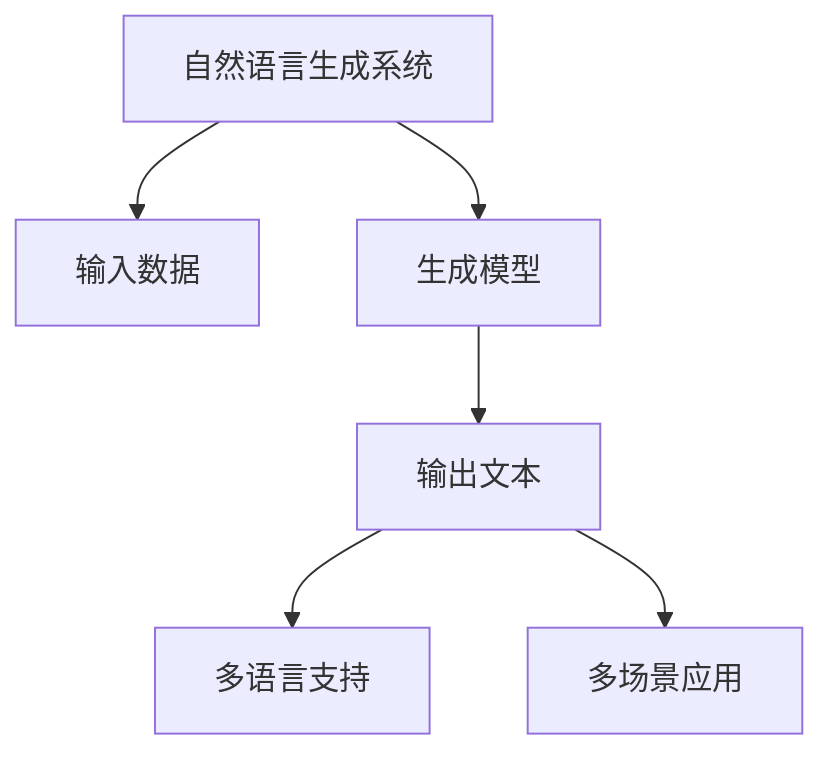
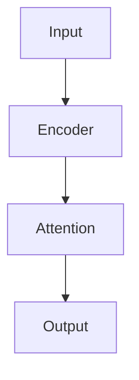

                 

---

# 构建企业级自然语言生成系统：多语言、多场景报告自动化

## 关键词：自然语言生成、企业级系统、多语言、多场景报告、自动化生成

## 摘要：本文将详细探讨如何构建一个企业级的自然语言生成系统，支持多语言和多场景的报告自动化。从基础概念到系统架构设计，从算法原理到实战项目，我们将全面解析如何利用先进的自然语言处理技术，实现高效、准确的多语言生成和多场景报告自动化。

---

# 第一部分：企业级自然语言生成系统概述

## 第1章：自然语言生成系统概述

### 1.1 问题背景与定义

#### 1.1.1 自然语言生成的定义与核心问题
自然语言生成（Natural Language Generation, NLG）是指将结构化的数据或信息转化为自然语言文本的过程。核心问题包括如何选择合适的词汇、构建合理的句子结构，以及确保生成文本的流畅性和准确性。

#### 1.1.2 企业级应用中的自然语言生成需求
企业级系统需要处理大量的结构化数据，并生成符合业务需求的自然语言文本。例如，财务报告、市场分析、客户沟通等场景都需要高效的自然语言生成能力。

#### 1.1.3 多语言与多场景报告自动化的必要性
随着全球化的发展，企业需要支持多种语言的报告生成。同时，不同场景（如财务、法律、医疗）对报告的格式和内容要求不同，自动化生成需要灵活适应这些需求。

### 1.2 自然语言生成系统的演进

#### 1.2.1 从规则驱动到数据驱动的转变
早期的自然语言生成主要依赖于规则，而现在基于深度学习的数据驱动方法已经成为主流，尤其是在大模型的出现后，生成能力得到了质的飞跃。

#### 1.2.2 大模型在自然语言生成中的应用
大模型（如GPT、BERT）通过预训练和微调，能够生成高质量的自然语言文本，显著提升了生成系统的性能和可定制性。

#### 1.2.3 企业级系统的特点与挑战
企业级系统需要高可用性、可扩展性和安全性。自然语言生成系统在企业环境中需要处理大量数据，同时满足实时性和准确性的要求。

### 1.3 应用场景与边界

#### 1.3.1 多语言场景的典型应用
- 跨语言报告生成：将同一内容生成为多种语言的报告。
- 跨语言客服系统：为全球客户提供本地化的沟通支持。

#### 1.3.2 多场景报告自动化的边界与限制
- 数据格式的标准化：不同场景可能需要不同的数据结构。
- 生成内容的合规性：生成的文本必须符合相关法规和行业标准。
- 性能限制：大规模生成可能面临计算资源的限制。

#### 1.3.3 系统的可扩展性与灵活性
企业级系统需要支持快速扩展和灵活配置，以适应不断变化的业务需求。

### 1.4 核心概念与联系

#### 1.4.1 自然语言生成的核心要素
- 输入数据：结构化或半结构化的数据，如数据库表、JSON等。
- 生成模型：基于深度学习的模型，如Transformer、扩散模型等。
- 输出文本：生成的自然语言文本，符合特定场景的需求。

#### 1.4.2 多语言与多场景的实体关系图

### 1.5 本章小结

---

# 第二部分：自然语言生成系统的核心原理

## 第2章：自然语言生成的核心原理

### 2.1 自然语言生成的生成机制

#### 2.1.1 基于统计的生成方法
早期的生成方法依赖于统计模型，如n-gram模型，通过概率计算生成文本。

#### 2.1.2 基于深度学习的生成方法
深度学习模型，如循环神经网络（RNN）、Transformer，通过复杂的网络结构捕捉上下文信息。

#### 2.1.3 基于大模型的生成机制
大模型通过预训练和微调，能够生成高质量的文本，支持多语言和多场景的应用。

### 2.2 大模型在自然语言生成中的应用

#### 2.2.1 Transformer模型的结构与特点

#### 2.2.2 解码器的自注意力机制
解码器通过自注意力机制生成文本，确保生成的句子结构合理。

#### 2.2.3 生成过程中的概率分布
生成过程基于概率分布，选择最可能的词汇组合成句子。

### 2.3 自然语言生成的训练策略

#### 2.3.1 监督学习与无监督学习
- 监督学习：使用标注数据进行训练。
- 无监督学习：利用未标注数据进行自适应学习。

#### 2.3.2 增强学习与对抗训练
增强学习通过奖励机制优化生成结果，对抗训练通过生成器-判别器框架提升生成质量。

#### 2.3.3 跨模态训练的挑战与优势
跨模态训练可以利用图像、语音等多种数据源，提升生成系统的泛化能力。

### 2.4 生成结果的评估与优化

#### 2.4.1 基于指标的评估方法
- BLEU：基于n-gram的精确度。
- ROUGE：基于召回率的评估。
- METEOR：结合准确率和流畅度的评估。

#### 2.4.2 基于人类评估的优化策略
通过人工评估生成文本的流畅度、准确性和自然度，进行优化调整。

#### 2.4.3 多语言生成的评估挑战
多语言生成需要考虑不同语言的语法和文化差异，评估指标需要适应多种语言环境。

---

## 总结

构建企业级自然语言生成系统是一个复杂而重要的任务，涉及多语言和多场景的应用需求。通过理解自然语言生成的核心原理和系统架构设计，结合实际项目中的实战经验，我们可以更好地应对各种挑战，实现高效、准确的自然语言生成。

---

接下来，我会根据上述大纲，逐步展开每一部分的内容，提供详细的讲解和具体的代码示例，帮助读者深入理解如何构建企业级自然语言生成系统。

