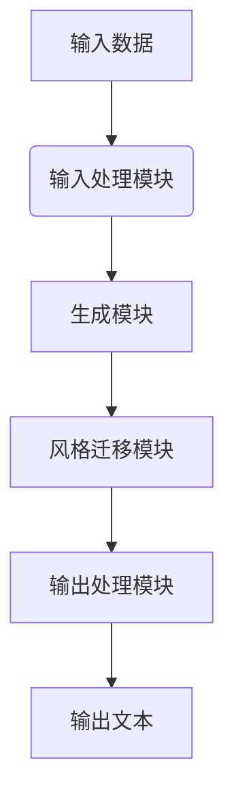

                 


# 构建企业级自然语言生成系统：多语言、多风格报告自动化

> **关键词**：自然语言生成，多语言，多风格，企业级系统，报告自动化

> **摘要**：  
> 本文旨在指导读者构建一个能够生成多语言、多风格报告的企业级自然语言生成系统。通过详细分析自然语言生成的核心原理、多语言与多风格生成的技术实现，以及企业级应用的具体需求，本文将系统地阐述如何设计和实现一个高效、可靠的自然语言生成系统。内容涵盖从理论基础到实际应用的各个环节，结合代码示例和系统架构设计，为读者提供全面的技术指导。

---

# 第一部分：背景与需求

## 第1章：背景与挑战

### 1.1 自然语言生成的背景与挑战
自然语言生成（Natural Language Generation, NLG）是人工智能领域的重要研究方向，旨在使计算机能够自动生成人类可读的文本。随着企业对自动化报告、多语言沟通和个性化内容需求的增加，NLG技术的应用场景越来越广泛。

#### 挑战
- **语言多样性**：企业需要支持多种语言的文本生成，这对模型的泛化能力提出了更高要求。
- **风格一致性**：在不同场景下，生成文本的风格需要保持一致，如正式报告、营销文案等。
- **性能优化**：企业级系统需要处理大量数据，对生成效率和资源利用率提出了严格要求。

### 1.2 企业级应用的需求
企业级自然语言生成系统需要满足以下需求：
1. **高可用性**：系统必须稳定运行，支持7×24小时的文本生成任务。
2. **多语言支持**：能够生成多种语言的文本，满足国际化企业的需求。
3. **多风格生成**：支持不同场景下的文本风格切换，如正式、口语化、技术性等。
4. **可扩展性**：系统架构应具备良好的扩展性，能够应对数据量和用户量的增长。

### 1.3 解决方案概述
通过结合深度学习技术，采用多语言模型和风格迁移算法，构建一个模块化的自然语言生成系统。系统将支持多种语言的文本生成，并通过风格迁移技术实现多风格输出，同时优化性能以满足企业级应用的需求。

---

## 第2章：问题描述与目标

### 2.1 问题描述
在企业级应用中，传统的文本生成方式效率低下，难以满足多语言、多风格的需求。具体问题包括：
- **效率问题**：传统基于规则的生成方法难以应对复杂场景。
- **语言限制**：难以支持多种语言的文本生成。
- **风格单一**：无法根据需求灵活调整文本风格。

### 2.2 实现目标
本系统的目标是实现一个多语言、多风格的自然语言生成系统，具备以下特点：
1. **多语言支持**：支持至少5种主流语言的文本生成。
2. **风格多样性**：能够根据输入参数生成不同风格的文本。
3. **高效率**：优化生成算法，提高生成速度和准确率。
4. **模块化设计**：系统架构模块化，便于扩展和维护。

### 2.3 系统边界与外延
- **输入**：系统接受结构化数据（如JSON格式）或半结构化数据，并指定生成语言和风格。
- **输出**：生成符合要求的自然语言文本，输出格式可定制。
- **交互**：系统提供API接口，支持与企业现有系统的集成。

---

## 第3章：自然语言生成模型原理

### 3.1 基于深度学习的生成模型
深度学习模型（如Transformer）在自然语言生成领域表现出色，主要通过解码器结构生成文本。

#### 解码器结构
解码器通过自注意力机制捕捉上下文信息，生成词序列表，最终得到完整的文本。

$$ \text{解码器输出} = \text{自注意力}(x) + \text{前注意力}(x) $$

#### 示例
给定输入关键词“天气”，生成一段天气预报文本。

### 3.2 多语言生成模型
多语言生成模型通过共享不同语言的嵌入层，降低训练数据的需求。

#### 多语言模型训练流程
1. 数据预处理：将多种语言的数据合并，建立统一的训练集。
2. 模型训练：使用多语言数据训练生成模型。
3. 解码阶段：根据输入语言选择对应的解码器。

### 3.3 风格迁移技术
风格迁移通过训练风格分类器和生成器，实现从一种风格到另一种风格的文本转换。

#### 风格分类器
分类器用于识别输入文本的风格特征，生成器基于这些特征生成目标风格的文本。

---

## 第4章：系统架构设计

### 4.1 系统功能模块
系统主要包括以下功能模块：
1. **输入处理模块**：接收输入数据并解析。
2. **生成模块**：根据输入生成文本。
3. **风格迁移模块**：实现不同风格的文本生成。
4. **输出处理模块**：格式化输出文本。

#### 系统模块图


### 4.2 系统架构图


---

## 第5章：算法实现与优化

### 5.1 生成模型实现
基于Transformer的生成模型实现，包括编码器和解码器部分。

#### 代码示例
```python
import tensorflow as tf

class Transformer(tf.keras.Model):
    def __init__(self, vocab_size, d_model, num_heads, num_layers):
        super(Transformer, self).__init__()
        self.embedding = tf.keras.layers.Embedding(vocab_size, d_model)
        self.encoder = Encoder(num_layers, d_model, num_heads)
        self.decoder = Decoder(num_layers, d_model, num_heads)
    
    def call(self, inputs, target):
        enc_output = self.encoder(self.embedding(inputs))
        dec_output = self.decoder(target, enc_output)
        return dec_output
```

### 5.2 风格迁移实现
通过训练风格分类器和生成器，实现风格迁移。

#### 代码示例
```python
import tensorflow as tf

class StyleClassifier(tf.keras.Model):
    def __init__(self, vocab_size, d_model, num_styles):
        super(StyleClassifier, self).__init__()
        self.embedding = tf.keras.layers.Embedding(vocab_size, d_model)
        self.fc = tf.keras.layers.Dense(num_styles, activation='softmax')
    
    def call(self, inputs):
        features = self.embedding(inputs)
        output = self.fc(features)
        return output
```

---

## 第6章：企业级应用与优化

### 6.1 应用场景
- **多语言报告生成**：跨国企业生成多语言的财务报告。
- **个性化营销文案**：根据用户特征生成不同风格的营销文案。

### 6.2 性能优化
通过优化模型压缩、使用量化技术等方法，提升生成效率。

### 6.3 系统扩展
支持更多语言和风格的扩展，增加系统的灵活性。

---

## 第7章：总结与展望

### 7.1 总结
本文系统地介绍了如何构建一个多语言、多风格的企业级自然语言生成系统，涵盖从理论到实践的各个环节。

### 7.2 展望
未来，自然语言生成技术将更加智能化，支持更复杂的场景，如实时对话生成、动态风格调整等。

---

通过以上章节的详细规划，我们可以看到构建一个企业级自然语言生成系统需要从理论到实践的全面考虑。接下来将根据这个大纲逐步展开每个章节的内容，为读者提供详细的技术指导。

