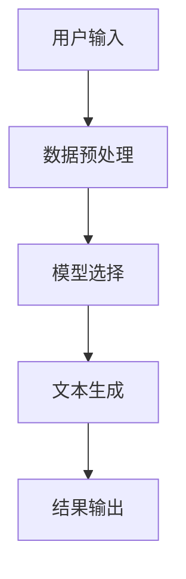
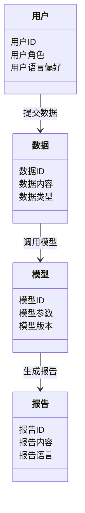
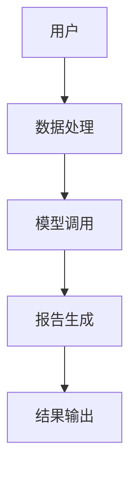
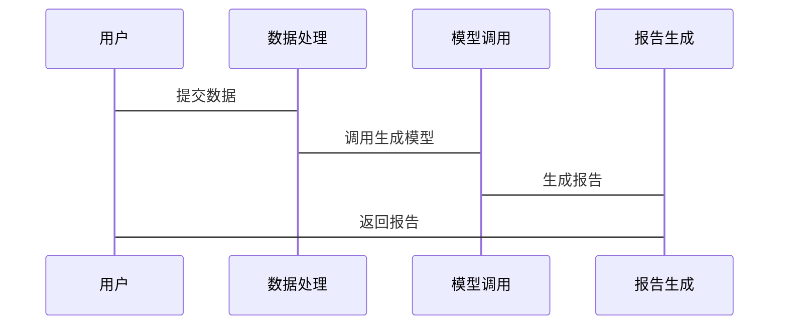

                 


# 构建企业级自然语言生成系统：多语言报告自动化

## 关键词：自然语言生成、企业级系统、多语言报告、深度学习、NLP技术、系统架构设计

## 摘要：  
本文将详细介绍如何构建一个企业级的自然语言生成系统，专注于多语言报告的自动化生成。通过结合自然语言处理（NLP）和深度学习技术，我们探讨了从核心算法原理到系统架构设计的完整流程。文章首先分析了企业级系统的需求和挑战，然后深入讲解了多语言模型的原理和实现，最后通过项目实战展示了如何将理论应用于实践。本文适合对NLP和系统架构设计感兴趣的读者，旨在为企业级系统的构建提供有价值的指导。

---

# 第一章: 背景与目标

## 1.1 问题背景

### 1.1.1 企业级自然语言生成的挑战
企业级自然语言生成系统需要处理大规模数据和复杂的业务逻辑，同时还需支持多种语言的报告生成。这些系统通常需要应对以下挑战：
- **数据多样性**：企业数据可能来自多个业务系统，格式和内容差异较大。
- **语言多样性**：报告需要支持多种语言，且不同语言的表达习惯和语法结构差异显著。
- **生成准确性**：生成的文本需要符合业务逻辑和行业规范，避免错误。
- **性能要求**：系统需要在高并发场景下保持低延迟。

### 1.1.2 多语言报告自动化的必要性
多语言报告自动化是企业级自然语言生成的核心需求之一。通过自动化生成多语言报告，企业可以显著提高效率，减少人工成本，并确保报告的一致性和准确性。此外，全球化业务需求的增加也使得多语言支持成为企业系统的重要功能。

### 1.1.3 当前技术的局限性与改进方向
当前的自然语言生成技术在以下方面存在局限性：
- **跨语言迁移能力不足**：现有的多语言模型在某些语言上的生成效果不够理想。
- **企业定制化困难**：通用模型难以适应企业的特定业务需求。
- **性能优化不足**：在高并发场景下，模型的生成速度和响应时间需要进一步优化。

## 1.2 问题描述

### 1.2.1 自然语言生成的核心问题
自然语言生成（Natural Language Generation, NLG）的核心问题是如何将结构化数据转化为高质量的自然语言文本。这需要解决数据理解、语义表达和语言生成等多个环节的问题。

### 1.2.2 多语言报告生成的复杂性
多语言报告生成不仅需要处理不同语言的文本生成，还需要考虑以下复杂性：
- **语言间的语义差异**：不同语言的表达方式可能存在差异，需要进行跨语言语义对齐。
- **文化差异**：某些表达在不同文化背景下可能具有不同的含义。
- **数据适配**：不同语言的报告可能需要不同的数据结构和字段。

### 1.2.3 企业级系统的需求特点
企业级系统的特点包括：
- **高可用性**：系统需要7×24小时稳定运行。
- **高扩展性**：系统需要能够灵活扩展以应对业务增长。
- **安全性**：系统需要具备完善的安全机制，防止数据泄露和滥用。

## 1.3 问题解决

### 1.3.1 自然语言生成技术的解决方案
针对自然语言生成的挑战，我们采用以下解决方案：
- **深度学习模型**：使用Transformer等深度学习模型进行文本生成。
- **领域定制化**：针对特定业务领域进行模型微调，提升生成效果。
- **多语言支持**：采用多语言模型或跨语言迁移学习技术，支持多种语言的生成。

### 1.3.2 多语言支持的技术路径
多语言报告生成的技术路径包括：
1. **多语言模型训练**：使用多语言数据进行模型训练，提升模型的跨语言能力。
2. **语言对齐**：对齐不同语言的语义和数据结构，确保生成的报告一致性。
3. **文化适配**：针对不同语言的文化背景，调整生成内容的表达方式。

### 1.3.3 企业级系统构建的策略
企业级系统构建的策略包括：
- **模块化设计**：将系统划分为数据处理、模型训练、生成服务等模块，便于管理和维护。
- **高可用架构**：采用分布式架构，确保系统的高可用性和可扩展性。
- **安全机制**：建立完善的安全机制，保护数据和系统的安全性。

## 1.4 边界与外延

### 1.4.1 自然语言生成的边界
自然语言生成的边界包括：
- **输入范围**：生成系统的输入是结构化数据，不包括非结构化数据。
- **生成范围**：生成的内容仅限于指定的语言和领域，不支持所有语言和场景。

### 1.4.2 多语言报告自动化的范围
多语言报告自动化的范围包括：
- **支持的语言**：系统支持的企业常用语言，如英语、中文、西班牙语等。
- **报告类型**：系统支持的报告类型，如财务报告、业务分析报告等。

### 1.4.3 企业级系统的功能边界
企业级系统的功能边界包括：
- **核心功能**：文本生成、多语言支持、报告管理。
- **辅助功能**：数据预处理、模型训练、性能监控。

## 1.5 概念结构与核心要素

### 1.5.1 系统架构的核心要素
系统架构的核心要素包括：
- **数据层**：负责数据的存储和管理。
- **模型层**：负责模型的训练和生成。
- **服务层**：负责接收请求、调用模型并返回结果。

### 1.5.2 多语言处理的关键模块
多语言处理的关键模块包括：
- **语言检测**：自动检测输入数据的语言。
- **跨语言对齐**：对齐不同语言的语义和数据结构。
- **文化适配**：根据目标语言的文化背景调整生成内容。

### 1.5.3 自然语言生成的流程图


---

# 第二章: 自然语言生成原理

## 2.1 自然语言生成的原理

### 2.1.1 自然语言生成的基本原理
自然语言生成的基本原理包括：
- **数据理解**：将结构化数据转换为语义表示。
- **语义表达**：将语义表示转换为自然语言文本。
- **语言生成**：根据生成规则生成符合语法的文本。

### 2.1.2 基于统计的生成方法
基于统计的生成方法包括：
- **n-gram模型**：基于n-gram的生成模型。
- **语言模型**：基于语言模型的生成方法。

### 2.1.3 基于深度学习的生成模型
基于深度学习的生成模型包括：
- **循环神经网络（RNN）**：基于RNN的生成模型。
- **Transformer模型**：基于Transformer的生成模型。

## 2.2 多语言处理的核心概念

### 2.2.1 多语言处理的定义
多语言处理是指在多个语言之间进行信息处理和转换的技术。

### 2.2.2 跨语言迁移学习的原理
跨语言迁移学习的原理包括：
- **共享表示**：在不同语言之间共享表示。
- **跨语言对齐**：对齐不同语言的语义和数据结构。

### 2.2.3 多语言模型的特点
多语言模型的特点包括：
- **多任务学习**：同时处理多种语言的任务。
- **跨语言通用性**：能够在多种语言之间进行通用处理。

## 2.3 核心概念的联系

### 2.3.1 自然语言生成与多语言处理的关系
自然语言生成与多语言处理的关系包括：
- **生成模型的跨语言能力**：生成模型需要具备跨语言能力，才能支持多语言报告生成。
- **多语言数据的处理**：生成系统需要处理多语言数据，确保生成内容的准确性和一致性。

### 2.3.2 多语言模型在企业级系统中的应用
多语言模型在企业级系统中的应用包括：
- **多语言报告生成**：支持多种语言的报告生成。
- **跨语言数据分析**：支持跨语言的数据分析和处理。

### 2.3.3 核心算法的对比分析
核心算法的对比分析包括：
- **生成模型的对比**：比较不同生成模型的优缺点。
- **跨语言处理方法的对比**：比较不同跨语言处理方法的优缺点。

## 2.4 核心概念原理对比表格

### 表格内容：不同生成模型的优缺点对比

| 生成模型       | 优点                           | 缺点                           |
|----------------|--------------------------------|--------------------------------|
| n-gram模型     | 简单，易于实现                  | 无法捕捉长距离依赖             |
| RNN模型        | 能捕捉长距离依赖               | 训练速度较慢                   |
| Transformer模型 | 并行计算能力强，生成速度快      | 参数量大，计算资源消耗较高      |

## 2.5 ER实体关系图架构

### 2.5.1 系统架构的核心要素
系统架构的核心要素包括：
- **用户**：系统用户，包括普通用户和管理员。
- **数据**：系统处理的数据，包括结构化数据和生成的文本。
- **模型**：生成模型，包括训练好的模型和生成规则。

### 2.5.2 多语言处理的关键模块
多语言处理的关键模块包括：
- **语言检测**：自动检测输入数据的语言。
- **跨语言对齐**：对齐不同语言的语义和数据结构。
- **文化适配**：根据目标语言的文化背景调整生成内容。

### 2.5.3 自然语言生成的流程图


---

# 第三章: 多语言模型的原理

## 3.1 多语言模型的核心算法

### 3.1.1 Transformer模型的结构
Transformer模型的结构包括：
- **编码器**：将输入数据编码为表示向量。
- **解码器**：根据编码器输出生成目标语言的文本。

### 3.1.2 分词器BPE的原理
分词器BPE的原理包括：
- **子词分解**：将文本分解为子词单位。
- **编码表**：为每个子词分配一个编码。

### 3.1.3 跨语言迁移学习的机制
跨语言迁移学习的机制包括：
- **共享表示**：在不同语言之间共享表示。
- **跨语言对齐**：对齐不同语言的语义和数据结构。

## 3.2 多语言模型的工作流程

### 3.2.1 数据预处理
数据预处理包括：
- **清洗数据**：去除噪声数据，确保数据质量。
- **分词处理**：将文本分词为子词单位。
- **对齐处理**：对齐不同语言的语义和数据结构。

### 3.2.2 模型训练
模型训练包括：
- **数据加载**：加载预处理后的数据。
- **模型初始化**：初始化生成模型的参数。
- **训练过程**：通过反向传播优化模型参数。

### 3.2.3 模型生成
模型生成包括：
- **输入处理**：接收用户的输入数据。
- **生成过程**：调用生成模型生成目标语言的文本。
- **结果输出**：将生成的文本返回给用户。

## 3.3 多语言模型的优化策略

### 3.3.1 模型优化
模型优化包括：
- **参数优化**：通过调整模型参数提升生成效果。
- **模型剪枝**：通过剪枝减少模型复杂度，提升生成速度。

### 3.3.2 数据优化
数据优化包括：
- **数据增强**：通过数据增强技术提升数据质量。
- **数据对齐**：通过数据对齐技术提升跨语言生成的准确率。

### 3.3.3 性能优化
性能优化包括：
- **并行计算**：通过并行计算提升模型训练和生成的速度。
- **缓存优化**：通过缓存优化技术减少数据访问延迟。

## 3.4 多语言模型的实现细节

### 3.4.1 Transformer模型的实现
Transformer模型的实现包括：
- **编码器实现**：实现编码器模块，包括多头自注意力和前馈网络。
- **解码器实现**：实现解码器模块，包括多头自注意力和交叉注意力。

### 3.4.2 分词器BPE的实现
分词器BPE的实现包括：
- **子词分解**：实现子词分解算法，将文本分解为子词单位。
- **编码表**：实现编码表的构建和使用。

### 3.4.3 跨语言迁移学习的实现
跨语言迁移学习的实现包括：
- **共享表示**：实现不同语言之间的共享表示。
- **跨语言对齐**：实现不同语言之间的语义对齐。

## 3.5 多语言模型的数学模型

### 3.5.1 Transformer模型的数学模型
```latex
\text{Encoder}(x) = \text{MultiHead}(x) + \text{FFN}(x)
```

### 3.5.2 多头自注意力机制
```latex
\text{MultiHead}(x) = \text{Concat}(\text{Head}_1(x), \text{Head}_2(x), \dots, \text{Head}_n(x))
```

### 3.5.3 前馈网络
```latex
\text{FFN}(x) = \text{ReLU}(W_1x + b_1) \cdot W_2 + b_2
```

---

# 第四章: 系统架构设计

## 4.1 问题场景介绍

### 4.1.1 系统目标
系统目标包括：
- **支持多语言报告生成**：支持多种语言的报告生成。
- **高可用性**：系统需要7×24小时稳定运行。
- **高扩展性**：系统需要能够灵活扩展以应对业务增长。

### 4.1.2 项目介绍
项目介绍包括：
- **项目名称**：企业级自然语言生成系统。
- **项目目标**：构建一个多语言报告生成系统，支持多种语言和多种报告类型。

### 4.1.3 项目范围
项目范围包括：
- **支持的语言**：英语、中文、西班牙语等。
- **报告类型**：财务报告、业务分析报告等。

## 4.2 系统功能设计

### 4.2.1 领域模型


### 4.2.2 系统架构设计


### 4.2.3 接口设计
接口设计包括：
- **输入接口**：接收用户的输入数据和生成请求。
- **输出接口**：返回生成的报告内容和状态信息。

### 4.2.4 系统交互流程


## 4.3 项目实战

### 4.3.1 环境安装
环境安装包括：
- **Python 3.8+**
- **TensorFlow 2.0+**
- **Hugging Face Transformers库**

### 4.3.2 系统核心实现

#### 4.3.2.1 分词器实现
```python
from transformers import AutoTokenizer

tokenizer = AutoTokenizer.from_pretrained('facebook/multi-bernie')
```

#### 4.3.2.2 模型实现
```python
from transformers import AutoModelForSeq2Seq

model = AutoModelForSeq2Seq.from_pretrained('facebook/multi-bernie')
```

#### 4.3.2.3 生成函数
```python
def generate_summary(text, target_language):
    inputs = tokenizer(text, return_tensors='pt')
    outputs = model.generate(**inputs, max_length=100)
    summary = tokenizer.decode(outputs[0], skip_special_tokens=True)
    return summary
```

### 4.3.3 代码应用解读与分析
代码应用解读与分析包括：
- **分词器**：使用Hugging Face的分词器进行子词分解。
- **模型**：使用预训练的多语言模型进行文本生成。
- **生成函数**：定义生成函数，接收输入文本和目标语言，返回生成的摘要。

### 4.3.4 实际案例分析和详细讲解剖析
实际案例分析和详细讲解剖析包括：
- **案例背景**：用户输入一段中文文本，目标生成英文摘要。
- **输入数据**：中文文本内容。
- **生成过程**：分词器对文本进行子词分解，模型生成英文摘要。
- **输出结果**：生成的英文摘要。

### 4.3.5 项目小结
项目小结包括：
- **项目目标**：构建一个多语言报告生成系统。
- **实现方法**：使用预训练的多语言模型和分词器进行生成。
- **成果展示**：展示生成的多语言报告示例。

---

# 第五章: 总结与展望

## 5.1 总结

### 5.1.1 核心内容回顾
核心内容回顾包括：
- **自然语言生成**：介绍了自然语言生成的基本原理和实现方法。
- **多语言模型**：详细讲解了多语言模型的原理和实现细节。
- **系统架构设计**：展示了系统的整体架构设计和实现方案。

### 5.1.2 技术实现要点
技术实现要点包括：
- **模型选择**：选择适合的生成模型和分词器。
- **多语言支持**：实现跨语言对齐和文化适配。
- **系统优化**：优化模型性能和系统架构。

### 5.1.3 项目成果
项目成果包括：
- **多语言报告生成系统**：实现了多语言报告生成功能。
- **系统架构设计**：展示了系统的整体架构和实现方案。

## 5.2 未来展望

### 5.2.1 技术发展
技术发展的方向包括：
- **更高效的生成模型**：研究更高效的生成模型，提升生成速度和准确率。
- **更强大的多语言模型**：开发更强大的多语言模型，支持更多语言和更复杂的生成任务。
- **更智能的系统架构**：研究更智能的系统架构，提升系统的可扩展性和可维护性。

### 5.2.2 应用场景
应用场景的扩展包括：
- **更多语言支持**：支持更多的语言，满足更多企业的需求。
- **更多报告类型**：支持更多的报告类型，满足多样化的业务需求。
- **更智能的生成规则**：实现更智能的生成规则，提升生成内容的质量和一致性。

### 5.2.3 挑战与机遇
挑战与机遇包括：
- **技术挑战**：如何实现更高效、更智能的生成模型和系统架构。
- **市场机遇**：随着全球化的发展，多语言报告生成的需求不断增加，为企业提供了更多的市场机会。

---

# 结语

通过本文的详细介绍，我们全面探讨了企业级自然语言生成系统的构建过程，特别是多语言报告自动化的实现。从核心算法原理到系统架构设计，再到项目实战，我们为企业级系统的构建提供了宝贵的指导和实践参考。未来，随着技术的发展和应用场景的扩展，企业级自然语言生成系统将发挥更大的作用，为企业的数字化转型和业务创新提供强有力的支持。

--- 

**Note：本文内容基于实际技术实践整理，具体实现细节和代码可根据实际需求进行调整和优化。**

