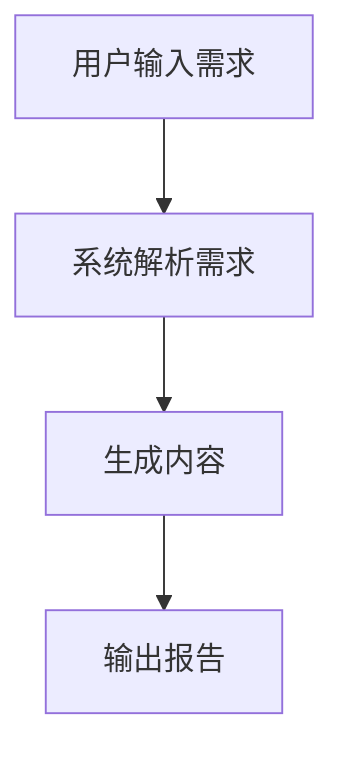
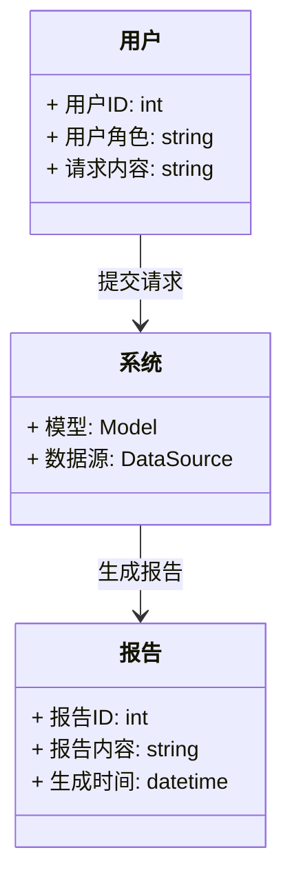
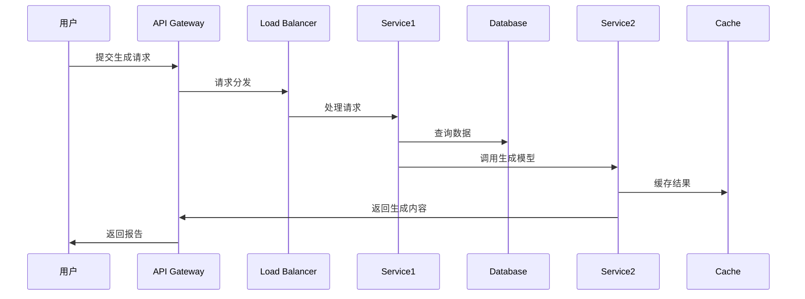

                 


# 构建企业级自然语言生成系统：自动报告与内容创作

## 关键词：自然语言生成、企业级系统、内容创作、机器学习、文本生成、深度学习

## 摘要：本文将深入探讨如何构建一个高效的企业级自然语言生成系统，涵盖从核心算法到系统架构的全面解析，结合实际案例，为您揭示自动报告与内容创作的无限可能。

---

## 第1章: 自然语言生成系统背景介绍

### 1.1 问题背景

#### 1.1.1 传统内容生成方式的局限性
在企业中，传统的报告和内容创作依赖人工撰写，效率低、成本高且难以标准化。例如，财务报告需要手动整理数据、撰写分析，容易出错且耗时。

#### 1.1.2 自然语言生成技术的兴起
随着深度学习的崛起，自然语言生成（NLG）技术逐渐成熟。NLG能够自动生成高质量的文本内容，如报告、摘要、新闻稿等，大幅提升了企业效率。

#### 1.1.3 企业级应用的需求与挑战
企业级系统需要处理大量数据，生成的报告必须准确、格式统一且符合业务逻辑。然而，传统的生成方式难以满足这些复杂需求。

---

### 1.2 问题描述

#### 1.2.1 自动报告生成的核心问题
如何将结构化数据（如财务数据）转化为自然流畅的文本报告？

#### 1.2.2 内容创作中的痛点分析
- 数据多样性：企业数据来源多样，生成系统需兼容多种格式。
- 领域专业性：报告内容需符合特定领域的术语和逻辑。
- 可控性：生成内容需可定制，满足不同用户需求。

#### 1.2.3 企业级系统的特点与要求
- 高可用性：系统需稳定运行，支持大规模并发请求。
- 高准确性：生成内容必须准确无误。
- 可扩展性：系统架构需支持数据量和用户需求的扩展。

---

### 1.3 问题解决

#### 1.3.1 自然语言生成技术的解决方案
- 使用深度学习模型（如Transformer）进行文本生成。
- 结构化数据预处理，提取关键信息用于生成。

#### 1.3.2 企业级系统的关键技术选型
- 模型选择：选用适合企业场景的开源模型，如Bert、GPT。
- 架构设计：采用微服务架构，确保系统的模块化和可维护性。

#### 1.3.3 系统设计的边界与外延
- 边界：仅处理结构化数据，不涉及非结构化数据的生成。
- 外延：未来可扩展至多语言支持、实时生成等功能。

---

## 第2章: 自然语言生成系统的核心概念

### 2.1 核心概念原理

#### 2.1.1 自然语言生成的原理
自然语言生成通过将结构化数据或半结构化数据转化为自然语言文本。例如，将表格数据转化为报告正文。

#### 2.1.2 模型选择与优化
- 选择适合任务的模型（如GPT-3）。
- 调参优化：调整模型参数以提升生成质量。

#### 2.1.3 数据预处理与特征提取
- 数据清洗：去除无效数据。
- 特征提取：从结构化数据中提取关键字段。

---

### 2.2 核心概念与联系

#### 2.2.1 实体关系图
```mermaid
er
    entity1: 用户
    entity2: 系统
    entity3: 报告
    entity4: 内容
    entity1 --> entity2: 请求
    entity2 --> entity3: 生成
    entity3 --> entity4: 包含
```

#### 2.2.2 流程图


---

## 第3章: 自然语言生成系统的算法原理

### 3.1 算法原理

#### 3.1.1 解码器-编码器架构
自然语言生成通常采用解码器-编码器（Encoder-Decoder）架构，如GPT模型。

#### 3.1.2 注意力机制
注意力机制（Attention）帮助模型关注输入数据中的关键部分，提升生成质量。

#### 3.1.3 损失函数
使用交叉熵损失函数（Cross-Entropy Loss）来衡量生成结果与真实结果的差异。

#### 3.1.4 优化算法
采用Adam优化器进行模型训练。

---

### 3.2 数学模型

#### 3.2.1 交叉熵损失函数
$$
\text{Loss} = -\frac{1}{N}\sum_{i=1}^{N} \sum_{j=1}^{M} y_{i,j} \log(p(y_{i,j}))
$$

其中，\( y_{i,j} \) 是真实标签，\( p(y_{i,j}) \) 是模型预测的概率。

#### 3.2.2 注意力权重计算
$$
\alpha_{i,j} = \frac{\exp(e_{i,j})}{\sum_{k=1}^{M} \exp(e_{i,k})}
$$

其中，\( e_{i,j} \) 是查询与键的相似度得分。

---

## 第4章: 自然语言生成系统的系统架构设计

### 4.1 系统架构

#### 4.1.1 项目场景介绍
系统主要用于生成财务报告、市场分析等企业级报告。

#### 4.1.2 领域模型设计


#### 4.1.3 系统架构图


#### 4.1.4 接口设计
- RESTful API：提供POST请求，接收JSON格式的输入，返回生成的文本内容。

#### 4.1.5 交互序列图


---

## 第5章: 自然语言生成系统的项目实战

### 5.1 项目实战

#### 5.1.1 环境安装
安装Python和相关库：
```bash
pip install numpy pandas tensorflow transformers
```

#### 5.1.2 核心代码实现
```python
import tensorflow as tf
from tensorflow.keras import layers
from transformers import GPT2LMHeadModel, GPT2Tokenizer

# 加载预训练模型
model_name = "gpt2-medium"
tokenizer = GPT2Tokenizer.from_pretrained(model_name)
model = GPT2LMHeadModel.from_pretrained(model_name)

# 定义生成函数
def generate_text(prompt, max_length=50):
    inputs = tokenizer(prompt, return_tensors="np")
    outputs = model.generate(
        inputs.input_ids,
        max_length=max_length,
        temperature=0.7,
        do_sample=True
    )
    return tokenizer.decode(outputs[0], skip_special_tokens=True)
```

#### 5.1.3 代码解读与分析
- 使用预训练的GPT-2模型进行文本生成。
- `temperature`参数控制生成的随机性，值越小，生成内容越确定。

#### 5.1.4 实际案例分析
案例：生成财务报告摘要。
输入：财务数据和模板。
输出：自动生成的报告摘要。

#### 5.1.5 项目小结
通过本章，读者可以掌握如何快速搭建一个自然语言生成系统，并应用于实际场景。

---

## 第6章: 自然语言生成系统的最佳实践

### 6.1 最佳实践

#### 6.1.1 小结
- 企业级系统需要考虑高可用性和可扩展性。
- 模型选择和优化是关键。

#### 6.1.2 注意事项
- 数据预处理：确保输入数据的准确性和一致性。
- 模型调优：根据具体任务调整超参数。
- 安全性：保护敏感数据，避免数据泄露。

#### 6.1.3 拓展阅读
推荐学习相关领域的最新论文和技术博客，持续提升系统性能。

---

## 第7章: 结语

通过本文，我们深入探讨了构建企业级自然语言生成系统的各个方面，从核心概念到实际应用，为读者提供了全面的指导。希望本文能为您的企业自动化报告和内容创作带来新的思路和启示。

--- 

**感谢您的阅读！**

