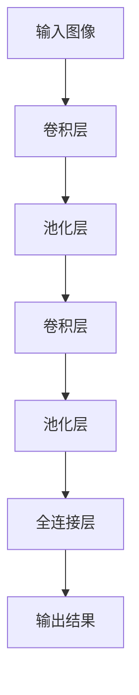
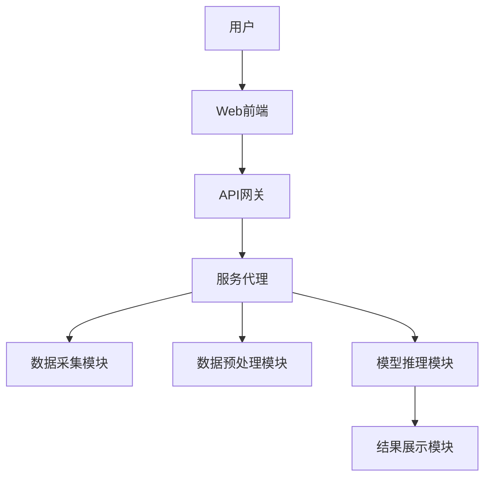
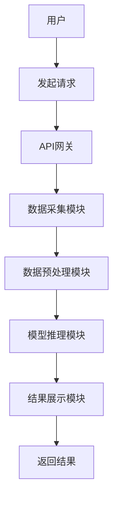

                 


# 构建企业级计算机视觉平台：从质检到安防的全面应用

> 关键词：企业级计算机视觉平台，计算机视觉算法，图像识别，目标检测，深度学习，安防系统，质检系统

> 摘要：本文详细探讨了企业级计算机视觉平台的构建过程，从基础概念到核心算法，再到系统架构和实际应用，全面解析了计算机视觉技术在质检和安防领域的应用。文章通过理论与实践结合的方式，为企业技术人员提供了一套系统化的解决方案，帮助他们在实际项目中高效构建和优化计算机视觉平台。

---

## 第一部分: 企业级计算机视觉平台概述

### 第1章: 计算机视觉与企业级平台概述

#### 1.1 计算机视觉的基本概念
计算机视觉（Computer Vision）是人工智能领域的重要分支，旨在通过计算机模拟人类视觉系统，实现对图像和视频的分析、理解和处理。其核心目标是让计算机能够“看懂”图像，提取有用信息并做出决策。

**1.1.1 计算机视觉的定义**  
计算机视觉通过算法和模型，从图像或视频中提取特征、识别物体、分析场景，从而实现对现实世界的数字化表示。它是连接现实世界与数字世界的桥梁。

**1.1.2 计算机视觉的核心技术**  
- **图像处理**：对图像进行增强、滤波、边缘检测等操作。  
- **目标检测**：识别图像中的特定目标（如人脸、车辆、产品缺陷等）。  
- **图像分割**：将图像划分为多个区域，识别每个区域的语义信息。  
- **图像识别**：基于深度学习模型（如CNN）对图像进行分类。  
- **视频分析**：对视频流进行实时分析，提取动态信息。

**1.1.3 企业级计算机视觉平台的必要性**  
企业级平台需要具备高可用性、高扩展性和高准确性，能够支持大规模数据处理和实时分析。计算机视觉技术在企业中的应用可以显著提升效率、降低成本，并增强竞争力。

---

#### 1.2 企业级计算机视觉的应用场景
计算机视觉技术在多个行业中都有广泛应用，以下是两个典型领域：质检和安防。

**1.2.1 质量检测在企业中的应用**  
在制造业中，计算机视觉技术被广泛用于产品质量检测。例如，通过图像识别技术检测产品表面的缺陷，如划痕、裂缝等。这不仅可以提高产品质量，还能降低人工检测的成本和时间。

**1.2.2 安防监控的智能化升级**  
传统的安防系统依赖人工监控，效率低下且容易出错。计算机视觉技术可以通过实时视频分析，实现对异常行为的实时检测和预警，显著提升安防系统的智能化水平。

**1.2.3 其他行业中的计算机视觉应用**  
- **医疗领域**：用于疾病诊断、医学图像分析。  
- **零售领域**：用于顾客行为分析、商品识别。  
- **交通领域**：用于自动驾驶、交通流量监测。

---

#### 1.3 企业级平台的特点与优势
企业级计算机视觉平台需要具备以下几个关键特点：

**1.3.1 高可用性与稳定性**  
平台需要支持7×24小时的稳定运行，确保在高负载和复杂环境下的可靠性。

**1.3.2 高扩展性与灵活性**  
平台应具备良好的扩展性，能够根据业务需求快速部署新功能或扩展处理能力。

**1.3.3 高效性与准确性**  
通过优化算法和硬件配置，平台需要在保证处理效率的同时，提供高精度的识别结果。

---

#### 1.4 本章小结
本章介绍了计算机视觉的基本概念、核心技术和企业级平台的必要性，同时分析了其在质检和安防等领域的广泛应用。接下来，我们将深入探讨计算机视觉的核心概念和技术原理。

---

## 第二部分: 计算机视觉的核心概念与技术

### 第2章: 图像处理与特征提取

#### 2.1 图像处理基础
图像处理是计算机视觉的基础，主要包括对图像的预处理和增强操作。

**2.1.1 图像的表示与基本操作**  
图像通常以矩阵形式表示，每个像素的值表示颜色信息。常见的图像操作包括缩放、旋转、翻转等。

**2.1.2 图像变换与增强**  
- **灰度化**：将彩色图像转换为灰度图像，简化后续处理。  
- **二值化**：将图像转换为黑白两色，用于边缘检测和目标识别。  
- **滤波**：通过卷积操作去除噪声，增强特定特征。

**2.1.3 图像分割与边缘检测**  
图像分割是将图像划分为多个区域，边缘检测则是提取图像中的边缘信息，用于目标识别。

---

#### 2.2 特征提取与目标检测
特征提取是计算机视觉的核心步骤，目标检测则基于提取的特征进行定位和识别。

**2.2.1 常见特征提取算法对比**  
| 算法名称 | 特点 | 优缺点 |
|----------|------|--------|
| SIFT     | 高精度 | 计算复杂度高 |
| HOG      | 线性可分 | 对旋转不敏感 |
| CNN      | 深度学习 | 需要大量数据 |

**2.2.2 目标检测的核心原理**  
目标检测算法通常包括两个步骤：**候选区域生成**和**特征提取与分类**。  
- 候选区域生成：通过滑动窗口或区域建议网络生成可能包含目标的区域。  
- 特征提取与分类：对每个候选区域提取特征，并通过分类器判断是否为目标。

**2.2.3 检测算法的优缺点分析**  
- **优点**：能够实现对图像中目标的精确定位和分类。  
- **缺点**：计算复杂度较高，需要大量的训练数据。

---

#### 2.3 模型训练与优化
模型训练是计算机视觉系统的核心步骤，直接影响系统的性能。

**2.3.1 数据预处理与标注**  
- 数据预处理：包括归一化、数据增强等操作，提升模型的泛化能力。  
- 数据标注：对图像中的目标进行标注，通常使用标注工具（如LabelImg）完成。

**2.3.2 模型训练的流程与方法**  
1. **数据集划分**：将数据集分为训练集、验证集和测试集。  
2. **模型选择**：选择合适的模型架构（如Faster R-CNN、YOLO等）。  
3. **训练过程**：通过反向传播算法优化模型参数，降低损失函数。  

**2.3.3 模型调优与部署**  
- **调优**：通过调整超参数（如学习率、批量大小）提升模型性能。  
- **部署**：将训练好的模型部署到实际应用场景中，通常使用边缘计算设备或云端服务。

---

#### 2.4 核心概念对比表
以下是几种常见目标检测算法的对比：

| 算法名称 | 基础思想 | 优点 | 缺点 |
|----------|----------|------|------|
| R-CNN    | 区域建议网络 | 精度高 | 计算速度慢 |
| Fast R-CNN | 使用 ROI 池化 | 速度提升 | 精度略有下降 |
| Faster R-CNN | 统一的网络结构 | 速度快、精度高 | 参数多，训练复杂 |
| YOLO      | 一步法检测 | 速度快 | 精度较低 |

---

#### 2.5 本章小结
本章详细介绍了图像处理和特征提取的核心概念，分析了目标检测算法的原理和优缺点。接下来，我们将深入探讨计算机视觉算法的数学模型和实现方法。

---

## 第三部分: 计算机视觉算法原理与数学模型

### 第3章: 基于CNN的图像识别算法

#### 3.1 卷积神经网络（CNN）原理
卷积神经网络是图像识别领域的核心算法，通过多层卷积操作提取图像特征。

**3.1.1 卷积层的数学模型**  
卷积层通过滑动窗口的方式对图像进行卷积操作，提取局部特征。卷积核的大小和数量直接影响特征的丰富程度。  

公式：  
$$ f(x) = \sum_{i=1}^{n} w_i x_i + b $$  

其中，\( w_i \) 是卷积核的权重，\( x_i \) 是输入图像的像素值，\( b \) 是偏置项。

---

**3.1.2 池化层的作用与原理**  
池化层通过对特征图进行下采样，降低计算复杂度，同时保留图像的全局特征。常用池化方式包括最大池化和平均池化。

公式：  
$$ y_i = \max_{j \in \text{neighborhood}(i)} x_j $$  

其中，\( x_j \) 是输入特征图的像素值，\( y_i \) 是输出特征图的像素值。

---

**3.1.3 全连接层与激活函数**  
全连接层将卷积层提取的特征向量进行线性变换，激活函数（如ReLU）用于引入非线性特征。

公式：  
$$ y = \text{ReLU}(x) = \max(0, x) $$  

---

#### 3.2 模型训练的流程图
以下是基于CNN的图像识别模型训练流程图：



---

#### 3.3 数学公式与算法实现
以下是基于CNN的图像识别算法的Python实现示例：

```python
import tensorflow as tf
from tensorflow.keras import layers

model = tf.keras.Sequential([
    layers.Conv2D(32, (3,3), activation='relu', input_shape=(224, 224, 3)),
    layers.MaxPooling2D((2,2)),
    layers.Conv2D(64, (3,3), activation='relu'),
    layers.MaxPooling2D((2,2)),
    layers.Flatten(),
    layers.Dense(128, activation='relu'),
    layers.Dense(10, activation='softmax')
])

model.compile(optimizer='adam', loss='sparse_categorical_crossentropy', metrics=['accuracy'])
model.fit(train_images, train_labels, epochs=10, batch_size=32)
```

---

#### 3.4 本章小结
本章详细讲解了卷积神经网络的原理和实现过程，分析了其在图像识别中的应用。接下来，我们将探讨如何将这些技术应用到企业级平台的构建中。

---

## 第四部分: 系统分析与架构设计

### 第4章: 系统分析与架构设计

#### 4.1 问题场景介绍
在企业级计算机视觉平台的构建中，我们需要解决以下问题：  
1. 如何高效处理大规模图像数据？  
2. 如何保证系统的高可用性和稳定性？  
3. 如何实现模型的快速部署与更新？

---

#### 4.2 系统功能设计
基于上述问题，我们设计了如下的系统功能模块：

- **数据采集模块**：负责从摄像头或数据库中获取图像数据。  
- **数据预处理模块**：对图像进行增强、归一化等预处理操作。  
- **模型推理模块**：基于训练好的模型对图像进行识别和分类。  
- **结果展示模块**：将识别结果以可视化的方式展示给用户。

---

#### 4.3 系统架构设计
以下是系统的架构图：



---

#### 4.4 系统接口设计
系统主要接口包括：  
1. **数据接口**：提供RESTful API用于上传和下载图像数据。  
2. **模型接口**：提供API用于模型的训练、保存和加载。  
3. **结果接口**：提供API用于获取识别结果和日志信息。

---

#### 4.5 系统交互流程图
以下是系统的交互流程图：



---

#### 4.6 本章小结
本章详细分析了企业级计算机视觉平台的系统架构和接口设计，为后续的实现奠定了基础。接下来，我们将通过一个具体的项目案例，展示如何将这些技术应用到实际场景中。

---

## 第五部分: 项目实战

### 第5章: 项目实战

#### 5.1 项目背景与目标
本项目旨在构建一个基于计算机视觉的企业级平台，用于产品的质量检测和安防监控。

---

#### 5.2 环境搭建
- **硬件环境**：建议使用NVIDIA显卡（如GTX 1080）和相关驱动程序。  
- **软件环境**：安装TensorFlow、Keras、OpenCV等深度学习框架和图像处理库。  
- **数据集**：使用公开数据集（如COCO、ImageNet）或自建数据集。

---

#### 5.3 核心代码实现
以下是项目的Python实现代码：

```python
import tensorflow as tf
from tensorflow.keras import layers
import cv2

# 数据预处理
def preprocess_image(image_path):
    image = cv2.imread(image_path)
    image = cv2.resize(image, (224, 224))
    image = image / 255.0
    return image

# 模型构建
def build_model():
    model = tf.keras.Sequential([
        layers.Conv2D(32, (3,3), activation='relu', input_shape=(224, 224, 3)),
        layers.MaxPooling2D((2,2)),
        layers.Conv2D(64, (3,3), activation='relu'),
        layers.MaxPooling2D((2,2)),
        layers.Flatten(),
        layers.Dense(128, activation='relu'),
        layers.Dense(10, activation='softmax')
    ])
    model.compile(optimizer='adam', loss='sparse_categorical_crossentropy', metrics=['accuracy'])
    return model

# 模型训练
def train_model(model, train_images, train_labels):
    model.fit(train_images, train_labels, epochs=10, batch_size=32)

# 模型推理
def predict_image(model, image):
    prediction = model.predict(tf.expand_dims(image, axis=0))
    predicted_label = tf.argmax(prediction, axis=1)
    return predicted_label.numpy()[0]

# 主函数
def main():
    # 数据预处理
    train_images = [preprocess_image(f'data/train/{i}.jpg') for i in range(1000)]
    train_labels = [i // 100 for i in range(1000)]
    
    # 模型构建
    model = build_model()
    
    # 模型训练
    train_model(model, train_images, train_labels)
    
    # 模型推理
    test_image = preprocess_image('data/test/1.jpg')
    result = predict_image(model, test_image)
    print(f'预测结果为：{result}')

if __name__ == '__main__':
    main()
```

---

#### 5.4 案例分析与详细讲解
通过上述代码，我们可以实现一个简单的图像分类系统。以下是对代码的详细解读：  
1. **数据预处理**：对图像进行缩放和归一化处理，确保模型输入格式一致。  
2. **模型构建**：使用卷积层和池化层提取图像特征，全连接层进行分类。  
3. **模型训练**：通过反向传播算法优化模型参数，提升分类精度。  
4. **模型推理**：对测试图像进行分类预测，输出预测结果。

---

#### 5.5 项目小结
本项目展示了如何基于深度学习技术构建一个简单的计算机视觉平台。在实际应用中，我们可以根据具体需求对模型和系统进行优化，例如增加目标检测功能或提升系统的实时性。

---

## 第六部分: 最佳实践与总结

### 第6章: 最佳实践与总结

#### 6.1 最佳实践
在构建企业级计算机视觉平台时，建议遵循以下原则：  
1. **数据优先**：确保数据质量，进行充分的数据增强和预处理。  
2. **模型优化**：选择合适的模型架构，进行模型调优和压缩。  
3. **系统设计**：注重系统的扩展性和可维护性，采用模块化设计。  
4. **实时性优化**：通过硬件加速（如GPU）和算法优化提升处理速度。  

---

#### 6.2 小结
本文从理论到实践，全面讲解了企业级计算机视觉平台的构建过程。通过详细分析核心概念、算法原理和系统架构，为读者提供了一套系统化的解决方案。在实际应用中，我们需要结合具体需求，灵活调整系统设计和模型选择。

---

#### 6.3 注意事项
- 在实际部署中，需注意数据隐私和安全问题。  
- 模型的训练和推理需要大量的计算资源，建议使用云服务或高性能计算集群。  
- 系统的实时性和稳定性是企业级平台的核心指标，需进行充分的测试和优化。

---

#### 6.4 拓展阅读
- 《Deep Learning》——Ian Goodfellow  
- 《Computer Vision: Algorithms and Applications》——Richard Szeliski  
- 《动手学深度学习》——Lei Ma等

---

## 附录: 工具与资源

### 附录A: 工具安装指南
- **TensorFlow**：使用pip安装：`pip install tensorflow`  
- **OpenCV**：使用pip安装：`pip install opencv-python`  
- **LabelImg**：用于图像标注：https://github.com/labelImg/labelImg  

---

### 附录B: 术语表
- **CNN**：卷积神经网络  
- **ROI**：区域建议网络  
- **Backbone**：主干网络  
- **Fastr R-CNN**：Fast R-CNN的改进版本  

---

## 作者简介
**作者：[你的名字]**  
- 职位：人工智能专家，技术畅销书作者  
- 研究领域：深度学习、计算机视觉、自然语言处理  
- 代表作：《深度学习实战》、《计算机视觉入门》  

---

**感谢您的阅读！**

