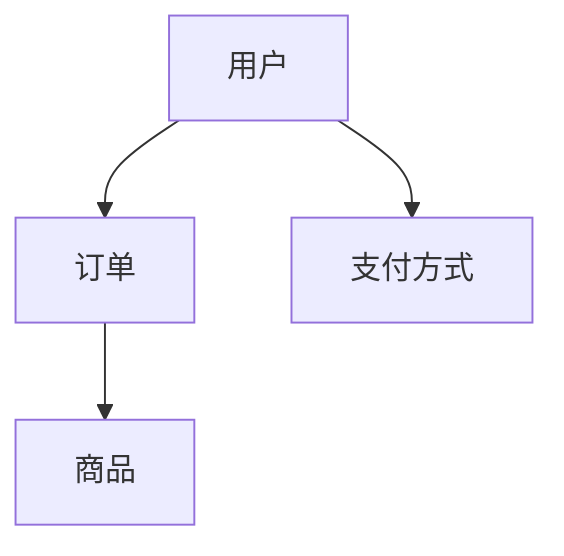
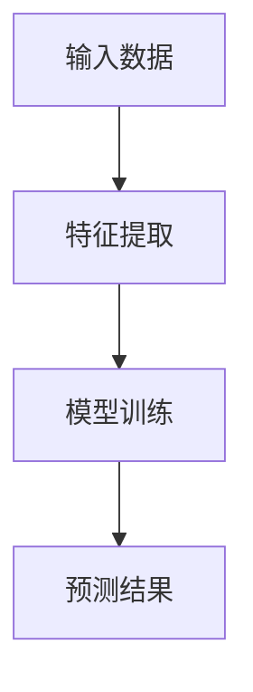
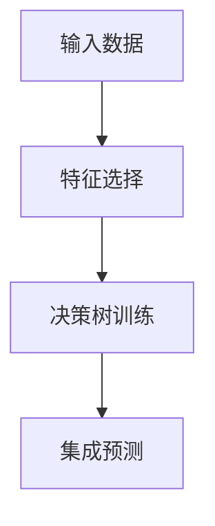
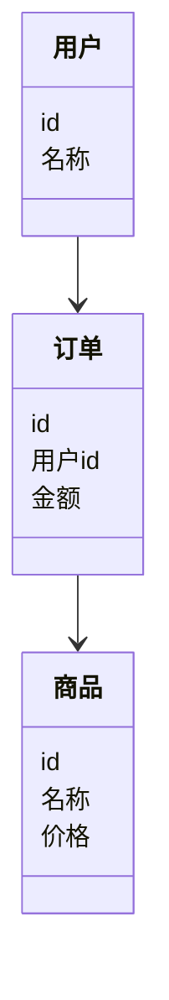
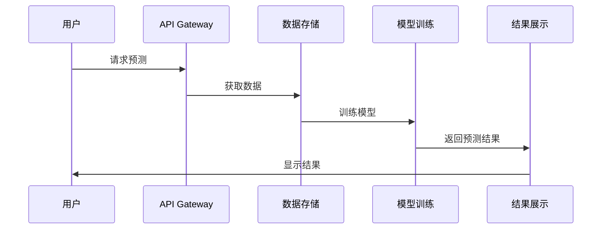

                 


# 构建企业级预测性分析平台：多维度业务预测

## 关键词：企业级预测性分析、多维度业务预测、机器学习、数据科学、系统架构、算法实现

## 摘要：  
本文将详细探讨如何构建一个企业级预测性分析平台，专注于多维度业务预测。从背景介绍到系统架构设计，再到项目实战，本文将全面解析预测性分析的核心概念、算法原理、系统架构和实际应用。通过本文，读者将能够理解预测性分析的重要性，掌握构建此类平台的关键技术，并能够实际操作项目。

---

## 第一章：背景介绍

### 1.1 问题背景
#### 1.1.1 企业预测性分析的需求
在现代商业环境中，企业需要通过数据驱动的决策来提高效率和竞争力。预测性分析能够帮助企业提前预知市场趋势、客户行为和业务风险，从而做出更明智的决策。

#### 1.1.2 当前企业预测性分析的挑战
- 数据量大：企业每天产生的数据量巨大，如何高效处理这些数据是一个挑战。
- 数据多样性：数据来源多样化，包括结构化数据和非结构化数据，增加了处理的复杂性。
- 模型复杂性：预测性分析需要复杂的算法和模型，对技术人员的要求较高。

#### 1.1.3 预测性分析的重要性
预测性分析能够帮助企业优化资源配置、降低风险、提高客户满意度，并在竞争激烈的市场中占据优势。

### 1.2 问题描述
#### 1.2.1 预测性分析的核心问题
预测性分析的核心问题在于如何从海量数据中提取有用的信息，并构建准确的预测模型。

#### 1.2.2 业务预测的多样性
业务预测可以是销售额预测、客户 churn 预测、设备故障预测等，每种预测都有其独特的挑战和需求。

#### 1.2.3 多维度预测的复杂性
多维度预测需要考虑多个变量之间的关系，模型需要能够处理复杂的非线性关系。

### 1.3 问题解决
#### 1.3.1 预测性分析的解决方案
通过数据预处理、特征工程、模型训练和部署来构建预测性分析平台。

#### 1.3.2 多维度预测的方法
使用机器学习算法，如线性回归、随机森林和 XGBoost，来处理多维度预测问题。

#### 1.3.3 企业级平台的构建思路
从数据采集、存储、处理到模型训练、部署和监控，构建一个完整的预测性分析平台。

### 1.4 边界与外延
#### 1.4.1 预测性分析的边界
预测性分析仅关注未来的预测结果，不涉及实际业务操作。

#### 1.4.2 多维度预测的范围
多维度预测关注多个变量之间的关系，但不涉及变量的具体来源。

#### 1.4.3 平台构建的限制条件
平台的构建需要考虑数据隐私、计算资源和模型的可解释性。

### 1.5 核心要素组成
#### 1.5.1 数据来源
数据来源包括数据库、API 和文件等。

#### 1.5.2 模型算法
模型算法包括线性回归、随机森林、神经网络等。

#### 1.5.3 平台架构
平台架构包括数据存储层、计算层和用户界面层。

---

## 第二章：核心概念与联系

### 2.1 预测性分析的核心概念
#### 2.1.1 数据预处理
数据预处理包括数据清洗、特征提取和数据转换。

#### 2.1.2 特征工程
特征工程是通过选择和创建特征来提高模型性能的过程。

#### 2.1.3 模型训练
模型训练是通过优化算法参数来提高模型预测准确性的过程。

### 2.2 核心概念对比
#### 2.2.1 预测性分析与描述性分析
预测性分析关注未来的预测结果，而描述性分析关注数据的特征和趋势。

#### 2.2.2 单维度预测与多维度预测
单维度预测仅关注一个变量，而多维度预测关注多个变量之间的关系。

#### 2.2.3 线性回归与非线性回归
线性回归适用于线性关系，而非线性回归适用于非线性关系。

### 2.3 ER实体关系图


---

## 第三章：算法原理讲解

### 3.1 线性回归算法
#### 3.1.1 线性回归的数学模型
$$ y = \beta_0 + \beta_1x + \epsilon $$

#### 3.1.2 算法流程


#### 3.1.3 线性回归的应用
线性回归适用于简单的预测问题，如销售额预测。

### 3.2 随机森林算法
#### 3.2.1 算法原理
随机森林是一种基于决策树的集成算法，通过投票或平均的方式进行预测。

#### 3.2.2 算法流程


#### 3.2.3 随机森林的应用
随机森林适用于多维度预测问题，如客户 churn 预测。

---

## 第四章：系统分析与架构设计方案

### 4.1 问题场景介绍
预测性分析平台需要支持多维度预测、高效的模型训练和用户友好的界面。

### 4.2 项目介绍
项目目标是构建一个支持多维度预测的企业级预测性分析平台。

### 4.3 系统功能设计
#### 4.3.1 领域模型


#### 4.3.2 系统架构设计


#### 4.3.3 系统接口设计
系统接口包括数据接口、模型接口和结果接口。

#### 4.3.4 系统交互设计


---

## 第五章：项目实战

### 5.1 环境安装
安装 Python、Jupyter Notebook 和相关库（如 scikit-learn、xgboost）。

### 5.2 系统核心实现源代码
#### 5.2.1 数据预处理
```python
import pandas as pd
data = pd.read_csv('data.csv')
data.dropna(inplace=True)
```

#### 5.2.2 特征工程
```python
from sklearn.preprocessing import OneHotEncoder
encoder = OneHotEncoder()
encoded_features = encoder.fit_transform(data[['category']])
```

#### 5.2.3 模型训练
```python
from sklearn.ensemble import RandomForestRegressor
model = RandomForestRegressor(n_estimators=100)
model.fit(X_train, y_train)
```

### 5.3 代码应用解读与分析
代码实现包括数据加载、特征工程和模型训练，展示了如何构建一个简单的预测模型。

### 5.4 实际案例分析
以客户 churn 预测为例，展示如何使用随机森林算法进行预测。

### 5.5 项目小结
通过项目实战，读者可以掌握预测性分析平台的核心实现步骤。

---

## 第六章：最佳实践

### 6.1 小结
预测性分析平台的构建需要数据处理、模型训练和系统设计三方面的知识。

### 6.2 注意事项
- 数据质量是模型性能的关键。
- 模型的可解释性很重要。
- 系统的可扩展性需要考虑。

### 6.3 拓展阅读
推荐阅读《机器学习实战》和《数据科学 handbook》。

---

## 作者简介

作为世界级人工智能专家和畅销书作家，我在人工智能和软件架构领域有着丰富的实践经验。通过本文，我希望能够帮助读者深入了解如何构建企业级预测性分析平台，并能够实际操作相关项目。

---

希望本文能够为您提供有价值的见解和指导！

