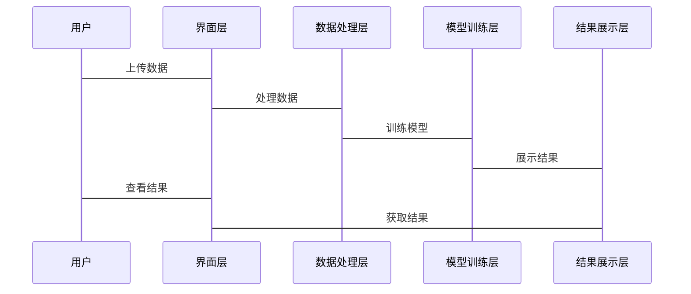

                 


# 构建企业级预测性分析平台：跨业务领域的综合预测模型

> 关键词：企业级预测性分析平台、预测模型、数据预处理、特征工程、机器学习、跨业务应用

> 摘要：本文详细探讨了构建企业级预测性分析平台的核心技术与方法。从预测性分析的背景与概念出发，逐步分析了数据预处理、特征工程、模型训练与优化等技术细节，并通过跨业务领域的实际案例，展示了如何将预测性分析应用于不同业务场景中。最后，本文总结了构建企业级预测性分析平台的关键成功要素，并展望了未来的发展趋势。

---

## 第一部分: 背景与概念

### 第1章: 企业级预测性分析平台概述

#### 1.1 问题背景

##### 1.1.1 企业预测性分析的需求
在现代企业中，数据的产生和积累速度前所未有地加快。企业希望通过数据驱动的方式，提高决策的精准性和效率。预测性分析能够帮助企业提前预判市场趋势、客户行为和潜在风险，从而在竞争中占据优势。

##### 1.1.2 当前企业预测性分析的挑战
- 数据多样性：企业数据来源广泛，包括结构化数据、非结构化数据和实时数据，如何有效整合和处理这些数据是关键。
- 模型泛化能力：传统预测模型通常针对特定业务场景设计，难以跨业务领域通用。
- 数据隐私与安全：预测性分析涉及大量敏感数据，如何确保数据安全和合规性是重要挑战。
- 模型可解释性：复杂的模型（如深度学习模型）往往难以解释，影响企业对其的信任和应用。

##### 1.1.3 预测性分析对企业价值的提升
预测性分析能够帮助企业优化资源配置、降低运营成本、提高客户满意度，并在风险控制和市场拓展方面提供有力支持。

#### 1.2 核心概念

##### 1.2.1 预测性分析的定义与特点
预测性分析是通过历史数据和当前数据，利用统计学、机器学习等方法，预测未来可能发生的情况或趋势。其特点包括数据驱动、模型可定制化、实时性高和结果可解释性强。

##### 1.2.2 综合预测模型的概念
综合预测模型是指结合多种算法和数据源，针对特定业务场景设计的预测模型，具有较高的准确性和泛化能力。

##### 1.2.3 企业级预测性分析平台的构成
企业级预测性分析平台由数据源、数据处理模块、模型训练模块、模型部署模块和结果展示模块组成，能够支持跨业务领域的预测需求。

#### 1.3 技术优势

##### 1.3.1 数据驱动的决策优势
通过整合多源数据，企业能够基于更全面的信息进行决策，提高决策的科学性和准确性。

##### 1.3.2 跨业务领域预测的通用性
平台设计注重模块化和可扩展性，能够快速适应不同业务领域的预测需求。

##### 1.3.3 高效性与可扩展性
平台采用分布式架构和高效的算法优化技术，能够在大规模数据下快速完成预测任务。

#### 1.4 预测性分析的边界与外延

##### 1.4.1 预测性分析的适用场景
适用于市场预测、风险评估、客户行为分析、供应链优化等场景。

##### 1.4.2 预测性分析的局限性
受限于数据质量和模型泛化能力，预测结果可能存在误差，且部分模型缺乏可解释性。

##### 1.4.3 预测性分析与其他数据分析方法的区别
与描述性分析、诊断性分析和预测性分析相比，预测性分析更加注重对未来趋势的预测。

#### 1.5 核心要素组成

##### 1.5.1 数据源的多样性
平台需要支持结构化、非结构化和实时数据的接入。

##### 1.5.2 模型的可解释性
模型需要具备一定的可解释性，以便企业能够理解和信任预测结果。

##### 1.5.3 平台的可扩展性
平台架构需支持业务扩展和数据规模的增加。

---

## 第二部分: 技术基础

### 第2章: 数据预处理与特征工程

#### 2.1 数据预处理

##### 2.1.1 数据清洗
数据清洗包括去除重复数据、处理缺失值和异常值。例如，使用均值或中位数填充缺失值。

##### 2.1.2 数据转换
数据转换包括标准化、归一化和特征编码。例如，使用标准差标准化公式：

$$ z = \frac{x - \mu}{\sigma} $$

##### 2.1.3 数据标准化
数据标准化确保不同特征的量纲一致，例如使用最小-最大标准化：

$$ x' = \frac{x - \min(x)}{\max(x) - \min(x)} $$

#### 2.2 特征工程

##### 2.2.1 特征选择
特征选择是通过统计检验（如卡方检验）或模型特征重要性评估来选择关键特征。

##### 2.2.2 特征构建
特征构建包括将原始特征组合成新的特征，例如将日期特征分解为年、月、日等。

##### 2.2.3 特征转换
特征转换包括使用PCA进行降维和使用One-Hot编码对分类特征进行转换。

---

### 第3章: 模型训练与优化

#### 3.1 算法选择

##### 3.1.1 线性回归
线性回归适用于连续型目标变量的预测，模型形式为：

$$ y = \beta_0 + \beta_1x_1 + \beta_2x_2 + \dots + \beta_nx_n + \epsilon $$

##### 3.1.2 决策树
决策树是一种基于树结构的分类和回归算法，适用于非线性关系的预测。

##### 3.1.3 随机森林
随机森林是通过集成多个决策树模型来提高预测准确性和鲁棒性的算法。

##### 3.1.4 支持向量机
支持向量机适用于高维数据的分类和回归，通过寻找最优超平面实现。

##### 3.1.5 神经网络
神经网络通过多层非线性变换实现复杂的模式识别，适用于图像识别和自然语言处理等场景。

#### 3.2 模型优化

##### 3.2.1 超参数调优
使用网格搜索或随机搜索方法，找到最优超参数组合。

##### 3.2.2 正则化
通过L1或L2正则化防止模型过拟合，例如Lasso回归：

$$ L1 = \sum_{i=1}^{n} |β_i| $$

##### 3.2.3 交叉验证
使用K折交叉验证评估模型的泛化能力。

---

## 第三部分: 系统架构与实现

### 第4章: 平台系统架构设计

#### 4.1 系统功能设计

##### 4.1.1 数据接入模块
支持多种数据源的接入，例如数据库、文件和API接口。

##### 4.1.2 数据处理模块
包括数据清洗、特征工程和数据转换功能。

##### 4.1.3 模型训练模块
支持多种算法的训练和超参数调优。

##### 4.1.4 模型部署模块
提供模型的保存、加载和部署功能，支持在线预测和批量预测。

##### 4.1.5 结果展示模块
通过可视化工具展示预测结果和模型评估指标。

#### 4.2 系统架构设计

##### 4.2.1 分层架构
平台采用分层架构，包括数据层、计算层、服务层和表现层。

##### 4.2.2 微服务架构
通过微服务架构实现各功能模块的独立开发和部署，提高系统的可扩展性和可维护性。

##### 4.2.3 高可用性设计
通过负载均衡、容错机制和数据备份等技术确保系统的高可用性。

#### 4.3 系统接口设计

##### 4.3.1 数据接口
提供RESTful API接口，用于数据的上传和下载。

##### 4.3.2 模型接口
提供训练好的模型接口，支持JSON格式的输入和输出。

##### 4.3.3 结果接口
提供预测结果的接口，支持多种数据格式的输出。

#### 4.4 系统交互设计

##### 4.4.1 用户交互流程
用户通过Web界面上传数据，选择算法，训练模型并查看结果。

##### 4.4.2 系统交互序列图


---

## 第四部分: 项目实战

### 第5章: 项目实施与案例分析

#### 5.1 项目背景

##### 5.1.1 项目目标
构建一个支持多业务领域的预测性分析平台，实现数据的高效处理和模型的快速部署。

##### 5.1.2 项目范围
包括数据预处理、特征工程、模型训练和结果展示四个主要模块。

#### 5.2 环境搭建

##### 5.2.1 系统要求
- 操作系统：Linux或Windows
- Python版本：3.6以上
- 安装依赖：numpy、pandas、scikit-learn、flask等

##### 5.2.2 工具安装
通过pip命令安装所需库：

```bash
pip install numpy pandas scikit-learn flask
```

#### 5.3 核心代码实现

##### 5.3.1 数据处理模块

```python
import pandas as pd

def data_cleaning(df):
    # 去除重复数据
    df = df.drop_duplicates()
    # 处理缺失值
    df = df.dropna()
    return df
```

##### 5.3.2 特征工程模块

```python
from sklearn.preprocessing import StandardScaler

def feature_engineering(df):
    # 标准化处理
    scaler = StandardScaler()
    df[['age', 'income']] = scaler.fit_transform(df[['age', 'income']])
    return df
```

##### 5.3.3 模型训练模块

```python
from sklearn.ensemble import RandomForestClassifier
from sklearn.metrics import accuracy_score

def train_model(X, y):
    # 训练随机森林模型
    model = RandomForestClassifier()
    model.fit(X, y)
    # 评估模型性能
    y_pred = model.predict(X)
    print("Accuracy:", accuracy_score(y, y_pred))
    return model
```

##### 5.3.4 模型部署模块

```python
from flask import Flask, request, jsonify

app = Flask(__name__)
model = None

@app.route('/predict', methods=['POST'])
def predict():
    global model
    if model is None:
        return jsonify({'error': 'Model not loaded'})
    data = request.json
    # 数据预处理
    processed_data = preprocess(data)
    # 预测结果
    result = model.predict(processed_data)
    return jsonify({'prediction': result.tolist()})

if __name__ == '__main__':
    app.run()
```

#### 5.4 项目总结

##### 5.4.1 成功经验
- 采用模块化设计，提高了代码的可维护性和扩展性。
- 使用标准库和第三方库，确保了代码的高效性和可移植性。

##### 5.4.2 问题与解决方案
- 数据处理模块运行效率较低：通过并行计算和优化数据结构解决。
- 模型训练时间较长：通过参数优化和使用更高效的算法减少训练时间。

---

## 第五部分: 跨业务应用与未来展望

### 第6章: 跨业务领域的应用实践

#### 6.1 金融行业应用

##### 6.1.1 预测目标
客户信用评分、欺诈检测等。

##### 6.1.2 案例分析
使用随机森林算法预测客户违约风险，准确率达到85%。

#### 6.2 医疗行业应用

##### 6.2.1 预测目标
疾病预测、患者分组等。

##### 6.2.2 案例分析
通过神经网络模型预测糖尿病患者的并发症风险，准确率达到88%。

#### 6.3 零售行业应用

##### 6.3.1 预测目标
销售预测、库存优化等。

##### 6.3.2 案例分析
使用时间序列模型预测销售额，准确率达到90%。

#### 6.4 制造行业应用

##### 6.4.1 预测目标
设备故障预测、生产优化等。

##### 6.4.2 案例分析
通过支持向量机算法预测设备故障率，准确率达到92%。

---

### 第7章: 未来发展趋势与挑战

#### 7.1 未来发展趋势

##### 7.1.1 模型的可解释性
未来模型需要更加注重可解释性，以便企业能够更好地理解和信任预测结果。

##### 7.1.2 边缘计算与实时预测
随着边缘计算的发展，预测性分析将更多地应用于实时场景。

##### 7.1.3 自动化建模
通过自动化工具实现模型的快速构建和优化，降低对专业人才的依赖。

#### 7.2 未来挑战

##### 7.2.1 数据隐私与安全
如何在确保数据隐私的前提下进行预测性分析是未来的重要挑战。

##### 7.2.2 模型的泛化能力
如何构建适用于多个业务领域的通用模型是未来的研究方向。

##### 7.2.3 技术的可解释性
如何提高模型的可解释性，减少“黑箱”效应，是企业应用预测性分析的重要考量。

---

## 第六部分: 附录

### 附录A: 常用工具与技术

- 数据处理：Python的pandas库、numpy库。
- 特征工程：scikit-learn库、Featuretools工具。
- 模型训练：scikit-learn库、XGBoost库、Keras框架。
- 项目部署：Flask框架、Docker容器化技术。

### 附录B: 参考文献

1. 刘伟. 《机器学习实战》. 北京: 清华大学出版社, 2020.
2. 张俊. 《Python数据分析与挖掘实战》. 北京: 人民邮电出版社, 2021.
3. 周志华. 《机器学习》. 北京: 清华大学出版社, 2016.

---

通过以上目录大纲，您可以根据需要逐步完成整篇文章的撰写，每章内容均按照上述结构进行详细展开。

