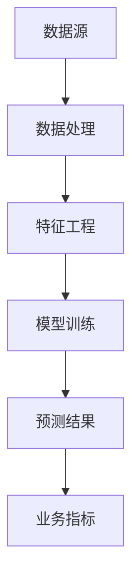
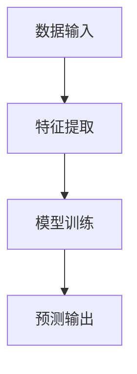
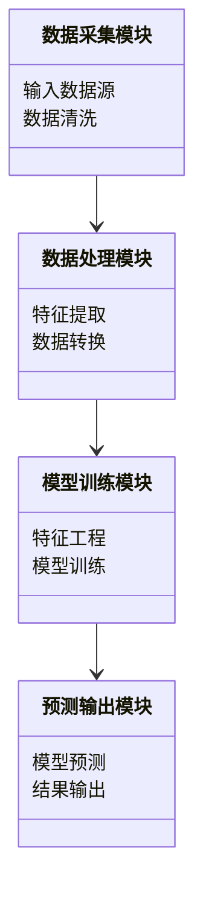
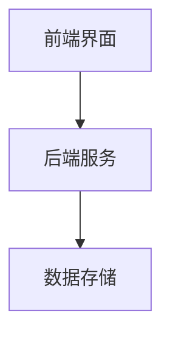
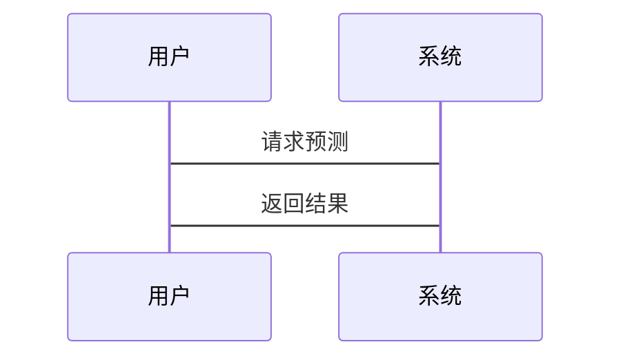

                 


# 构建企业级预测性分析平台：跨部门业务指标预测

> 关键词：企业级预测性分析、跨部门业务指标、机器学习、系统架构设计、数据科学、预测模型

> 摘要：企业级预测性分析平台是通过整合跨部门数据，利用机器学习算法和数据分析技术，对业务指标进行预测和优化的综合性系统。本文将详细介绍企业级预测性分析平台的构建过程，涵盖从核心概念到算法原理、系统架构设计，再到项目实战的全生命周期。通过本文，读者将能够理解如何设计和实现一个高效、准确的预测性分析平台，以支持企业的决策制定和业务优化。

---

# 第一部分: 企业级预测性分析平台概述

## 第1章: 企业级预测性分析平台的背景与概念

### 1.1 问题背景与挑战

#### 1.1.1 企业预测性分析的需求背景
在现代企业中，数据的爆炸式增长为企业带来了巨大的机遇，同时也带来了新的挑战。企业需要从海量数据中提取有价值的信息，以支持决策制定、业务优化和风险控制。然而，传统的数据分析方法往往局限于对历史数据的描述性分析，难以满足企业对未来的预测需求。因此，企业级预测性分析应运而生。

#### 1.1.2 传统预测性分析的局限性
传统预测性分析方法（如简单的回归分析）往往基于单个业务指标进行预测，忽略了企业内部各部门之间的关联性。这种单一维度的预测方式无法准确反映企业的整体运营状况，导致预测结果的准确性和可靠性不足。

#### 1.1.3 企业级预测性分析的必要性
企业级预测性分析通过整合跨部门数据，利用先进的机器学习算法和大数据技术，能够从多维度对企业业务指标进行预测，从而帮助企业更好地应对市场变化、优化资源配置和提升整体竞争力。

### 1.2 问题描述与目标

#### 1.2.1 预测性分析的核心问题
预测性分析的核心问题在于如何从历史数据中发现规律，并利用这些规律对未来趋势进行预测。在企业级预测性分析中，还需要考虑多个业务指标之间的相互影响，以及如何将预测结果应用到实际业务场景中。

#### 1.2.2 企业级预测性分析的目标
企业级预测性分析的目标是通过构建一个综合性的预测平台，整合企业内部各个部门的数据，利用机器学习算法对关键业务指标进行预测，并为企业的决策提供支持。

#### 1.2.3 跨部门业务指标预测的复杂性
跨部门业务指标预测的复杂性主要体现在以下几个方面：
1. 数据来源多样化，需要进行数据清洗和整合。
2. 业务指标之间的相互影响，需要构建复杂的预测模型。
3. 模型的实时更新和优化，以适应业务变化。

### 1.3 核心概念与边界

#### 1.3.1 预测性分析的定义与特征
预测性分析是指利用历史数据和机器学习算法，对未来的业务指标进行预测的过程。其核心特征包括：
- 数据驱动性：基于大量历史数据进行预测。
- 实时性：能够实时更新模型，适应业务变化。
- 可解释性：模型的预测结果需要能够被业务人员理解和解释。

#### 1.3.2 企业级预测性分析的边界
企业级预测性分析的边界主要体现在以下几个方面：
1. 数据范围：仅限于企业内部数据，不涉及外部数据。
2. 预测范围：仅限于企业内部的业务指标。
3. 应用场景：主要用于企业内部的决策支持和业务优化。

#### 1.3.3 与其他数据分析方法的区别
与其他数据分析方法（如描述性分析、诊断性分析）相比，预测性分析的核心在于“预测未来”，而不是“描述过去”或“诊断问题”。它通过分析历史数据中的模式和趋势，预测未来的业务指标。

### 1.4 本章小结
本章主要介绍了企业级预测性分析平台的背景、核心问题、目标以及与传统预测性分析的区别。通过这些内容，读者可以理解企业级预测性分析的重要性和必要性。

---

## 第2章: 企业级预测性分析平台的核心要素

### 2.1 核心概念与联系

#### 2.1.1 数据源的多样性
企业级预测性分析平台需要整合来自不同部门的数据，包括销售数据、财务数据、物流数据等。这些数据需要经过清洗、转换和整合，才能用于模型训练。

#### 2.1.2 预测模型的构建
预测模型是企业级预测性分析平台的核心部分。模型的构建需要选择合适的算法，并对数据进行特征工程、模型训练和优化。

#### 2.1.3 跨部门业务指标的关联性
跨部门业务指标之间的关联性是企业级预测性分析的核心内容。通过分析这些关联性，可以构建更复杂的预测模型，提高预测的准确性。

### 2.2 核心概念原理

#### 2.2.1 数据流的处理流程
数据流的处理流程包括数据清洗、数据转换、数据整合和数据建模四个阶段。每个阶段都需要进行详细的数据处理，以确保数据的准确性和一致性。

#### 2.2.2 模型训练与优化
模型训练与优化是构建预测模型的核心步骤。需要选择合适的算法，进行参数调优和模型评估，以提高模型的预测精度。

#### 2.2.3 业务指标预测的实现逻辑
业务指标预测的实现逻辑包括特征提取、模型选择、模型训练和预测结果输出四个步骤。每个步骤都需要进行详细的设计和实现。

### 2.3 ER实体关系图



### 2.4 本章小结
本章详细介绍了企业级预测性分析平台的核心要素，包括数据源的多样性、预测模型的构建以及跨部门业务指标的关联性。通过这些内容，读者可以理解平台的核心组成部分及其相互关系。

---

## 第3章: 预测性分析的算法原理

### 3.1 算法原理概述

#### 3.1.1 机器学习的基本概念
机器学习是一种人工智能技术，通过训练模型从数据中学习规律，并利用这些规律进行预测或分类。机器学习算法可以分为监督学习、无监督学习和半监督学习三大类。

#### 3.1.2 监督学习与无监督学习的区别
监督学习是在有标签的数据上进行训练，目标是通过训练数据学习到一个函数，能够对新的数据进行分类或回归预测。无监督学习是在无标签的数据上进行训练，目标是通过数据中的内在结构发现数据的分布规律。

#### 3.1.3 常见预测算法的分类
常见的预测算法包括线性回归、逻辑回归、决策树、随机森林、支持向量机（SVM）、神经网络等。

### 3.2 算法流程图



### 3.3 数学模型与公式

#### 3.3.1 线性回归模型
线性回归是一种简单的预测模型，适用于线性关系的场景。其数学公式为：
$$ y = \beta_0 + \beta_1x + \epsilon $$

#### 3.3.2 逻辑回归模型
逻辑回归用于分类问题，其概率公式为：
$$ P(y=1|x) = \frac{e^{\beta_0 + \beta_1x}}{1 + e^{\beta_0 + \beta_1x}} $$

#### 3.3.3 决策树模型
决策树是一种基于树状结构的预测模型，其信息增益公式为：
$$ entropy = -\sum p_i \log p_i $$

### 3.4 算法实现与案例

#### 3.4.1 简单线性回归实现
```python
import numpy as np

def simple_linear_regression(x, y):
    n = len(x)
    denominator = n * np.sum(x**2) - (np.sum(x))**2
    beta1 = (n * np.sum(x*y) - np.sum(x)*np.sum(y)) / denominator
    beta0 = (np.sum(y) - beta1 * np.sum(x)) / n
    return beta0, beta1

x = np.array([1, 2, 3, 4, 5])
y = np.array([2, 4, 5, 4, 6])
beta0, beta1 = simple_linear_regression(x, y)
print(f"模型为：y = {beta0} + {beta1}x")
```

### 3.5 本章小结
本章详细介绍了预测性分析中常用的算法及其原理，包括线性回归、逻辑回归和决策树等算法的数学公式和实现代码。通过这些内容，读者可以理解如何选择和实现合适的预测算法。

---

## 第4章: 企业级预测性分析平台的系统架构设计

### 4.1 系统功能设计

#### 4.1.1 领域模型设计
领域模型是系统设计的核心，需要涵盖数据采集、数据处理、模型训练和预测输出四个模块。



#### 4.1.2 系统功能模块
系统功能模块包括数据采集、数据处理、模型训练和预测输出四个模块。每个模块都有其特定的功能和实现方式。

### 4.2 系统架构设计

#### 4.2.1 系统架构图
系统架构设计包括前端界面、后端服务和数据存储三部分。



#### 4.2.2 系统接口设计
系统接口设计需要考虑数据输入、数据输出和模型调用三个接口。

#### 4.2.3 系统交互图
系统交互图展示了用户与系统之间的交互流程。



### 4.3 本章小结
本章详细介绍了企业级预测性分析平台的系统架构设计，包括功能模块、系统架构图和系统交互图等内容。通过这些内容，读者可以理解如何设计和实现一个高效的预测性分析平台。

---

## 第5章: 企业级预测性分析平台的项目实战

### 5.1 环境安装

#### 5.1.1 安装Python
需要安装Python 3.8及以上版本。

#### 5.1.2 安装机器学习库
需要安装scikit-learn、numpy和pandas等库。

### 5.2 系统核心实现源代码

#### 5.2.1 数据采集模块
```python
import pandas as pd

def data_collection():
    # 数据采集逻辑
    data = pd.read_csv('data.csv')
    return data

data = data_collection()
print(data.head())
```

#### 5.2.2 数据处理模块
```python
import numpy as np
from sklearn.preprocessing import StandardScaler

def data_processing(data):
    # 数据清洗和转换
    data = data.dropna()
    scaler = StandardScaler()
    processed_data = scaler.fit_transform(data)
    return processed_data

processed_data = data_processing(data)
print(processed_data)
```

#### 5.2.3 模型训练模块
```python
from sklearn.linear_model import LinearRegression

def model_training(processed_data):
    # 特征工程和模型训练
    X = processed_data[:, :-1]
    y = processed_data[:, -1]
    model = LinearRegression()
    model.fit(X, y)
    return model

model = model_training(processed_data)
print(model.coef_)
```

#### 5.2.4 预测输出模块
```python
def model_prediction(model, new_data):
    # 模型预测
    prediction = model.predict(new_data)
    return prediction

new_data = processed_data[-1, :-1].reshape(1, -1)
predicted_value = model_prediction(model, new_data)
print(predicted_value)
```

### 5.3 代码应用解读与分析

#### 5.3.1 数据采集模块解读
数据采集模块负责从数据源中读取数据，并将其存储为数据框格式。

#### 5.3.2 数据处理模块解读
数据处理模块对数据进行清洗和标准化处理，确保数据的准确性和一致性。

#### 5.3.3 模型训练模块解读
模型训练模块对数据进行特征工程处理，并利用线性回归算法进行模型训练。

#### 5.3.4 预测输出模块解读
预测输出模块利用训练好的模型对新数据进行预测，并输出预测结果。

### 5.4 实际案例分析和详细讲解剖析

#### 5.4.1 案例背景
假设我们有一个销售数据集，包括销售量、价格、广告投入等指标。

#### 5.4.2 数据处理与模型训练
对数据进行清洗和标准化处理，然后利用线性回归算法进行模型训练。

#### 5.4.3 模型评估与优化
通过交叉验证和参数调优，提高模型的预测精度。

### 5.5 项目小结
本章通过一个实际案例，详细讲解了企业级预测性分析平台的项目实现过程，包括环境安装、代码实现和案例分析等内容。通过这些内容，读者可以掌握如何将理论应用于实际项目中。

---

## 第6章: 最佳实践与总结

### 6.1 最佳实践

#### 6.1.1 数据质量管理
数据质量是预测性分析的核心，需要进行数据清洗、去重和标准化处理。

#### 6.1.2 模型优化策略
模型优化需要进行参数调优、特征选择和模型融合。

#### 6.1.3 系统维护与更新
系统需要定期更新数据和模型，以适应业务变化。

### 6.2 小结

#### 6.2.1 核心概念回顾
企业级预测性分析平台的核心概念包括数据源的多样性、预测模型的构建和跨部门业务指标的关联性。

#### 6.2.2 算法原理总结
机器学习算法是预测性分析的核心，需要选择合适的算法并进行模型优化。

#### 6.2.3 系统架构设计
系统架构设计需要考虑功能模块、接口设计和系统交互流程。

### 6.3 注意事项

#### 6.3.1 数据隐私与安全
在处理企业数据时，需要注意数据隐私和安全问题。

#### 6.3.2 模型可解释性
模型的可解释性是业务人员理解和信任预测结果的关键。

#### 6.3.3 系统性能优化
需要对系统进行性能优化，确保预测结果的实时性和准确性。

### 6.4 拓展阅读

#### 6.4.1 推荐书籍
1. 《机器学习实战》
2. 《数据挖掘导论》
3. 《企业级应用架构设计》

#### 6.4.2 推荐博客与资源
1. [Towards Data Science](https://towardsdatascience.com/)
2. [Kaggle](https://www.kaggle.com/)
3. [GitHub](https://github.com/)

### 6.5 本章小结
本章总结了企业级预测性分析平台的最佳实践，包括数据质量管理、模型优化策略和系统维护等内容。同时，还提供了拓展阅读的资源，帮助读者进一步深入学习。

---

## 第7章: 结语

企业级预测性分析平台是数据科学与人工智能技术结合的产物，它能够为企业提供精准的业务指标预测，支持企业的决策制定和业务优化。通过本文的详细介绍，读者可以掌握企业级预测性分析平台的构建过程和实现方法。未来，随着人工智能技术的不断发展，企业级预测性分析平台将发挥越来越重要的作用，为企业创造更大的价值。

--- 

# 结束

