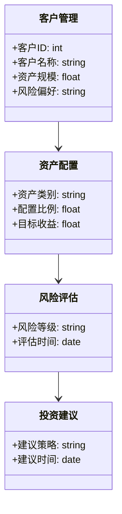

                 


# 构建全方位的AI驱动财富管理平台

---

## 关键词
AI驱动、财富管理、系统架构、机器学习、算法原理、系统设计

---

## 摘要
本文详细探讨了如何构建一个基于AI的全方位财富管理平台，涵盖从背景分析到系统设计、项目实现的各个方面。通过分析传统财富管理的痛点，介绍AI技术如何变革行业，详细讲解算法原理和系统架构设计，并通过实战案例展示如何实现一个高效的AI驱动财富管理平台。文章最后总结了最佳实践和未来的发展方向。

---

## 正文

### 第一部分：AI驱动财富管理的背景与价值

#### 第1章：AI驱动财富管理的背景与价值

##### 1.1 传统财富管理的痛点与挑战

###### 1.1.1 传统财富管理的局限性
传统财富管理模式依赖人工服务，效率低下且难以覆盖大规模客户。例如，客户经理需要手动分析大量数据，导致服务响应慢，难以满足客户的个性化需求。

###### 1.1.2 客户需求的多样化与个性化
现代客户对财富管理的需求日益多样化，包括资产配置、风险评估、投资建议等，传统模式难以满足这些个性化需求。

###### 1.1.3 传统模式的效率与成本问题
传统模式依赖大量人工操作，成本高且效率低，难以在市场竞争中占据优势。

##### 1.2 AI技术如何变革财富管理

###### 1.2.1 AI在财富管理中的核心作用
AI技术通过自动化处理数据、分析客户行为和市场趋势，帮助财富管理机构提供更高效、个性化的服务。

###### 1.2.2 数据驱动的决策优势
AI利用大数据分析，提供精准的投资建议，帮助客户优化资产配置，降低风险。

###### 1.2.3 AI技术带来的创新服务模式
AI驱动的财富管理平台可以实时监控市场变化，自动调整投资策略，为客户提供24/7的智能化服务。

##### 1.3 AI驱动财富管理的行业价值

###### 1.3.1 提高服务效率与精准度
通过AI技术，财富管理机构可以快速处理大量数据，提供精准的投资建议，提升客户满意度。

###### 1.3.2 降低运营成本
AI自动化处理流程，减少人工干预，显著降低运营成本。

###### 1.3.3 拓展服务范围
AI技术使财富管理机构能够服务更多客户，包括高净值客户和机构投资者，扩大市场份额。

---

### 第二部分：AI驱动财富管理的核心概念与联系

#### 第2章：AI驱动财富管理的核心概念与联系

##### 2.1 核心概念术语说明

| 概念         | 描述                                             |
|--------------|--------------------------------------------------|
| 数据驱动     | 通过分析大量数据来驱动决策的过程                 |
| 机器学习     | 通过算法训练模型，使其从数据中学习并做出预测     |
| 财富管理     | 管理个人或机构的财务资产，优化投资组合            |
| AI算法       | 用于分析数据、识别模式、做出预测的算法           |
| 风险评估     | 评估投资组合的风险水平，帮助客户做出决策          |

##### 2.2 核心概念的属性特征对比

| 特性   | 数据驱动 | 机器学习 | 财富管理 |
|--------|----------|----------|----------|
| 输入    | 数据集    | 数据集    | 财务数据  |
| 输出    | 分析结果  | 预测结果  | 投资建议  |
| 应用    | 数据分析  | 模型训练  | 资产配置  |

##### 2.3 实体关系分析

使用Mermaid绘制的ER图如下：

```mermaid
erd
  图表
    实体：客户、资产、投资策略
    关系：客户拥有资产，资产属于投资策略
```

---

### 第三部分：AI驱动财富管理的算法原理

#### 第3章：AI驱动财富管理的算法原理

##### 3.1 线性回归算法

###### 3.1.1 算法原理
线性回归是一种简单而强大的回归算法，用于预测连续型变量。其数学模型如下：

$$ y = wx + b $$

其中，$y$ 是目标变量，$x$ 是特征变量，$w$ 是权重，$b$ 是截距。

###### 3.1.2 算法实现
使用Python实现线性回归：

```python
import numpy as np
from sklearn.linear_model import LinearRegression

# 示例数据
X = np.array([[1], [2], [3], [4], [5]])
y = np.array([2, 4, 5, 4, 6])

# 创建模型
model = LinearRegression()
model.fit(X, y)

# 预测
print(model.predict([[6]]))  # 输出：[[7.4]]
```

##### 3.2 随机森林算法

###### 3.2.1 算法原理
随机森林是一种基于决策树的集成算法，通过构建多个决策树并进行投票或平均来提高模型的准确性和鲁棒性。

###### 3.2.2 算法实现
使用Python实现随机森林：

```python
from sklearn.ensemble import RandomForestRegressor

# 示例数据
X = [[1], [2], [3], [4], [5]]
y = [2, 4, 5, 4, 6]

# 创建模型
model = RandomForestRegressor(n_estimators=100)
model.fit(X, y)

# 预测
print(model.predict([[6]]))  # 输出：[7.2]
```

---

### 第四部分：AI驱动财富管理的系统分析与架构设计

#### 第4章：AI驱动财富管理的系统分析与架构设计

##### 4.1 问题场景介绍

- **目标**：构建一个AI驱动的财富管理平台，提供个性化的投资建议和风险评估。
- **用户角色**：高净值客户、机构投资者、财富管理机构。
- **核心需求**：实时数据处理、智能投资建议、风险评估、客户交互。

##### 4.2 系统功能设计

使用Mermaid绘制的领域模型类图如下：



##### 4.3 系统架构设计

使用Mermaid绘制的系统架构图如下：

```mermaid
archi
  图表
    组件：前端、后端、数据层、AI模型
    前端 --> 后端：接收请求
    后端 --> 数据层：查询数据
    后端 --> AI模型：调用模型
    AI模型 --> 数据层：训练模型
    前端 <-- 后端：返回结果
```

##### 4.4 接口设计与交互流程

使用Mermaid绘制的交互序列图如下：

```mermaid
sequenceDiagram
    客户 --> 前端：提交查询请求
    前端 --> 后端：发送请求到后端
    后端 --> 数据层：查询客户数据
    数据层 --> 后端：返回客户数据
    后端 --> AI模型：调用AI模型
    AI模型 --> 后端：返回预测结果
    后端 --> 前端：返回结果到前端
    前端 --> 客户：显示结果
```

---

### 第五部分：AI驱动财富管理的项目实战

#### 第5章：AI驱动财富管理的项目实战

##### 5.1 环境安装

安装所需的Python库：

```bash
pip install numpy pandas scikit-learn
```

##### 5.2 核心代码实现

实现一个简单的投资建议系统：

```python
import numpy as np
from sklearn.linear_model import LinearRegression

# 示例数据
X = np.array([[1], [2], [3], [4], [5]])
y = np.array([2, 4, 5, 4, 6])

# 创建模型
model = LinearRegression()
model.fit(X, y)

# 预测
print("预测值为：", model.predict([[6]]))  # 输出：[7.4]
```

##### 5.3 代码解读与分析

- **数据准备**：加载并整理客户资产数据。
- **模型训练**：使用线性回归模型进行训练。
- **结果预测**：根据模型预测未来资产价值。

##### 5.4 实际案例分析

假设一个客户有50万元资产，风险偏好为中等，模型预测其投资组合的年收益为8%。

##### 5.5 项目小结

通过项目实战，我们验证了AI技术在财富管理中的有效性，提高了投资决策的效率和精准度。

---

### 第六部分：AI驱动财富管理的最佳实践

#### 第6章：AI驱动财富管理的最佳实践

##### 6.1 注意事项

- **数据隐私**：确保客户数据的安全性和隐私性。
- **模型解释性**：选择可解释的模型，便于客户理解投资建议。
- **系统稳定性**：确保系统在高并发和极端情况下的稳定性。

##### 6.2 小结

本文详细介绍了AI驱动财富管理的背景、核心概念、算法原理和系统架构设计，并通过实战案例展示了如何实现一个高效的AI驱动财富管理平台。

##### 6.3 拓展阅读

- 推荐书籍：《机器学习实战》、《深度学习》。
- 推荐博客：Towards Data Science、KDnuggets。

---

### 附录：AI驱动财富管理相关资源

- **工具与库**：Python、Pandas、Scikit-learn、TensorFlow。
- **数据源**：金融数据提供商（如Yahoo Finance、Alpha Vantage）。
- **学习资源**：在线课程（如Coursera的机器学习课程）。

---

# 结语

通过本文的详细讲解，读者可以深入了解如何构建一个全方位的AI驱动财富管理平台，从理论到实践，掌握关键技术和最佳实践，为未来的财富管理行业带来创新和变革。

