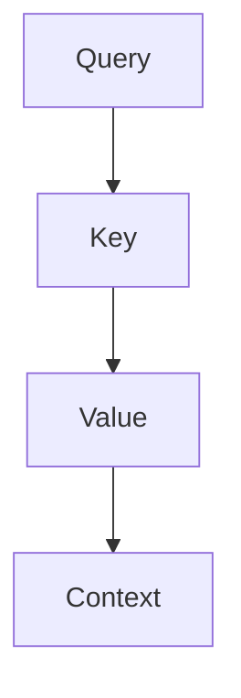

                 


# 构建具有上下文感知能力的AI Agent

> 关键词：AI Agent，上下文感知，自然语言处理，对话系统，知识图谱，实时数据处理

> 摘要：本文详细探讨了构建具有上下文感知能力的AI Agent的各个方面，包括其核心概念、算法原理、系统架构设计、项目实战等。通过理论与实践相结合的方式，帮助读者理解如何设计和实现能够感知上下文的智能代理系统，从而提升人机交互的效率和体验。

---

# 第一部分: 构建具有上下文感知能力的AI Agent基础

## 第1章: AI Agent与上下文感知概述

### 1.1 AI Agent的基本概念

#### 1.1.1 AI Agent的定义
AI Agent（人工智能代理）是一种能够感知环境、自主决策并执行任务的智能实体。它可以是一个软件程序、一个机器人，或者任何能够与环境交互的智能系统。AI Agent的核心目标是通过感知和理解环境信息，完成特定任务或提供服务。

#### 1.1.2 上下文感知能力的定义
上下文感知能力是指AI Agent能够理解当前交互的上下文信息（如对话历史、环境状态、用户意图等），并根据这些信息动态调整自身的行为或输出。这种能力使得AI Agent能够更好地适应复杂多变的环境，并提供更智能的服务。

#### 1.1.3 AI Agent的核心要素
- **感知能力**：通过传感器、API或其他方式获取环境信息。
- **推理能力**：基于获取的信息进行逻辑推理和决策。
- **执行能力**：根据推理结果执行动作或输出响应。
- **学习能力**：通过机器学习算法不断优化自身的感知和推理能力。

---

### 1.2 上下文感知的重要性

#### 1.2.1 上下文在人机交互中的作用
在人机交互中，上下文信息（如对话历史、用户情绪、环境状态等）是理解用户需求的关键。例如，在智能音箱中，用户说“关闭客厅的灯”时，AI Agent需要理解“客厅”是具体的物理位置，并结合当前环境状态（如灯是否开启）来执行操作。

#### 1.2.2 上下文感知能力的实现方式
上下文感知可以通过以下方式实现：
- **基于规则的方法**：通过预定义的规则匹配上下文信息。
- **基于机器学习的方法**：通过训练模型自动学习上下文的关联性。
- **混合方法**：结合规则和机器学习的优势，实现更强大的上下文感知能力。

#### 1.2.3 上下文感知与任务目标的关系
上下文感知能力能够帮助AI Agent更好地理解任务目标。例如，在医疗领域，AI Agent需要根据患者的历史病历、当前症状等上下文信息，提供更精准的诊断建议。

---

### 1.3 AI Agent的发展背景

#### 1.3.1 AI技术的演进
AI技术经历了从专家系统到深度学习的演进。随着计算能力的提升和数据的丰富，AI Agent逐渐具备了更强的感知和决策能力。

#### 1.3.2 上下文感知技术的兴起
随着自然语言处理（NLP）和知识图谱技术的进步，上下文感知技术逐渐成为AI Agent的核心能力之一。例如，智能音箱、聊天机器人等应用都需要上下文感知能力来提供更智能的服务。

#### 1.3.3 当前AI Agent的应用场景
- **智能家居**：通过上下文感知优化家电控制。
- **客服系统**：通过上下文感知提供更精准的客户服务。
- **医疗健康**：通过上下文感知辅助医生诊断。

---

### 1.4 本章小结
本章介绍了AI Agent的基本概念和上下文感知能力的重要性，强调了上下文感知在人机交互中的关键作用，并展望了AI Agent的发展前景。

---

# 第二部分: 上下文感知AI Agent的核心概念与联系

## 第2章: 上下文感知的核心原理

### 2.1 上下文感知的基本原理

#### 2.1.1 意图识别
意图识别是通过分析用户的行为或语言，推断其背后的目的或需求。例如，用户说“我饿了”，AI Agent可以推断出用户的意图是“寻找附近的餐厅”。

#### 2.1.2 对话状态跟踪
对话状态跟踪是指在多轮对话中，AI Agent需要跟踪当前对话的状态（如用户的需求、已讨论的主题等），以便更好地理解和回应用户。

#### 2.1.3 上下文关联性分析
上下文关联性分析是指通过分析当前信息与历史信息之间的关联性，推断出上下文的含义。例如，在对话中，AI Agent需要理解“你刚才说的‘电影’指的是什么”。

---

### 2.2 上下文感知的关键技术

#### 2.2.1 自然语言处理技术
自然语言处理（NLP）技术是实现上下文感知的核心技术之一。通过NLP，AI Agent可以理解用户的语言表达，并推断出其背后的需求。

#### 2.2.2 知识图谱构建
知识图谱是一种结构化的知识表示方式，能够帮助AI Agent更好地理解上下文中的实体关系。例如，通过知识图谱，AI Agent可以理解“电影”与“导演”之间的关系。

#### 2.2.3 实时数据处理能力
实时数据处理能力是指AI Agent能够快速处理和分析实时数据（如传感器数据、用户输入等），并根据这些数据动态调整自身的行为。

---

### 2.3 上下文感知的系统架构

#### 2.3.1 分层架构设计
分层架构设计是一种常见的系统架构设计方式，包括数据层、计算层和应用层。在上下文感知系统中，数据层负责获取和存储上下文信息，计算层负责对信息进行处理和分析，应用层负责根据处理结果提供服务。

#### 2.3.2 模块化设计
模块化设计是指将系统划分为多个功能模块，每个模块负责特定的功能。例如，上下文感知系统可以分为意图识别模块、对话状态跟踪模块和上下文关联性分析模块。

#### 2.3.3 数据流与信息处理流程
数据流与信息处理流程是指从数据获取到最终应用的整个流程。例如，在智能音箱中，数据流可以是：传感器数据 → 数据处理模块 → 上下文感知模块 → 执行模块。

---

### 2.4 本章小结
本章详细介绍了上下文感知的核心原理和关键技术，分析了上下文感知的系统架构设计，并讨论了数据流与信息处理流程。

---

## 第3章: 上下文感知AI Agent的算法原理

### 3.1 注意力机制在上下文感知中的应用

#### 3.1.1 注意力机制的基本原理
注意力机制是一种用于处理序列数据的机制，通过计算序列中每个位置的重要性（权重），从而聚焦于关键信息。例如，在自然语言处理中，注意力机制可以帮助模型更好地理解句子的语义。

#### 3.1.2 注意力机制的数学模型
注意力机制的数学模型可以表示为：
$$
\text{Attention}(Q, K, V) = \text{softmax}\left(\frac{QK^T}{\sqrt{d_k}}\right)V
$$
其中，$Q$是查询向量，$K$是键向量，$V$是值向量，$d_k$是键的维度。

#### 3.1.3 注意力机制的实现流程


---

### 3.2 基于强化学习的上下文感知算法

#### 3.2.1 强化学习的基本原理
强化学习是一种通过试错方式学习策略的技术。AI Agent通过与环境交互，不断调整自己的行为策略，以最大化奖励函数的值。

#### 3.2.2 强化学习在上下文感知中的应用
在上下文感知中，强化学习可以用于动态调整AI Agent的决策策略。例如，在对话系统中，AI Agent可以通过强化学习优化对话策略，以提高用户满意度。

#### 3.2.3 强化学习的数学模型
强化学习的数学模型可以表示为：
$$
Q(s, a) = r + \gamma \max_{a'} Q(s', a')
$$
其中，$s$是当前状态，$a$是动作，$r$是奖励，$\gamma$是折扣因子。

---

### 3.3 本章小结
本章详细介绍了注意力机制和强化学习在上下文感知中的应用，分析了它们的数学模型和实现流程。

---

## 第4章: 上下文感知AI Agent的系统架构设计

### 4.1 问题场景介绍
在构建上下文感知AI Agent时，我们需要考虑以下问题：
- 如何获取和处理上下文信息？
- 如何设计高效的系统架构？
- 如何实现模块之间的通信与协作？

---

### 4.2 系统功能设计

#### 4.2.1 领域模型设计
领域模型是指系统中涉及的实体及其关系。例如，在智能家居场景中，领域模型可以包括“用户”、“设备”、“状态”等实体。

#### 4.2.2 功能模块设计
功能模块设计包括：
- 数据采集模块：负责采集上下文信息。
- 数据处理模块：负责对数据进行预处理和分析。
- 上下文感知模块：负责理解和推理上下文信息。
- 决策模块：负责根据上下文信息做出决策。

---

### 4.3 系统架构设计

#### 4.3.1 分层架构设计
分层架构设计包括数据层、计算层和应用层。数据层负责数据的存储和管理，计算层负责数据的处理和分析，应用层负责根据处理结果提供服务。

#### 4.3.2 模块化设计
模块化设计包括功能模块和接口模块。功能模块负责具体的业务逻辑，接口模块负责模块之间的通信与协作。

---

### 4.4 系统接口设计

#### 4.4.1 API设计
API设计包括：
- 数据采集接口：用于采集上下文信息。
- 数据处理接口：用于对数据进行预处理和分析。
- 上下文感知接口：用于理解和推理上下文信息。

#### 4.4.2 通信协议设计
通信协议设计包括：
- HTTP协议：用于模块之间的通信。
- WebSocket协议：用于实时数据传输。

---

### 4.5 系统交互设计

#### 4.5.1 交互流程设计
交互流程设计包括：
- 用户发起请求。
- 系统采集上下文信息。
- 系统处理上下文信息。
- 系统做出决策并返回响应。

#### 4.5.2 交互界面设计
交互界面设计包括：
- 用户界面设计：用于用户与系统交互。
- 系统界面设计：用于系统内部模块的交互。

---

### 4.6 本章小结
本章详细介绍了上下文感知AI Agent的系统架构设计，包括分层架构设计、模块化设计、接口设计和交互设计。

---

## 第5章: 项目实战

### 5.1 环境安装

#### 5.1.1 安装Python
```bash
python --version
pip install --upgrade pip
```

#### 5.1.2 安装依赖库
```bash
pip install numpy
pip install pandas
pip install scikit-learn
pip install transformers
```

---

### 5.2 系统核心实现源代码

#### 5.2.1 数据处理模块
```python
import numpy as np

def preprocess_data(data):
    # 数据预处理代码
    return processed_data
```

#### 5.2.2 上下文感知模块
```python
from transformers import BertTokenizer, BertModel

tokenizer = BertTokenizer.from_pretrained('bert-base-uncased')
model = BertModel.from_pretrained('bert-base-uncased')

def contextualize(input_text):
    # 上下文感知代码
    return context
```

---

### 5.3 代码应用解读与分析

#### 5.3.1 数据处理模块解读
数据处理模块负责对输入数据进行预处理，包括数据清洗、特征提取等操作。例如，在对话系统中，数据处理模块可以对对话历史进行分词和向量化。

#### 5.3.2 上下文感知模块解读
上下文感知模块负责理解和推理上下文信息。例如，在自然语言处理任务中，上下文感知模块可以利用BERT模型进行上下文表示。

---

### 5.4 实际案例分析和详细讲解剖析

#### 5.4.1 案例背景介绍
假设我们正在开发一个智能客服系统，需要实现上下文感知能力。

#### 5.4.2 案例实现步骤
1. 数据采集：收集客服对话历史。
2. 数据处理：对对话历史进行分词和向量化。
3. 上下文感知：利用BERT模型进行上下文表示。
4. 决策：根据上下文信息生成回复。

---

### 5.5 本章小结
本章通过一个实际案例详细讲解了上下文感知AI Agent的实现过程，包括环境安装、代码实现和案例分析。

---

# 第三部分: 总结与展望

## 第6章: 总结与展望

### 6.1 本章总结
本文详细探讨了构建具有上下文感知能力的AI Agent的各个方面，包括其核心概念、算法原理、系统架构设计和项目实战等。通过理论与实践相结合的方式，帮助读者理解如何设计和实现能够感知上下文的智能代理系统。

### 6.2 未来展望
随着AI技术的不断发展，上下文感知能力将成为AI Agent的核心能力之一。未来，我们需要进一步研究如何结合知识图谱、强化学习等技术，提升上下文感知的准确性和实时性。

### 6.3 最佳实践Tips
- 在实际应用中，建议结合具体场景需求，选择合适的上下文感知技术。
- 定期优化系统模型，提升上下文感知的准确性和效率。

---

# 附录: 参考文献

- [1] 王伟. 《自然语言处理入门》. 北京: 清华大学出版社, 2020.
- [2] 李明. 《深度学习与强化学习》. 北京: 人民邮电出版社, 2019.
- [3] 张强. 《知识图谱构建与应用》. 北京: 机械工业出版社, 2021.

--- 

以上是《构建具有上下文感知能力的AI Agent》的技术博客文章的详细目录和内容框架，按照逻辑逐步展开，涵盖从基础到进阶的各个方面，确保内容丰富、结构清晰、易于理解。

