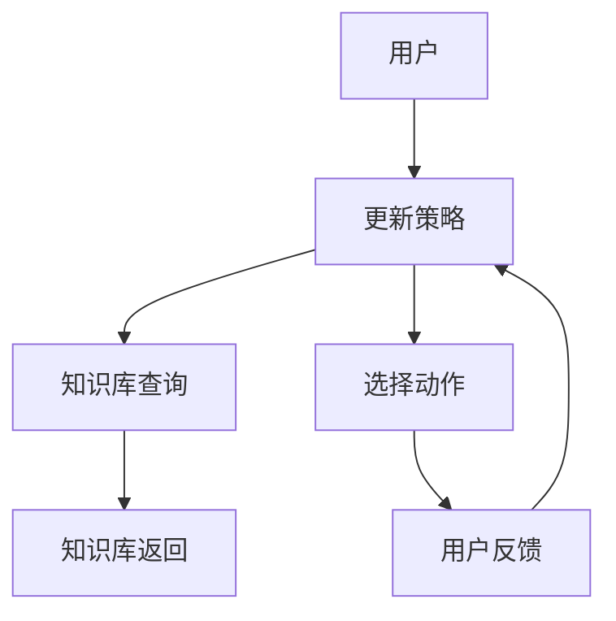
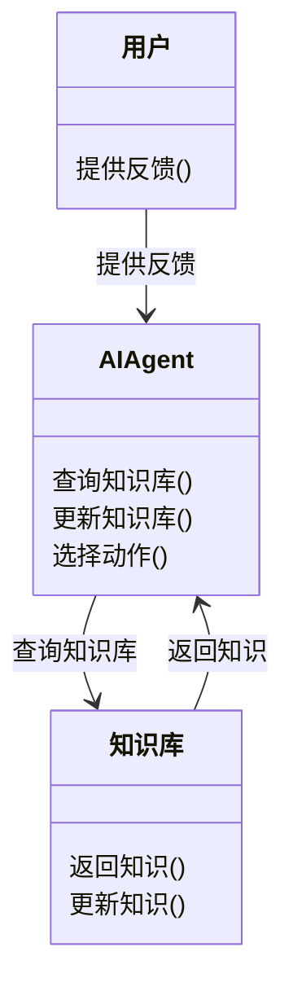

                 


# 构建具有人机协作学习能力的AI Agent系统

> 关键词：人机协作学习，AI Agent，强化学习，知识表示，系统架构，交互设计

> 摘要：本文系统地探讨了如何构建一个具有人机协作学习能力的AI Agent系统，从背景介绍、核心概念、算法原理、系统架构到项目实战，全面解析了构建该系统的各个方面。通过详细的理论分析和实际案例，本文旨在为读者提供一个清晰的构建指南，帮助他们理解并实现具有人机协作学习能力的AI Agent系统。

---

## 第一部分: 人机协作学习与AI Agent系统背景

### 第1章: 人机协作学习与AI Agent概述

#### 1.1 问题背景与问题描述
人机协作学习是一种新兴的技术，旨在通过人机协作的方式，使得AI Agent能够从人类反馈中学习并改进其性能。传统的AI系统往往依赖于预定义的规则或固定的训练数据，而人机协作学习的核心思想是通过动态的、实时的交互来优化AI的行为。

#### 1.2 人机协作学习的核心概念
- **人机协作学习的定义**：人机协作学习是一种通过人类与AI Agent之间的交互，动态更新AI的知识库和行为策略的技术。
- **AI Agent的定义**：AI Agent是一种能够感知环境、自主决策并执行任务的智能体。
- **人机协作学习与传统AI的区别**：传统AI依赖于固定的训练数据，而人机协作学习通过实时交互不断优化AI的行为。

#### 1.3 问题解决与边界
- **问题解决**：人机协作学习能够帮助AI Agent在动态环境中快速适应和优化其行为。
- **边界与外延**：人机协作学习的边界在于其依赖于人类的反馈，而外延则包括各种AI应用领域。
- **核心要素与概念结构**：人机协作学习系统的核心要素包括知识库、交互模块、学习算法和执行模块。

#### 1.4 本章小结
本章介绍了人机协作学习的基本概念和AI Agent的核心思想，为后续章节奠定了基础。

---

## 第二部分: 人机协作学习的核心概念与联系

### 第2章: 人机协作学习的原理与模型

#### 2.1 人机协作学习的基本原理
- **基于强化学习的协作机制**：通过人类的反馈（奖励或惩罚）来优化AI的行为策略。
- **知识表示与更新方法**：知识库的动态更新是人机协作学习的核心，通常采用符号表示法或概率表示法。
- **人机交互中的动态调整策略**：根据人类的反馈实时调整AI的决策策略。

#### 2.2 核心概念对比分析
| 对比维度 | 传统AI | 人机协作学习 |
|----------|--------|--------------|
| 数据来源 | 预定义数据 | 动态交互数据 |
| 决策方式 | 基于规则 | 基于学习模型 |
| 适应性 | 固定 | 动态优化 |

#### 2.3 系统架构ER图
```mermaid
er
  actor: 用户
  role: AI Agent
  entity: 知识库
  entity: 交互记录
  entity: 学习目标
  relationship:
    用户 -[提供反馈]-> AI Agent
    AI Agent -[查询/更新]-> 知识库
    AI Agent -[记录交互]-> 交互记录
    AI Agent -[更新目标]-> 学习目标
```

---

## 第三部分: 算法原理讲解

### 第3章: 人机协作学习算法的数学模型

#### 3.1 基于强化学习的协作算法
- **数学模型**：使用马尔可夫决策过程（MDP）模型，定义状态、动作、奖励和策略。
- **算法步骤**：
  1. 初始化知识库和策略模型。
  2. 用户与AI Agent进行交互，AI Agent根据当前状态选择动作。
  3. 用户对AI Agent的动作进行反馈（奖励或惩罚）。
  4. AI Agent根据反馈更新策略模型。
  5. 重复上述步骤直到达到目标。

#### 3.2 知识表示与更新算法
- **知识表示**：使用符号逻辑或概率图模型表示知识。
- **更新算法**：基于反馈的加权更新方法，公式如下：
  $$ \theta_{new} = \theta_{old} + \alpha \cdot (r - \theta_{old}) $$
  其中，$\alpha$ 是学习率，$r$ 是奖励值。

#### 3.3 实际案例分析


---

## 第四部分: 系统分析与架构设计方案

### 第4章: 问题场景与系统功能设计

#### 4.1 问题场景介绍
- **问题场景**：用户与AI Agent进行交互，AI Agent需要根据用户的反馈动态优化其行为。
- **系统功能需求**：知识库管理、交互记录、策略更新、用户反馈处理。

#### 4.2 领域模型类图


#### 4.3 系统架构设计


---

## 第五部分: 项目实战

### 第5章: 系统实现与案例分析

#### 5.1 环境安装与配置
- **环境要求**：安装Python、TensorFlow、Mermaid工具等。

#### 5.2 系统核心实现
```python
class AI_Agent:
    def __init__(self, knowledge_base):
        self.knowledge_base = knowledge_base
        self.strategy = self.default_strategy()

    def query_knowledge(self, query):
        return self.knowledge_base.query(query)

    def update_strategy(self, feedback):
        self.strategy = self.update_model(self.strategy, feedback)

    def default_strategy(self):
        # 初始化策略
        return {}

    def update_model(self, model, feedback):
        # 基于反馈更新模型
        return model + feedback
```

#### 5.3 代码解读与分析
- **知识库查询**：通过`query_knowledge`方法查询知识库。
- **策略更新**：通过`update_strategy`方法基于用户反馈更新策略模型。

#### 5.4 实际案例分析
- **案例描述**：用户与AI Agent进行交互，AI Agent根据反馈动态优化其行为。

#### 5.5 项目小结
- 成功的关键点：实时反馈机制、动态知识库更新。
- 可能遇到的问题：反馈的不一致性和延迟。

---

## 第六部分: 最佳实践与总结

### 第6章: 最佳实践与总结

#### 6.1 最佳实践
- **实时反馈的重要性**：确保用户的反馈能够及时传递给AI Agent。
- **动态知识库的维护**：定期更新和优化知识库内容。

#### 6.2 小结
- 人机协作学习的核心在于实时的交互和动态的知识更新。
- 构建一个高效的AI Agent系统需要结合算法、系统架构和用户反馈的优化。

#### 6.3 注意事项
- 确保系统的可扩展性和灵活性。
- 处理用户的反馈时要注意其多样性和不确定性。

#### 6.4 拓展阅读
- 推荐阅读关于强化学习和知识图谱的相关文献。

---

# 附录

## 附录A: 术语表
- AI Agent：智能体
- 强化学习：Reinforcement Learning
- 知识表示：Knowledge Representation

---

## 附录B: 参考文献
- Russell, S., & Norvig, P. (2010). Artificial Intelligence: A Modern Approach.
- Sutton, R. S., & Barto, A. G. (2018). Reinforcement Learning: An Introduction.

---

## 附录C: 源代码仓库
- 代码仓库地址：[GitHub](https://github.com/yourusername/ai-agent-system)

---

通过以上目录大纲，您可以开始撰写具体的正文内容，确保每章内容详细、逻辑清晰，符合技术博客的写作要求。

