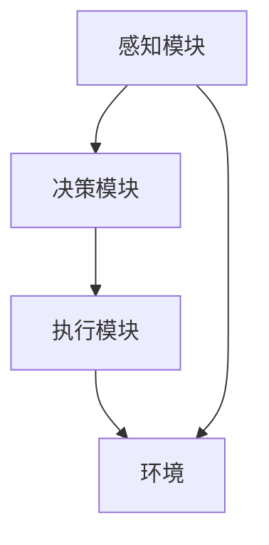
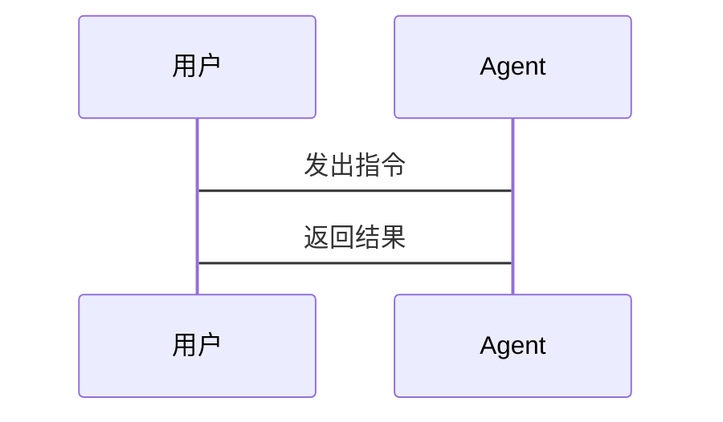

                 


# 构建具有人机协作能力的AI Agent系统

---

## 关键词：
AI Agent, 人机协作, 人工智能, 系统架构, 算法原理, 系统设计

---

## 摘要：
本文将详细介绍如何构建一个具有人机协作能力的AI Agent系统。文章从AI Agent的基本概念和背景出发，深入分析其核心概念、算法原理、系统架构以及实际项目中的实现细节。通过理论与实践相结合的方式，帮助读者理解如何设计和实现一个能够与人类有效协作的智能系统。

---

# 第一部分: AI Agent系统概述

## 第1章: AI Agent的基本概念与背景

### 1.1 AI Agent的定义与特点
AI Agent（人工智能代理）是指在计算机系统中，能够感知环境、自主决策并执行任务的智能实体。AI Agent的核心特点包括：

1. **自主性**：AI Agent能够在没有外部干预的情况下独立运行。
2. **反应性**：能够实时感知环境并做出响应。
3. **目标导向性**：通过设定目标来驱动行为。
4. **社交能力**：能够与其他Agent或人类进行交互和协作。

### 1.2 人机协作的背景与重要性
随着人工智能技术的快速发展，AI Agent在各个领域的应用越来越广泛。人机协作不仅能够提高效率，还能通过结合人类的创造力和AI的计算能力，解决更复杂的问题。

#### 1.2.1 人机协作的定义
人机协作是指人类与AI Agent共同完成任务的过程。在这个过程中，AI Agent通过分析数据、提供建议或执行具体操作，帮助人类更高效地完成目标。

#### 1.2.2 人机协作在AI Agent中的作用
- **提高效率**：AI Agent可以快速处理大量数据，帮助人类节省时间。
- **增强决策能力**：通过数据分析和预测，AI Agent为人类提供更全面的决策支持。
- **扩展能力**：AI Agent可以执行人类难以完成的复杂任务。

### 1.3 AI Agent的分类与应用场景
AI Agent可以根据功能和应用场景分为以下几类：

1. **基于任务的AI Agent**：专注于完成特定任务，如自动回复客服系统。
2. **基于知识的AI Agent**：利用知识库进行推理和决策，如智能助手。
3. **基于学习的AI Agent**：通过机器学习算法不断优化性能，如自动驾驶系统。

---

## 第2章: AI Agent系统的核心概念

### 2.1 AI Agent的构成模块
AI Agent系统通常由以下几个核心模块组成：

1. **感知模块**：负责接收外部环境的数据，如传感器输入或用户指令。
2. **决策模块**：对感知到的数据进行分析，生成决策。
3. **执行模块**：根据决策结果执行具体操作。

#### 2.1.1 感知模块
感知模块是AI Agent与外界交互的第一道屏障。它通过传感器、摄像头或其他输入设备获取数据，并将其转化为系统可以处理的形式。

#### 2.1.2 决策模块
决策模块是AI Agent的核心，负责根据感知到的信息生成行动计划。常见的决策算法包括强化学习和监督学习。

#### 2.1.3 执行模块
执行模块负责将决策模块生成的指令转化为实际操作，如机器人执行动作或系统发送邮件。

### 2.2 人机协作的核心机制
为了实现有效的协作，AI Agent需要具备以下核心机制：

1. **信息交互机制**：确保人类与AI Agent之间能够实时交换信息。
2. **共同决策机制**：结合人类的判断和AI的计算结果，做出最优决策。
3. **反馈优化机制**：根据人类的反馈不断优化AI Agent的行为。

### 2.3 AI Agent与人类协作的边界与外延
AI Agent与人类协作的边界是指AI Agent能够独立完成的任务范围。外延则是指AI Agent能够辅助人类完成的任务范围。

#### 2.3.1 协作边界
AI Agent的协作边界通常包括以下内容：
- **自主决策任务**：如自动驾驶中的路径规划。
- **辅助决策任务**：如医疗诊断系统中的病情分析。

#### 2.3.2 协作外延
AI Agent的协作外延是指AI Agent能够影响的领域，如：
- **数据处理**：如自动整理和分析数据。
- **知识管理**：如智能笔记助手。

### 2.4 核心概念的ER实体关系图
以下是AI Agent系统核心概念的ER实体关系图：

```mermaid
er
actor(Agent, Human, 系统)
relationship(协作, 任务, 决策)
```

---

## 第3章: AI Agent系统的算法原理

### 3.1 强化学习算法
强化学习是一种通过试错机制来优化决策的算法。AI Agent通过与环境交互，不断调整策略以最大化奖励。

#### 3.1.1 强化学习的基本原理
- **状态（State）**：AI Agent所处的环境状态。
- **动作（Action）**：AI Agent在给定状态下采取的动作。
- **奖励（Reward）**：AI Agent因采取某个动作而获得的奖励或惩罚。

#### 3.1.2 强化学习的数学模型
强化学习的目标是通过优化策略函数，使得期望奖励最大化：

$$ J(\theta) = \mathbb{E}[R] $$

其中，$\theta$ 是策略函数的参数。

### 3.2 监督学习算法
监督学习是一种通过训练数据来学习函数映射的算法。AI Agent可以通过监督学习来分类、回归或预测。

#### 3.2.1 监督学习的数学模型
监督学习的目标是通过优化损失函数，使得预测值与真实值之间的差异最小化：

$$ L(y, \hat{y}) = \mathbb{E}[(y - \hat{y})^2] $$

其中，$y$ 是真实值，$\hat{y}$ 是预测值。

### 3.3 算法在AI Agent中的应用
AI Agent可以通过强化学习优化决策过程，通过监督学习进行任务分类和预测。

---

## 第4章: AI Agent系统的系统架构

### 4.1 系统功能设计
AI Agent系统的功能设计通常包括以下几个方面：
- **数据采集**：从外部环境获取数据。
- **数据处理**：对数据进行清洗和预处理。
- **决策推理**：基于数据生成决策。
- **执行操作**：根据决策执行具体操作。

### 4.2 系统架构设计
以下是AI Agent系统的架构设计：



### 4.3 系统接口设计
系统接口设计需要考虑以下几点：
- **输入接口**：接收用户的指令或环境数据。
- **输出接口**：向用户或环境发送操作结果。
- **通信接口**：与其他系统或AI Agent进行交互。

### 4.4 系统交互设计
以下是系统交互的序列图：



---

## 第5章: AI Agent系统的项目实战

### 5.1 环境搭建
为了实现一个简单的AI Agent系统，我们需要以下工具：
- **Python**：编程语言
- **TensorFlow**：深度学习框架
- **OpenAI API**：用于自然语言处理

### 5.2 核心代码实现
以下是AI Agent系统的核心代码实现：

```python
import numpy as np
from tensorflow.keras import layers

# 定义神经网络模型
model = tf.keras.Sequential([
    layers.Dense(64, activation='relu', input_shape=(input_dim,)),
    layers.Dense(output_dim, activation='sigmoid')
])

# 定义损失函数和优化器
model.compile(loss='binary_crossentropy', optimizer='adam', metrics=['accuracy'])

# 训练模型
model.fit(X_train, y_train, epochs=10, batch_size=32)
```

### 5.3 项目小结
通过本次实战，我们了解了如何从环境搭建到代码实现，完成一个简单的AI Agent系统。实际案例分析可以帮助我们更好地理解理论知识。

---

## 第6章: 总结与展望

### 6.1 最佳实践 Tips
- **持续优化**：定期更新模型和算法，以提高性能。
- **注重反馈**：通过用户反馈不断改进系统。
- **安全第一**：确保系统的安全性和隐私性。

### 6.2 总结
本文详细介绍了如何构建一个具有人机协作能力的AI Agent系统。通过理论与实践相结合的方式，帮助读者理解AI Agent的核心概念、算法原理和系统架构。

### 6.3 展望
未来，随着人工智能技术的不断发展，AI Agent系统将在更多领域得到应用，人机协作也将变得更加高效和智能。

---

## 结语
通过本文的学习，读者可以系统地掌握构建具有人机协作能力的AI Agent系统的知识和技能。希望本文能够为读者在AI Agent领域的研究和实践提供有价值的参考。

--- 

感谢您的阅读！如果本文对您有所帮助，请点赞、收藏并分享给更多人。

