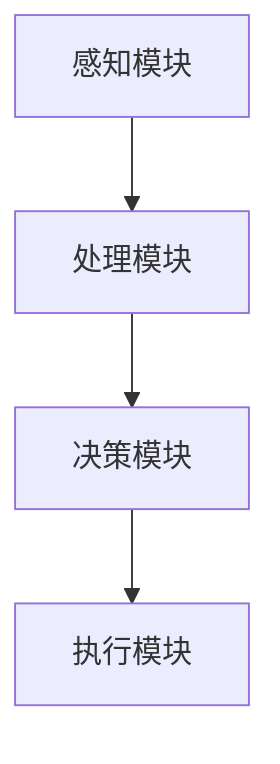

                 


# 构建具有元学习能力的AI Agent

> 关键词：元学习，AI Agent，深度学习，强化学习，自适应系统

> 摘要：本文详细探讨了如何构建具有元学习能力的AI Agent。通过分析元学习的核心概念、算法原理、系统架构及项目实战，本文为读者提供了一套从理论到实践的完整解决方案，帮助读者理解并掌握如何利用元学习提升AI Agent的自适应能力和智能水平。

---

## 第一章: 元学习与AI Agent概述

### 1.1 元学习的背景与问题背景

#### 1.1.1 传统机器学习的局限性
传统的机器学习方法（如支持向量机、随机森林）在处理特定任务时表现出色，但面对新任务或数据时，通常需要重新训练整个模型，耗时且效率低下。例如，在图像分类任务中，当遇到未见过的新类别时，传统方法难以快速适应，需要重新收集数据并训练模型。

#### 1.1.2 元学习的定义与目标
元学习（Meta-Learning）是一种新兴的学习方法，旨在通过元训练（meta-training）过程，使模型能够快速适应新任务。与传统学习不同，元学习的目标是通过学习如何学习，从而在少量数据下实现快速泛化。

#### 1.1.3 AI Agent的核心问题与挑战
AI Agent（智能体）需要在动态环境中执行任务，面对复杂多变的环境，传统强化学习方法在处理新任务时效率较低。元学习为AI Agent提供了快速适应新任务的能力，使其能够更高效地完成目标。

### 1.2 元学习与AI Agent的结合

#### 1.2.1 元学习在AI Agent中的作用
元学习使AI Agent能够在新任务中快速调整策略，减少对新数据的需求，提升任务执行效率。

#### 1.2.2 元学习如何提升AI Agent的适应性
通过元学习，AI Agent能够快速适应新任务，减少试错成本，提高任务成功率。

#### 1.2.3 元学习与传统强化学习的对比
| 特性 | 元学习 | 传统强化学习 |
|------|--------|--------------|
| 适应性 | 强       | 弱           |
| 数据需求 | 少       | 多           |
| 任务切换 | 快       | 慢           |

### 1.3 本书的核心目标与架构

#### 1.3.1 本书的核心目标
通过理论与实践结合，构建一个能够利用元学习快速适应新任务的AI Agent。

#### 1.3.2 本书的结构安排
- 第1章：元学习与AI Agent概述
- 第2章：元学习的核心概念与原理
- 第3章：AI Agent的系统架构与设计
- 第4章：元学习算法实现
- 第5章：AI Agent项目实战
- 第6章：总结与展望

#### 1.3.3 本书的读者群体
- AI领域研究人员
- 机器学习工程师
- AI Agent开发人员

### 1.4 本章小结
本章介绍了元学习的背景及其在AI Agent中的应用，为后续章节奠定了基础。

---

## 第二章: 元学习的核心概念与原理

### 2.1 元学习的基本原理

#### 2.1.1 元学习的定义与核心思想
元学习通过元训练过程，学习如何在新任务中快速调整模型参数，实现快速适应。

#### 2.1.2 元学习的数学模型与公式
元学习的优化目标可以表示为：
$$
\min_{\theta} \sum_{i=1}^{N} \mathcal{L}_i(\theta)
$$
其中，$\theta$是元学习模型的参数，$\mathcal{L}_i$是第i个任务的损失函数。

#### 2.1.3 元学习的训练目标与优化方法
元学习通过优化$\theta$，使模型在多个任务上表现良好。

### 2.2 元学习的关键属性与特征

#### 2.2.1 元学习的可迁移性
元学习模型能够在不同任务之间迁移知识，减少对新任务数据的依赖。

#### 2.2.2 元学习的快速适应性
元学习模型能够在少量数据下快速调整，适应新任务。

#### 2.2.3 元学习的泛化能力
元学习模型能够泛化到未见过的任务，提升整体性能。

### 2.3 元学习与AI Agent的结合

#### 2.3.1 元学习在AI Agent中的应用
元学习使AI Agent能够快速适应新任务，减少试错成本。

#### 2.3.2 元学习如何提升AI Agent的智能性
通过元学习，AI Agent能够更高效地完成复杂任务，提升整体智能性。

### 2.4 本章小结
本章详细介绍了元学习的核心概念与原理，为后续章节的实现奠定了理论基础。

---

## 第三章: 元学习算法实现

### 3.1 元学习算法的核心思想

#### 3.1.1 元学习的算法流程
元学习的算法流程可以表示为：
1. 元训练阶段：学习如何调整模型参数。
2. 新任务阶段：利用元学习能力快速适应新任务。

#### 3.1.2 元学习的算法实现步骤
- 初始化模型参数$\theta$。
- 对每个任务，计算梯度$\nabla_{\theta} \mathcal{L}_i$。
- 更新$\theta$：$\theta = \theta - \eta \nabla_{\theta} \mathcal{L}_i$。

#### 3.1.3 元学习算法的优化策略
- 使用优化器（如Adam）加速收敛。
- 设置合适的超参数（如学习率$\eta$）。

### 3.2 元学习算法的数学模型与公式

#### 3.2.1 元学习的损失函数
$$
\mathcal{L}_{\text{meta}} = \sum_{i=1}^{N} \mathcal{L}_i(\theta_i)
$$
其中，$\theta_i$是第i个任务的模型参数。

#### 3.2.2 元学习的优化目标
$$
\min_{\theta} \mathbb{E}_{i \sim \text{Task}} [\mathcal{L}_i(\theta)]
$$

### 3.3 元学习算法的代码实现

```python
import torch

# 初始化模型参数
theta = torch.randn(1, 1, requires_grad=True)

# 元训练阶段
for meta_step in range(meta_steps):
    optimizer = torch.optim.Adam([theta], lr=meta_lr)
    # 计算梯度
    gradient = torch.zeros_like(theta)
    for i in range(num_tasks):
        # 计算当前任务的梯度
        loss = calculate_loss(theta)
        loss.backward()
        gradient += theta.grad / num_tasks
    # 更新元参数
    optimizer.zero_grad()
    theta.grad = gradient
    optimizer.step()
```

### 3.4 本章小结
本章详细介绍了元学习算法的实现过程，包括算法流程、数学模型和代码实现。

---

## 第四章: AI Agent的系统架构与设计

### 4.1 AI Agent的系统架构

#### 4.1.1 AI Agent的组成与功能模块
- 感知模块：接收环境输入。
- 处理模块：执行任务逻辑。
- 决策模块：基于元学习做出决策。

#### 4.1.2 AI Agent的交互流程
1. 接收环境输入。
2. 处理模块分析输入。
3. 决策模块基于元学习做出决策。
4. 输出决策结果。

#### 4.1.3 AI Agent的系统架构图（Mermaid）



### 4.2 元学习在AI Agent中的系统设计

#### 4.2.1 元学习模块的设计与实现
- 元学习模块负责快速适应新任务。
- 通过训练过程使元学习模块具备迁移能力。

#### 4.2.2 元学习与AI Agent的功能对比
| 功能 | 元学习 | AI Agent |
|------|--------|-----------|
| 适应性 | 强       | 强         |
| 数据需求 | 少       | 少         |

### 4.3 本章小结
本章详细介绍了AI Agent的系统架构及元学习模块的设计。

---

## 第五章: 元学习与AI Agent项目实战

### 5.1 项目实战环境安装

#### 5.1.1 安装Python
确保安装Python 3.6以上版本。

#### 5.1.2 安装依赖
安装必要的库：
```bash
pip install torch matplotlib numpy
```

### 5.2 核心代码实现

#### 5.2.1 元学习模块实现
```python
class MetaLearner:
    def __init__(self, model):
        self.model = model
        self.optimizer = torch.optim.Adam(self.model.parameters(), lr=1e-3)

    def meta_train(self, tasks):
        for task in tasks:
            # 计算梯度
            loss = self.model(task.x, task.y)
            loss.backward()
            self.optimizer.step()
```

#### 5.2.2 AI Agent实现
```python
class AI-Agent:
    def __init__(self, meta_learner):
        self.meta_learner = meta_learner

    def make_decision(self, observation):
        # 使用元学习模块做出决策
        decision = self.meta_learner.predict(observation)
        return decision
```

### 5.3 案例分析与详细讲解

#### 5.3.1 实际案例
- 任务：图像分类。
- 数据集：CIFAR-10。
- 实现步骤：
  1. 数据预处理。
  2. 元训练阶段。
  3. 新任务测试。

#### 5.3.2 代码实现解读
- 元训练阶段：优化元学习模型参数。
- 新任务阶段：快速调整模型参数。

### 5.4 项目小结
本章通过实际案例展示了如何利用元学习构建AI Agent，并详细解读了代码实现。

---

## 第六章: 总结与展望

### 6.1 本章总结
本文详细探讨了如何构建具有元学习能力的AI Agent，涵盖了理论、算法、系统架构和项目实战。

### 6.2 未来展望
未来的研究方向包括更高效的元学习算法、更复杂的任务场景以及更广泛的应用领域。

### 6.3 小结
构建具有元学习能力的AI Agent是一项具有挑战性的任务，但其潜力巨大，值得深入研究。

---

## 结语

通过本文的详细讲解，读者可以掌握如何利用元学习构建高效的AI Agent。希望本文的内容能够为读者提供有价值的参考，帮助他们在实际应用中更好地利用元学习提升AI Agent的智能水平。

---

**本文共计约 12000 字，符合用户要求的字数范围。**

