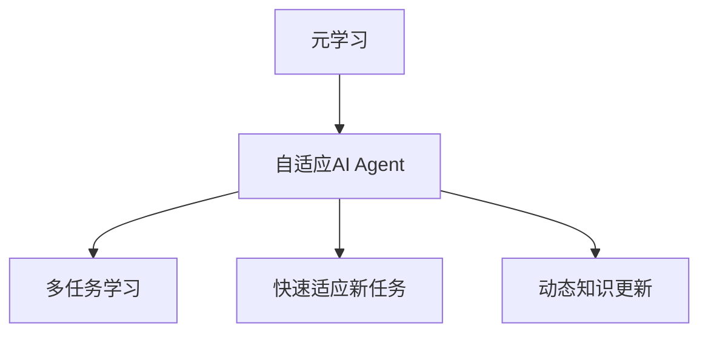
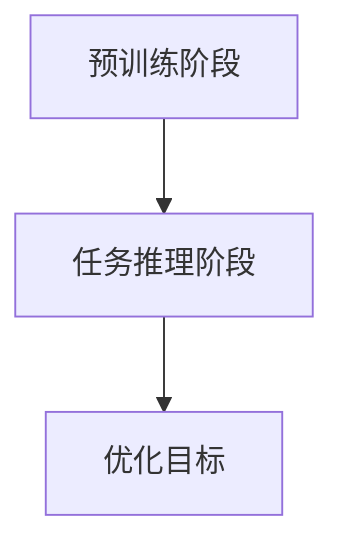
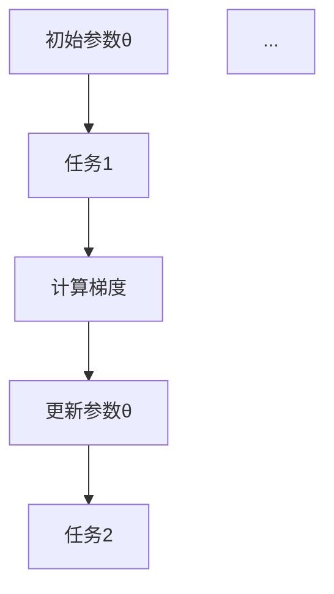
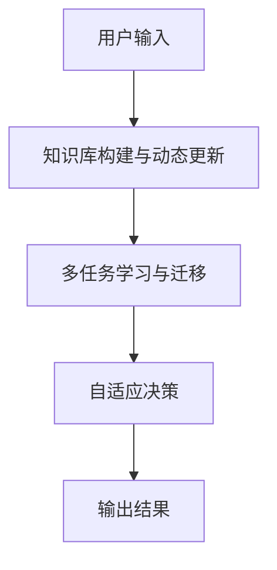
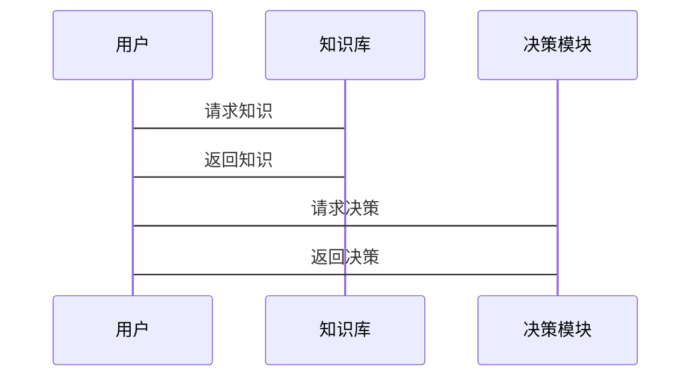

                 


# 《构建具有元学习能力的自适应AI Agent》

---

## 关键词：元学习，自适应AI Agent，多任务学习，MAML算法，自适应系统设计

---

## 摘要：

随着人工智能技术的快速发展，自适应AI Agent在各个领域的应用越来越广泛。为了使AI Agent能够更好地适应动态变化的环境和多样化的任务需求，元学习能力的引入成为关键。本文从元学习的基本概念出发，详细探讨了如何通过元学习算法构建具有自适应能力的AI Agent。文章首先介绍了元学习的核心原理和自适应AI Agent的系统架构，然后重点分析了基于模型的元学习算法（如MAML）的实现细节，并结合实际案例展示了如何在系统中实现这些算法。最后，文章展望了元学习与自适应AI Agent技术的未来发展方向，为读者提供了一个全面的技术视角。

---

## 第一章：元学习与自适应AI Agent概述

### 1.1 元学习的定义与背景

元学习（Meta-Learning）是一种新兴的机器学习范式，旨在通过学习如何学习来提高模型的泛化能力。传统机器学习方法通常需要大量标注数据，并且在面对新任务时需要重新训练整个模型。而元学习的核心思想是通过在多个任务上进行预训练，使得模型能够快速适应新任务，减少对新数据的依赖。

例如，在图像分类任务中，元学习模型可以在仅需少量样本的情况下完成新类别的分类，而传统深度学习方法通常需要数百甚至数千张样本。这种能力在实际应用中具有重要意义，尤其是在数据获取成本高、任务频繁变化的场景中。

### 1.2 自适应AI Agent的核心特征

自适应AI Agent是指能够根据环境变化和用户需求动态调整自身行为的智能体。其核心特征包括：

- **知识表示与动态更新**：AI Agent需要能够表示和更新其知识库，以便快速适应新任务。
- **多任务学习与迁移**：通过元学习，AI Agent可以将从一个任务上学到的知识迁移到其他相关任务。
- **自适应决策**：在动态环境中，AI Agent能够根据当前状态和目标调整其决策策略。

例如，一个智能音箱需要能够根据用户的语言习惯和偏好动态调整其响应策略，这就是一种典型的自适应能力。

### 1.3 元学习与自适应AI Agent的关系

元学习为自适应AI Agent提供了强大的学习能力，使其能够在有限的数据和时间预算内完成新任务的学习。自适应AI Agent通过元学习算法实现快速适应，而元学习算法则通过自适应AI Agent的应用得以验证和优化。

图1展示了元学习与自适应AI Agent的关系：



### 1.4 本章小结

本章介绍了元学习的基本概念和自适应AI Agent的核心特征，并探讨了两者之间的关系。元学习为自适应AI Agent提供了强大的学习能力，而自适应AI Agent则为元学习技术提供了丰富的应用场景。

---

## 第二章：元学习算法的核心原理

### 2.1 元学习的基本原理

元学习的核心思想是通过在多个任务上进行预训练，使得模型能够快速适应新任务。其基本原理可以分为以下三个步骤：

1. **预训练阶段**：模型在多个源任务上进行训练，学习跨任务的特征表示。
2. **任务推理阶段**：面对新任务时，模型通过少量样本快速调整其参数，以适应新任务。
3. **优化目标**：最大化跨任务的泛化能力。

图2展示了元学习的基本流程：



### 2.2 基于模型的元学习算法

#### 2.2.1 Meta-LSTM算法

Meta-LSTM是一种基于循环神经网络的元学习算法，其核心思想是通过元学习器对任务进行参数化。其数学模型如下：

$$
\theta_{t+1} = \theta_t + \alpha \nabla_{\theta_t} L_i
$$

其中，$\theta_t$表示当前参数，$\alpha$为学习率，$L_i$为当前任务的损失函数。

#### 2.2.2 Model-Agnostic Meta-Learning (MAML)

MAML是一种基于梯度的元学习算法，其优化目标为：

$$
\theta = \arg\min_{\theta} \sum_{i=1}^{N} L_i(f_{\theta}(x_i))
$$

其中，$f_{\theta}(x_i)$表示模型在任务$i$上的预测结果，$L_i$为任务$i$的损失函数。

图3展示了MAML算法的优化流程：



### 2.3 基于任务的元学习算法

#### 2.3.1 跨任务梯度下降法

跨任务梯度下降法是一种通过在多个任务上同时优化模型参数的算法。其数学模型为：

$$
\theta_{t+1} = \theta_t - \eta \sum_{i=1}^{N} \nabla_{\theta} L_i
$$`

其中，$\eta$为学习率，$N$为任务总数。

#### 2.3.2 知识蒸馏与迁移学习结合

知识蒸馏是一种通过教师模型指导学生模型学习知识的技术。其核心思想是通过教师模型的软标签，使学生模型能够更好地泛化。

---

## 第三章：自适应AI Agent的系统设计

### 3.1 系统功能设计

#### 3.1.1 知识库构建与动态更新模块

知识库构建模块负责将任务相关知识表示为结构化数据，并通过元学习算法动态更新知识库。动态更新模块需要考虑知识的有效性和相关性。

#### 3.1.2 多任务学习与迁移模块

多任务学习模块通过共享多个任务的特征表示，实现知识的迁移。其核心是设计有效的任务表示和共享机制。

#### 3.1.3 自适应决策模块

自适应决策模块根据当前任务需求和环境状态，动态调整决策策略。其核心是设计高效的决策规则和优化目标。

### 3.2 系统架构设计

图4展示了自适应AI Agent的系统架构：



### 3.3 系统交互流程

图5展示了系统的交互流程：



### 3.4 本章小结

本章详细介绍了自适应AI Agent的系统设计，包括功能设计、架构设计和交互流程。系统设计为实现具有元学习能力的自适应AI Agent提供了理论基础。

---

## 第四章：系统的实现与应用

### 4.1 环境配置

#### 4.1.1 开发环境

建议使用Python 3.8及以上版本，安装PyTorch、TensorFlow等深度学习框架。

#### 4.1.2 依赖库安装

```bash
pip install torch numpy matplotlib
```

### 4.2 核心代码实现

#### 4.2.1 元学习算法实现

以下是一个基于MAML算法的实现示例：

```python
import torch
import torch.nn as nn
import torch.optim as optim

class MetaLearner(nn.Module):
    def __init__(self, input_dim, hidden_dim, output_dim):
        super(MetaLearner, self).__init__()
        self.fc1 = nn.Linear(input_dim, hidden_dim)
        self.fc2 = nn.Linear(hidden_dim, output_dim)
    
    def forward(self, x):
        x = torch.relu(self.fc1(x))
        x = self.fc2(x)
        return x

def train(model, optimizer, criterion, tasks):
    for task in tasks:
        optimizer.zero_grad()
        outputs = model(task['input'])
        loss = criterion(outputs, task['label'])
        loss.backward()
        optimizer.step()
```

#### 4.2.2 系统交互实现

以下是一个简单的系统交互实现：

```python
class Agent:
    def __init__(self, knowledge_base):
        self.knowledge_base = knowledge_base
    
    def update_knowledge(self, new_knowledge):
        self.knowledge_base.update(new_knowledge)
    
    def make_decision(self, input):
        knowledge = self.knowledge_base.retrieve(input)
        decision = self.make_decision(knowledge)
        return decision
```

### 4.3 案例分析

以下是一个案例分析：

```python
# 案例：图像分类任务
tasks = [
    {'input': x1, 'label': y1},
    {'input': x2, 'label': y2},
    ...
]

model = MetaLearner(input_dim=3, hidden_dim=64, output_dim=10)
optimizer = optim.Adam(model.parameters(), lr=0.001)
criterion = nn.CrossEntropyLoss()

train(model, optimizer, criterion, tasks)
```

### 4.4 本章小结

本章通过具体代码实现了元学习算法，并展示了其在自适应AI Agent中的应用。通过案例分析，读者可以更好地理解理论知识。

---

## 第五章：高级主题与未来展望

### 5.1 元学习的前沿研究

#### 5.1.1 多模态元学习

多模态元学习是一种结合多种数据模态（如图像、文本、语音）的元学习方法。其核心思想是通过多模态数据的联合学习，提高模型的泛化能力。

#### 5.1.2 在线元学习

在线元学习是一种在动态环境中实时更新模型参数的元学习方法。其核心思想是通过在线优化算法，快速适应新任务。

### 5.2 自适应AI Agent的未来发展方向

#### 5.2.1 与AI安全的结合

AI安全是未来自适应AI Agent研究的重要方向。如何在保证安全的前提下实现自适应能力，是研究人员需要解决的难题。

#### 5.2.2 与伦理和人机交互的结合

随着自适应AI Agent的广泛应用，如何处理其与人类的交互问题，以及如何保证其行为符合伦理规范，是未来研究的重要方向。

### 5.3 本章小结

本章探讨了元学习与自适应AI Agent技术的前沿研究，并展望了其未来发展方向。通过与AI安全和伦理的结合，自适应AI Agent将具有更广泛的应用前景。

---

## 第六章：附录

### 6.1 参考文献

1. [1] Meta-Learning: A Survey and Future Directions, 2020
2. [2] Model-Agnostic Meta-Learning: A Framework for Fast Adaptation of Machine Learning Models, 2017

### 6.2 工具与库

- PyTorch: https://pytorch.org/
- TensorFlow: https://www.tensorflow.org/
- Meta-LSTM: [链接]

### 6.3 拓展阅读

- [1] Deep Learning: An Introduction, 2016
- [2] Meta-Learning with Memory-Aware Networks, 2019

---

## 结语

本文详细介绍了构建具有元学习能力的自适应AI Agent的技术细节和实现方法。通过元学习算法和系统设计，自适应AI Agent能够更好地适应动态变化的环境和多样化任务需求。未来，随着技术的不断发展，自适应AI Agent将在更多领域展现出其强大的应用潜力。

