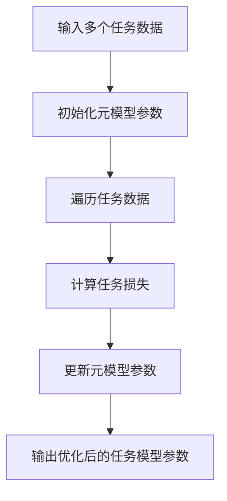
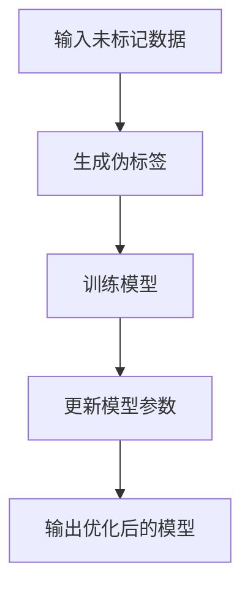
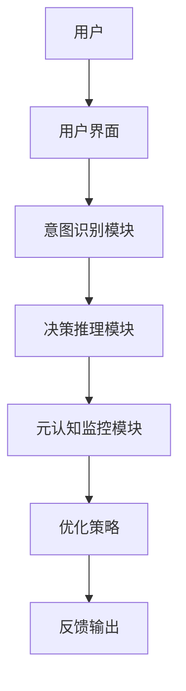
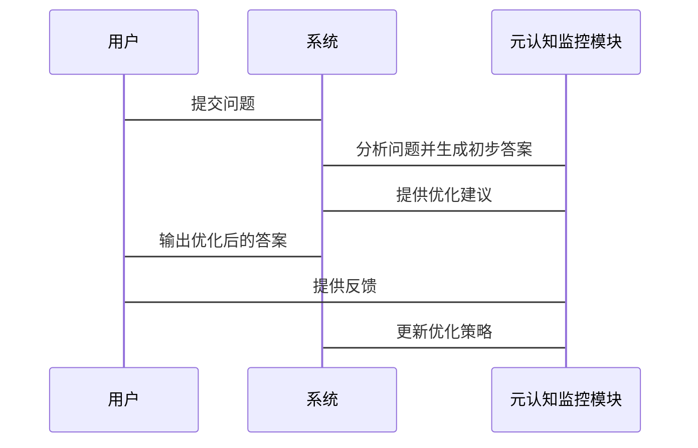

                 


# 构建具有元认知能力的AI Agent

## 关键词：元认知，AI Agent，元学习，自我监督学习，系统架构，项目实战

## 摘要：本文详细探讨了构建具有元认知能力的AI Agent的背景、核心概念、算法原理、系统架构设计、项目实战及优化方法。通过理论分析与实践结合，展示了如何使AI Agent具备自我监控、自我评估和自我修正的能力，从而显著提升其智能水平和问题解决能力。

---

# 第1章: 元认知AI Agent的背景与必要性

## 1.1 元认知与AI Agent的基本概念

### 1.1.1 元认知的定义与特征
元认知（Metacognition）是指对自身认知过程的认知，包括监控、评估和调节这些过程的能力。它具有以下特征：
- **内省性**：能够反思自己的思考过程。
- **调控性**：能够调整认知策略以优化表现。
- **目标导向性**：能够根据目标选择合适的方法。

### 1.1.2 AI Agent的基本概念
AI Agent（智能体）是一个能够感知环境并采取行动以实现目标的实体。它可以分为：
- **简单反射型**：基于规则的反应式智能体。
- **基于模型的反应式**：结合内部模型进行决策。
- **规划型**：具备目标规划和推理能力。

### 1.1.3 元认知AI Agent的必要性
元认知AI Agent的必要性体现在以下几个方面：
- **提升智能性**：通过元认知能力，AI Agent能够更好地理解自身的行为，并做出更智能的决策。
- **增强适应性**：能够根据环境变化动态调整策略，适应复杂场景。
- **提高可靠性**：通过自我监控和评估，减少错误决策的发生。

## 1.2 元认知AI Agent的应用场景

### 1.2.1 智能决策支持系统
在医疗诊断、金融投资等领域，元认知AI Agent可以通过反思和优化决策过程，提供更精准的建议。

### 1.2.2 自动化问题解决
通过元认知能力，AI Agent能够识别问题解决过程中的瓶颈，并提出改进方案。

### 1.2.3 人机协作与增强
元认知AI Agent可以与人类协同工作，通过反思和优化协作过程，提升整体效率。

## 1.3 元认知AI Agent的挑战与机遇

### 1.3.1 技术挑战
- **复杂性**：元认知模型的设计和实现需要复杂的算法和架构。
- **数据需求**：元学习需要大量数据支持模型的训练和优化。

### 1.3.2 应用挑战
- **伦理问题**：元认知AI Agent的决策过程需要考虑伦理和法律问题。
- **用户信任**：用户需要信任AI Agent的元认知能力。

### 1.3.3 未来发展与潜力
随着AI技术的不断发展，元认知AI Agent将在更多领域展现出巨大潜力，特别是在需要动态适应和复杂决策的场景中。

## 1.4 本章小结
本章介绍了元认知和AI Agent的基本概念，探讨了元认知AI Agent的必要性、应用场景以及面临的挑战与机遇，为后续章节的深入分析奠定了基础。

---

# 第2章: 元认知AI Agent的核心概念与联系

## 2.1 元认知模型的原理

### 2.1.1 元认知模型的构成
元认知模型通常包括以下三个组成部分：
- **元认知知识**：对认知过程和策略的知识。
- **元认知调控**：对认知过程的监控和调节。
- **元认知评估**：对认知过程和结果的评估。

### 2.1.2 元认知模型的属性特征对比表

| 属性       | 元认知知识         | 元认知调控         | 元认知评估         |
|------------|------------------|------------------|------------------|
| 定义       | 关于认知过程的知识 | 对认知过程的监控 | 对认知过程的评估 |
| 功能       | 提供策略和方法     | 调整认知过程       | 评估结果和过程     |
| 示例       | 知识如何学习       | 调整学习策略       | 评估学习效果       |

### 2.1.3 元认知模型的ER实体关系图
```mermaid
erDiagram
    participant 元认知知识 {
        <属性> 元认知知识_id : integer
        <属性> 内容 : string
    }
    participant 元认知调控 {
        <属性> 调控_id : integer
        <属性> 调控策略 : string
    }
    participant 元认知评估 {
        <属性> 评估_id : integer
        <属性> 评估结果 : string
    }
    元认知知识 --> 元认知调控 : 基于知识制定调控策略
    元认知调控 --> 元认知评估 : 根据调控策略评估效果
    元认知评估 --> 元认知知识 : 反馈优化知识
```

## 2.2 元认知与AI Agent的联系

### 2.2.1 元认知在AI Agent中的作用
元认知在AI Agent中的作用体现在以下几个方面：
- **自我监控**：监控自身的决策过程。
- **策略调整**：根据监控结果调整策略。
- **结果评估**：评估决策结果并优化未来行为。

### 2.2.2 元认知能力对AI Agent性能的影响
元认知能力对AI Agent性能的影响包括：
- **提升决策效率**：通过反思和优化，减少无效决策。
- **增强适应性**：能够快速适应环境变化。
- **提高准确性**：通过评估和反馈，提升决策的准确性。

### 2.2.3 元认知与传统AI Agent的区别
| 方面       | 元认知AI Agent                | 传统AI Agent              |
|------------|----------------------------|---------------------------|
| 决策方式   | 基于元认知的动态调整          | 基于预设规则或模型         |
| 学习能力   | 具备元学习能力，能够自我优化  | 依赖外部数据和模型训练     |
| 灵活性     | 高度灵活，能够动态调整策略    | 灵活性较低，依赖预设规则   |

## 2.3 本章小结
本章详细探讨了元认知模型的构成及其在AI Agent中的作用，分析了元认知能力对AI Agent性能的影响，并对比了元认知AI Agent与传统AI Agent的区别。

---

# 第3章: 元认知AI Agent的算法原理

## 3.1 元学习算法

### 3.1.1 元学习的基本概念
元学习（Meta-Learning）是一种通过在多个任务上进行学习，以快速适应新任务的算法。其核心思想是学习如何学习。

### 3.1.2 元学习的数学模型
元学习的数学模型通常包括以下两部分：
- **元模型**：用于参数更新的模型，如：
  $$ \theta_{t+1} = \theta_t + \alpha \nabla_{\theta_t} \mathcal{L}_t $$
- **任务模型**：用于具体任务的模型，如：
  $$ y = f(x; \theta_t) $$

### 3.1.3 元学习的流程图


## 3.2 自我监督学习

### 3.2.1 自我监督学习的基本原理
自我监督学习（Self-Supervised Learning）是一种通过预测未标记数据的标签来学习特征表示的方法。

### 3.2.2 自我监督学习的数学模型
自我监督学习的数学模型通常包括以下部分：
- **目标函数**：用于衡量预测与真实值的差异，如：
  $$ \mathcal{L}(x, y) = \frac{1}{n} \sum_{i=1}^{n} (y_i - \hat{y}_i)^2 $$
- **预测函数**：用于生成预测值，如：
  $$ \hat{y}_i = f(x_i; \theta) $$

### 3.2.3 自我监督学习的流程图


## 3.3 元认知网络的构建

### 3.3.1 元认知网络的结构
元认知网络通常包括以下三个部分：
- **感知层**：感知环境信息。
- **认知层**：进行推理和决策。
- **元认知层**：监控和优化认知过程。

### 3.3.2 元认知网络的训练方法
元认知网络的训练方法通常包括以下步骤：
1. **初始化参数**：随机初始化网络参数。
2. **前向传播**：将输入数据通过网络进行前向传播。
3. **计算损失**：根据输出结果计算损失函数。
4. **反向传播**：通过反向传播更新网络参数。
5. **元学习优化**：根据元学习算法优化元认知网络的参数。

### 3.3.3 元认知网络的优化策略
- **逐步优化**：先优化任务模型，再优化元模型。
- **联合优化**：同时优化任务模型和元模型的参数。
- **分阶段优化**：在不同阶段采用不同的优化策略。

## 3.4 本章小结
本章详细介绍了元学习和自我监督学习的算法原理，并探讨了元认知网络的构建和优化策略，为后续章节的实现奠定了算法基础。

---

# 第4章: 元认知AI Agent的系统分析与架构设计

## 4.1 系统分析

### 4.1.1 问题场景介绍
假设我们正在开发一个智能客服系统，该系统需要具备元认知能力，能够根据用户的反馈动态调整服务策略。

### 4.1.2 项目介绍
本项目的目标是构建一个具备元认知能力的智能客服系统，能够根据用户反馈优化服务流程。

### 4.1.3 系统功能设计（领域模型）
系统功能设计包括以下几个方面：
- **用户交互**：用户与系统进行对话。
- **意图识别**：识别用户的意图。
- **决策推理**：根据意图进行推理和决策。
- **元认知监控**：监控决策过程并进行优化。

## 4.2 系统架构设计

### 4.2.1 系统架构图


### 4.2.2 系统接口设计
系统接口设计包括以下几个部分：
- **输入接口**：接收用户输入。
- **输出接口**：输出系统决策结果。
- **反馈接口**：接收用户反馈并优化系统策略。

### 4.2.3 系统交互设计


## 4.3 本章小结
本章通过系统分析和架构设计，展示了如何构建一个具备元认知能力的AI Agent系统，为后续章节的实现提供了系统层面的支持。

---

# 第5章: 元认知AI Agent的项目实战

## 5.1 环境安装

### 5.1.1 安装Python
```bash
python --version
# 确保Python版本为3.8及以上
```

### 5.1.2 安装依赖库
```bash
pip install numpy
pip install tensorflow
pip install matplotlib
pip install scikit-learn
```

## 5.2 系统核心实现源代码

### 5.2.1 元学习模型实现
```python
import tensorflow as tf
import numpy as np

class MetaLearner(tf.keras.Model):
    def __init__(self, input_dim, hidden_dim, output_dim):
        super(MetaLearner, self).__init__()
        self.hidden_layer = tf.keras.layers.Dense(hidden_dim, activation='relu')
        self.output_layer = tf.keras.layers.Dense(output_dim)

    def call(self, inputs):
        x = self.hidden_layer(inputs)
        x = self.output_layer(x)
        return x

# 初始化元学习模型
meta_learner = MetaLearner(input_dim=10, hidden_dim=20, output_dim=5)

# 定义损失函数
def meta_loss(y_true, y_pred):
    return tf.keras.losses.mean_squared_error(y_true, y_pred)

# 编译模型
meta_learner.compile(optimizer=tf.keras.optimizers.Adam(learning_rate=0.001), loss=meta_loss)
```

### 5.2.2 自我监督学习实现
```python
from sklearn.metrics import mean_squared_error

def self_supervised_learning(X_train, y_train):
    # 生成伪标签
    y_pred = np.random.randint(0, 2, size=len(X_train))
    # 训练模型
    model = tf.keras.Sequential([
        tf.keras.layers.Dense(64, activation='relu'),
        tf.keras.layers.Dense(1, activation='sigmoid')
    ])
    model.compile(optimizer='adam', loss='binary_crossentropy')
    model.fit(X_train, y_pred, epochs=10, batch_size=32)
    # 计算损失
    loss = mean_squared_error(y_train, model.predict(X_train))
    return loss

# 示例数据
X_train = np.random.rand(100, 10)
y_train = np.random.randint(0, 2, size=100)
# 训练模型
loss = self_supervised_learning(X_train, y_train)
print("训练损失:", loss)
```

### 5.2.3 元认知网络实现
```python
import numpy as np
from tensorflow.keras import layers, Model

class MetaCognitiveNetwork(Model):
    def __init__(self, input_dim, hidden_dim, output_dim):
        super(MetaCognitiveNetwork, self).__init__()
        self.base_network = self._build_base_network(input_dim, hidden_dim, output_dim)
        self.meta_network = self._build_meta_network(hidden_dim, output_dim)

    def _build_base_network(self, input_dim, hidden_dim, output_dim):
        inputs = layers.Input(shape=(input_dim,))
        x = layers.Dense(hidden_dim, activation='relu')(inputs)
        outputs = layers.Dense(output_dim)(x)
        return Model(inputs=inputs, outputs=outputs)

    def _build_meta_network(self, hidden_dim, output_dim):
        inputs = layers.Input(shape=(hidden_dim,))
        x = layers.Dense(hidden_dim, activation='relu')(inputs)
        outputs = layers.Dense(output_dim)(x)
        return Model(inputs=inputs, outputs=outputs)

    def call(self, inputs):
        base_output = self.base_network(inputs)
        meta_output = self.meta_network(base_output)
        return meta_output

# 初始化元认知网络
meta_cognitive_network = MetaCognitiveNetwork(input_dim=10, hidden_dim=20, output_dim=5)

# 定义损失函数
def meta_cognitive_loss(y_true, y_pred):
    return tf.keras.losses.mean_squared_error(y_true, y_pred)

# 编译模型
meta_cognitive_network.compile(optimizer=tf.keras.optimizers.Adam(learning_rate=0.001), loss=meta_cognitive_loss)
```

## 5.3 项目实战小结
本章通过具体的项目实战，展示了如何在实际场景中实现元认知AI Agent的核心算法和系统架构，为后续章节的优化和应用提供了实践依据。

---

# 第6章: 元认知AI Agent的系统优化与实践

## 6.1 元认知AI Agent的系统优化策略

### 6.1.1 参数优化
- **学习率调整**：根据训练过程动态调整学习率。
- **正则化优化**：使用L1/L2正则化减少过拟合。

### 6.1.2 模型优化
- **网络结构调整**：根据任务需求调整网络结构。
- **模型融合**：结合多种模型的优势。

### 6.1.3 算法优化
- **分布式训练**：利用分布式计算加速训练过程。
- **增量学习**：在新数据上进行增量优化。

## 6.2 元认知AI Agent的实践总结

### 6.2.1 实践中的常见问题
- **数据不足**：元学习需要大量数据支持。
- **计算资源限制**：复杂的模型需要大量计算资源。
- **模型过拟合**：需要引入正则化等技术进行优化。

### 6.2.2 解决方案与经验分享
- **数据增强**：通过数据增强技术增加数据量。
- **模型优化**：采用轻量化设计和分布式训练。
- **性能监控**：通过监控工具实时优化模型性能。

## 6.3 本章小结
本章总结了元认知AI Agent的系统优化策略和实践中的经验教训，为读者提供了宝贵的参考。

---

# 第7章: 元认知AI Agent的未来展望与总结

## 7.1 未来发展趋势

### 7.1.1 元认知能力的进一步增强
未来，元认知AI Agent的元认知能力将更加智能化，能够实现更复杂的自我监控和优化。

### 7.1.2 多模态数据的融合
通过融合多模态数据，元认知AI Agent将具备更强的感知和理解能力。

### 7.1.3 人机协作的深化
元认知AI Agent将与人类协同工作，实现更高效的人机协作。

## 7.2 本论文的总结

### 7.2.1 核心贡献
本文提出了构建具有元认知能力的AI Agent的理论框架和实现方法，为元认知AI Agent的研究和应用提供了新的思路。

### 7.2.2 展望未来
未来的研究将更加关注元认知AI Agent的智能化和实用性，推动其在更多领域的应用。

## 7.3 本章小结
本章总结了元认知AI Agent的未来发展趋势，并回顾了本文的核心贡献和研究意义。

---

# 第8章: 最佳实践与注意事项

## 8.1 最佳实践

### 8.1.1 数据准备
- **数据质量**：确保数据的准确性和完整性。
- **数据多样性**：覆盖多种场景和数据类型。

### 8.1.2 模型选择
- **任务匹配**：选择适合任务的模型架构。
- **性能评估**：使用合适的评估指标。

### 8.1.3 训练策略
- **超参数调优**：通过网格搜索或随机搜索优化超参数。
- **交叉验证**：使用交叉验证评估模型的泛化能力。

## 8.2 注意事项

### 8.2.1 数据泄漏
在元学习中，需要注意避免数据泄漏，特别是在训练和测试数据的划分上。

### 8.2.2 模型复杂度
复杂的模型可能导致过拟合，需要通过正则化和交叉验证等方法进行优化。

### 8.2.3 计算资源
元学习需要大量的计算资源，需要合理配置硬件资源。

## 8.3 本章小结
本章总结了构建元认知AI Agent的最佳实践和注意事项，为读者提供了实用的建议。

---

# 结语

通过本文的详细探讨，我们全面了解了如何构建具有元认知能力的AI Agent，从理论到实践，从算法到系统架构，为未来的AI发展提供了新的方向。希望本文能为相关领域的研究者和开发者提供有价值的参考。

--- 

**感谢您的耐心阅读，祝您阅读愉快！**

