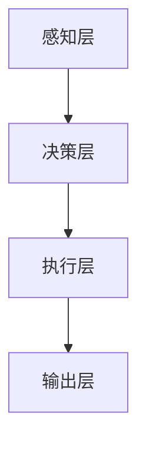
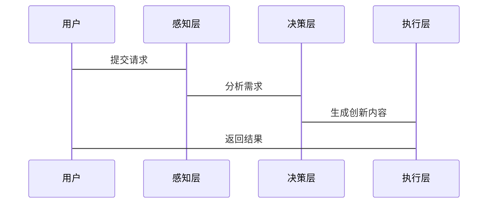

                 


# 构建具有创造力的AI Agent

## 关键词
- 创造力, AI Agent, 生成模型, 强化学习, 系统架构

## 摘要
本文详细探讨了如何构建具有创造力的AI Agent，涵盖了创造力的定义与重要性、AI Agent的核心概念、创造力驱动的算法原理、系统架构设计、项目实战以及最佳实践。通过理论分析和实际案例，帮助读者理解并掌握构建具备创造性思维的AI Agent的关键技术与方法。

---

# 第1章: 创造力与AI Agent概述

## 1.1 创造力的定义与重要性
### 1.1.1 创造力的定义
创造力是指生成新颖且有用的想法、解决方案或内容的能力。在AI Agent中，创造力使其能够超越预设规则，生成创新的输出。

### 1.1.2 创造力在AI Agent中的作用
创造力使AI Agent能够适应复杂环境，解决未预见的问题，并提供独特的解决方案。

### 1.1.3 创造力与传统AI的区别
传统AI依赖规则和数据，而具备创造力的AI Agent能够生成创新的输出，适应动态环境。

## 1.2 AI Agent的基本概念
### 1.2.1 AI Agent的定义
AI Agent是能够感知环境并采取行动以实现目标的智能实体。

### 1.2.2 AI Agent的核心特点
- 自主性：独立决策
- 反应性：实时响应环境变化
- 目标导向：基于目标采取行动

### 1.2.3 创造力在AI Agent中的实现方式
- 使用生成模型（如GAN、Transformer）生成创新内容
- 强化学习优化创造力评估

## 1.3 创造力与AI Agent的结合
### 1.3.1 创造力在AI Agent中的应用场景
- 文本生成
- 图像创作
- 策略优化

### 1.3.2 创造力对AI Agent性能的提升
- 提高问题解决的多样性
- 增强环境适应能力

### 1.3.3 创造力在AI Agent设计中的挑战
- 创新性与实用性的平衡
- 确保创造力评估的客观性

## 1.4 本章小结
本章介绍了创造力在AI Agent中的重要性及其应用场景，为后续内容奠定基础。

---

# 第2章: 创造力与AI Agent的核心概念

## 2.1 创造力的数学模型
### 2.1.1 创造力的数学表达式
创造力可以通过创新性、有用性和独特性指标进行量化。

### 2.1.2 创造力与概率论的关系
基于概率分布的生成模型（如GAN、VAE）用于模拟创造力。

### 2.1.3 创造力与优化算法的结合
使用强化学习优化创造力评估指标，如生成对抗网络中的损失函数。

## 2.2 AI Agent的创造力评估
### 2.2.1 创造力评估的指标
- 创新性：输出的新颖性
- 有用性：输出的实用性
- 多样性：输出的多样性

### 2.2.2 创造力评估的方法
- 人类评分
- 自动评估指标（如BLEU、ROUGE）
- 强化学习中的奖励机制

### 2.2.3 创造力评估的工具
- 基于机器学习的评估模型
- 用户反馈系统

## 2.3 创造力与AI Agent的交互
### 2.3.1 创造力在人机交互中的作用
- 提供多样化的响应
- 适应用户的个性化需求

### 2.3.2 创造力与用户需求的匹配
- 动态调整生成内容以匹配用户偏好
- 实时反馈机制优化交互体验

### 2.3.3 创造力在多轮对话中的应用
- 保持对话连贯性的同时生成创新内容
- 根据上下文调整生成策略

## 2.4 本章小结
本章深入探讨了创造力在AI Agent中的数学模型和评估方法，并分析了其在人机交互中的应用。

---

# 第3章: 创造力驱动的AI Agent算法原理

## 3.1 基于生成模型的创造力实现
### 3.1.1 变量关系图
- 输入：环境感知
- 中间层：生成模型
- 输出：创新内容

### 3.1.2 生成模型的原理
生成模型（如GAN、Transformer）通过学习数据分布生成新颖内容。

### 3.1.3 生成模型的优缺点
- 优点：高创新性
- 缺点：可能缺乏实用性

## 3.2 基于强化学习的创造力优化
### 3.2.1 强化学习的原理
通过奖励机制优化AI Agent的创造力评估。

### 3.2.2 强化学习与创造力的关系
强化学习用于优化生成内容的创新性和实用性。

### 3.2.3 强化学习的挑战
- 奖励函数的设计
- 训练时间长

## 3.3 创造力评估的数学模型
### 3.3.1 创造力评估的公式
$$C(x) = f(x) \cdot g(x)$$
其中，C(x)为创造力评估，f(x)为创新性，g(x)为实用性。

### 3.3.2 创造力评估的优化
使用梯度下降法优化创造力评估函数。

## 3.4 本章小结
本章详细讲解了基于生成模型和强化学习的创造力实现方法，并探讨了创造力评估的数学模型。

---

# 第4章: AI Agent的系统架构设计

## 4.1 问题场景介绍
构建一个具备创造力的AI Agent，应用于文本生成任务。

## 4.2 系统功能设计
- 感知层：接收输入并生成创新内容
- 决策层：优化生成策略
- 执行层：输出结果

## 4.3 系统架构设计
### 4.3.1 系统架构图


### 4.3.2 系统组件交互
- 感知层接收用户输入
- 决策层优化生成策略
- 执行层生成并输出结果

## 4.4 系统接口设计
- 输入接口：接收用户请求
- 输出接口：返回创新内容
- API接口：供其他系统调用

## 4.5 系统交互序列图


## 4.6 本章小结
本章详细设计了具备创造力的AI Agent的系统架构，并展示了各组件的交互过程。

---

# 第5章: 项目实战

## 5.1 环境安装
- 安装Python 3.8+
- 安装TensorFlow、Keras、PyTorch
- 安装其他依赖库

## 5.2 系统核心实现源代码
### 5.2.1 生成模型实现
```python
import tensorflow as tf
from tensorflow.keras import layers

# 定义生成器模型
def create_generator():
    model = tf.keras.Sequential([
        layers.Dense(256, activation='relu'),
        layers.Dense(512, activation='relu'),
        layers.Dense(784, activation='sigmoid'),
    ])
    return model
```

### 5.2.2 创造力评估实现
```python
def creativity_score(input_sequence):
    # 使用预训练模型评估创新性
    model = load_model('creativity_model.h5')
    return model.predict(input_sequence)
```

## 5.3 代码应用解读与分析
- 生成模型生成创新内容
- 创造力评估模型优化输出

## 5.4 实际案例分析
- 文本生成案例：生成一篇创新的文章
- 图像生成案例：生成独特的艺术作品

## 5.5 项目小结
本章通过实际案例展示了具备创造力的AI Agent的实现过程。

---

# 第6章: 最佳实践、小结、注意事项、拓展阅读

## 6.1 最佳实践
- 确保高质量的数据输入
- 定期优化创造力评估模型
- 注意模型的可解释性

## 6.2 小结
本文详细探讨了构建具备创造力的AI Agent的关键技术与方法，从理论到实践，为读者提供了全面的指导。

## 6.3 注意事项
- 数据质量对创造力评估至关重要
- 模型的可解释性需要考虑
- 注意创新性与实用性的平衡

## 6.4 拓展阅读
- 关注最新的生成模型研究
- 学习强化学习的最新进展
- 探索创造力评估的新方法

---

# 本章结束

通过以上目录结构，您可以逐步构建具有创造力的AI Agent，从理论到实践，全面掌握其设计与实现的关键点。

