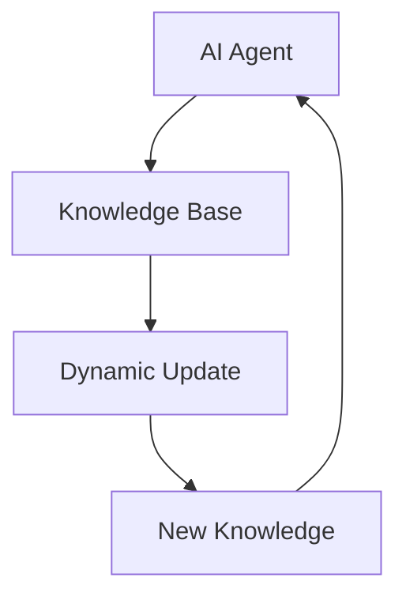
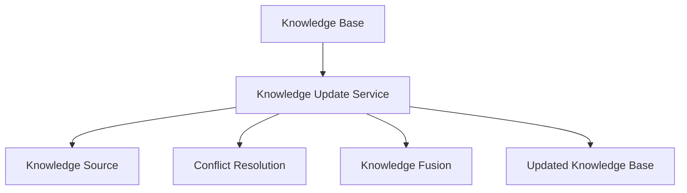
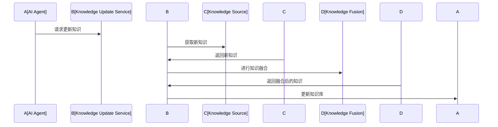

                 


# 构建具有动态知识更新能力的AI Agent

> 关键词：AI Agent, 动态知识更新, 知识表示, 知识融合, 动态知识图谱, 实时信息处理, 智能系统设计

> 摘要：本文详细探讨了构建具有动态知识更新能力的AI Agent的关键技术与实现方法。首先介绍了AI Agent的基本概念与动态知识更新的重要性，接着分析了动态知识更新的核心概念与实现机制，包括知识表示与知识图谱、动态知识更新算法及其数学模型。然后，深入讨论了系统的架构设计与实现，包括系统功能设计、架构设计图、接口设计和交互序列图。最后，通过项目实战的方式，详细指导读者如何实现一个具有动态知识更新能力的AI Agent，并提供了最佳实践和注意事项。

---

## 第1章: AI Agent与动态知识更新的背景介绍

### 1.1 AI Agent的基本概念
#### 1.1.1 AI Agent的定义
AI Agent（智能体）是指在环境中能够感知并自主行动以实现目标的实体。AI Agent可以通过传感器获取信息，通过执行器与环境交互，并通过内部的知识库和推理机制来做出决策。

#### 1.1.2 AI Agent的核心要素
AI Agent的核心要素包括：
- **感知能力**：通过传感器或接口获取环境中的信息。
- **推理能力**：基于知识库进行逻辑推理，生成行动策略。
- **行动能力**：通过执行器对外界产生影响。
- **知识库**：存储AI Agent所需的知识和经验。

#### 1.1.3 动态知识更新的定义与重要性
动态知识更新是指AI Agent能够实时或近实时地更新其知识库，以适应环境的变化。动态知识更新的重要性在于：
- 提高AI Agent的适应性。
- 增强AI Agent的实时决策能力。
- 支持多领域知识的动态融合。

### 1.2 动态知识更新的背景与问题背景
#### 1.2.1 AI Agent面临的知识更新挑战
AI Agent在运行过程中会面临以下知识更新挑战：
- 知识的时效性：知识可能过时或不再适用。
- 知识的完整性：需要动态获取新知识以补充缺失的信息。
- 知识的冲突性：新旧知识可能存在冲突，需要进行融合与协调。

#### 1.2.2 动态知识更新的必要性
动态知识更新的必要性体现在以下几个方面：
- 实现AI Agent的实时性：快速响应环境变化。
- 提高决策的准确性：基于最新知识做出决策。
- 支持复杂场景的处理：在多变的环境中保持高效运作。

#### 1.2.3 动态知识更新的边界与外延
动态知识更新的边界包括：
- 知识的更新频率：实时更新、周期性更新或事件驱动更新。
- 知识的来源：结构化数据、非结构化数据或半结构化数据。
- 知识的范围：局部知识更新或全局知识更新。

动态知识更新的外延包括：
- 知识的表示与存储。
- 知识的获取与融合。
- 知识的推理与应用。

### 1.3 动态知识更新的应用场景
#### 1.3.1 实时信息处理
动态知识更新能够支持AI Agent在实时信息处理场景中的应用，例如实时监控系统、舆情分析系统等。

#### 1.3.2 知识库的动态扩展
动态知识更新能够帮助AI Agent的知识库动态扩展，例如智能问答系统、智能推荐系统等。

#### 1.3.3 多领域知识融合
动态知识更新能够支持AI Agent在多领域知识融合中的应用，例如跨领域知识图谱构建、复杂问题求解等。

---

## 第2章: 动态知识更新的核心概念与联系

### 2.1 核心概念原理
#### 2.1.1 知识表示与知识图谱
知识表示是动态知识更新的基础。知识图谱是一种结构化的知识表示方式，通常由实体和关系构成。知识图谱可以通过图结构表示实体之间的关系，例如：

- 实体：人、地点、组织等。
- 关系：位于、属于、关联等。

知识图谱的构建和更新是动态知识更新的关键步骤。

#### 2.1.2 动态知识更新的机制
动态知识更新的机制包括：
- **知识获取**：通过爬虫、API等方式获取新知识。
- **知识解析**：将获取的知识转化为结构化的数据。
- **知识融合**：将新知识与现有知识图谱进行融合，解决知识冲突问题。
- **知识存储**：将更新后的知识存储到知识库中。

#### 2.1.3 知识融合与冲突解决
知识融合是动态知识更新的重要环节。知识融合的过程包括：
- **实体识别**：识别新知识中的实体。
- **关系提取**：提取实体之间的关系。
- **冲突检测**：检测新知识与现有知识图谱之间的冲突。
- **冲突解决**：通过规则或算法解决冲突，例如选择最新的知识或合并实体。

### 2.2 核心概念属性特征对比
#### 2.2.1 不同知识更新机制的对比分析
以下是几种常见的知识更新机制的对比：

| 知识更新机制 | 描述 | 优点 | 缺点 |
|--------------|------|------|------|
| 基于规则的更新 | 通过预定义的规则进行知识更新 | 简单易实现 | 需要手动维护规则 |
| 基于概率的更新 | 通过概率模型进行知识更新 | 能够处理不确定性 | 计算复杂度较高 |
| 基于强化学习的更新 | 通过强化学习模型进行知识更新 | 自适应性强 | 需要大量训练数据 |

#### 2.2.2 动态知识更新与静态知识存储的对比
动态知识更新与静态知识存储的主要区别在于：
- **动态知识更新**：支持实时或近实时的知识更新，能够适应环境的变化。
- **静态知识存储**：知识是固定的，无法动态更新。

#### 2.2.3 动态知识更新的性能指标
动态知识更新的性能指标包括：
- 更新延迟：知识更新所需的时间。
- 更新吞吐量：单位时间内能够更新的知识量。
- 更新准确率：更新后知识的准确性。

### 2.3 ER实体关系图架构
以下是动态知识更新系统的核心实体关系图：



---

## 第3章: 动态知识更新的算法原理

### 3.1 基于规则的动态知识更新算法
#### 3.1.1 算法流程
基于规则的动态知识更新算法的流程如下：

1. 获取新知识。
2. 解析新知识，提取实体和关系。
3. 检查新知识与现有知识图谱是否存在冲突。
4. 根据预定义的规则解决冲突。
5. 更新知识图谱。

#### 3.1.2 算法实现
以下是基于规则的动态知识更新算法的Python实现示例：

```python
def update_knowledge_base(new_knowledge, knowledge_base):
    # 解析新知识
    entities = extract_entities(new_knowledge)
    relations = extract_relations(new_knowledge)
    
    # 检查冲突
    conflicts = detect_conflicts(entities, relations, knowledge_base)
    
    # 根据规则解决冲突
    resolved_conflicts = apply_rules(conflicts)
    
    # 更新知识库
    updated_knowledge_base = merge_knowledge(resolved_conflicts, knowledge_base)
    
    return updated_knowledge_base
```

### 3.2 基于概率的动态知识更新算法
#### 3.2.1 算法流程
基于概率的动态知识更新算法的流程如下：

1. 获取新知识。
2. 解析新知识，提取实体和关系。
3. 计算新知识与现有知识图谱的概率相似度。
4. 根据概率阈值决定是否更新知识图谱。
5. 更新知识图谱。

#### 3.2.2 算法实现
以下是基于概率的动态知识更新算法的Python实现示例：

```python
import math

def update_knowledge_base(new_knowledge, knowledge_base):
    # 解析新知识
    entities = extract_entities(new_knowledge)
    relations = extract_relations(new_knowledge)
    
    # 计算概率相似度
    similarity = calculate_similarity(entities, relations, knowledge_base)
    
    # 根据概率阈值决定是否更新
    if similarity > 0.8:
        updated_knowledge_base = merge_knowledge(entities, relations, knowledge_base)
    else:
        updated_knowledge_base = knowledge_base
    
    return updated_knowledge_base
```

### 3.3 基于强化学习的动态知识更新算法
#### 3.3.1 算法流程
基于强化学习的动态知识更新算法的流程如下：

1. 获取新知识。
2. 解析新知识，提取实体和关系。
3. 通过强化学习模型评估新知识的价值。
4. 根据评估结果决定是否更新知识图谱。
5. 更新知识图谱。

#### 3.3.2 算法实现
以下是基于强化学习的动态知识更新算法的Python实现示例：

```python
def update_knowledge_base(new_knowledge, knowledge_base):
    # 解析新知识
    entities = extract_entities(new_knowledge)
    relations = extract_relations(new_knowledge)
    
    # 通过强化学习模型评估新知识的价值
    value = evaluate_value(entities, relations)
    
    # 根据评估结果决定是否更新
    if value > 0.5:
        updated_knowledge_base = merge_knowledge(entities, relations, knowledge_base)
    else:
        updated_knowledge_base = knowledge_base
    
    return updated_knowledge_base
```

---

## 第4章: 系统分析与架构设计方案

### 4.1 问题场景介绍
动态知识更新系统的应用场景包括：
- 实时监控系统：需要实时更新环境数据。
- 智能问答系统：需要动态更新知识库以回答最新问题。
- 智能推荐系统：需要动态更新用户偏好和行为数据。

### 4.2 系统功能设计
动态知识更新系统的主要功能包括：
- 知识获取：通过多种渠道获取新知识。
- 知识解析：将获取的知识转化为结构化的数据。
- 知识融合：将新知识与现有知识图谱进行融合，解决知识冲突。
- 知识存储：将更新后的知识存储到知识库中。

### 4.3 系统架构设计
以下是动态知识更新系统的架构图：



### 4.4 系统接口设计
动态知识更新系统的接口包括：
- 获取新知识的接口：`get_new_knowledge()`
- 知识解析的接口：`parse_knowledge(new_knowledge)`
- 知识融合的接口：`fuse_knowledge(new_knowledge, knowledge_base)`
- 知识更新的接口：`update_knowledge_base(new_knowledge, knowledge_base)`

### 4.5 系统交互序列图
以下是动态知识更新系统的交互序列图：



---

## 第5章: 项目实战

### 5.1 环境安装
以下是动态知识更新系统的环境安装步骤：

1. 安装Python：`python --version`
2. 安装依赖库：`pip install mermaid-python`

### 5.2 系统核心实现
以下是动态知识更新系统的Python实现示例：

```python
class KnowledgeUpdateSystem:
    def __init__(self, knowledge_base):
        self.knowledge_base = knowledge_base
    
    def update_knowledge(self, new_knowledge):
        # 解析新知识
        entities = self.parse_knowledge(new_knowledge)
        relations = self.extract_relations(new_knowledge)
        
        # 检查冲突
        conflicts = self.detect_conflicts(entities, relations)
        
        # 解决冲突
        resolved_conflicts = self.resolve_conflicts(conflicts)
        
        # 更新知识库
        self.knowledge_base = self.merge_knowledge(resolved_conflicts, self.knowledge_base)
        
        return self.knowledge_base
```

### 5.3 代码应用解读与分析
动态知识更新系统的代码实现包括以下几个部分：
- 知识解析：将新知识转化为结构化的数据。
- 知识融合：解决新知识与现有知识图谱之间的冲突。
- 知识更新：将融合后的知识更新到知识库中。

### 5.4 实际案例分析
以下是一个动态知识更新系统的实际案例：

假设知识库中已经包含“巴黎”的信息，现在需要更新“巴黎”的信息：

```python
# 初始化知识库
knowledge_base = {
    "Paris": {
        "country": "France",
        "population": 2161400
    }
}

# 新知识
new_knowledge = {
    "Paris": {
        "country": "France",
        "population": 2161500
    }
}

# 更新知识库
updated_knowledge_base = update_knowledge_base(new_knowledge, knowledge_base)
```

### 5.5 项目小结
动态知识更新系统的实现需要考虑以下几个方面：
- 知识的获取与解析。
- 知识的融合与冲突解决。
- 知识的更新与存储。

---

## 第6章: 最佳实践、小结、注意事项和拓展阅读

### 6.1 最佳实践
1. 知识的获取与解析：确保新知识的获取渠道多样，解析方法高效。
2. 知识的融合：采用多种冲突解决规则，提高知识融合的准确性。
3. 知识的更新：定期检查知识库的准确性和完整性，及时更新。

### 6.2 小结
本文详细探讨了构建具有动态知识更新能力的AI Agent的关键技术与实现方法。通过动态知识更新，AI Agent能够实时适应环境的变化，提高决策的准确性和效率。

### 6.3 注意事项
1. 数据来源的可靠性：确保新知识的来源可靠。
2. 知识的冲突解决：制定合理的冲突解决规则。
3. 系统的性能优化：提高知识更新的效率和准确性。

### 6.4 拓展阅读
1. 《知识图谱构建与应用》
2. 《动态知识更新算法研究》
3. 《AI Agent的设计与实现》

---

通过本文的讲解，读者可以深入了解动态知识更新的核心概念、算法原理和系统实现，为构建具有动态知识更新能力的AI Agent提供理论和实践指导。

