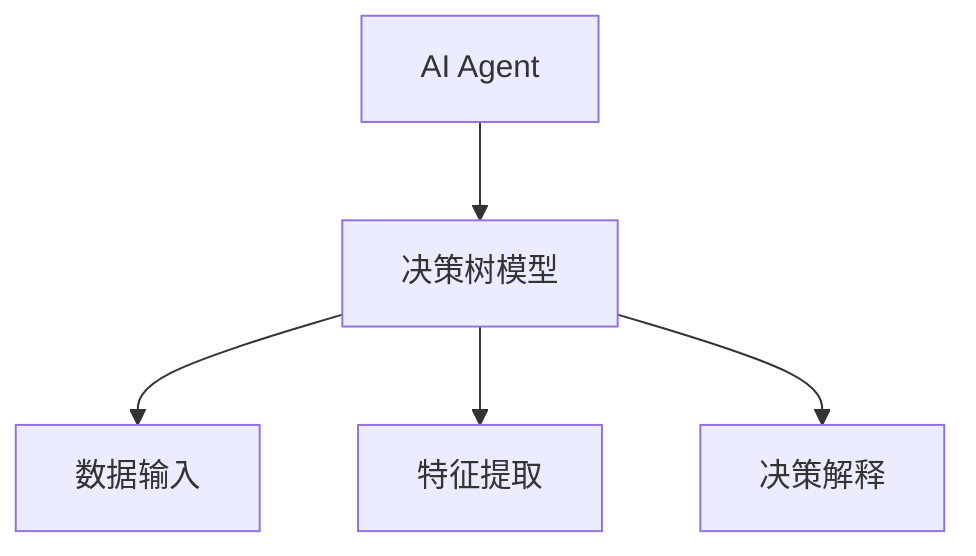

                 


好的，我将按照您的要求创作一篇关于“构建具有可解释性决策树的AI Agent”的技术博客文章。让我们先来看看文章的结构和内容安排：

# 构建具有可解释性决策树的AI Agent

> 关键词：可解释性AI、决策树、AI Agent、机器学习、数据科学

> 摘要：本文将详细探讨如何构建一个具有可解释性决策树的AI Agent。通过分析决策树的基本原理、可解释性优势，结合具体的算法实现和实际案例，帮助读者理解如何在AI Agent中实现可解释性决策树。文章将从理论到实践，逐步展开，为读者提供一个全面的指导。

---

## 第一部分：可解释性AI与决策树概述

### 第1章：可解释性AI的核心概念

#### 1.1 什么是可解释性AI
可解释性AI（Explainable AI, XAI）是指AI系统能够清晰地解释其决策过程和结果的能力。这使得人类能够理解、验证和信任AI的输出。

#### 1.2 可解释性在AI系统中的重要性
在医疗、金融、司法等领域，AI的决策必须是可以解释的，以便在出现问题时进行责任追溯和改进。

#### 1.3 可解释性与决策树的关系
决策树是一种高度可解释的机器学习模型，通过树状结构展示决策路径，使得人类能够直观理解AI的决策过程。

---

### 第2章：决策树的基本原理

#### 2.1 决策树的定义与特点
- **定义**：决策树是一种树状结构，每个内部节点表示一个特征，每个分支表示一个决策路径，叶子节点表示最终的决策结果。
- **特点**：直观、易于理解、易于解释、适合用于分类和回归问题。

#### 2.2 决策树的优势与局限性
- **优势**：
  - 可视化能力强，易于解释。
  - 适合处理离散数据和类别数据。
- **局限性**：
  - 对噪声数据敏感，容易过拟合。
  - 决策树的深度可能影响解释性。

#### 2.3 决策树在AI Agent中的应用场景
- **分类任务**：例如在医疗领域，用于诊断疾病。
- **决策支持**：例如在金融领域，用于信用评分。

---

## 第二部分：决策树算法与可解释性原理

### 第3章：决策树算法基础

#### 3.1 决策树的构建过程
- **特征选择**：通过计算信息增益、信息增益率或基尼指数选择最优特征。
- **分裂标准**：常见的分裂标准包括信息增益、信息增益率和基尼指数。

#### 3.2 常见决策树算法的实现
- **ID3算法**：基于信息增益，适用于离散特征。
- **C4.5算法**：基于信息增益率，适用于连续特征。
- **CART算法**：基于基尼指数，适用于分类和回归任务。

#### 3.3 决策树的可解释性分析
- **特征重要性**：通过计算特征在决策过程中的贡献度，确定哪些特征对最终决策影响最大。
- **决策路径**：通过遍历决策树的路径，解释每个决策节点的作用。

---

### 第4章：可解释性决策树的数学模型

#### 4.1 决策树的分裂准则
- **信息增益**：$$ \text{信息增益} = \text{熵}(S) - \text{期望熵}(S_i) $$
- **信息增益率**：$$ \text{信息增益率} = \frac{\text{信息增益}}{\text{特征的熵}} $$
- **基尼指数**：$$ \text{基尼指数} = 1 - \sum_{i=1}^{k} p_i^2 $$

#### 4.2 决策树的数学公式
- **熵的计算公式**：
  $$ \text{熵} = -\sum_{i=1}^{n} p_i \log p_i $$
- **基尼指数的计算公式**：
  $$ \text{基尼指数} = 1 - \sum_{i=1}^{k} p_i^2 $$

#### 4.3 决策树的可解释性度量
- **特征重要性**：通过计算特征在整个决策过程中的贡献度，确定哪些特征对决策影响最大。
- **叶节点的可解释性**：通过查看叶节点的标签，理解最终的分类结果。

---

## 第三部分：构建可解释性决策树的AI Agent

### 第5章：AI Agent的核心功能与架构设计

#### 5.1 AI Agent的定义与功能
- **定义**：AI Agent是一种能够感知环境、自主决策并执行任务的智能体。
- **功能**：
  - 感知环境：通过传感器或数据输入获取信息。
  - 决策：基于决策树模型做出决策。
  - 执行：根据决策结果执行任务。

#### 5.2 可解释性决策树的系统设计
- **数据输入**：接收原始数据，进行预处理和特征提取。
- **决策树构建**：基于训练数据构建可解释性决策树模型。
- **决策解释**：通过遍历决策树，生成可理解的解释。

#### 5.3 系统架构图


---

### 第6章：项目实战：构建可解释性决策树AI Agent

#### 6.1 环境配置
- **安装Python和相关库**：
  ```bash
  pip install scikit-learn
  pip install graphviz
  pip install matplotlib
  ```

#### 6.2 数据准备与特征提取
- **数据集选择**：例如使用IRIS数据集。
- **特征提取**：提取数据集中的特征，并进行标准化处理。

#### 6.3 决策树模型实现
- **使用Scikit-learn库**：
  ```python
  from sklearn.tree import DecisionTreeClassifier
  from sklearn.model_selection import train_test_split
  from sklearn.metrics import accuracy_score
  ```

#### 6.4 模型训练与评估
- **训练数据集**：
  ```python
  X_train, X_test, y_train, y_test = train_test_split(X, y, test_size=0.2)
  ```
- **模型训练**：
  ```python
  clf = DecisionTreeClassifier()
  clf.fit(X_train, y_train)
  ```

#### 6.5 模型解释
- **可视化决策树**：
  ```python
  from sklearn.tree import export_graphviz
  export_graphviz(clf, out_file='tree.dot', feature_names=feature_names)
  ```

---

### 第7章：总结与展望

#### 7.1 总结
- 可解释性决策树是一种强大的AI Agent决策机制，能够提供直观的决策路径和清晰的解释。
- 通过构建可解释性决策树，可以提高AI系统的透明度和可信度。

#### 7.2 展望
- 未来，随着AI技术的发展，可解释性决策树将在更多领域得到应用，特别是在需要高度透明性和责任追究的领域。

---

通过以上步骤，我们逐步构建了一个具有可解释性决策树的AI Agent，并详细讲解了其核心原理和实现方法。希望这篇文章能够帮助您更好地理解和应用可解释性决策树技术。

