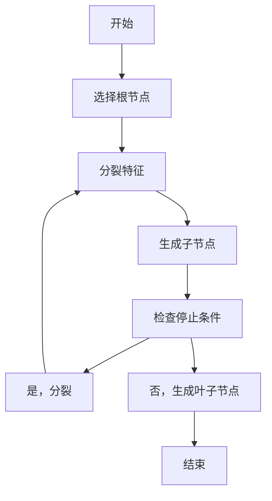
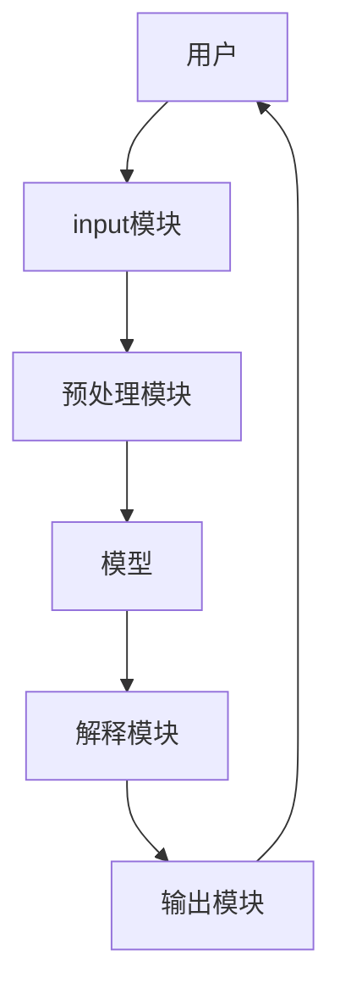
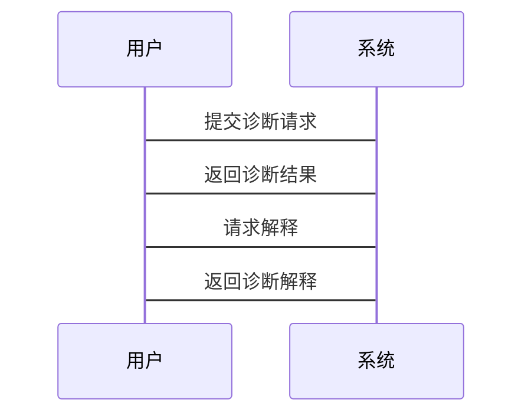

                 


# 《构建具有可解释性决策能力的AI Agent》

## 关键词：可解释性AI，AI Agent，决策树，线性模型，规则集模型，系统架构设计

## 摘要：本文深入探讨构建具有可解释性决策能力的AI Agent的关键技术，涵盖背景、核心概念、算法原理、系统设计、项目实战及总结。通过详细分析，揭示可解释性AI的重要性及其在实际应用中的实现方法。

---

# 第一部分：可解释性AI Agent的背景与基础

## 第1章：可解释性AI Agent概述

### 1.1 AI Agent的基本概念

#### 1.1.1 AI Agent的定义
AI Agent（智能体）是能够感知环境并采取行动以实现目标的实体。决策型AI Agent通过分析输入数据，生成决策并采取行动，广泛应用于医疗、金融等领域。

#### 1.1.2 决策型AI Agent的特点
- **自主性**：能够独立决策，无需外部干预。
- **反应性**：实时感知环境变化，动态调整决策。
- **目标导向**：基于目标选择最优行动路径。

#### 1.1.3 可解释性AI的必要性
随着AI决策系统的广泛应用，用户和监管机构需要了解AI的决策过程，以确保决策的正确性和合法性。例如，医疗诊断AI系统必须让用户理解诊断依据，才能被信赖和采用。

### 1.2 可解释性AI的背景与挑战

#### 1.2.1 当前AI决策系统的局限性
许多AI模型（如深度神经网络）是黑箱模型，用户无法理解其决策过程，这在需要透明性的领域（如金融、司法）构成挑战。

#### 1.2.2 可解释性在AI Agent中的重要性
可解释性AI（XAI）确保用户能够理解AI的决策过程，增强信任，并在出现问题时进行追溯和修正。

#### 1.2.3 可解释性AI的伦理与法律问题
随着AI在关键领域的应用，明确的决策解释需求成为法律和伦理上的要求。例如，GDPR规定用户有权了解自动化决策的依据。

### 1.3 本章小结
本章介绍了AI Agent的基本概念、决策型AI Agent的特点，以及可解释性AI的重要性。强调了在实际应用中，可解释性是用户信任和法律合规的关键因素。

---

## 第2章：可解释性AI的核心概念与联系

### 2.1 可解释性AI的定义与特点

#### 2.1.1 可解释性的定义
可解释性指AI系统的决策过程能够以人类可理解的方式被解释。这意味着用户能够理解AI为什么做出特定决策。

#### 2.1.2 可解释性AI的核心属性
- **透明性**：AI的决策过程对用户透明。
- **可理解性**：用户能够理解AI的决策逻辑。
- **可追溯性**：用户能够追踪AI决策的依据。

#### 2.1.3 可解释性与不可解释性AI的对比

| 特性         | 可解释性AI               | 不可解释性AI             |
|--------------|--------------------------|--------------------------|
| 透明性       | 高                      | 低                      |
| 可理解性     | 高                      | 低                      |
| 可追溯性     | 高                      | 低                      |

### 2.2 可解释性AI的关键特征

#### 2.2.1 透明性
AI的决策过程对用户开放，用户能够理解模型如何得出结论。

#### 2.2.2 可理解性
用户能够理解AI的决策逻辑，通常通过简单的规则或流程图实现。

#### 2.2.3 可追溯性
用户能够追踪AI决策的依据，了解每个决策背后的因素。

### 2.3 可解释性AI的ER实体关系图

```mermaid
erDiagram
    customer[用户] 
    decision[决策] 
    explanation[解释]
    rule[规则]
    attribute[属性]
    customer -|> decision
    decision -|> explanation
    explanation -|> rule
    rule -|> attribute
```

### 2.4 本章小结
本章详细介绍了可解释性AI的核心概念、关键特征，并通过ER实体关系图展示了各概念之间的关系。理解这些概念有助于后续算法和系统设计。

---

## 第3章：可解释性AI的算法原理

### 3.1 可解释性AI的典型算法

#### 3.1.1 决策树算法
决策树是一种直观且易于解释的算法，常用于分类和回归问题。

#### 3.1.2 线性模型
线性回归和逻辑回归模型具有良好的可解释性，适用于简单的预测任务。

#### 3.1.3 规则集模型
基于规则的模型通过一系列条件判断进行决策，具有较高的可解释性。

### 3.2 决策树算法的工作原理



### 3.3 线性模型的数学模型

#### 3.3.1 线性回归模型
$$ y = \beta_0 + \beta_1x + \epsilon $$

#### 3.3.2 逻辑回归模型
$$ P(y=1|x) = \frac{1}{1 + e^{- (\beta_0 + \beta_1x)}} $$

### 3.4 规则集模型的实现

#### 3.4.1 规则生成
通过决策树生成规则，例如：
```python
if age > 30 and income > 50k then approve else deny
```

### 3.5 本章小结
本章详细介绍了几种典型的可解释性算法，包括决策树、线性模型和规则集模型，并通过图表和公式展示了它们的工作原理。

---

## 第4章：可解释性AI的系统分析与架构设计

### 4.1 可解释性AI的系统分析

#### 4.1.1 项目背景
以医疗诊断AI Agent为例，说明可解释性AI的应用场景和需求。

#### 4.1.2 系统功能设计
- 数据输入模块：接收患者数据
- 特征提取模块：提取关键特征
- 模型选择模块：选择合适的解释模型
- 结果解释模块：生成可理解的解释

### 4.2 系统架构设计



### 4.3 接口设计与交互流程图



### 4.4 本章小结
本章通过医疗诊断AI Agent的案例，详细介绍了系统的分析和架构设计，展示了可解释性AI在实际应用中的系统结构。

---

## 第5章：可解释性AI的项目实战

### 5.1 环境安装

```bash
pip install scikit-learn
pip install mermaid
```

### 5.2 核心代码实现

#### 5.2.1 决策树模型实现

```python
from sklearn.tree import DecisionTreeClassifier
from sklearn import tree

# 训练模型
model = DecisionTreeClassifier()
model.fit(X_train, y_train)

# 绘制决策树
tree.plot_tree(model)
```

#### 5.2.2 结果解释

```python
def explain_decision(model, input_data):
    # 获取决策路径
    path = model.decision_path(input_data)
    # 提取叶子节点
    leaf = path[-1]
    # 获取叶子节点的标签
    prediction = model.predict(input_data)
    return prediction
```

### 5.3 项目小结
本章通过实际项目展示了可解释性AI的实现过程，包括环境安装、代码实现和结果解释。

---

## 第6章：总结与展望

### 6.1 总结
本文详细探讨了构建具有可解释性决策能力的AI Agent的关键技术，包括背景、核心概念、算法原理、系统设计和项目实战。

### 6.2 未来展望
未来的研究方向包括结合强化学习和知识图谱的可解释性模型，以及多模态数据的可解释性处理。

### 6.3 最佳实践Tips
- 保持模型简单，提高可解释性。
- 提供多种解释方式，满足不同用户需求。
- 定期更新模型，确保决策的准确性和可解释性。

---

## 附录：参考文献

（此处列出相关文献和资源）

---

## 结语

通过本文的详细讲解，读者可以全面理解构建具有可解释性决策能力的AI Agent的技术要点，并能够在实际应用中进行有效设计和实现。

