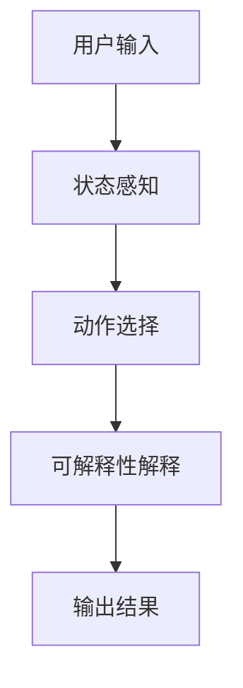
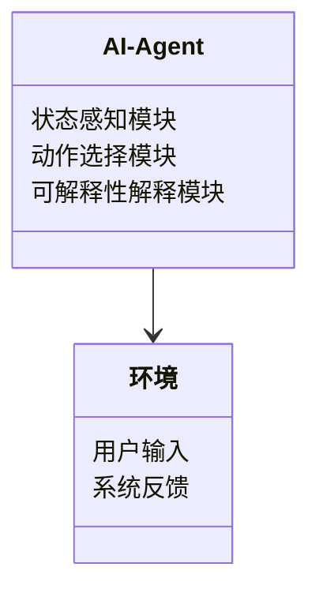
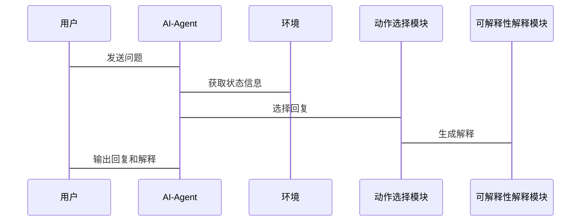

                 


# 构建具有可解释性强化学习能力的AI Agent

---

## 关键词：  
AI Agent, 强化学习, 可解释性, Q-learning, 策略梯度, 系统架构设计, 项目实战

---

## 摘要：  
本文详细探讨了如何构建具有可解释性强化学习能力的AI Agent。通过分析强化学习的核心原理、可解释性AI的重要性，以及两者结合的方法，本文为读者提供了从理论到实践的完整指导。文章涵盖强化学习的基本概念、可解释性AI的实现策略、强化学习的数学模型、系统架构设计、项目实战以及未来研究方向。

---

# 第1章: 强化学习与可解释性AI概述

## 1.1 强化学习的基本概念  
### 1.1.1 强化学习的定义与核心要素  
强化学习（Reinforcement Learning, RL）是一种机器学习范式，通过智能体与环境的交互，学习最优策略以最大化累积奖励。其核心要素包括：  
1. **状态（State）**：智能体所处的环境状况。  
2. **动作（Action）**：智能体在给定状态下采取的行为。  
3. **奖励（Reward）**：智能体采取动作后获得的反馈，用于评估动作的好坏。  
4. **策略（Policy）**：智能体在不同状态下选择动作的规则。  
5. **价值函数（Value Function）**：评估某个状态下采取特定动作后的预期累积奖励。  

### 1.1.2 强化学习的背景与应用领域  
强化学习起源于马尔可夫决策过程（MDP）理论，广泛应用于机器人控制、游戏AI、自动驾驶等领域。  

### 1.1.3 可解释性AI的定义与重要性  
可解释性AI（Explainable AI, XAI）是指AI系统能够以人类可理解的方式解释其决策过程。在医疗、金融等领域，可解释性是信任和合规的关键。  

## 1.2 AI Agent的基本原理  
### 1.2.1 AI Agent的定义与分类  
AI Agent是指在环境中感知并自主决策的智能体。根据智能体的复杂性，可分为简单反射型Agent和复杂 deliberative Agent。  

### 1.2.2 强化学习在AI Agent中的作用  
强化学习通过与环境交互，帮助AI Agent学习最优决策策略。  

### 1.2.3 可解释性AI Agent的挑战与机遇  
可解释性AI Agent需要在保持高性能的同时，提供透明的决策过程。  

## 1.3 本章小结  
本章介绍了强化学习的基本概念、AI Agent的原理以及可解释性AI的重要性，为后续内容奠定了基础。

---

# 第2章: 强化学习的核心原理  

## 2.1 马尔可夫决策过程（MDP）  
### 2.1.1 MDP的定义与数学模型  
MDP由五元组 $(S, A, P, R, \gamma)$ 表示，其中：  
- $S$：状态空间  
- $A$：动作空间  
- $P(s'|s,a)$：从状态 $s$ 采取动作 $a$ 后转移到状态 $s'$ 的概率  
- $R(s,a)$：从状态 $s$ 采取动作 $a$ 后获得的奖励  
- $\gamma$：折扣因子  

### 2.1.2 策略与价值函数的数学表达  
- **策略 $\pi$**：$a = \pi(s)$，表示在状态 $s$ 下采取动作 $a$ 的概率。  
- **价值函数 $V(s)$**：$V(s) = \mathbb{E}[R_{t+1} + \gamma R_{t+2} + \gamma^2 R_{t+3} + \dots | s]$  

## 2.2 Q-learning算法  
### 2.2.1 Q-learning的基本原理  
Q-learning通过学习动作-价值函数 $Q(s,a)$，更新公式为：  
$$ Q(s,a) \leftarrow Q(s,a) + \alpha [r + \gamma \max Q(s',a') - Q(s,a)] $$  

### 2.2.2 Q-learning的数学模型与公式  
Q-learning的目标是逼近最优策略 $Q^*(s,a)$，即：  
$$ Q^*(s,a) = \max_{a'} Q^*(s',a') $$  

### 2.2.3 Q-learning的收敛性分析  
Q-learning在离散状态和动作空间下，可以收敛到最优策略。  

## 2.3 策略梯度方法  
### 2.3.1 策略梯度的基本概念  
策略梯度方法通过优化策略的参数 $\theta$，使目标函数 $J(\theta) = \mathbb{E}[R]$ 最大化。  

### 2.3.2 策略梯度的数学推导  
策略梯度更新公式为：  
$$ \theta \leftarrow \theta + \alpha \nabla_\theta J(\theta) $$  

### 2.3.3 策略梯度与Q-learning的对比分析  
策略梯度直接优化策略，而Q-learning通过学习价值函数间接优化策略。  

## 2.4 本章小结  
本章详细介绍了强化学习的核心原理，包括MDP、Q-learning和策略梯度方法，为后续章节奠定了理论基础。

---

# 第3章: 可解释性强化学习的核心概念  

## 3.1 可解释性AI的定义与特征  
### 3.1.1 可解释性的定义  
可解释性是指AI系统能够以人类可理解的方式解释其决策过程。  

### 3.1.2 可解释性的特征对比表格  
| 特征         | 不可解释性AI | 可解释性AI |  
|--------------|-------------|------------|  
| 透明度       | 低          | 高          |  
| 用户信任     | 低          | 高          |  
| 调试难度     | 高          | 低          |  

### 3.1.3 可解释性与不可解释性AI的对比分析  
可解释性AI在医疗、金融等领域更具优势，但可能在复杂任务中表现稍逊。  

## 3.2 强化学习中的可解释性挑战  
### 3.2.1 动作序列的可解释性问题  
复杂任务中，动作序列的因果关系难以解析。  

### 3.2.2 状态空间的复杂性与可解释性  
高维状态空间增加了决策过程的不透明性。  

## 3.3 可解释性强化学习的实现方法  
### 3.3.1 基于规则的可解释性方法  
通过预定义规则解释决策过程。  

### 3.3.2 基于模型的可解释性方法  
通过模型展示决策背后的逻辑。  

### 3.3.3 基于分解的可解释性方法  
将复杂决策分解为多个可解释的子决策。  

## 3.4 本章小结  
本章分析了可解释性强化学习的核心概念和实现方法，为后续章节的设计提供了思路。

---

# 第4章: 可解释性强化学习的数学模型  

## 4.1 强化学习的数学模型  
### 4.1.1 MDP的数学表达  
如前所述，MDP由五元组 $(S, A, P, R, \gamma)$ 表示。  

### 4.1.2 Q-learning的数学公式  
$$ Q(s,a) \leftarrow Q(s,a) + \alpha [r + \gamma \max Q(s',a') - Q(s,a)] $$  

### 4.1.3 策略梯度的数学推导  
$$ \theta \leftarrow \theta + \alpha \nabla_\theta J(\theta) $$  

## 4.2 可解释性强化学习的数学模型  
### 4.2.1 可解释性强化学习的目标函数  
通过引入可解释性约束，优化目标函数：  
$$ \min_{\theta} \mathbb{E}[R] + \lambda \cdot \text{可解释性指标} $$  

### 4.2.2 可解释性强化学习的算法推导  
结合强化学习和可解释性目标，推导新的算法框架。  

## 4.3 本章小结  
本章通过数学模型分析了可解释性强化学习的实现方法，为系统设计提供了理论支持。

---

# 第5章: 可解释性强化学习的系统架构设计  

## 5.1 问题场景介绍  
以智能客服对话系统为例，设计一个可解释性强化学习的AI Agent。  

## 5.2 系统功能设计  
### 5.2.1 系统功能模块  
- 状态感知模块  
- 动作选择模块  
- 可解释性解释模块  

### 5.2.2 系统功能流程图  


## 5.3 系统架构设计  
### 5.3.1 系统架构图  


## 5.4 系统接口设计  
- 用户输入接口  
- 系统反馈接口  

## 5.5 系统交互流程图  


## 5.6 本章小结  
本章通过系统架构设计，展示了可解释性强化学习AI Agent的实现框架。

---

# 第6章: 可解释性强化学习的项目实战  

## 6.1 环境安装  
- Python 3.8+  
- 安装依赖：`pip install numpy matplotlib gym`  

## 6.2 系统核心实现源代码  
```python
import gym
import numpy as np

class AI_Agent:
    def __init__(self, env):
        self.env = env
        self.gamma = 0.99
        self.lr = 0.01
        self.Q = np.zeros((env.observation_space.n, env.action_space.n))

    def epsilon_greedy_policy(self, state, epsilon=0.1):
        if np.random.random() < epsilon:
            return np.random.randint(self.env.action_space.n)
        else:
            return np.argmax(self.Q[state])

    def update_Q(self, state, action, reward, next_state):
        self.Q[state, action] += self.lr * (reward + self.gamma * np.max(self.Q[next_state]) - self.Q[state, action])

    def explain_decision(self, state):
        action = np.argmax(self.Q[state])
        return f"选择动作{action}，因为状态{state}下的Q值最高为{self.Q[state, action]}"

env = gym.make('CartPole-v0')
agent = AI_Agent(env)

for episode in range(1000):
    state = env.reset()
    while True:
        action = agent.epsilon_greedy_policy(state)
        next_state, reward, done, _ = env.step(action)
        agent.update_Q(state, action, reward, next_state)
        if done:
            break
        state = next_state
```

## 6.3 代码应用解读与分析  
- **AI_Agent类**：初始化环境和参数，定义epsilon-greedy策略，更新Q表，解释决策。  
- **epsilon_greedy_policy**：平衡探索与利用的策略。  
- **update_Q**：Q-learning算法的核心更新公式。  
- **explain_decision**：生成可解释的决策描述。  

## 6.4 实际案例分析  
以CartPole-v0环境为例，展示AI Agent的训练过程和解释能力。  

## 6.5 项目小结  
本章通过实际项目展示了可解释性强化学习AI Agent的实现过程，验证了理论的可行性。

---

# 第7章: 总结与展望  

## 7.1 本章总结  
本文详细探讨了可解释性强化学习AI Agent的构建过程，涵盖了理论分析、系统设计和项目实现。  

## 7.2 未来研究方向  
- 更高效的可解释性强化学习算法  
- 可解释性与实时性的平衡优化  
- 多智能体系统的可解释性问题  

## 7.3 最佳实践Tips  
- 在复杂任务中，优先选择基于规则的可解释性方法  
- 定期验证可解释性模型的准确性和实用性  

## 7.4 本章小结  
本文总结了可解释性强化学习的重要性和实现方法，为未来的研究提供了方向。

---

# 参考文献  
（此处列出相关文献和资源）

---

**全文完**

