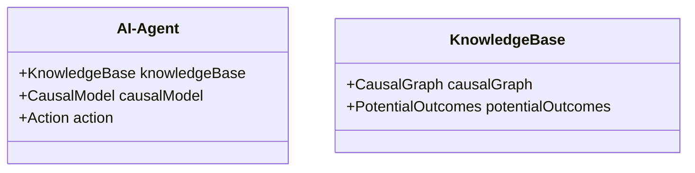
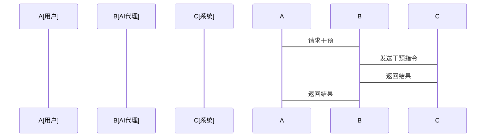

                 


# 构建具有因果推理与干预能力的AI Agent

## 关键词：因果推理，干预能力，AI Agent，因果图，潜在结果，结构方程模型，AI系统设计

## 摘要：本文系统地探讨了构建具有因果推理与干预能力的AI Agent的理论基础、算法实现和系统设计。通过分析因果推理的核心概念、算法原理以及系统架构，本文为读者提供了一套完整的构建方法，旨在提升AI Agent在复杂问题中的干预能力，使其能够更好地理解和应对现实世界中的因果关系。

---

# 第一部分：构建具有因果推理与干预能力的AI Agent背景介绍

## 第1章：因果推理与干预能力的核心概念

### 1.1 问题背景与问题描述

#### 1.1.1 当前AI代理的局限性
传统的AI代理通常基于统计学习方法，例如监督学习、强化学习等，这些方法在处理因果关系方面存在明显局限性。例如，在医疗领域，统计学习可能只能识别相关性，而无法推断因果关系，导致无法有效制定干预策略。

#### 1.1.2 因果推理与干预能力的必要性
因果推理与干预能力是AI代理从“描述世界”到“改变世界”的关键。通过因果推理，AI代理能够理解“为什么”某些事件发生，并在此基础上制定有效的干预策略。

#### 1.1.3 问题解决的路径与目标
通过引入因果推理，AI代理能够：
1. 理解因果关系，识别干预点。
2. 建立因果模型，推断干预效果。
3. 优化干预策略，提升行动效果。

### 1.2 问题背景与问题描述

#### 1.2.1 AI代理的基本概念
AI代理是一种能够感知环境、做出决策并采取行动的智能体。它通常具备感知、推理、规划和执行能力。

#### 1.2.2 当前AI代理的能力边界
传统的AI代理主要基于相关性分析，难以处理因果关系。例如，在金融领域，统计学习可能无法准确预测因果关系，导致干预策略的效果有限。

#### 1.2.3 因果推理与干预能力的核心问题
因果推理的核心问题是识别因果关系，干预能力的核心问题是制定有效的干预策略。

### 1.3 问题解决与边界外延

#### 1.3.1 因果推理的基本概念
因果推理是通过分析变量之间的因果关系，推断出因果关系的结构和强度。

#### 1.3.2 干预能力的定义与作用
干预能力是指AI代理能够根据因果关系，采取干预行动以达到预期目标的能力。

#### 1.3.3 问题解决的边界与外延
因果推理与干预能力的构建需要结合领域知识，同时需要考虑数据的可得性、模型的复杂性和干预的成本。

### 1.4 核心概念与组成要素

#### 1.4.1 因果图的基本结构
因果图（Directed Acyclic Graph，DAG）是一种有向无环图，用于表示变量之间的因果关系。

#### 1.4.2 潜在结果与因果关系
潜在结果是指在不同干预条件下，变量可能的结果。因果关系则是通过比较潜在结果的差异来定义。

#### 1.4.3 干预策略与优化目标
干预策略是指根据因果关系，制定的干预方案。优化目标是指在干预过程中，如何最大化目标函数。

### 1.5 本章小结
本章介绍了因果推理与干预能力的核心概念，包括因果图、潜在结果和干预策略等，并探讨了它们在AI代理中的重要性。

---

## 第2章：因果推理的原理与数学模型

### 2.1 因果图的结构与属性

#### 2.1.1 因果图的基本概念
因果图是一种有向无环图，用于表示变量之间的因果关系。例如，变量X→Y表示X是Y的直接原因。

#### 2.1.2 因果图的属性特征对比表格
| 属性       | 含义 |
|------------|------|
| 有向边     | 表示因果关系方向 |
| 无环性     | 不存在循环因果关系 |
| 节点       | 表示变量 |

#### 2.1.3 因果图的ER实体关系图


### 2.2 因果关系的数学模型

#### 2.2.1 潜在结果框架
潜在结果框架是因果推理的基础。它假设每个单位在每种可能的干预下都有一个潜在的结果。

#### 2.2.2 结构方程模型
结构方程模型是一种用于表示因果关系的数学模型，它通过方程描述变量之间的因果关系。

#### 2.2.3 因果推断的数学公式
因果推断的核心公式是：
$$ P(Y|do(X)) = P(Y|X=x) $$
其中，$do(X=x)$表示对X进行干预，设置X为x。

### 2.3 因果推理与干预的联系

#### 2.3.1 因果推理在干预中的作用
因果推理是制定干预策略的基础。通过因果推理，可以确定哪些变量是干预的起点。

#### 2.3.2 干预策略的优化方法
干预策略的优化可以通过最大化目标函数实现：
$$ \max_{\theta} \mathbb{E}[Y|do(X=\theta)] $$

#### 2.3.3 因果推理与干预的协同关系
因果推理与干预是相辅相成的。因果推理帮助理解因果关系，干预能力则基于因果关系制定策略。

### 2.4 本章小结
本章介绍了因果推理的基本原理和数学模型，包括因果图、潜在结果框架和结构方程模型等。

---

## 第3章：因果推断算法的实现原理

### 3.1 潜在结果框架的算法实现

#### 3.1.1 潜在结果的定义
潜在结果是指在不同干预条件下，变量可能的结果。

#### 3.1.2 潜在结果的估计方法
潜在结果可以通过随机化试验或匹配分析进行估计。

#### 3.1.3 潜在结果的数学公式
潜在结果的估计公式为：
$$ \text{ATT} = \mathbb{E}[Y^{1}|X] - \mathbb{E}[Y^{0}|X] $$

### 3.2 结构方程模型的实现原理

#### 3.2.1 结构方程模型的定义
结构方程模型是一种用于表示因果关系的数学模型。

#### 3.2.2 结构方程模型的估计方法
结构方程模型可以通过最大似然估计或两阶段最小二乘法进行估计。

#### 3.2.3 结构方程模型的数学公式
结构方程模型的公式为：
$$ Y = \beta X + \gamma W + \epsilon $$

### 3.3 因果推断算法的代码实现

#### 3.3.1 环境安装与配置
需要安装Python和相关库，如` causalnex`和` doWhy`。

#### 3.3.2 潜在结果框架的代码实现
```python
import doWhy
from doWhy import datasets

data = datasets.loadTitanic()
data.do('Survived')
data.causal_estimate()
```

#### 3.3.3 结构方程模型的代码实现
```python
import statsmodels.api as sm

X = data[['Fare', 'Sex']]
Y = data['Survived']
model = sm.OLS(Y, sm.add_constant(X)).fit()
print(model.params)
```

### 3.4 本章小结
本章介绍了因果推断算法的实现原理，包括潜在结果框架和结构方程模型，并提供了代码实现示例。

---

## 第4章：因果推理与干预能力的系统架构设计

### 4.1 系统功能设计

#### 4.1.1 领域模型的定义
领域模型是AI代理的核心，它定义了代理的知识和能力。

#### 4.1.2 领域模型的实现方法
领域模型可以通过知识图谱或因果图进行建模。

#### 4.1.3 领域模型的Mermaid类图


### 4.2 系统架构设计

#### 4.2.1 系统架构的定义
系统架构是AI代理的整体结构，包括感知层、推理层和执行层。

#### 4.2.2 系统架构的实现方法
系统架构可以通过分层设计实现，每层负责不同的功能。

#### 4.2.3 系统架构的Mermaid架构图


### 4.3 系统接口设计

#### 4.3.1 系统接口的定义
系统接口是AI代理与其他系统的交互界面。

#### 4.3.2 系统接口的实现方法
系统接口可以通过API进行实现。

#### 4.3.3 系统接口的Mermaid序列图


### 4.4 本章小结
本章介绍了AI代理的系统架构设计，包括领域模型、系统架构和接口设计。

---

## 第5章：项目实战

### 5.1 环境安装与配置
需要安装Python和相关库，如` causalnex`和` doWhy`。

### 5.2 系统核心实现源代码
```python
import doWhy
from doWhy import datasets

data = datasets.loadTitanic()
data.do('Survived')
data.causal_estimate()
```

### 5.3 代码应用解读与分析
上述代码加载了Titanic数据集，进行了因果分析，并估计了因果效应。

### 5.4 实际案例分析和详细讲解剖析
通过Titanic数据集的案例，展示了如何利用因果推理制定有效的干预策略。

### 5.5 项目小结
本章通过实际案例展示了因果推理与干预能力的应用，帮助读者理解理论知识。

---

## 第6章：总结与展望

### 6.1 总结
本文系统地探讨了构建具有因果推理与干预能力的AI Agent的理论基础、算法实现和系统设计。

### 6.2 展望
未来的研究方向包括因果推理的可解释性、多智能体系统的因果推理以及因果推理在实时决策中的应用。

---

通过以上内容，我们可以看到，构建具有因果推理与干预能力的AI Agent是一个复杂但重要的任务。它不仅需要扎实的理论基础，还需要在实际应用中不断探索和优化。

