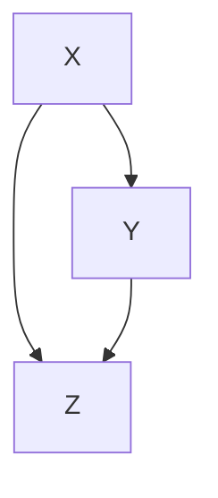
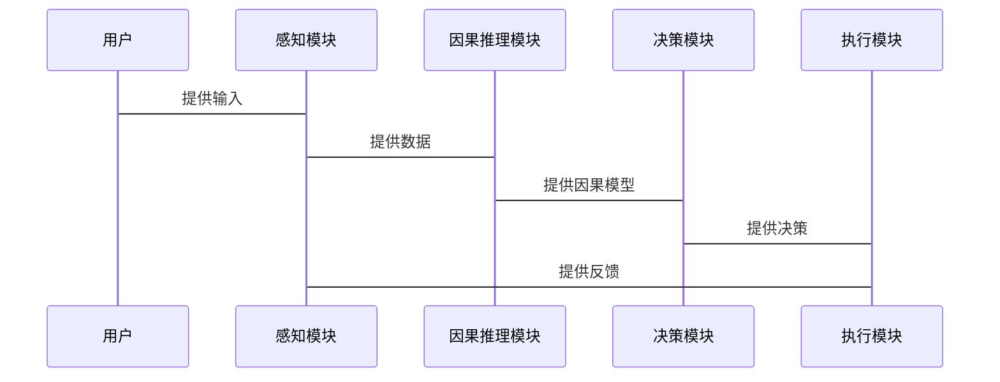

                 


# 构建具有因果推理能力的AI Agent

> 关键词：因果推理，AI Agent，反事实推理，结构方程模型，系统架构，Python实现

> 摘要：本文详细探讨了构建具有因果推理能力的AI Agent的方法，从背景介绍、核心概念、算法原理到系统架构和项目实战，全面解析了如何在AI Agent中实现因果推理。通过理论与实践相结合的方式，为读者提供了从理解到实现的完整指南。

---

# 第一部分: 构建具有因果推理能力的AI Agent基础

## 第1章: 背景介绍与问题背景

### 1.1 问题背景

#### 1.1.1 当前AI Agent的发展现状
AI Agent（智能体）是指在环境中能够感知并自主行动以实现目标的实体。近年来，随着深度学习和自然语言处理技术的快速发展，AI Agent在各个领域得到了广泛应用，例如自动驾驶、智能助手、医疗诊断等。然而，当前的AI Agent大多依赖于统计关联性进行决策，缺乏对因果关系的理解，这在处理复杂问题时显得力不从心。

#### 1.1.2 因果推理在AI Agent中的重要性
因果推理是指理解一个事件如何导致另一个事件的能力。在AI Agent中，因果推理能够帮助智能体理解动作与结果之间的关系，从而做出更合理的决策。例如，在医疗诊断中，AI Agent需要理解药物的使用如何导致患者的病情变化，而不仅仅是观察到两者之间的相关性。

#### 1.1.3 当前存在的主要问题与挑战
尽管AI Agent在某些领域取得了显著进展，但大多数系统仍然无法有效处理因果关系。主要问题包括：
- **因果关系的复杂性**：因果关系可能涉及多个变量和间接影响。
- **数据的稀缺性**：因果推理通常需要干预数据，而这类数据往往难以获取。
- **算法的局限性**：现有的因果推理算法在处理动态和不确定性环境时表现有限。

### 1.2 问题描述

#### 1.2.1 AI Agent的核心功能与目标
AI Agent的核心功能包括感知环境、推理因果关系、制定决策和执行行动。其目标是在动态和不确定的环境中实现目标，同时具备学习和自适应能力。

#### 1.2.2 因果推理的基本概念与定义
因果推理是研究因果关系的科学，旨在理解一个事件如何导致另一个事件。在AI Agent中，因果推理需要将观察到的现象与潜在的因果关系联系起来。

#### 1.2.3 问题解决的边界与外延
因果推理在AI Agent中的应用范围包括：
- **决策制定**：基于因果关系做出最优决策。
- **反事实推理**：评估“如果采取其他行动，结果会如何”。
- **复杂系统建模**：理解和模拟多变量系统的因果关系。

### 1.2.4 系统的结构与核心要素组成

- **感知模块**：负责收集环境中的数据。
- **因果推理模块**：分析数据，建立因果模型。
- **决策模块**：基于因果模型制定行动策略。
- **执行模块**：执行决策并反馈结果。

### 1.3 本章小结
本章介绍了因果推理在AI Agent中的重要性，分析了当前存在的问题与挑战，并明确了AI Agent的结构与核心要素。

---

## 第2章: 因果推理的核心概念与联系

### 2.1 因果推理的基本原理

#### 2.1.1 因果关系的定义与特征
因果关系是指一个事件（原因）导致另一个事件（结果）的发生。其特征包括：
- **时间顺序**：原因发生在结果之前。
- **内在关系**：原因直接影响结果。
- **可干预性**：可以通过干预来改变结果。

#### 2.1.2 因果推理的数学模型
因果推理可以通过概率论和图论进行建模。常见的数学模型包括：
- **因果图（Directed Acyclic Graph, DAG）**：用于表示变量之间的因果关系。
- **潜在结果框架（Potential Outcome Framework）**：用于分析每个变量对结果的影响。

#### 2.1.3 因果图的构建与解释
因果图通过有向边表示变量之间的因果关系。例如，以下因果图表示变量X影响变量Y和Z，而Y又影响Z。



### 2.2 反事实推理与因果推理的关系

#### 2.2.1 反事实推理的定义与应用
反事实推理是指评估在假设采取不同行动的情况下，结果会如何变化。例如，评估如果患者不服用药物，病情会如何发展。

#### 2.2.2 因果推理与反事实推理的联系
反事实推理是因果推理的一种形式，用于分析“如果”情况下的结果。因果推理为反事实推理提供了理论基础。

#### 2.2.3 反事实推理在AI Agent中的应用
在医疗诊断中，AI Agent可以通过反事实推理评估不同治疗方案的效果。

### 2.3 结构方程模型与因果推理

#### 2.3.1 结构方程模型的定义与特点
结构方程模型（SEM）是一种统计方法，用于估计变量之间的因果关系。其特点包括：
- **明确的因果假设**：模型中明确表示变量之间的因果关系。
- **同时分析多个变量**：可以同时分析多个变量的相互影响。

#### 2.3.2 结构方程模型与因果图的关系
结构方程模型可以看作是因果图的一种数学表示。例如，以下因果图可以用结构方程模型表示：


#### 2.3.3 结构方程模型在因果推理中的应用
结构方程模型广泛应用于社会科学、经济学等领域，用于估计变量之间的因果关系。

### 2.4 核心概念对比表

| 概念 | 定义 | 特征 | 应用 |
|------|------|------|------|
| 因果关系 | 一个事件导致另一个事件 | 时间顺序、内在关系、可干预性 | 决策制定、反事实推理、复杂系统建模 |
| 因果图 | 表示变量间因果关系的有向无环图 | 可视化、易于理解 | 分析因果关系、识别因果路径 |
| 反事实推理 | 评估假设性情况下的结果 | 假设性、反向推理 | 治疗方案评估、政策分析 |

### 2.5 ER实体关系图

```mermaid
erDiagram
    actor 用户
    actor 环境
    actor AI Agent
    actor 数据源
    boundary 感知模块
    boundary 因果推理模块
    boundary 决策模块
    boundary 执行模块
    用户 --> 感知模块: 提供输入
    环境 --> 感知模块: 提供环境数据
    感知模块 --> 因果推理模块: 提供数据
    因果推理模块 --> 决策模块: 提供因果模型
    决策模块 --> 执行模块: 提供决策
    执行模块 --> 环境: 执行行动
    数据源 --> 因果推理模块: 提供背景数据
```

### 2.6 本章小结
本章详细介绍了因果推理的核心概念，包括因果关系、因果图和结构方程模型，并通过对比表和实体关系图展示了这些概念之间的联系。

---

## 第3章: 因果推理算法原理与实现

### 3.1 因果推断的数学模型

#### 3.1.1 因果图的构建与表示
因果图通过有向边表示变量之间的因果关系。例如，以下因果图表示X影响Y和Z，而Y又影响Z。


#### 3.1.2 潜在结果框架
潜在结果框架通过定义每个变量对结果的影响来分析因果关系。例如，假设X是药物，Y是病情，潜在结果框架可以表示为：

$$ Y = f(X) $$

其中，f(X)表示在给定X的情况下，Y的可能结果。

#### 3.1.3 因果推断的公式与定理
因果推断可以通过以下公式进行：

$$ P(Y|do(X)) = \sum_{x} P(Y|X=x) P(X=x) $$

其中，do(X)表示对X进行干预。

### 3.2 ID算法（Identification Algorithm）

#### 3.2.1 ID算法的基本原理
ID算法是一种用于识别因果效应的算法。它通过构建因果图并检查是否存在有效的干预路径来确定因果效应是否可识别。

#### 3.2.2 ID算法的步骤与流程
ID算法的步骤如下：
1. 构建因果图。
2. 检查是否存在有效的干预路径。
3. 如果存在，则因果效应可识别；否则，无法识别。

#### 3.2.3 ID算法的数学推导
ID算法的数学推导基于潜在结果框架和因果图的结构。具体推导如下：

假设因果图中X是Y的父节点，且X和Y之间没有其他路径，则：

$$ P(Y|do(X)) = P(Y|X) $$

### 3.3 反事实推理算法

#### 3.3.1 反事实推理的基本步骤
反事实推理的基本步骤包括：
1. 定义反事实假设。
2. 构建因果模型。
3. 评估反事实假设下的结果。

#### 3.3.2 反事实推理的实现方法
反事实推理可以通过以下公式进行：

$$ P(Y|not do(X)) = \sum_{x} P(Y|X=x) P(X=x) $$

#### 3.3.3 反事实推理的数学模型
反事实推理的数学模型基于潜在结果框架，通过假设干预变量来分析结果。

### 3.4 算法实现的Python代码示例

#### 3.4.1 ID算法的Python实现

```python
def id_algorithm(cause, effect, graph):
    # 检查是否存在有效的干预路径
    paths = find_all_paths(cause, effect, graph)
    for path in paths:
        if is_valid_intervention_path(path):
            return True
    return False
```

#### 3.4.2 反事实推理的Python实现

```python
def factual_reasoning(graph, variables, intervention):
    # 评估反事实假设下的结果
    for var in variables:
        if var == intervention:
            continue
        # 分析变量对结果的影响
        pass
```

### 3.5 本章小结
本章详细介绍了因果推断的数学模型和ID算法，并通过Python代码示例展示了算法的实现方法。

---

## 第4章: 系统架构设计与实现

### 4.1 系统架构设计

#### 4.1.1 系统结构与模块划分
AI Agent的系统架构包括以下几个模块：
- **感知模块**：负责收集环境数据。
- **因果推理模块**：分析数据，建立因果模型。
- **决策模块**：基于因果模型制定决策。
- **执行模块**：执行决策并反馈结果。

#### 4.1.2 系统功能设计
系统功能包括：
- 数据采集与处理。
- 因果模型构建。
- 决策制定与执行。

#### 4.1.3 系统架构图

```mermaid
graph TD
    感知模块 --> 因果推理模块: 提供数据
    因果推理模块 --> 决策模块: 提供因果模型
    决策模块 --> 执行模块: 提供决策
    执行模块 --> 感知模块: 提供反馈
```

### 4.2 系统接口设计

#### 4.2.1 接口定义
系统接口包括：
- 数据接口：用于感知模块和因果推理模块之间的数据传输。
- 决策接口：用于决策模块和执行模块之间的决策传递。

#### 4.2.2 接口实现
数据接口可以通过REST API实现，决策接口可以通过消息队列实现。

### 4.3 系统交互流程

#### 4.3.1 交互流程图



### 4.4 本章小结
本章详细介绍了AI Agent的系统架构设计，包括模块划分、功能设计和接口设计，并通过图表展示了系统的交互流程。

---

## 第5章: 项目实战与案例分析

### 5.1 项目实战

#### 5.1.1 环境配置
项目实战需要以下环境：
- Python 3.8+
- Mermaid工具
- 必要的Python库（如networkx、pymc等）。

#### 5.1.2 代码实现
以下是项目的Python代码示例：

```python
import networkx as nx

def build_causal_graph(variables, edges):
    graph = nx.DiGraph()
    graph.add_nodes_from(variables)
    graph.add_edges_from(edges)
    return graph

# 定义变量和边
variables = ['X', 'Y', 'Z']
edges = [('X', 'Y'), ('X', 'Z'), ('Y', 'Z')]
graph = build_causal_graph(variables, edges)

# 可视化因果图
nx.draw(graph, with_labels=True, arrowstyle='->')
```

#### 5.1.3 功能解读
上述代码构建了一个因果图，并通过networkx库可视化了图的结构。

### 5.2 案例分析

#### 5.2.1 案例背景
假设我们正在开发一个医疗诊断AI Agent，需要分析药物X对病情Y的影响。

#### 5.2.2 案例分析
通过因果推理，我们发现药物X不仅直接影响病情Y，还通过中间变量Z影响Y。因此，决策模块需要考虑Z的变化对Y的影响。

#### 5.2.3 代码实现
以下是因果推理的代码实现：

```python
def causal_inference(graph, cause, effect):
    # 检查是否存在有效的干预路径
    paths = find_all_paths(cause, effect, graph)
    for path in paths:
        if is_valid_intervention_path(path):
            return True
    return False

# 示例
graph = build_causal_graph(variables, edges)
cause = 'X'
effect = 'Y'
result = causal_inference(graph, cause, effect)
print(result)
```

### 5.3 本章小结
本章通过项目实战和案例分析，展示了如何将因果推理应用于实际问题中，并通过代码实现和可视化工具帮助读者更好地理解。

---

## 第6章: 最佳实践与小结

### 6.1 最佳实践

#### 6.1.1 数据质量的重要性
因果推理依赖于高质量的数据，数据的完整性和相关性直接影响推理结果。

#### 6.1.2 算法选择的策略
选择合适的算法需要考虑数据类型、因果关系的复杂性和应用场景。

#### 6.1.3 系统架构的设计原则
系统架构应具备模块化、可扩展性和可维护性。

### 6.2 小结

#### 6.2.1 本文的核心内容回顾
本文详细介绍了因果推理的基本概念、算法原理和系统架构，并通过案例分析展示了如何将因果推理应用于实际问题中。

#### 6.2.2 未来研究方向
未来的研究方向包括：
- 更高效的因果推理算法。
- 更复杂系统的因果建模。
- 多模态数据的因果推理。

### 6.3 注意事项

#### 6.3.1 数据的可干预性
因果推理需要可干预的数据，这在某些领域可能难以获取。

#### 6.3.2 算法的局限性
现有的算法在处理动态和不确定性环境时仍存在局限性。

#### 6.3.3 系统的可解释性
因果推理的可解释性是用户信任系统的重要因素。

### 6.4 拓展阅读

#### 6.4.1 推荐书籍
- 《因果的发现与推断》。
- 《AI Agent设计与实现》。

#### 6.4.2 推荐资源
- 因果推理相关的学术论文。
- 开源工具库（如DAGitty、DoWhy）。

### 6.5 本章小结
本章总结了本文的核心内容，并提出了未来的研究方向和注意事项，同时为读者提供了拓展阅读的资源。

---

## 第7章: 总结与展望

### 7.1 总结
本文详细探讨了构建具有因果推理能力的AI Agent的方法，从理论到实践，全面解析了因果推理的核心概念、算法原理和系统架构。

### 7.2 展望
未来的研究将更加关注因果推理的可扩展性和可解释性，并探索其在更多领域的应用。

### 7.3 本章小结
本文总结了因果推理在AI Agent中的重要性，并展望了未来的研究方向。

---

## 参考文献

（此处列出相关文献和资源）

---

通过以上步骤，我们可以系统地构建一个具有因果推理能力的AI Agent，从理论到实践，全面解析了因果推理的核心概念、算法原理和系统架构。希望本文能够为读者提供从理解到实现的完整指南。

