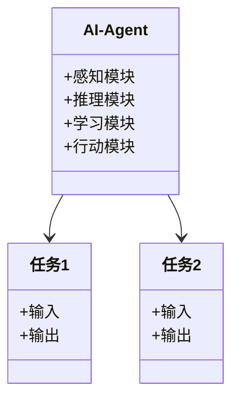
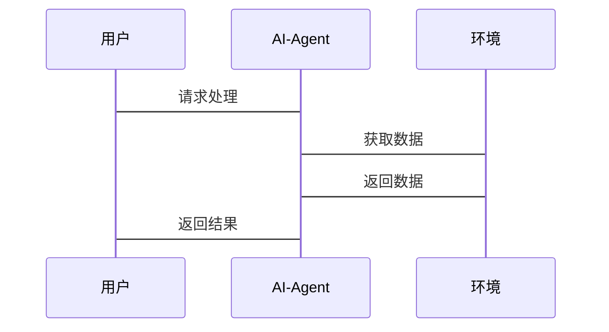

                 


# 构建具有多任务学习能力的AI Agent

> 关键词：多任务学习，AI Agent，深度学习，神经网络，模型架构

> 摘要：本文深入探讨了如何构建具有多任务学习能力的AI Agent。从基本概念到算法实现，从系统设计到项目实战，全面解析多任务学习在AI Agent中的应用，帮助读者掌握构建高效多任务AI Agent的核心技术与方法。

---

## 第1章 多任务学习与AI Agent的背景

### 1.1 多任务学习的定义与背景

#### 1.1.1 多任务学习的定义
多任务学习（Multi-Task Learning, MTL）是一种机器学习范式，旨在通过同时学习多个相关任务来提升模型的泛化能力和效率。与单任务学习不同，MTL允许模型共享不同任务之间的信息，从而更好地捕捉任务间的潜在联系。

#### 1.1.2 多任务学习的背景与动机
在现实应用中，AI Agent通常需要处理多种任务，例如自然语言理解、视觉识别和决策控制。传统单任务学习方法在处理这些任务时需要分别训练多个独立模型，这不仅效率低下，还可能导致模型之间缺乏知识共享，性能受限。

#### 1.1.3 多任务学习与单任务学习的对比
通过对比分析，多任务学习能够有效减少模型冗余，提高训练效率，同时提升模型在多个任务上的整体性能。

### 1.2 AI Agent的基本概念

#### 1.2.1 AI Agent的定义
AI Agent是一种智能体，能够感知环境、执行任务并做出决策。它通常具备感知、推理、学习和行动的能力。

#### 1.2.2 AI Agent的核心特征
- **自主性**：能够在没有外部干预的情况下运行。
- **反应性**：能够根据环境变化调整行为。
- **学习能力**：能够通过经验改进性能。

#### 1.2.3 多任务学习在AI Agent中的作用
多任务学习能够帮助AI Agent在多种任务上同时提升性能，增强其适应性和智能性。

### 1.3 多任务学习在AI Agent中的应用场景

#### 1.3.1 自然语言处理中的应用
例如，多任务学习可以同时进行文本分类和机器翻译，共享语言特征。

#### 1.3.2 计算机视觉中的应用
例如，同时进行图像分类和目标检测，共享低层视觉特征。

#### 1.3.3 机器人控制中的应用
例如，同时进行路径规划和物体识别，共享运动控制特征。

---

## 第2章 多任务学习的核心概念

### 2.1 多任务学习的原理

#### 2.1.1 多任务学习的基本原理
通过共享参数或任务间信息，提升模型在多个任务上的性能。

#### 2.1.2 多任务学习的挑战与解决方案
- **任务间干扰**：采用任务权重调节和参数共享策略。
- **计算效率**：优化算法复杂度。

#### 2.1.3 多任务学习的数学模型
多任务学习的数学模型通常涉及多个损失函数的组合优化。

### 2.2 多任务学习的模型结构

#### 2.2.1 分支型模型
模型在某个节点后分成多个分支，分别处理不同任务。

#### 2.2.2 并行型模型
模型同时处理多个任务，任务间参数独立。

#### 2.2.3 嵌入型模型
任务间共享嵌入层，提升特征表示能力。

### 2.3 多任务学习的任务交互机制

#### 2.3.1 任务间的信息共享
通过共享参数或特征层，促进任务间的知识共享。

#### 2.3.2 任务间的权重分配
根据任务重要性动态调整任务权重。

#### 2.3.3 任务间的动态平衡
通过自适应机制，平衡不同任务的训练进度。

---

## 第3章 多任务学习与AI Agent的核心联系

### 3.1 多任务学习在AI Agent中的应用

#### 3.1.1 多任务学习如何提升AI Agent的智能性
通过共享知识，提升AI Agent的推理和决策能力。

#### 3.1.2 多任务学习如何增强AI Agent的适应性
使AI Agent能够更好地应对多种任务和环境变化。

#### 3.1.3 多任务学习如何优化AI Agent的效率
减少训练数据和计算资源的需求。

### 3.2 多任务学习与AI Agent的协同进化

#### 3.2.1 多任务学习如何推动AI Agent的发展
通过任务间的知识共享，提升AI Agent的综合性能。

#### 3.2.2 AI Agent如何反哺多任务学习的进步
通过实际应用场景，验证和优化多任务学习算法。

#### 3.2.3 多任务学习与AI Agent的未来趋势
探索更高效的多任务学习算法和更智能的AI Agent架构。

---

## 第4章 多任务学习的算法原理

### 4.1 多任务学习的主要算法

#### 4.1.1 多任务学习的经典算法
- **MTL（Multi-Task Learning）**
- **MMI（Multi-Task Multi-Instance Learning）**

#### 4.1.2 多任务学习的改进算法
- **HAT（Hierarchical Attention Network）**
- **MAM（Multi-Task Attention Model）**

#### 4.1.3 多任务学习的前沿算法
- **Task-aware Attention**
- **Parameter Sharing Networks**

### 4.2 多任务学习算法的数学模型

#### 4.2.1 分支型算法的数学模型
$$
L = \sum_{i=1}^{n} \lambda_i L_i
$$
其中，$\lambda_i$ 是任务权重。

#### 4.2.2 并行型算法的数学模型
$$
L = \frac{1}{n}\sum_{i=1}^{n} L_i
$$

#### 4.2.3 嵌入型算法的数学模型
$$
L = \sum_{i=1}^{n} w_i L_i
$$
其中，$w_i$ 是任务权重。

---

## 第5章 多任务学习的系统分析与架构设计

### 5.1 系统功能设计

#### 5.1.1 领域模型设计
使用Mermaid类图展示系统模块之间的关系。



#### 5.1.2 系统架构设计
使用Mermaid架构图展示系统整体架构。


### 5.2 系统接口设计

#### 5.2.1 接口定义
- 输入接口：感知数据
- 输出接口：行动指令

#### 5.2.2 交互流程
使用Mermaid序列图展示系统交互流程。



---

## 第6章 多任务学习的项目实战

### 6.1 环境安装

```bash
pip install numpy
pip install tensorflow
pip install keras
```

### 6.2 核心实现源代码

```python
import numpy as np
import tensorflow as tf
from tensorflow import keras

# 定义多任务模型
def multi_task_model(input_shape, output_shapes):
    inputs = keras.Input(shape=input_shape)
    x = keras.layers.Dense(64, activation='relu')(inputs)
    task_outputs = []
    for output in output_shapes:
        output_layer = keras.layers.Dense(output[0], activation='softmax')(x)
        task_outputs.append(output_layer)
    model = keras.Model(inputs=inputs, outputs=task_outputs)
    return model

# 编译模型
model = multi_task_model(input_shape=(input_dim,), output_shapes=[(num_classes1,), (num_classes2,)])
model.compile(optimizer='adam', loss={'task1': 'sparse_categorical_crossentropy', 'task2': 'sparse_categorical_crossentropy'})
```

### 6.3 案例分析与解读

#### 6.3.1 案例分析
以自然语言处理中的文本分类和实体识别为例，展示多任务学习的应用。

#### 6.3.2 代码实现
详细解读上述代码，说明模型结构和训练过程。

### 6.4 项目小结

---

## 第7章 总结与展望

### 7.1 总结
多任务学习能够有效提升AI Agent的性能和效率，是未来AI发展的趋势。

### 7.2 展望
探索更高效的多任务学习算法和更智能的AI Agent架构。

### 7.3 最佳实践 tips
- 合理选择任务组合
- 谨慎设计任务权重
- 定期验证模型性能

### 7.4 小结
多任务学习与AI Agent的结合将推动人工智能技术的进一步发展。

---

通过以上内容，我们可以全面了解如何构建具有多任务学习能力的AI Agent，从理论到实践，帮助读者掌握这一前沿技术。

