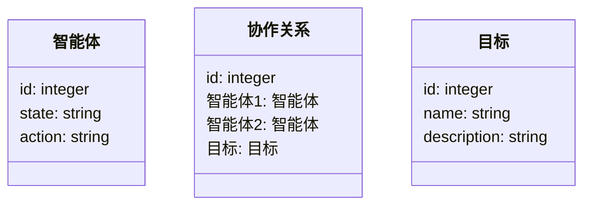
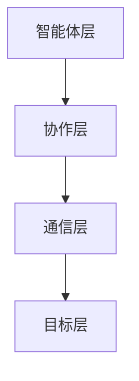
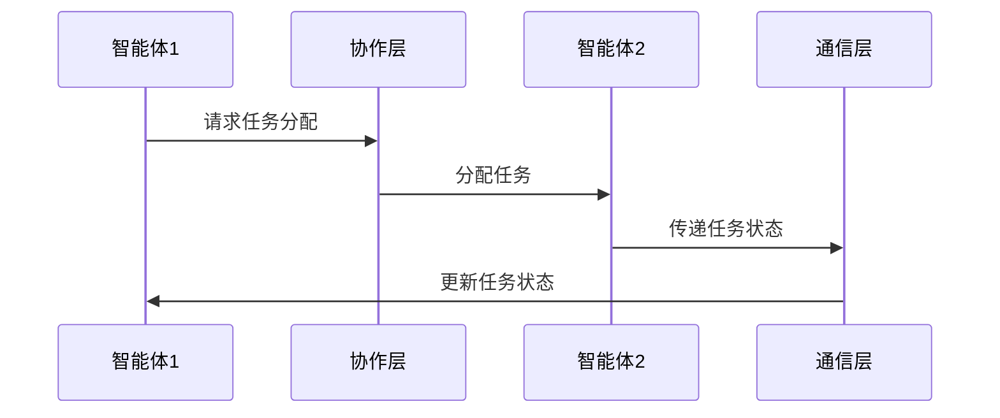

                 


# 构建具有多智能体协作能力的AI系统

## 关键词：多智能体协作、AI系统、分布式计算、算法原理、系统架构设计、项目实战

## 摘要：  
多智能体协作是人工智能领域的重要研究方向，旨在通过多个智能体的协同工作，实现复杂任务的高效完成。本文将从背景、核心概念、算法原理、系统架构设计到项目实战，全面解析如何构建一个具有多智能体协作能力的AI系统。通过本文的学习，读者将能够理解多智能体协作的基本原理，掌握相关算法的设计与实现，并能够应用这些知识来构建实际的多智能体协作系统。

---

# 第一部分: 多智能体协作的背景与基础

## 第1章: 多智能体协作的背景与问题背景

### 1.1 多智能体协作的定义与概念

#### 1.1.1 多智能体协作的定义
多智能体协作（Multi-Agent Collaboration）是指多个智能体（Agent）通过相互协作，共同完成一个复杂任务的过程。智能体可以是软件程序、机器人或其他能够感知环境并采取行动的实体。多智能体协作的核心在于智能体之间的通信与协调，以实现共同的目标。

#### 1.1.2 多智能体协作的核心概念
- **智能体**：具有自主性、反应性、目标导向和社交能力的实体。
- **协作**：智能体之间通过信息共享和任务分配，共同完成任务。
- **分布式智能**：多个智能体协同工作，实现整体智能的提升。

#### 1.1.3 多智能体协作的背景与现状
随着人工智能技术的快速发展，多智能体协作的应用场景越来越广泛。例如，在自动驾驶、机器人协作、分布式任务分配等领域，多智能体协作能够显著提高系统的效率和灵活性。

### 1.2 多智能体协作的问题背景

#### 1.2.1 当前AI系统的主要挑战
传统的单智能体系统在处理复杂任务时存在以下问题：
- **单点故障**：系统依赖单一智能体，容易成为性能瓶颈。
- **任务复杂性**：单智能体难以同时处理多个任务。
- **灵活性不足**：难以动态调整任务分配。

#### 1.2.2 多智能体协作的必要性
- **提高效率**：通过任务分配和协作，多个智能体能够更快完成复杂任务。
- **增强鲁棒性**：多智能体协作能够容忍部分智能体的故障，确保系统整体可用性。
- **扩展性**：通过增加智能体数量，系统可以轻松扩展处理能力。

#### 1.2.3 多智能体协作的应用场景
- **自动驾驶**：多个车辆协作完成交通管理。
- **机器人协作**：工业机器人在生产线上的协同工作。
- **分布式任务分配**：多个智能体协同完成任务分配和资源管理。

### 1.3 多智能体协作的核心问题

#### 1.3.1 协作目标的定义
协作目标是智能体协作的核心，通常包括完成特定任务、优化资源利用或提高系统效率。

#### 1.3.2 智能体之间的通信与协调
智能体之间的通信是协作的关键，包括信息共享、任务分配和状态同步。

#### 1.3.3 多智能体协作的边界与外延
- **边界**：智能体协作的范围和限制。
- **外延**：多智能体协作与其他技术的结合，如分布式计算和边缘计算。

### 1.4 多智能体协作的核心要素

#### 1.4.1 智能体的定义与特征
智能体具有以下特征：
- **自主性**：能够自主决策。
- **反应性**：能够感知环境并做出反应。
- **目标导向**：有明确的目标。
- **社交能力**：能够与其他智能体通信和协作。

#### 1.4.2 协作机制的设计
协作机制包括任务分配、信息共享和冲突解决等。

#### 1.4.3 多智能体协作的系统架构
多智能体协作系统的架构通常包括：
- **智能体层**：负责具体任务的执行。
- **协作层**：负责任务分配和协作管理。
- **通信层**：负责智能体之间的信息传递。

## 第2章: 多智能体协作的核心概念与联系

### 2.1 多智能体协作的核心原理

#### 2.1.1 多智能体协作的基本原理
多智能体协作基于分布式计算和通信技术，通过智能体之间的协作实现复杂任务的完成。

#### 2.1.2 协作机制的数学模型
协作机制可以用以下数学模型表示：
$$ \text{协作目标} = \sum_{i=1}^{n} \text{智能体}_i \cdot \text{贡献度} $$

#### 2.1.3 协作过程的动态分析
协作过程包括任务分配、执行、反馈和优化等阶段。

### 2.2 多智能体协作的核心概念对比

#### 2.2.1 智能体类型对比
| 智能体类型 | 特性                 | 适用场景           |
|------------|----------------------|--------------------|
| 简单反射型 | 基于当前状态做出反应 | 简单任务           |
| 目标驱动型 | 为目标驱动           | 复杂任务           |
| 混合型     | 结合反射和目标驱动   | 综合任务           |

#### 2.2.2 协作方式对比
| 协作方式 | 特性                 | 适用场景           |
|----------|----------------------|--------------------|
| 分散协作 | 每个智能体独立协作     | 网络分布系统       |
| 集中协作 | 通过中央控制节点协作 | 高度依赖的系统     |

#### 2.2.3 协作目标对比
| 协作目标 | 特性                 | 适用场景           |
|----------|----------------------|--------------------|
| 优化目标 | 追求全局最优解         | 高效系统           |
| 平衡目标 | 追求局部最优解         | 分布式系统         |

### 2.3 多智能体协作的ER实体关系图
```mermaid
er
actor: 智能体 {
    id: integer
    type: string
    state: string
}
协作关系: 协作 {
    id: integer
    智能体1: 智能体
    智能体2: 智能体
    目标: 目标
}
目标: 目标 {
    id: integer
    name: string
    description: string
}
```

## 第3章: 多智能体协作的算法原理

### 3.1 多智能体协作算法概述

#### 3.1.1 基础概念
- **协作算法**：智能体之间通过算法实现协作。
- **通信协议**：智能体之间通信的规则。
- **任务分配**：智能体之间的任务分配策略。

#### 3.1.2 常见算法分类
- **基于纳什均衡的协作算法**：通过纳什均衡实现协作。
- **基于分布式计算的协作算法**：通过分布式计算实现协作。
- **基于强化学习的协作算法**：通过强化学习实现协作。

#### 3.1.3 算法选择策略
根据任务需求选择合适的协作算法。

### 3.2 纳什均衡与协作算法

#### 3.2.1 纳什均衡的定义
纳什均衡是博弈论中的一个概念，指在所有参与方都不改变策略的情况下，每个参与方的策略都是最优的。

#### 3.2.2 纳什均衡在协作中的应用
通过纳什均衡实现智能体之间的协作。

#### 3.2.3 纳什均衡的计算方法
计算纳什均衡的步骤如下：
1. 构建博弈矩阵。
2. 确定每个智能体的策略。
3. 计算纳什均衡点。

### 3.3 分布式计算与协作

#### 3.3.1 分布式计算的基本原理
分布式计算是将计算任务分配到多个节点上，通过协作完成任务。

#### 3.3.2 分布式协作的实现方法
通过通信协议实现智能体之间的协作。

#### 3.3.3 分布式协作的优缺点
- **优点**：提高计算效率，增强系统的扩展性。
- **缺点**：需要复杂的通信和协调机制。

### 3.4 多智能体协作的数学模型

#### 3.4.1 协作目标的数学表达
$$ \text{协作目标} = \sum_{i=1}^{n} \text{智能体}_i \cdot \text{贡献度} $$

#### 3.4.2 协作过程的数学模型
协作过程可以用以下数学模型表示：
$$ \text{状态} = \text{初始状态} + \sum_{i=1}^{n} \text{智能体}_i \cdot \text{行动} $$

#### 3.4.3 协作结果的评估指标
- **效率**：任务完成时间。
- **质量**：任务完成的质量。
- **稳定性**：系统的稳定性。

### 3.5 本章小结
...

---

## 第四章: 多智能体协作的系统分析与架构设计

### 4.1 项目背景与目标

#### 4.1.1 项目背景
本项目旨在构建一个多智能体协作系统，用于解决复杂任务的高效完成。

#### 4.1.2 项目目标
- **实现多智能体协作**：通过协作算法实现智能体之间的协作。
- **提高系统效率**：通过任务分配和协作优化系统效率。
- **增强系统的可扩展性**：通过分布式计算实现系统的扩展。

### 4.2 系统功能设计

#### 4.2.1 需求分析
- **智能体通信**：智能体之间的通信需求。
- **任务分配**：任务分配的策略和算法。
- **协作管理**：协作过程的管理与优化。

#### 4.2.2 功能模块划分
- **智能体层**：负责具体任务的执行。
- **协作层**：负责任务分配和协作管理。
- **通信层**：负责智能体之间的信息传递。

#### 4.2.3 领域模型设计


### 4.3 系统架构设计

#### 4.3.1 系统架构图


#### 4.3.2 接口设计
- **智能体接口**：提供智能体之间的通信接口。
- **协作接口**：提供任务分配和协作管理的接口。
- **通信接口**：提供智能体之间的信息传递接口。

#### 4.3.3 交互流程


## 第五章: 多智能体协作的项目实战

### 5.1 环境安装

#### 5.1.1 系统需求
- 操作系统：Linux/Windows/MacOS
- Python版本：3.6+
- 依赖库：numpy, matplotlib, scikit-learn

#### 5.1.2 安装步骤
```bash
pip install numpy
pip install matplotlib
pip install scikit-learn
```

### 5.2 系统核心实现

#### 5.2.1 协作算法实现
```python
def nash_equilibrium(game_matrix):
    # 计算纳什均衡
    pass

def distributed_collaboration(n_agents):
    # 分布式协作实现
    pass
```

#### 5.2.2 通信协议实现
```python
class Agent:
    def __init__(self, id):
        self.id = id
        self.state = None
        self.action = None

    def communicate(self, other_agent):
        # 实现通信逻辑
        pass
```

### 5.3 实际案例分析

#### 5.3.1 案例背景
假设我们有多智能体协作系统，用于优化交通流量。

#### 5.3.2 案例分析
通过协作算法实现交通流量的优化。

### 5.4 项目小结
...

---

## 第六章: 多智能体协作的最佳实践

### 6.1 最佳实践 tips
- **明确协作目标**：确保智能体之间的协作目标明确。
- **选择合适的算法**：根据任务需求选择合适的协作算法。
- **优化通信机制**：优化智能体之间的通信机制，提高协作效率。

### 6.2 小结
...

### 6.3 注意事项
- **系统安全性**：确保智能体之间的通信安全。
- **任务分配的公平性**：确保任务分配的公平性，避免某些智能体负担过重。
- **系统的可扩展性**：确保系统的可扩展性，方便后续的优化和升级。

### 6.4 拓展阅读
- **推荐书籍**：《Multi-Agent Systems》
- **推荐论文**：《Distributed Collaboration in Multi-Agent Systems》
- **推荐工具**：Python的多智能体协作库，如`Multi-Agent Reinforcement Learning (MARL)`框架。

---

通过以上内容，读者可以系统地了解多智能体协作的基本原理、算法设计、系统架构和项目实现。希望本文能够为读者在构建具有多智能体协作能力的AI系统方面提供有价值的参考和指导。

